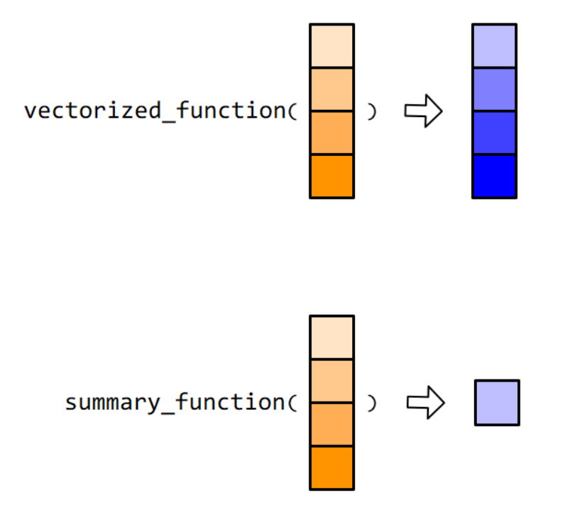

---
output:
  html_document: default
  pdf_document: default
---

# (PART) 基础 {-}

# R语言基础语法


:::: {.rmdnote data-latex="{注意}"}
1. 序列：由一些列可以根据位置索引的元素构成，元素可以很复杂，也可以是不同类型。**值得注意的是，列表也是一种序列。将列表理解为序列，有助于理解`purrr::map_*()`系列函数。**

2. R中两个不同长度的向量做运算，短的会自动循环补齐以配合长的。

```r
2:3 + 1:5
```

```
## Warning in 2:3 + 1:5: 长的对象长度不是短的对象长度的整倍数
```

```
## [1] 3 5 5 7 7
```

3. 使用`%in%`函数判断元素是否在集合内。


```r
c(1, 4) %in% c(1, 2, 3)
```

```
## [1]  TRUE FALSE
```
::::

::: {.rmdtip data-latex="{提示}"}
`[]`和`[[]]`的区别

R中`[]`和`[[]]`均有索引的功能，二者区别如下：

   - 单中括号`[]`提取的是对象的子集，所得的结果是一个集合。
   - 双中括号`[[]]`提取的是对象中的元素，所得的结果是一个单一的元素。
   - 双中括号`[[]]`只能提取单一元素，不适用于多元素的提取。
   
以向量为例，将一个向量必做10盒糖果，我们使用单中括号`[]`获取其中的3盒，而使用双中括号`[[]]`打开盒子并取出其中1颗糖果。

对未命名的向量，两者得到的结果相同；但对于已对元素命名的向量，二者得到结果不同。


```r
x <- c(a = 1, b = 2, c = 3)
# 取出标签为a的“糖果盒”，结果包括标签及值。
x["a"]
```

```
## a 
## 1
```

```r
# 取出a的“糖果盒”中的糖果，结果仅包含值。
x[["a"]]
```

```
## [1] 1
```
:::


## 函数

### 向量的函数

用在向量上的函数，可以分为向量化函数（vectorized function）和汇总类函数（summary function），这两类函数在tidyverse框架中应用均非常广泛。


```r
knitr::include_graphics("images/function-tow.jpg", dpi = FALSE)
```



### 自定义函数

自定义函数，需要四个关键部件：


```r
myFunction <- function(x, y){
  ...
}
```

- 创建：由`function(...)`函数创建一个自定义函数。

- 参数：由`(...)`指定参数。

- 函数主体：由`{}`括起，声明函数的具体功能，代码的最后一行可以用`return`返回计算后的值（不是必须）。

- 函数名称：将定义的函数赋值给函数名，如上例中的`myFunction`

#### 例题，根据数据标准化的公式\@ref(eq:standardization)，写出函数。

$$
\begin{align}
  std(x)=\frac{x_i-\hat{x}}{sd(x)}
  (#eq:standardization)
\end{align}
$$ 

```r
stand_data <- function(x){
  x - mean(x, na.rm = TRUE) / sd(x, na.rm = TRUE)
}
```

### 条件语句

即`if-else`语句，基本格式如下：


```r
if(condition) {
  Do sth. 
} else {
  Alternative sth.
}
```

#### 例题，设计一个函数让两个数字相加。

本例中可以加入一个条件语句，判断输入的参数是否为数字，如果输入的不是数字，则提示错误信息。


```r
sum_two <- function(num1, num2) {
  if(is.numeric(num1) & is.numeric(num2)){
     sum  <- num1 + num2
     return(sum)
  } else {
    print("输入错误，请重新输入")
  }
}
```

### 返回多个结果

函数还可以返回多个结果：先将结果放入列表或数据框中，然后在返回即可。


```r
mystat <- function(x){
   meanval <- mean(x) 
   sdval <- sd(x)
   
   list(sd = sdval, mean = meanval)
}
mystat(c(10,10))
```

```
## $sd
## [1] 0
## 
## $mean
## [1] 10
```

## 增强型数据框

tibble是增强型的data.frame，选取tibble的行或列时，即使遇到单行或单列的情况，数据也不会降维，总是返回tibble数据类型


```r
tb <- tibble::tibble(
  x = 1:4,
  y = 4:1,
  z = c("a", "b", "c", "d")
)
tb[, "x"]
```

```
## # A tibble: 4 x 1
##       x
##   <int>
## 1     1
## 2     2
## 3     3
## 4     4
```

```r
tb$x
```

```
## [1] 1 2 3 4
```

