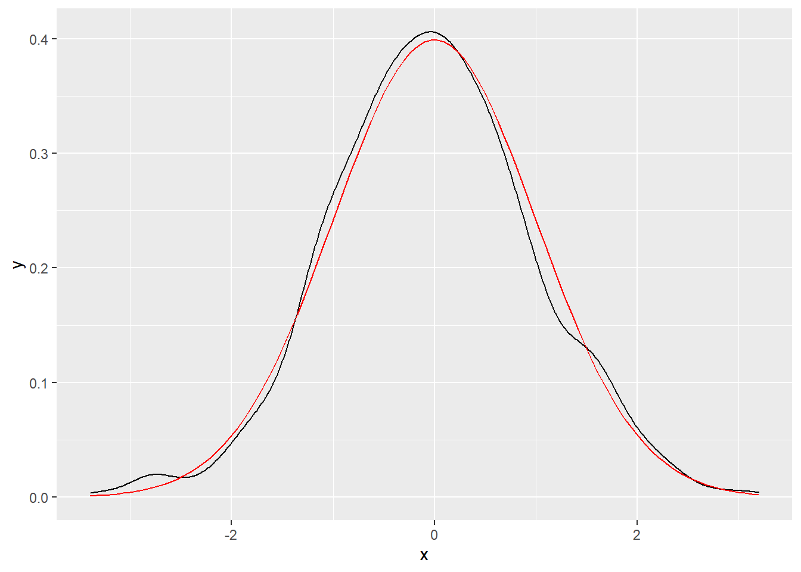
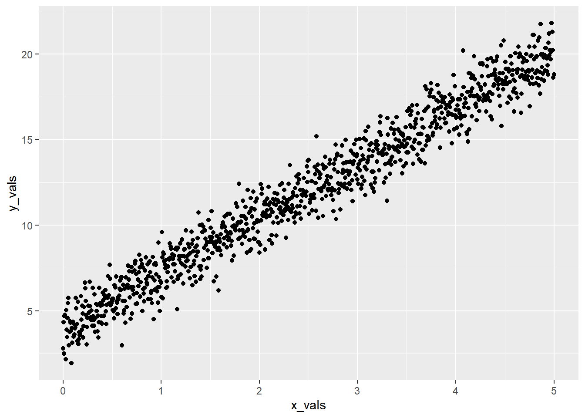
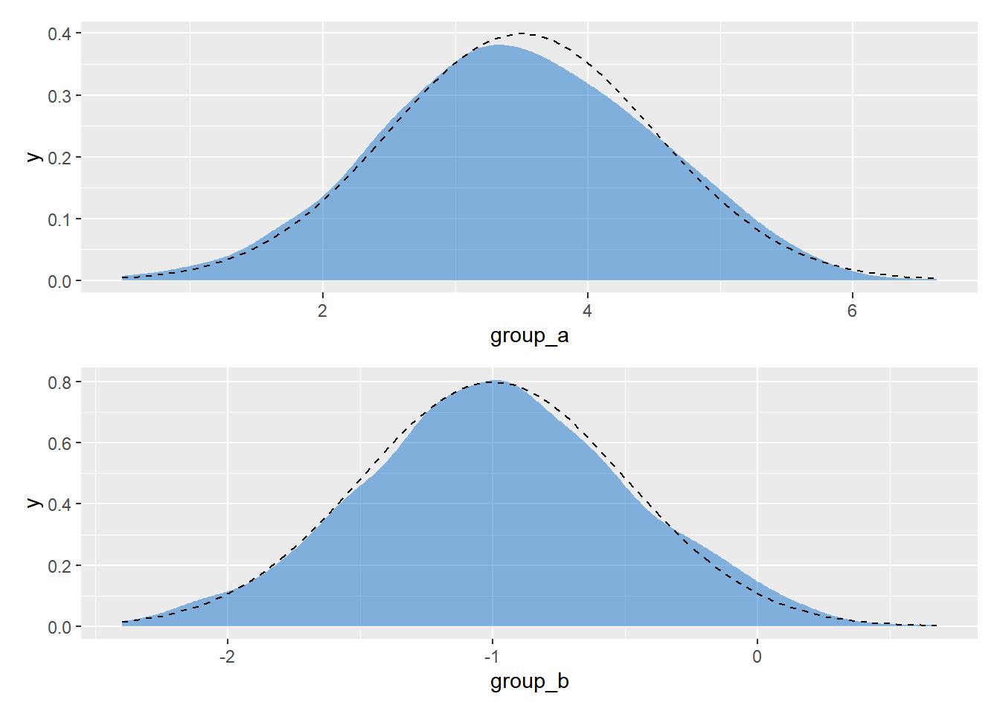
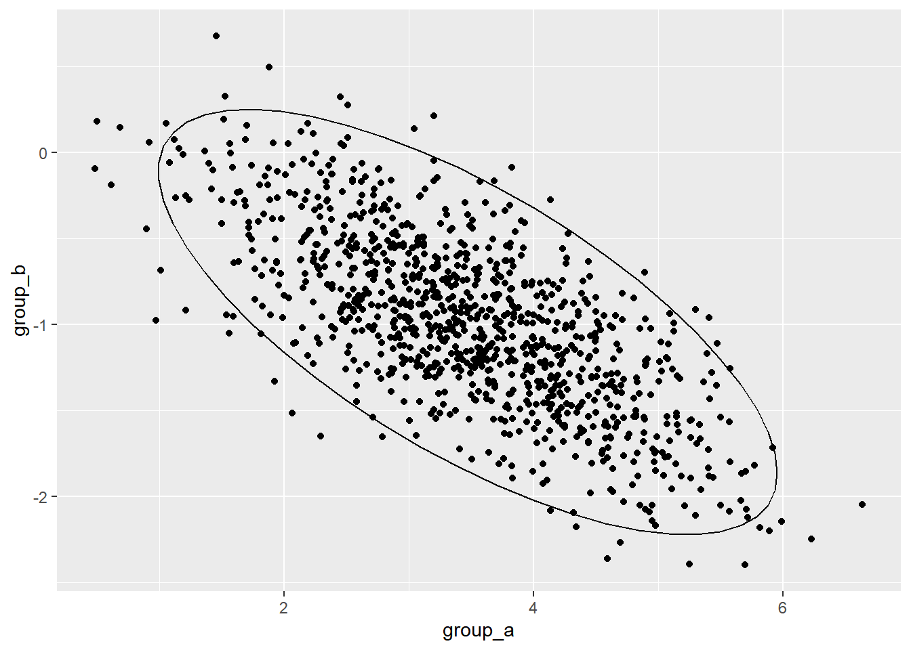
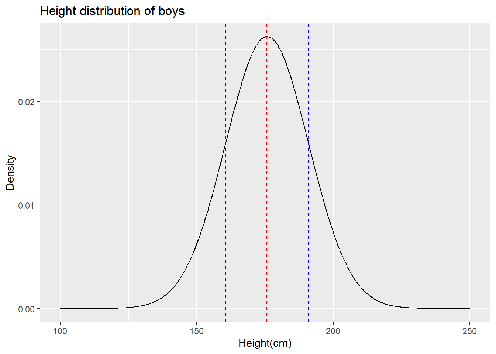
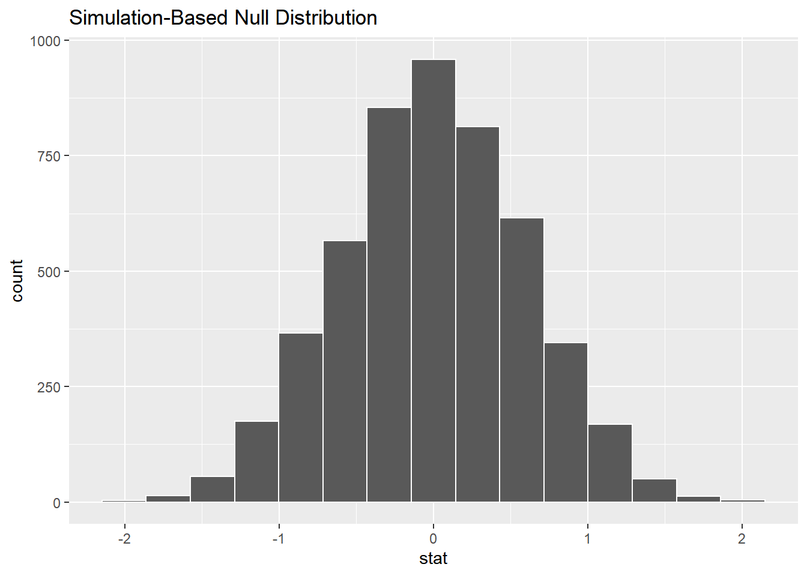

---
output:
  html_document: default
  pdf_document: default
---

# (PART) 建模 {-}

# 模拟与抽样1 {#tidystats-sampling}


`tidyverse`下的数据科学tidy原则和思想体现在以下几方面：

- 任何数据都可以规整数据框。

- 数据框的一列代表一个**变量**，一行代表一次**观测**。

- 函数处理数据时，应保持数据框进、数据框出

## 模拟

### 生成随机数

R中有很多生成随机数的函数，以随机分布来讲

| Distrution 	| Notation 		| R |
|:----------	|:-----------:|:-------------:|
|Uniform | $\text{U}(a, b)$ | `runif`|
|Normal  | $\text{N}(\mu, \sigma)$ | `rnorm`|
|Binormal  | $\text{Bin}(n, p)$ | `rbinorm`|
|Piosson  | $\text{pois}(\lambda)$ | `rpois`|
|Beta  | $\text{Beta}(\alpha, \beta)$ | `rbeta`|

以上函数中的`r`都代表随机分布的意思，事实上，每种分布都有四个对应的函数：

- d:density，密度。
- p:cumulative probability，累积概率。
- q:quantile，分位数函数
- r:random，随机偏差。


```r
set.seed(1234)
# 例1，生成100个正态分布的点，然后对其进行可视化，
# 并同时将理论上的正态分布画在同一个图形中。
tibble(
  x = rnorm(n = 1000, mean = 0, sd = 1)
) %>% 
  ggplot(aes(x = x)) +
    geom_density() +
  stat_function(
    fun = dnorm,
    args = list(mean = 0, sd = 1),
    color = "red"
  )
```




```r
# 例2 在数据框下，建立x和y的线性关系，假定x，y符合正态分布
# yi = 4 + 3.2xi
beta_0 <- 4
beta_1 <- 3.2
epsilon <- rnorm(n = 1000, mean = 0, sd = 1)

sim_normal <- tibble(
  x_vals = seq(from = 0, to = 5, length.out = 1000),
  y_vals = beta_0 + beta_1 * x_vals + epsilon
)

sim_normal %>% 
  ggplot(aes(x = x_vals, y = y_vals)) +
    geom_point()
```



### 生成多元正态分布[^]

使用`MASS`包中的`mvnorm`函数生成符合正态分布的随机数。`MASS::mvnorm(n = 1, mu, Sigma)`：

- n：随机样本的大小。

- mu：多元生态分布的均值向量。

- Sigma：协方差矩阵。

::: {.rmdtip data-latex="{提示}"}
1. 协方差是用来刻画**两个随机变量**的**相似程度**。

2. 协方差矩阵中：

   - 对角线上的元素为各个随机变量的方差。
   - 非对角线上的元素为两两随机变量之间的协方差。
   - 下例中`sigma_a`和`sigma_b`分别为随机变量`a`和`b`的方差，`cov_ab`为两变量的协方差，以此为基础构建协方差矩阵。
:::


```r
a <- 3.5
b <- -1
sigma_a <- 1
sigma_b <- 0.5
rho <- -0.7

mu <- c(a, b)
cov_ab <- sigma_a * sigma_b * rho  # 协方差

# 构建协方差矩阵
sigma <- matrix(c(
  sigma_a ^ 2, cov_ab,
  cov_ab, sigma_b ^ 2
), ncol = 2)

d <- MASS::mvrnorm(1000, mu = mu ,Sigma = sigma) %>% 
  data.frame() %>% 
  set_names("group_a", "group_b")
head(d)
```

```
##    group_a   group_b
## 1 4.513721 -1.261025
## 2 3.535779 -1.199056
## 3 3.572091 -1.139233
## 4 2.091071 -1.106365
## 5 4.947780 -2.143956
## 6 4.581704 -1.297491
```

```r
p1 <- d %>% ggplot(aes(x = group_a)) + 
  geom_density(
    color = "transparent",
    fill = "dodgerblue3",
    alpha =  1/2
  ) +
  stat_function(
    fun = dnorm,
    args = list(mean = 3.5, sd = 1),
    linetype = 2
  )
p2 <- d %>% ggplot(aes(x = group_b)) + 
  geom_density(
    color = "transparent",
    fill = "dodgerblue3",
    alpha =  1/2
  ) +
  stat_function(
    fun = dnorm,
    args = list(mean = -1, sd = 0.5),
    linetype = 2
  )

p1/p2
```




```r
d %>%
  ggplot(aes(x = group_a, y = group_b)) +
  geom_point() +
  stat_ellipse(type = "norm", level = 0.95)
```



[^]标准正态分布: 期望值（平均值）$μ = 0$，即曲线图象对称轴为Y轴，标准差$σ=1$条件下的正态分布，记为$N(0，1)$。


## 抽样与样本

假设高校男生总体的平均身高和身高标准差如下：


```r
true.mean <- 175.7
true.sd <- 15.19
```
对身高的分布进行模拟绘图：


```r
pop_distH <- 
  tibble(height = seq(100, 250, 0.5),
         density = dnorm(height, mean = true.mean,
                         sd = true.sd)
         )

ggplot(pop_distH) +
  geom_line(aes(height, density)) +
  geom_vline(
    xintercept = true.mean,
    color = "red",
    linetype = "dashed"
  ) +
  geom_vline(
    xintercept = true.mean + true.sd,
    color = "blue",
    linetype = "dashed"
  ) +
  geom_vline(
    xintercept = true.mean - true.sd,
    color = "blue",
    linetype = "dashed"
  ) +
   labs(
     x = "Height(cm)", y = "Density",
     title = "Height distribution of boys"
   )
```



## 让统计分析透明-重现infer基于模拟的假设检验


```r
library(tidyverse)
library(infer)

penguins <- palmerpenguins::penguins %>% 
  drop_na()

penguins %>% 
  # 指定响应变量（因变量）和解释变量（自变量）。
  specify(formula = bill_length_mm ~ sex) %>% 
  # 声明一个空假设检验
  hypothesize(null = "independence") %>% 
  # 生成重采样、排列或模拟
  generate(reps = 5000, type = "permute") %>% 
  # 计算汇总统计量
  calculate(
    stat = "diff in means",
    order = c("male", "female")
  ) %>% 
  visualize()
```



### 使用tidyverse重复infer的过程

#### 重复`diff in mean`的抽样过程
