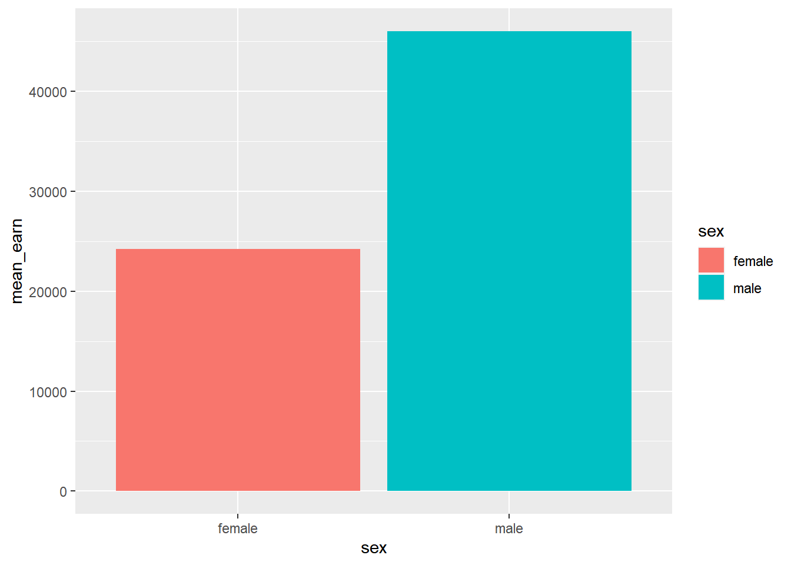
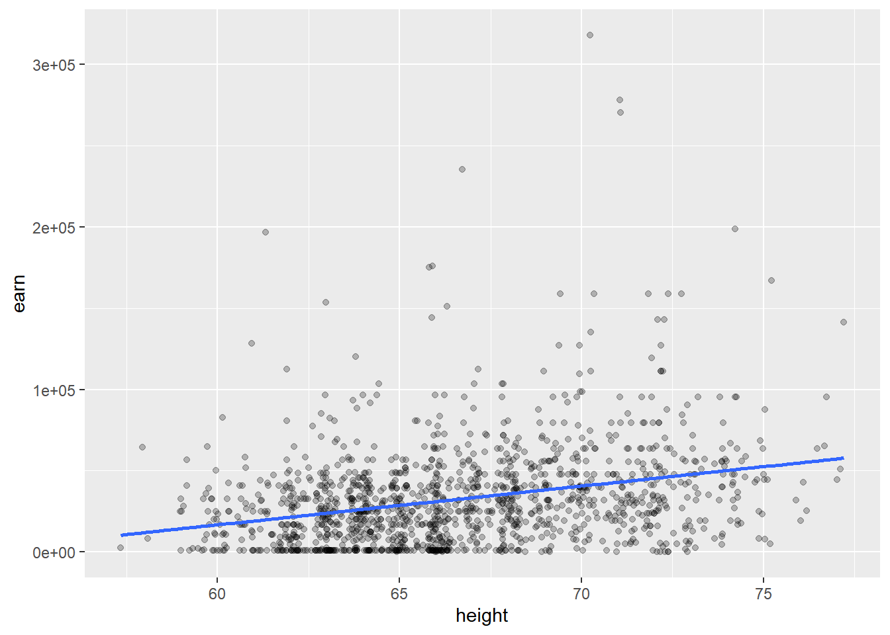

---
output:
  html_document: default
  pdf_document: default
---

# 线性回归 {#tidymodel-linear-regression}


## 从案例开始

一份1994年手机的1379个对象关于收入、身高、教育水平等信息的数据集。


```r
library(tidyverse)
# 导入
wages <- read_csv("datas/wages.csv")
wages %>% 
  head()
```

```
## # A tibble: 6 x 6
##     earn height sex    race     ed   age
##    <dbl>  <dbl> <chr>  <chr> <dbl> <dbl>
## 1 79571.   73.9 male   white    16    49
## 2 96397.   66.2 female white    16    62
## 3 48711.   63.8 female white    16    33
## 4 80478.   63.2 female other    16    95
## 5 82089.   63.1 female white    17    43
## 6 15313.   64.5 female white    15    30
```

### 缺失值检查

一般情况下，拿到一份数据，首先需要了解数据：

   - 了解每个变量的含义。
   - 检查缺失值情况。
   

```r
# 变量名称含义
wages %>% 
  colnames()
```

```
## [1] "earn"   "height" "sex"    "race"   "ed"     "age"
```

```r
# 统计缺失值
wages %>% 
  map_df( ~ sum(is.na(.))) %>% 
  pivot_longer(
    cols = everything(),
    names_to = "col_names",
    values_to = "sum_na"
  )
```

```
## # A tibble: 6 x 2
##   col_names sum_na
##   <chr>      <int>
## 1 earn           0
## 2 height         0
## 3 sex            0
## 4 race           0
## 5 ed             0
## 6 age            0
```

可以看到本例中：

- 共有6个变量。

- 没有缺失值。

### 简单变量统计

然后探索每个变量的分布。


```r
# 数据中男女分布的数量
wages %>% 
  count(sex)
```

```
## # A tibble: 2 x 2
##   sex        n
##   <chr>  <int>
## 1 female   859
## 2 male     520
```

```r
# 男女两组的身高均值和收入均值并可视化
wages %>% 
  group_by(sex) %>% 
  summarise(
    n = n(),
    mean_height = mean(height),
    mean_earn = mean(earn)
  ) %>% 
  ggplot(aes(x = sex, y = mean_earn, fill = sex)) +
    geom_col()
```



现在我们提出几个问题：

1. 长得越高是否挣钱越多？

2. 是否男性比女性挣得多？

3. 对收入影响最大的变量是哪个？

4. 怎么判定我们建立的模型是不是很好？


## 线性归回模型

### 长得高挣得多

这个问题就涉及到了线性模型。顾名思义，就是假设x和y存在线性关系，在数学上可以写为：

$$
\begin{align}
  y = \alpha + \beta * x + \epsilon \\
  \epsilon = Normal(\mu,\delta)
  (#eq:liner)
\end{align}
$$
$\epsilon$代表误差项，与x无关，且服从正态分布。线性回归模型最常用的是使用最小二乘法（OLS），估算$\hat{\alpha}$和$\hat{\beta}$，使得残差平方和最小，即$RSS = \sum_i(y_i-\hat{y_i})$或$\sum_i(\epsilon_i^2)$最小。如下图所示。


```r
knitr::include_graphics("images/best_fit.png", dpi = FALSE)
```


### 使用lm()函数拟合线性回归模型

`lm()`的基本用法如下：


```r
lm(formula = y ~ x, data)
```

- `formula`：指定回归模型，`~`符号代表预测，`y ~ x`表示y由x预测，即y代表因变量，x代表自变量。

- `data`：指定数据框。

在正式运行`lm()`之前，先画出身高和收入的散点图：**旨在提醒我们是要寻找*身高*和*收入*的关系**。


```r
wages %>% 
  ggplot(aes(height, earn)) +
    geom_point()
```


```r
# 正式建立模型
# 问题是长得高是否挣得多，自变量为身高，因变量为收入，
# 即身高对收入是否有影响。
model1 <- lm(
  formula = earn ~ height,
  data = wages
)
print(model1)
```

```
## 
## Call:
## lm(formula = earn ~ height, data = wages)
## 
## Coefficients:
## (Intercept)       height  
##     -126523         2387
```

y以上结果有两部分信息：

1. 第一部分是我们建立的模型。

2. 第二部分是R语言给出的截距（Intercept）和斜率（height）。根据结果可得出我们的模型为：

$\hat{y} = -126523 + 2387x$

进一步查看模型的详细信息：


```r
# 模型详细信息
summary(model1)
```

```
## 
## Call:
## lm(formula = earn ~ height, data = wages)
## 
## Residuals:
##    Min     1Q Median     3Q    Max 
## -47903 -19744  -5184  11642 276796 
## 
## Coefficients:
##             Estimate Std. Error t value Pr(>|t|)    
## (Intercept)  -126523      14076  -8.989   <2e-16 ***
## height          2387        211  11.312   <2e-16 ***
## ---
## Signif. codes:  0 '***' 0.001 '**' 0.01 '*' 0.05 '.' 0.1 ' ' 1
## 
## Residual standard error: 29910 on 1377 degrees of freedom
## Multiple R-squared:  0.08503,	Adjusted R-squared:  0.08437 
## F-statistic:   128 on 1 and 1377 DF,  p-value: < 2.2e-16
```

```r
# 模型拟合值-即预测结果
wages %>% 
  modelr::add_predictions(model1)
```

```
## # A tibble: 1,379 x 7
##      earn height sex    race        ed   age   pred
##     <dbl>  <dbl> <chr>  <chr>    <dbl> <dbl>  <dbl>
##  1 79571.   73.9 male   white       16    49 49867.
##  2 96397.   66.2 female white       16    62 31581.
##  3 48711.   63.8 female white       16    33 25708.
##  4 80478.   63.2 female other       16    95 24395.
##  5 82089.   63.1 female white       17    43 24061.
##  6 15313.   64.5 female white       15    30 27522.
##  7 47104.   61.5 female white       12    53 20385.
##  8 50960.   73.3 male   white       17    50 48434.
##  9  3213.   72.2 male   hispanic    15    25 45928.
## 10 42997.   72.4 male   white       12    30 46310.
## # ... with 1,369 more rows
```

```r
# 查看残差值-即观测值与估计值（拟合值）的差。
wages %>% 
  modelr::add_predictions(model1) %>% 
  modelr::add_residuals(model1)
```

```
## # A tibble: 1,379 x 8
##      earn height sex    race        ed   age   pred   resid
##     <dbl>  <dbl> <chr>  <chr>    <dbl> <dbl>  <dbl>   <dbl>
##  1 79571.   73.9 male   white       16    49 49867.  29705.
##  2 96397.   66.2 female white       16    62 31581.  64816.
##  3 48711.   63.8 female white       16    33 25708.  23003.
##  4 80478.   63.2 female other       16    95 24395.  56083.
##  5 82089.   63.1 female white       17    43 24061.  58028.
##  6 15313.   64.5 female white       15    30 27522. -12209.
##  7 47104.   61.5 female white       12    53 20385.  26720.
##  8 50960.   73.3 male   white       17    50 48434.   2526.
##  9  3213.   72.2 male   hispanic    15    25 45928. -42715.
## 10 42997.   72.4 male   white       12    30 46310.  -3313.
## # ... with 1,369 more rows
```

### 模型的解释

建立一个线性模型很简单，重要的是如何对模型进行解释，

`model1`模型的解释：

- 斜率$\beta = 2387$，表明身高每增加1个单位，收入增加2387个单位。

- 截距$\alpha = -126532$表明当身高为0时，期望的收入为-126532。


```r
wages %>% 
  ggplot(aes(x = height, y = earn)) +
    geom_point(alpha = 0.25) +
    geom_smooth(method = "lm", se = FALSE)
```



## 多元线性回归

前例为单个自变量`height`，现在增加一个自变量`ed`，对一元模型进行扩展。


```r
model2 <- lm(earn ~ height + ed, data = wages)
summary(model2)
```

```
## 
## Call:
## lm(formula = earn ~ height + ed, data = wages)
## 
## Residuals:
##    Min     1Q Median     3Q    Max 
## -63031 -17079  -3589  10488 258760 
## 
## Coefficients:
##              Estimate Std. Error t value Pr(>|t|)    
## (Intercept) -161541.5    13539.1  -11.93   <2e-16 ***
## height         2087.2      200.3   10.42   <2e-16 ***
## ed             4118.0      313.6   13.13   <2e-16 ***
## ---
## Signif. codes:  0 '***' 0.001 '**' 0.01 '*' 0.05 '.' 0.1 ' ' 1
## 
## Residual standard error: 28210 on 1376 degrees of freedom
## Multiple R-squared:  0.1869,	Adjusted R-squared:  0.1857 
## F-statistic: 158.2 on 2 and 1376 DF,  p-value: < 2.2e-16
```

