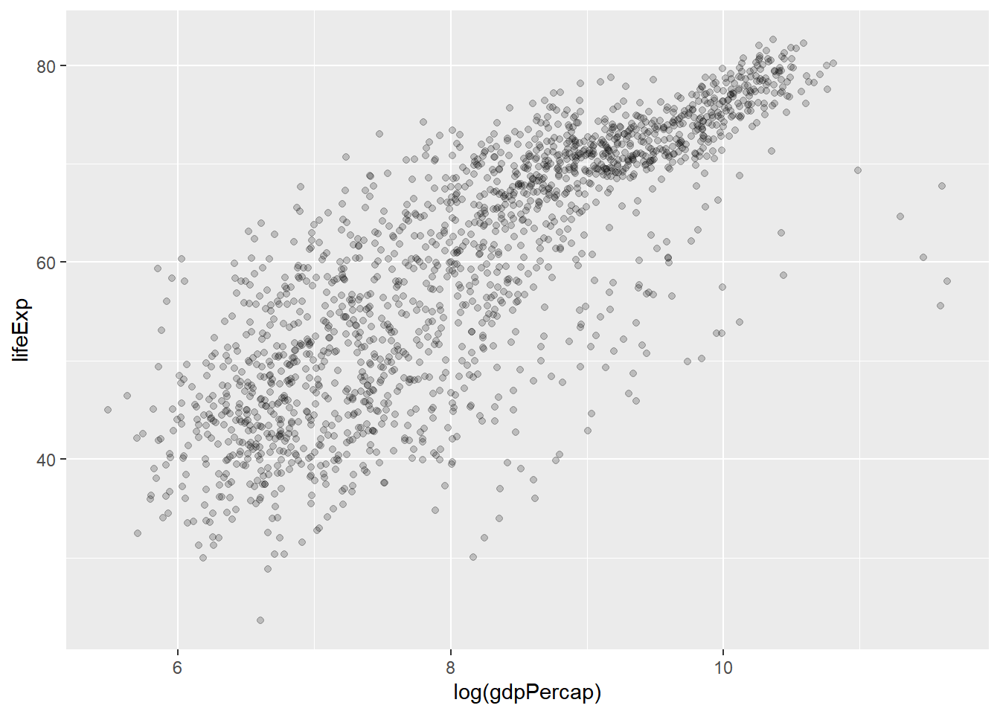
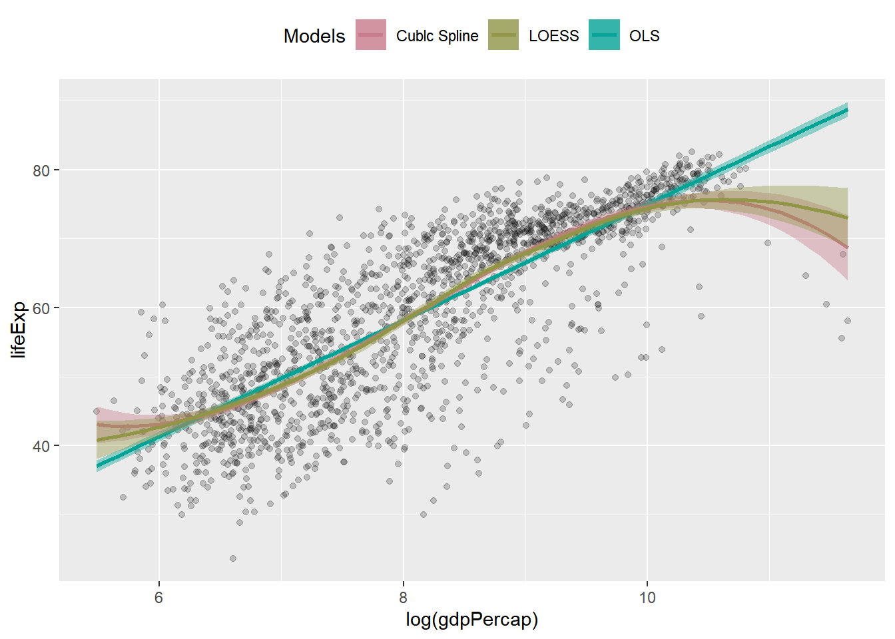

---
output:
  html_document: default
  pdf_document: default
---

# 结果整合 {#tidymodel-broom}


## 案例


```r
library(tidyverse)  # CRAN v1.3.1
library(gapminder)  # CRAN v0.3.0
gapminder
```

```
## # A tibble: 1,704 x 6
##    country     continent  year lifeExp      pop gdpPercap
##    <fct>       <fct>     <int>   <dbl>    <int>     <dbl>
##  1 Afghanistan Asia       1952    28.8  8425333      779.
##  2 Afghanistan Asia       1957    30.3  9240934      821.
##  3 Afghanistan Asia       1962    32.0 10267083      853.
##  4 Afghanistan Asia       1967    34.0 11537966      836.
##  5 Afghanistan Asia       1972    36.1 13079460      740.
##  6 Afghanistan Asia       1977    38.4 14880372      786.
##  7 Afghanistan Asia       1982    39.9 12881816      978.
##  8 Afghanistan Asia       1987    40.8 13867957      852.
##  9 Afghanistan Asia       1992    41.7 16317921      649.
## 10 Afghanistan Asia       1997    41.8 22227415      635.
## # ... with 1,694 more rows
```

### 可视化探索


```r
gapminder %>% 
  ggplot(aes(x = log(gdpPercap), y = lifeExp)) +
  geom_point(alpha = 0.2)
```



我们想用**不同模型**拟合`log(gdpPercap)`和`lifeExp`的关联。


```r
library(colorspace) # A Toolbox for Manipulating and Assessing Colors and Palettes

model_colors <- colorspace::qualitative_hcl(
  4, palette = "dark 2"
)

ggplot(gapminder, aes(log(gdpPercap), lifeExp)) +
  geom_point(alpha = 0.2) +
  geom_smooth(
    method = "lm", aes(color = "OLS", fill = "OLS") # 第一个模型
  ) + 
  geom_smooth(
    method = "lm", formula = y ~splines::bs(x, df = 3),
    aes(color = "Cublc Spline", fill = "Cublc Spline") # 第二个
  ) +
  geom_smooth(
    method = "loess",
    aes(color = "LOESS", fill = "LOESS") # 第三个模型
  ) +
  scale_color_manual(name = "Models", values = model_colors) +
  scale_fill_manual(name = "Models", values = model_colors) +
  theme(legend.position = "top")
```




