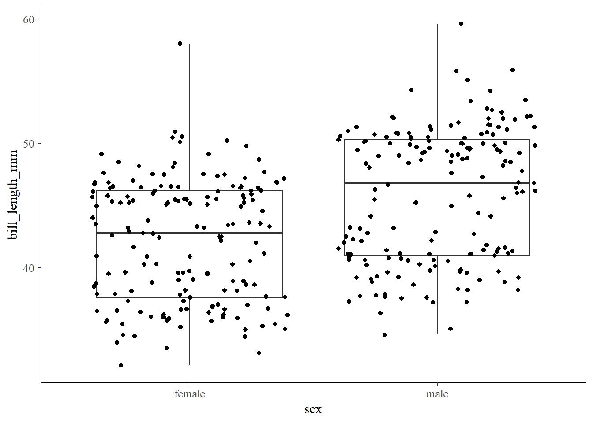

---
output:
  html_document: default
  pdf_document: default
---

# 双样本t检验 {#tidymodel-t-test}


## 实验设计

研究某种药物的疗效，一般采用**大样本随机双盲对照实验**，比较在特定条件下被试的反映，获取相关数据后，会进行组内比较或组间比较：

- **组内比较**，同一组人，每个人要完成多次测量（重复测量），如服药第一天的情况，服药第二天的情况……，每组的人数是恒定的。

- **组间比较**，A组的被试吃1mg，B组的被试吃2mg……，每组的人数不要求是恒定的。

以上的实验过程即会用到双样本t检验（two sample t-test）。

## 提问

我们以企鹅体征数据作为案例，假定企鹅就是我们的被试对象。


```r
library(tidyverse)
theme_set(bayesplot::theme_default())  # 设定默认作图主题

penguins <- palmerpenguins::penguins %>% 
  drop_na()
```

1. 不同性别企鹅的bill_length_mm的均值是否相同？

2. 企鹅种类有三种（Adelie, Chinstrap, Gentoo），比较在每个种类下男企鹅和女企鹅bill_length_mm的均值？

3. 两两比较不同种类的bill_length_mm的均值？

### 不同性别企鹅的bill_length_mm（嘴峰长度）是否相同？


```r
penguins %>% 
  ggplot(aes(x = sex, y = bill_length_mm)) +
    geom_boxplot() +
    geom_jitter() +
    theme(legend.position = "none")
```



#### 计算不同性别bill_length_mm的均值及差值


```r
mean_sex <- penguins %>% 
  group_by(sex) %>% 
  summarise(avg_rating = mean(bill_length_mm, na.rm = TRUE)) %>% 
  # lag()计算滞后值
  mutate(diff_means = avg_rating - lag(avg_rating))
mean_sex
```

```
## # A tibble: 2 x 3
##   sex    avg_rating diff_means
##   <fct>       <dbl>      <dbl>
## 1 female       42.1      NA   
## 2 male         45.9       3.76
```

由计算可知，不同性别企鹅嘴峰长度的平均值差距不明显，仅为3.7577922mm，且雄性企鹅的嘴峰长度大于雌性企鹅。

#### 使用`t.test()`进行t检验


```r
t.test(
  bill_length_mm ~ sex,
  data = penguins,
  var.equal = TRUE,  # 假定两个样本的方差是否
)
```

```
## 
## 	Two Sample t-test
## 
## data:  bill_length_mm by sex
## t = -6.667, df = 331, p-value = 1.094e-10
## alternative hypothesis: true difference in means between group female and group male is not equal to 0
## 95 percent confidence interval:
##  -4.866557 -2.649027
## sample estimates:
## mean in group female   mean in group male 
##             42.09697             45.85476
```

