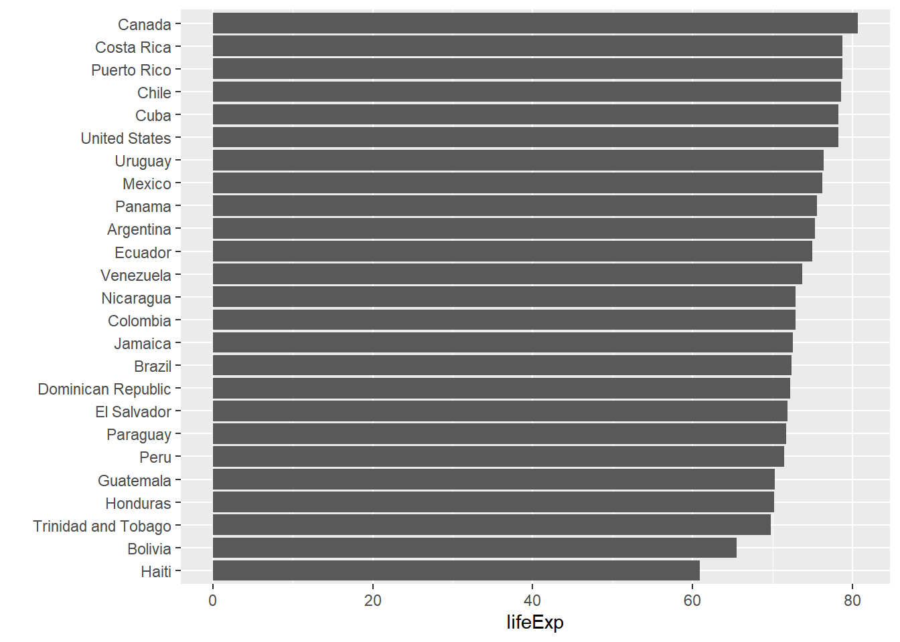
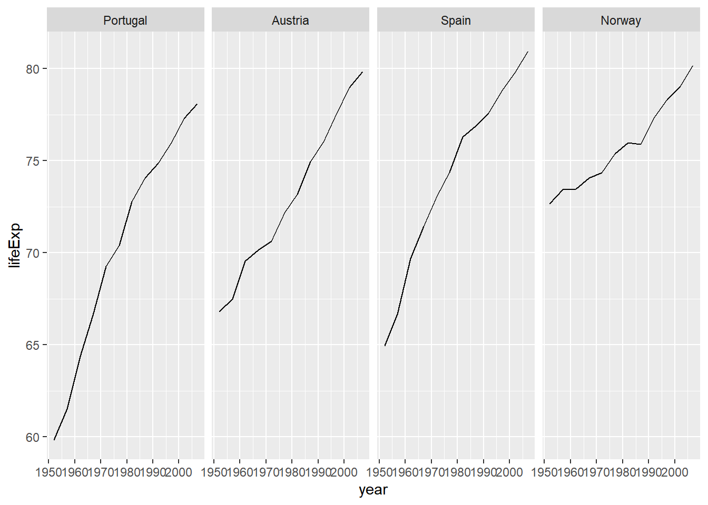
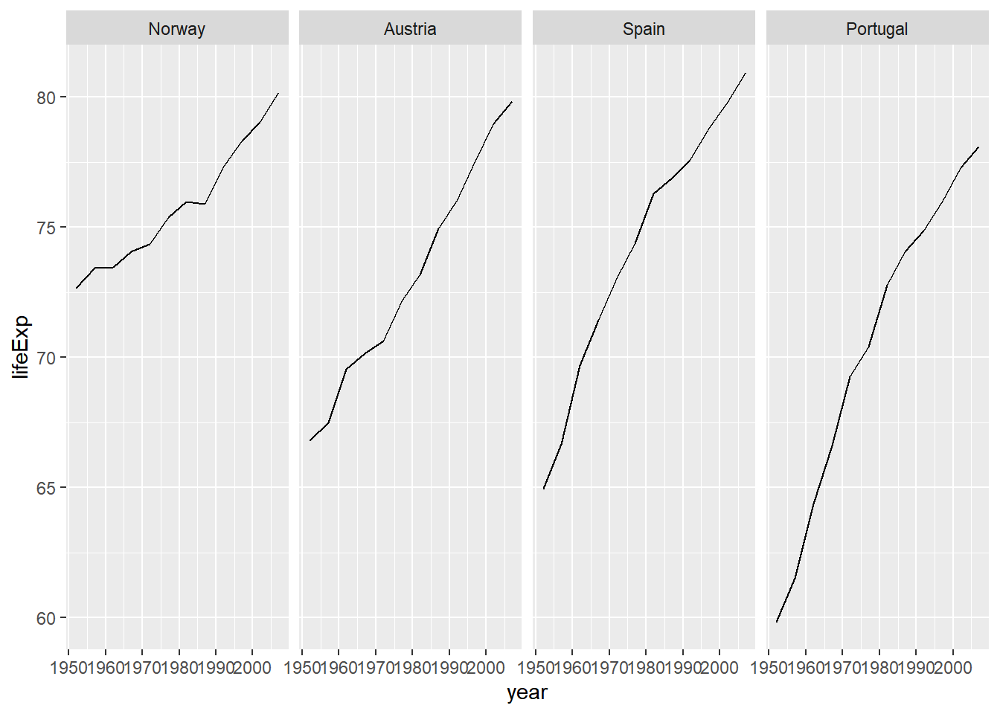

---
output:
  html_document: default
  pdf_document: default
---

# 因子 {#sec:factor}


**因子**用来存放名义型或有序性的分类变量，本质上是一个带有水平（level）属性的向量，如性别有两个水平：男、女。^[与字符型向量按照字母顺序排序的方式不同，因子型向量可以根据自身的需求对其排序进行自定义。]

## 创建因子


```r
factor(
  x,       # 创建因子的数据向量
  levels,  # 指定因子的各水平值
  labels,  # 设置各因子水平名称，与水平一一对应
  ordered, # 设置是否对因子水平排序。
  ...
)
```


## 有用函数

::: {.rmdtip data-latex="{提示}"}
`table()`函数可以统计数据中各因子出现的次数，也可以统计向量中每个不同元素出现的次数。


```r
x <- c("优", "中", "良", "优", "良", "良")
table(x)
```

```
## x
## 良 优 中 
##  3  2  1
```
:::

::: {.rmdtip data-latex="{提示}"}
`cut()`函数用来做连续变量离散化：将数值向量切分为若干区间段，返回因子。


```r
Age <- c(23, 15, 36, 47, 65 ,53)
cut(Age, 
    breaks = c(0, 18, 45, 100),
    labels = c("Young", "Middle", "Old"))
```

```
## [1] Middle Young  Middle Old    Old    Old   
## Levels: Young Middle Old
```
:::

## 练习

1. 画出2007年美洲人口寿命柱状图，从高到低排序。


```r
library(gapminder)
gapminder %>% 
  filter(
    year == 2007,
    continent == "Americas"
  ) %>% 
  ggplot(aes(x = reorder(country, lifeExp), y = lifeExp)) +
    geom_bar(stat = "identity") +
    coord_flip() +
    labs(x = "", y = "lifeExp")
```



2. 这是四个国家人口寿命的变化图。

- 小题1：要求给四个分面排序，按每个国家寿命的中位数。

- 小题2：要求给四个分面排序，按每个国家寿命差（最大值减去最小值）。


```r
# 小题1
gapminder %>%
  filter(country %in% c("Norway", "Portugal", "Spain", "Austria")) %>%
  mutate(country = fct_reorder(country, lifeExp, median)) %>% 
  ggplot(aes(year, lifeExp)) + 
    geom_line() +
    facet_wrap(vars(country), nrow = 1)
```




```r
# 小题2
gapminder %>%
  filter(country %in% c("Norway", "Portugal", "Spain", "Austria")) %>%
  mutate(country = fct_reorder(country, lifeExp, 
                               function(x){max(x) - min(x)})) %>% 
  ggplot(aes(year, lifeExp)) + 
    geom_line() +
    facet_wrap(vars(country), nrow = 1)
```


