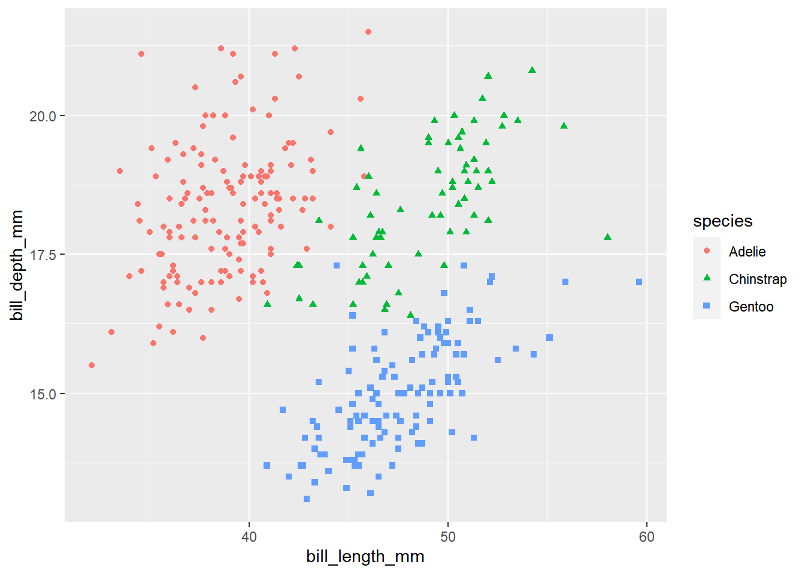

---
output:
  html_document: default
  pdf_document: default
---

# (PART) tidymodels包篇 {-}

# 机器学习 {#meching-leanrning-tidymodels}


## 数据


```r
penguins <- read_csv("datas/penguins.csv") %>%
  janitor::clean_names() %>% 
  drop_na()
```

```
## Warning in FUN(X[[i]], ...): strings not representable in native
## encoding will be translated to UTF-8
```

```
## Warning in FUN(X[[i]], ...): unable to translate '<U+00C4>' to native
## encoding
```

```
## Warning in FUN(X[[i]], ...): unable to translate '<U+00D6>' to native
## encoding
```

```
## Warning in FUN(X[[i]], ...): unable to translate '<U+00E4>' to native
## encoding
```

```
## Warning in FUN(X[[i]], ...): unable to translate '<U+00F6>' to native
## encoding
```

```
## Warning in FUN(X[[i]], ...): unable to translate '<U+00DF>' to native
## encoding
```

```
## Warning in FUN(X[[i]], ...): unable to translate '<U+00C6>' to native
## encoding
```

```
## Warning in FUN(X[[i]], ...): unable to translate '<U+00E6>' to native
## encoding
```

```
## Warning in FUN(X[[i]], ...): unable to translate '<U+00D8>' to native
## encoding
```

```
## Warning in FUN(X[[i]], ...): unable to translate '<U+00F8>' to native
## encoding
```

```
## Warning in FUN(X[[i]], ...): unable to translate '<U+00C5>' to native
## encoding
```

```
## Warning in FUN(X[[i]], ...): unable to translate '<U+00E5>' to native
## encoding
```

```r
penguins %>%
  head()
```

```
## # A tibble: 6 x 8
##   species island    bill_length_mm bill_depth_mm flipper_length_mm
##   <chr>   <chr>              <dbl>         <dbl>             <dbl>
## 1 Adelie  Torgersen           39.1          18.7               181
## 2 Adelie  Torgersen           39.5          17.4               186
## 3 Adelie  Torgersen           40.3          18                 195
## 4 Adelie  Torgersen           36.7          19.3               193
## 5 Adelie  Torgersen           39.3          20.6               190
## 6 Adelie  Torgersen           38.9          17.8               181
## # ... with 3 more variables: body_mass_g <dbl>, sex <chr>,
## #   year <dbl>
```


```r
penguins %>%
  ggplot(aes(x = bill_length_mm, y = bill_depth_mm, 
             color = species, shape = species)
         ) +
  geom_point()
```



## 机器学习


```r
# 数据分割，构建测试集和训练集
split <- penguins %>% 
  mutate(species = as_factor(species)) %>%  # 将species列转换为因子型
  mutate(species = fct_lump(species, 1)) %>%  # 将取值为1的species列合并为other 
  initial_split()

split
```

```
## <Analysis/Assess/Total>
## <249/84/333>
```


