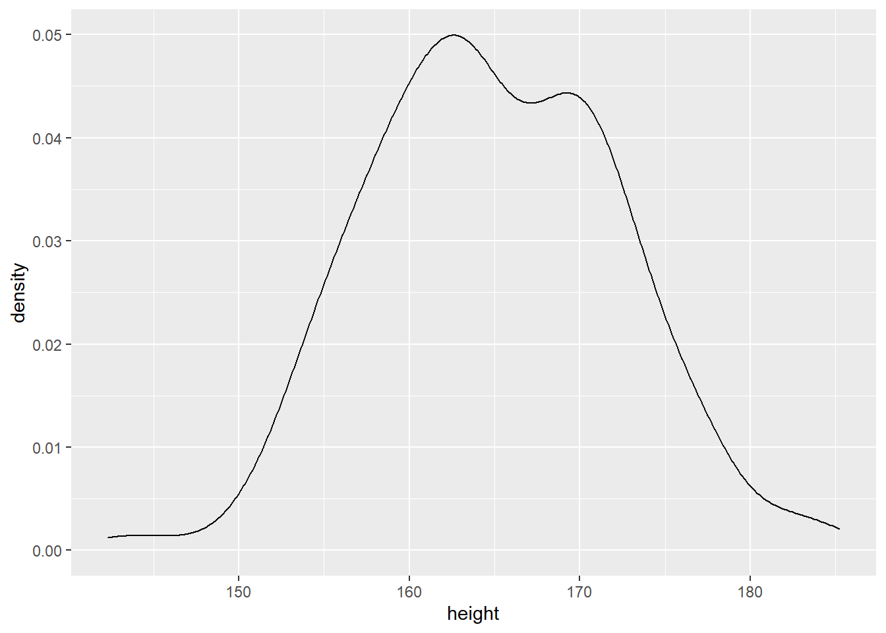
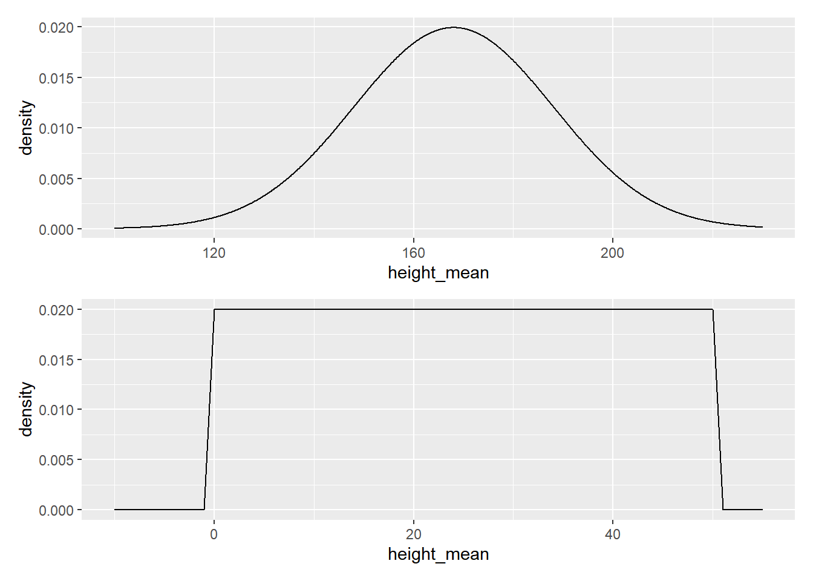

---
output:
  html_document: default
  pdf_document: default
---

# (PART) bayesian篇 {-}

# 贝叶斯推断 {#bayesian-inference}


- 概率学派，从数据出发。

- 贝叶斯：先假定参数有一个分布，看到数据后再重新分配可能性。

简单点说

$$
\Pr(\text{parameters} | \text{data}).
$$

这个量实际上贝叶斯定理中的后验概率分布(*posterior distribution*)

$$
\underbrace{\Pr(\text{parameters} | \text{data})}_{\text{posterior}} = \frac{\overbrace{\Pr(\text{data} | \text{parameters})}^{\text{likelihood}} \overbrace{\Pr(\text{parameters})}^{\text{prior}}}{\underbrace{\Pr(\text{data})}_{evidence}} .
$$

## 一个简单的贝叶斯推断实例-学生身高分布


```r
d <- readr::read_rds(here::here('datas', "height_weight.rds")) 
head(d)
```

```
##   sex   height   weight
## 1 boy 173.7173 59.93405
## 2 boy 170.8879 60.03269
## 3 boy 182.1087 62.76687
## 4 boy 176.2107 55.53530
## 5 boy 167.0802 56.64638
## 6 boy 183.1166 60.60861
```

查看样本的统计量并可视化，我们主要关注`height`列的情况 。


```r
sta_height <- d %>% 
  summarise(
    across(height, list(mean = mean, median = median,
                        max = max, min = min, sd = sd))) %>% 
  pivot_longer(cols = everything(),
               names_to = "index",
               values_to = "value")  # 转换为长表便于查看
sta_height
```

```
## # A tibble: 5 x 2
##   index          value
##   <chr>          <dbl>
## 1 height_mean   165.  
## 2 height_median 164.  
## 3 height_max    185.  
## 4 height_min    142.  
## 5 height_sd       7.31
```


```r
d %>% 
  ggplot(aes(x = height)) +
    geom_density()
```



## 一个简单的贝叶斯推断实例-推断

:::: {.rmdnote data-latex="{注意}"}
注意，我们的数据是一个样本，不代表全体的分布。这就是**推断**的意义，我们需要通过样本来**推断**总体的分布情况。
::::

我们回头在看一下`height`的各个统计量情况。


```
## # A tibble: 5 x 2
##   index          value
##   <chr>          <dbl>
## 1 height_mean   165.  
## 2 height_median 164.  
## 3 height_max    185.  
## 4 height_min    142.  
## 5 height_sd       7.31
```

根据统计量，我们可以做出如下推断：

- 均值可能是160，162，170，172，…,或者说这个均值在一个范围之内，在这个范围内，有些值的可能性大，有些值可能性较低。比如，认为这值游离在(150,180)范围，其中168左右的可能最大，两端的可能性最低。如果寻求用数学语言来描述，它符合正态分布的特征。

- 方差也可以假设在(0, 50)范围内都有可能，而且每个位置上的概率都相等。

将以上推断以图形方式显示：


```r
p1 <- ggplot(data = tibble(x = seq(from = 100, to = 230, by = .1)),
             aes(x = x, y = dnorm(x, mean = 168, sd = 20))) +
  geom_line() +
  labs(x = "height_mean", y = "density")

p2 <- ggplot(data = tibble(x = seq(from = -10, to = 55, by = 1)),
             aes(x = x, y = dunif(x, min = 0, max = 50))) +
  geom_line() +
  labs(x = "height_mean", y = "density")
p1 / p2
```



