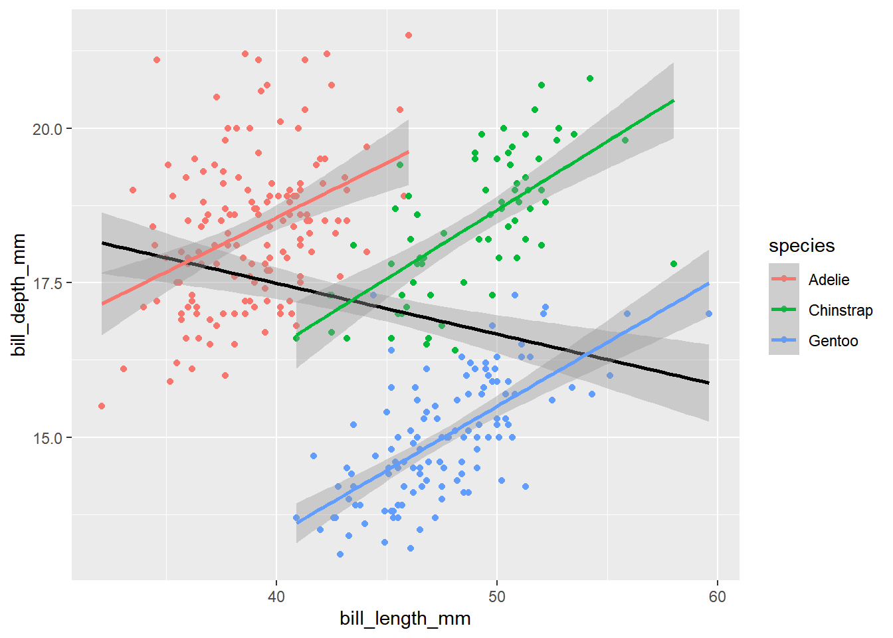

---
output:
  html_document: default
  pdf_document: default
---

# 字符串和时间日期 {#sec:str-date}


1. 在一张图中画出：

   - 企鹅嘴巴长度和厚度的散点图
   - 不同企鹅种类用不同颜色
   - 整体线性拟合
   - 不同种类分别线性拟合
   

```r
library(palmerpenguins)
penguins <- penguins %>% 
  drop_na()

ggplot(penguins, aes(x = bill_length_mm, 
                     y = bill_depth_mm)) +
  geom_point(aes(color = species)) +
  geom_smooth(color = "black", method = "lm") +
  geom_smooth(aes(color = species), method = "lm")
```



