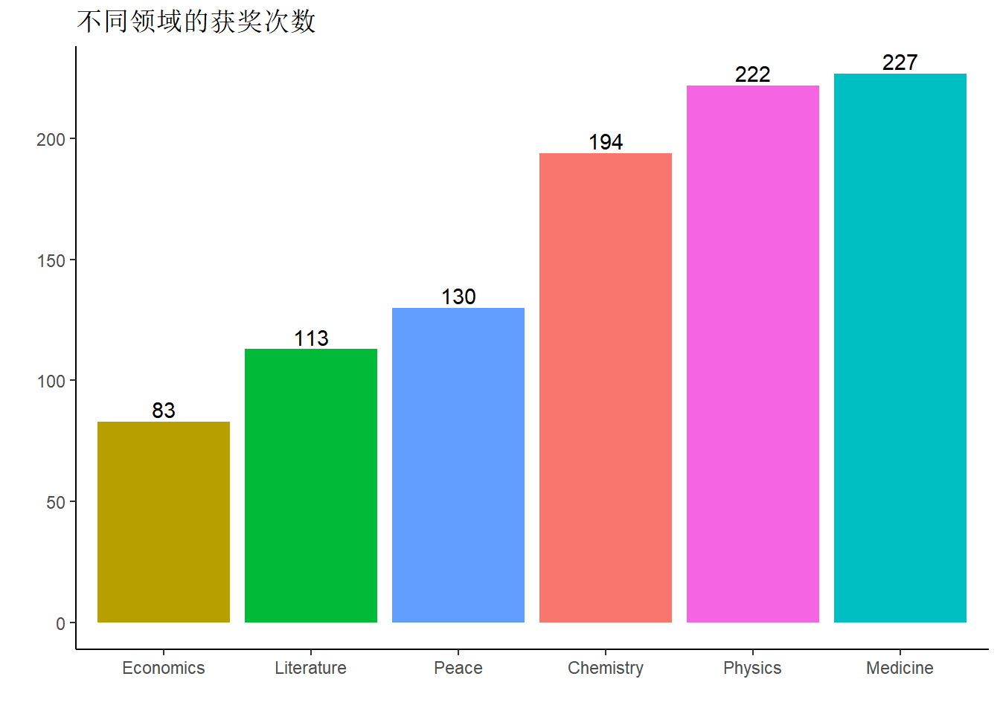
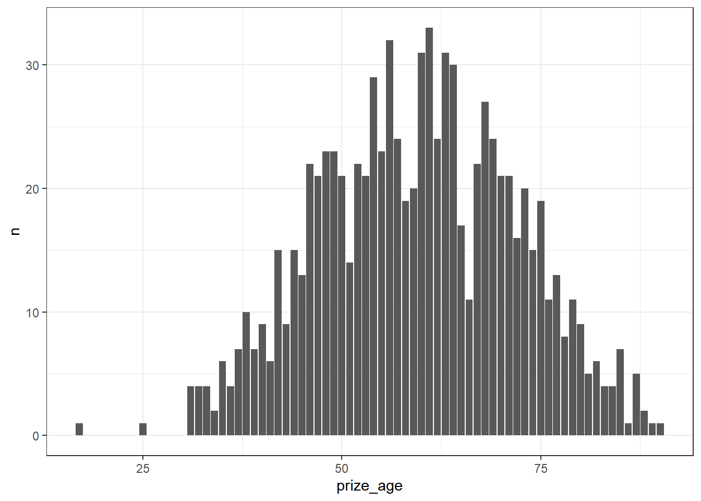
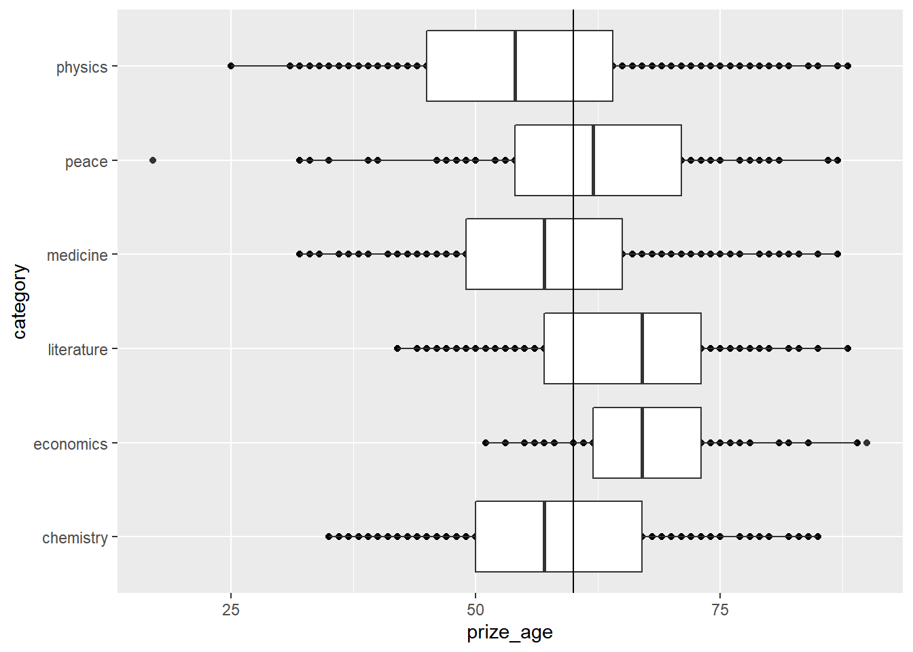
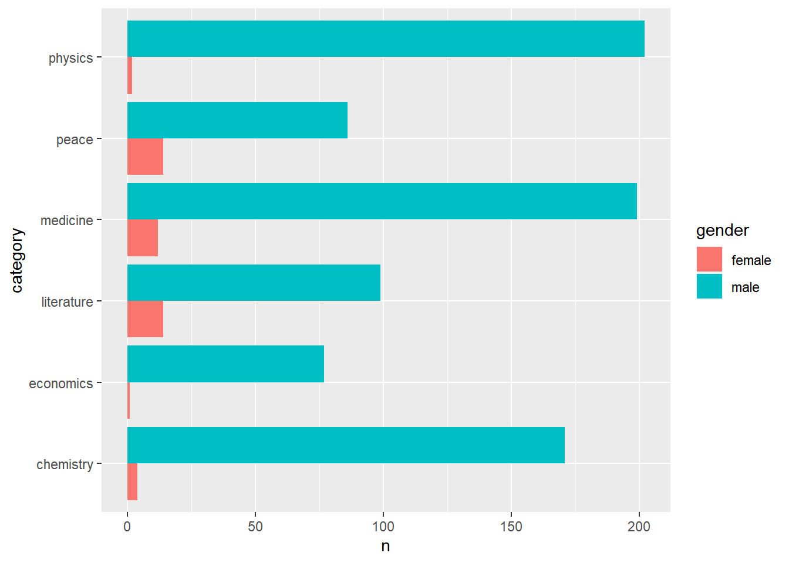
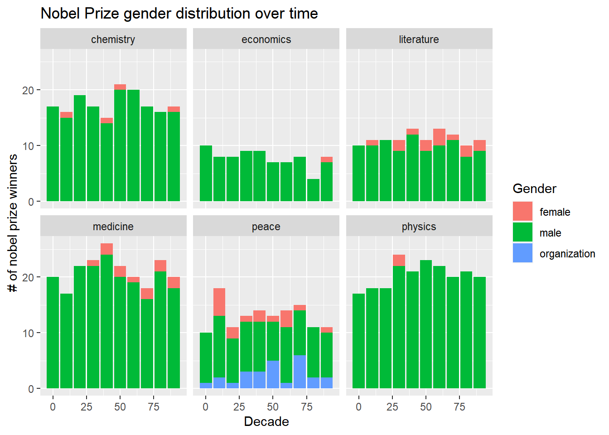
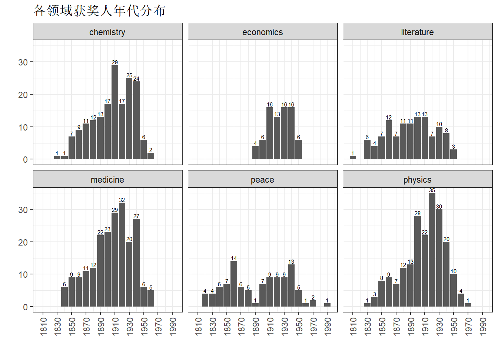
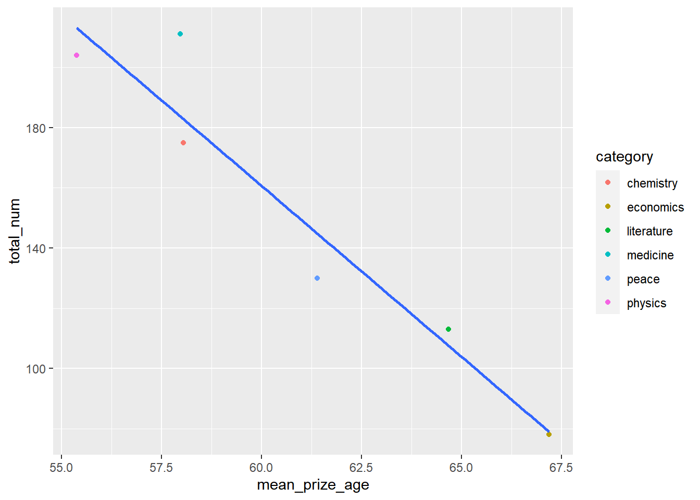
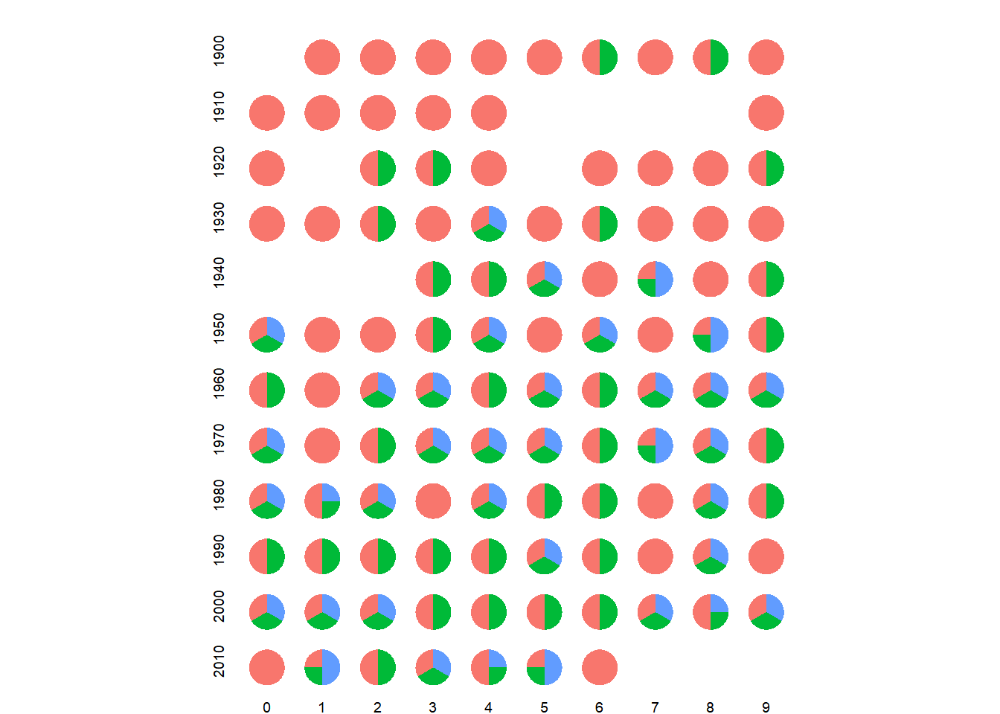

---
output:
  html_document: default
  pdf_document: default
---

# (PART) 应用篇 {-}

# 探索性数据分析-诺奖获得者 {#eda-nobel}


探索性数据分析（exporatory data analysis）是各种知识的综合运用。本章通过一个案例，讲解探索性数据分析的基本思路，也算是对前面几章内容的一次总结复习。

## 探索性

- 数据准备-对数据做到心中有数：

   - 描述变量
   - 数据结构
   - 缺失值及处理
   
- 数据探索-围绕探索的目标：

   - 数据规整
   - 可视化
   - 建模
   
## 数据集

这是一个诺贝尔得奖者的数据集。

## 导入数据


```r
library(tidyverse)
library(lubridate)
df <- read_csv("./datas/nobel_winners.csv")
df
```

```
## # A tibble: 969 x 18
##    prize_year category   prize     motivation prize_share laureate_id
##         <dbl> <chr>      <chr>     <chr>      <chr>             <dbl>
##  1       1901 Chemistry  The Nobe~ "\"in rec~ 1/1                 160
##  2       1901 Literature The Nobe~ "\"in spe~ 1/1                 569
##  3       1901 Medicine   The Nobe~ "\"for hi~ 1/1                 293
##  4       1901 Peace      The Nobe~  <NA>      1/2                 462
##  5       1901 Peace      The Nobe~  <NA>      1/2                 463
##  6       1901 Physics    The Nobe~ "\"in rec~ 1/1                   1
##  7       1902 Chemistry  The Nobe~ "\"in rec~ 1/1                 161
##  8       1902 Literature The Nobe~ "\"the gr~ 1/1                 571
##  9       1902 Medicine   The Nobe~ "\"for hi~ 1/1                 294
## 10       1902 Peace      The Nobe~  <NA>      1/2                 464
## # ... with 959 more rows, and 12 more variables:
## #   laureate_type <chr>, full_name <chr>, birth_date <date>,
## #   birth_city <chr>, birth_country <chr>, gender <chr>,
## #   organization_name <chr>, organization_city <chr>,
## #   organization_country <chr>, death_date <date>, death_city <chr>,
## #   death_country <chr>
```

::: {.rmdwarn data-latex="{警告}"}
- 路径（包括文件名）， 不要用中文和空格

- 数据框中变量，也不要有中文和空格（可用下划线代替空格）
:::

## 数据结构

1. 缺失值及其处理


```r
df %>% 
  map_df(~ sum(is.na(.))) %>% 
  pivot_longer(
    cols = everything(),
    names_to = "变量",
    values_to = "缺失值总数"
  )
```

```
## # A tibble: 18 x 2
##    变量                 缺失值总数
##    <chr>                     <int>
##  1 prize_year                    0
##  2 category                      0
##  3 prize                         0
##  4 motivation                   88
##  5 prize_share                   0
##  6 laureate_id                   0
##  7 laureate_type                 0
##  8 full_name                     0
##  9 birth_date                   31
## 10 birth_city                   28
## 11 birth_country                26
## 12 gender                       26
## 13 organization_name           247
## 14 organization_city           253
## 15 organization_country        253
## 16 death_date                  352
## 17 death_city                  370
## 18 death_country               364
```

## 确定想探索的问题

- 每个学科颁过多少次奖？

- 都有哪些人多次获奖？这些大神都是哪个年代的人？

- 性别比例

- 平均年龄和获奖数量

- 最年轻的诺奖获得者是谁？

- 中国诺奖获得者有哪些？

- 得奖的时候多大年龄？

- 获奖者所在国家的经济情况？

- 有大神多次获得诺贝尔奖，而且在不同科学领域获奖？

- 出生地分布？工作地分布？迁移模式？

- GDP经济与诺奖模型？

- 诺奖分享情况？

### 每个学科获奖次数


```r
# library(ggthemr)
# ggthemr("dust")
df %>% 
  count(category) %>% 
  ggplot(aes(x = fct_reorder(category, n), 
             y = n, fill = category)) +
    geom_col() +
    geom_text(aes(label = n), vjust = -0.25) +
    theme_classic() +
    labs(x = " ", y = " ", titles = "不同领域的获奖次数") +
    theme(legend.position = "none")
```



### 我国科学家获奖情况


```r
df %>% 
  filter(birth_country == "China") %>% 
  select(full_name, prize_year, category)
```

```
## # A tibble: 12 x 3
##    full_name              prize_year category  
##    <chr>                       <dbl> <chr>     
##  1 Walter Houser Brattain       1956 Physics   
##  2 Chen Ning Yang               1957 Physics   
##  3 Tsung-Dao (T.D.) Lee         1957 Physics   
##  4 Edmond H. Fischer            1992 Medicine  
##  5 Daniel C. Tsui               1998 Physics   
##  6 Gao Xingjian                 2000 Literature
##  7 Charles Kuen Kao             2009 Physics   
##  8 Charles Kuen Kao             2009 Physics   
##  9 Ei-ichi Negishi              2010 Chemistry 
## 10 Liu Xiaobo                   2010 Peace     
## 11 Mo Yan                       2012 Literature
## 12 Youyou Tu                    2015 Medicine
```

数据集中存在重复情况，如`Charles Kuen Kao`在2009年的`Physics`获奖记录了两次。

我们需要先对整个数据集进行处理，然后再进行筛选。


```r
nobel_winners <- df %>% 
  mutate_if(is.character, tolower) %>%  # 字符转换为小写
  distinct_at(vars(full_name, prize_year, category),
              .keep_all = TRUE) %>% 
  mutate(
    decade = 10 * (prize_year %% 10), 
    prize_age = prize_year - year(birth_date)
  ) 
nobel_winners
```

```
## # A tibble: 911 x 20
##    prize_year category   prize     motivation prize_share laureate_id
##         <dbl> <chr>      <chr>     <chr>      <chr>             <dbl>
##  1       1901 chemistry  the nobe~ "\"in rec~ 1/1                 160
##  2       1901 literature the nobe~ "\"in spe~ 1/1                 569
##  3       1901 medicine   the nobe~ "\"for hi~ 1/1                 293
##  4       1901 peace      the nobe~  <NA>      1/2                 462
##  5       1901 peace      the nobe~  <NA>      1/2                 463
##  6       1901 physics    the nobe~ "\"in rec~ 1/1                   1
##  7       1902 chemistry  the nobe~ "\"in rec~ 1/1                 161
##  8       1902 literature the nobe~ "\"the gr~ 1/1                 571
##  9       1902 medicine   the nobe~ "\"for hi~ 1/1                 294
## 10       1902 peace      the nobe~  <NA>      1/2                 464
## # ... with 901 more rows, and 14 more variables:
## #   laureate_type <chr>, full_name <chr>, birth_date <date>,
## #   birth_city <chr>, birth_country <chr>, gender <chr>,
## #   organization_name <chr>, organization_city <chr>,
## #   organization_country <chr>, death_date <date>, death_city <chr>,
## #   death_country <chr>, decade <dbl>, prize_age <dbl>
```

对数据进行规整后，再筛选我国的科学家。


```r
nobel_china <- nobel_winners %>% 
  filter(birth_country == "china") %>% 
  select(full_name, prize_year, category)
nobel_china
```

```
## # A tibble: 11 x 3
##    full_name              prize_year category  
##    <chr>                       <dbl> <chr>     
##  1 walter houser brattain       1956 physics   
##  2 chen ning yang               1957 physics   
##  3 tsung-dao (t.d.) lee         1957 physics   
##  4 edmond h. fischer            1992 medicine  
##  5 daniel c. tsui               1998 physics   
##  6 gao xingjian                 2000 literature
##  7 charles kuen kao             2009 physics   
##  8 ei-ichi negishi              2010 chemistry 
##  9 liu xiaobo                   2010 peace     
## 10 mo yan                       2012 literature
## 11 youyou tu                    2015 medicine
```

### 哪些人多次获奖


```r
nobel_winners %>% 
  group_by(full_name) %>% 
  mutate(
    number_prize = n(),
    number_cateory = n_distinct(category)
  ) %>% 
  arrange(desc(number_prize), full_name) %>% 
  filter(number_cateory == 2)
```

```
## # A tibble: 4 x 22
## # Groups:   full_name [2]
##   prize_year category  prize       motivation prize_share laureate_id
##        <dbl> <chr>     <chr>       <chr>      <chr>             <dbl>
## 1       1954 chemistry the nobel ~ "\"for hi~ 1/1                 217
## 2       1962 peace     the nobel ~  <NA>      1/1                 217
## 3       1903 physics   the nobel ~ "\"in rec~ 1/4                   6
## 4       1911 chemistry the nobel ~ "\"in rec~ 1/1                   6
## # ... with 16 more variables: laureate_type <chr>, full_name <chr>,
## #   birth_date <date>, birth_city <chr>, birth_country <chr>,
## #   gender <chr>, organization_name <chr>, organization_city <chr>,
## #   organization_country <chr>, death_date <date>, death_city <chr>,
## #   death_country <chr>, decade <dbl>, prize_age <dbl>,
## #   number_prize <int>, number_cateory <int>
```

### 获奖人年龄


```r
nobel_winners %>% 
  count(prize_age) %>% 
  ggplot(aes(x = prize_age, y = n)) +
    geom_col() +
    theme_bw() +
    labs("获奖者年龄柱状图")
```

```
## Warning: Removed 1 rows containing missing values (position_stack).
```




```r
nobel_winners %>% 
  filter(!is.na(prize_age)) %>% 
  group_by(category) %>% 
  mutate(category = fct_reorder(category,
                                prize_age,
                                median, 
                                na.rm = TRUE)) %>% 
  ggplot(aes(category, prize_age)) +
    geom_point() +
    geom_boxplot() +
    geom_hline(aes(yintercept = 60), 
               color = "black") +
    coord_flip()
```



由上图可知，

- 图中垂直的黑线为age=60。

- 各领域诺贝尔奖获得者在得奖时候年龄的中位数均超过了50岁，且大都在60岁上下。

### 性别比例


```r
nobel_winners %>% 
  filter(laureate_type == "individual",
         na.rm = TRUE) %>% 
  count(category, gender) %>% 
  group_by(category) %>% 
  mutate(prop = paste0(round(n / sum(n) * 100, 2),
                       "%")) %>% 
  ggplot(aes(category, n, fill = gender)) +
    geom_col(position = "dodge") +
    coord_flip()
```



- 可以看到获奖的人中，男性占绝大多数。

- 女性在和平、医学和文学三类奖项中获奖占比较多。


```r
# 各年代性别比例
nobel_winners %>% 
  count(decade, category, 
        gender = coalesce(gender, laureate_type)) %>% 
  group_by(decade, category) %>% 
  mutate(percent = n/sum(n)) %>% 
  ggplot(aes(decade, n, fill = gender)) +
    geom_col() +
    facet_wrap(~ category) +
    labs(
      x = "Decade",
      y = "# of nobel prize winners",
      fill = "Gender",
      title = "Nobel Prize gender distribution over time"
  )
```



### 获奖人出生年代


```r
nobel_winners %>% 
  select(category, birth_date) %>% 
  mutate(year = floor(year(birth_date) / 10) * 10) %>% 
  count(category, year) %>% 
  filter(!is.na(year)) %>% 
  ggplot(aes(x = year, y = n)) +
    geom_col()+
    scale_x_continuous(breaks = seq(1810, 1990, 20)) +
    geom_text(aes(label = n), vjust = -0.25,
              size = 2) +
    theme_bw() +
    theme(axis.text.x = element_text(angle = 90, 
                                      vjust = 0.5)) +
    facet_wrap(vars(category)) +
    labs(title = "各领域获奖人年代分布",
         x = " ", 
         y = " ")
```



### 最年轻的诺奖获得者


```r
nobel_winners %>% 
  filter(prize_age == min(prize_age, na.rm = TRUE)) %>%
  select(category, prize_year, full_name, birth_country, 
         gender, prize_age) 
```

```
## # A tibble: 1 x 6
##   category prize_year full_name        birth_country gender prize_age
##   <chr>         <dbl> <chr>            <chr>         <chr>      <dbl>
## 1 peace          2014 malala yousafzai pakistan      female        17
```

- 可以看到最年轻的诺奖获得者是出生于巴基斯坦的malala yousafzai，是一位女性，荣获2014年诺贝尔和平奖。

### 平均年龄和各领域获奖数量


```r
df1 <- nobel_winners %>% 
  group_by(category) %>% 
  summarise(
    mean_prize_age = mean(prize_age, na.rm = TRUE),
    total_num = n()
  ) %>% 
  arrange(desc(total_num))
df1
```

```
## # A tibble: 6 x 3
##   category   mean_prize_age total_num
##   <chr>               <dbl>     <int>
## 1 medicine             58.0       211
## 2 physics              55.4       204
## 3 chemistry            58.0       175
## 4 peace                61.4       130
## 5 literature           64.7       113
## 6 economics            67.2        78
```

```r
df1 %>% 
  ggplot(aes(mean_prize_age, total_num)) +
    geom_point(aes(color = category)) +
    geom_smooth(method = lm, se = FALSE)
```



- 医学奖领域获奖的数量最多，而经济学领域获奖数量最少。

- 获奖总数越少，获奖平均年龄越高。

## 地图


```r
library(here)
library(sf)
library(countrycode)

nobel_winners_clean <- nobel_winners %>%
  mutate_at(
    vars(birth_country, death_country),
    ~ ifelse(str_detect(., "\\("), 
             str_extract(., "(?<=\\().*?(?=\\))"), .)
  ) %>%
  mutate_at(
    vars(birth_country, death_country),
    ~ case_when(
      . == "scotland" ~ "united kingdom",
      . == "northern ireland" ~ "united kingdom",
      str_detect(., "czech") ~ "czechia",
      str_detect(., "germany") ~ "germany",
      TRUE ~ .
    )
  ) %>%
  select(full_name, prize_year, 
         category, birth_date, 
         birth_country, gender, 
         organization_name, 
         organization_country, death_country) 

nobel_winners_clean %>%
  mutate(
    colour = case_when(
      death_country == "united states of america" ~ "#FF2B4F",
      death_country == "germany" ~ "#fcab27",
      death_country == "united kingdom" ~ "#3686d3",
      death_country == "france" ~ "#88398a",
      death_country == "switzerland" ~ "#20d4bc",
      TRUE ~ "gray60"
    ))
```

```
## # A tibble: 911 x 10
##    full_name      prize_year category birth_date birth_country gender
##    <chr>               <dbl> <chr>    <date>     <chr>         <chr> 
##  1 "jacobus henr~       1901 chemist~ 1852-08-30 netherlands   male  
##  2 "sully prudho~       1901 literat~ 1839-03-16 france        male  
##  3 "emil adolf v~       1901 medicine 1854-03-15 poland        male  
##  4 "jean henry d~       1901 peace    1828-05-08 switzerland   male  
##  5 "frédéric pas~       1901 peace    1822-05-20 france        male  
##  6 "wilhelm conr~       1901 physics  1845-03-27 germany       male  
##  7 "hermann emil~       1902 chemist~ 1852-10-09 germany       male  
##  8 "christian ma~       1902 literat~ 1817-11-30 germany       male  
##  9 "ronald ross"        1902 medicine 1857-05-13 india         male  
## 10 " lie ducommu~       1902 peace    1833-02-19 switzerland   male  
## # ... with 901 more rows, and 4 more variables:
## #   organization_name <chr>, organization_country <chr>,
## #   death_country <chr>, colour <chr>
```

```r
nobel_winners_birth_country <- nobel_winners_clean %>%
  count(birth_country) %>% 
  filter(!is.na(birth_country)) %>% 
  mutate(ISO3 = countrycode(birth_country,
                            origin = "country.name",
                            destination = "iso3c"))

global <- 
  sf::st_read("datas/worldmap/TM_WORLD_BORDERS_SIMPL-0.3.shp") %>% 
  st_transform(4326)
```

```
## Reading layer `TM_WORLD_BORDERS_SIMPL-0.3' from data source 
##   `D:\Document\Rwork\0.Study R\Notes-for-Study-R\datas\worldmap\TM_WORLD_BORDERS_SIMPL-0.3.shp' 
##   using driver `ESRI Shapefile'
## Simple feature collection with 246 features and 11 fields
## Geometry type: MULTIPOLYGON
## Dimension:     XY
## Bounding box:  xmin: -180 ymin: -90 xmax: 180 ymax: 83.57027
## Geodetic CRS:  WGS 84
```


```r
global %>% 
  full_join(nobel_winners_birth_country, by = "ISO3") %>% 
  ggplot() +
    geom_sf(aes(fill = n),
            color = "white",
            size = 0.1) +
    labs(x = NULL, y = NULL,
         title = "Nobel Winners by country",
         subtitle = "color of map indicates number of Nobel lauretes",
         fill = "NO. Nobel lauretes",
         caption = "Made: Lee") +
    scale_fill_gradientn(colors = c("royalblue1",
                                    "magenta", 
                                    "orange", 
                                    "gold"), 
                         na.value = "white") +
    theme_void() +
    theme(legend.position = c(0.1, 0.3), 
          plot.background = element_rect(fill = "gray"),
          plot.title = element_text(hjust = 0.5),
          plot.subtitle = element_text(hjust = 0.5))
```


### 出生地和工作地不一样的占比


```r
nobel_winners_clean %>% 
  select(category, birth_country, death_country) %>% 
  mutate(immigration = if_else(
    birth_country == death_country, 0, 1
  )) %>% 
  group_by(immigration) %>% 
  count(immigration) %>% 
  drop_na()
```

```
## # A tibble: 2 x 2
## # Groups:   immigration [2]
##   immigration     n
##         <dbl> <int>
## 1           0   400
## 2           1   182
```

- 有182位获奖者不再自己的出生地工作。

### 共同获奖人


```r
nobel_winners %>% 
  separate(prize_share, into= c("num", "deno"), 
           sep = "/", remove = FALSE)
```

```
## # A tibble: 911 x 22
##    prize_year category   prize     motivation prize_share num   deno 
##         <dbl> <chr>      <chr>     <chr>      <chr>       <chr> <chr>
##  1       1901 chemistry  the nobe~ "\"in rec~ 1/1         1     1    
##  2       1901 literature the nobe~ "\"in spe~ 1/1         1     1    
##  3       1901 medicine   the nobe~ "\"for hi~ 1/1         1     1    
##  4       1901 peace      the nobe~  <NA>      1/2         1     2    
##  5       1901 peace      the nobe~  <NA>      1/2         1     2    
##  6       1901 physics    the nobe~ "\"in rec~ 1/1         1     1    
##  7       1902 chemistry  the nobe~ "\"in rec~ 1/1         1     1    
##  8       1902 literature the nobe~ "\"the gr~ 1/1         1     1    
##  9       1902 medicine   the nobe~ "\"for hi~ 1/1         1     1    
## 10       1902 peace      the nobe~  <NA>      1/2         1     2    
## # ... with 901 more rows, and 15 more variables: laureate_id <dbl>,
## #   laureate_type <chr>, full_name <chr>, birth_date <date>,
## #   birth_city <chr>, birth_country <chr>, gender <chr>,
## #   organization_name <chr>, organization_city <chr>,
## #   organization_country <chr>, death_date <date>, death_city <chr>,
## #   death_country <chr>, decade <dbl>, prize_age <dbl>
```


```r
nobel_winners %>% 
  filter(category == "medicine") %>% 
  mutate(
    num_a = as.numeric(str_sub(prize_share, 1, 1)),
    num_b = as.numeric(str_sub(prize_share, -1)),
    share = num_a / num_b,
    year = prize_year %% 10,
    decade = 10 * (prize_year %/% 10)  # %/%：floor向下取整
  ) %>% 
  group_by(prize_year) %>% 
  mutate(n = row_number()) %>% 
  ggplot() +
    geom_col(aes(x = "", y = share, fill = as.factor(n)),
             show.legend = FALSE) +
    coord_polar("y") +
    facet_grid(decade ~ year, switch = "both") +
    labs(title = "Annual Nobel Prize sharing") +
    theme_void() +
    theme(
      plot.title = element_text(face = "bold", 
                                vjust = 8),
      strip.text.x = element_text(
        size = 7,
        margin = margin(t = 5)
      ),
      strip.text.y = element_text(
        size = 7,
        angle = 180, hjust = 1, 
        margin = margin(r = 10)
      )
    )
```




