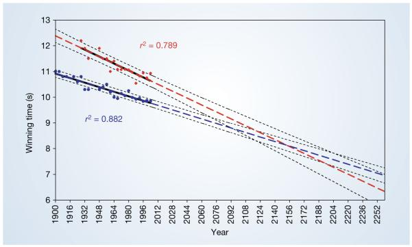
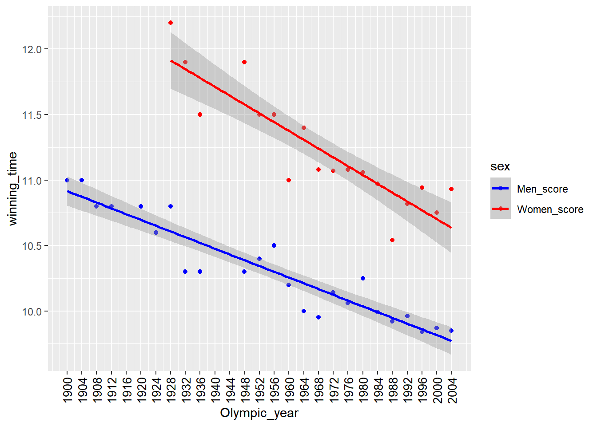

---
output:
  html_document: default
  pdf_document: default
---

# 探索性数据分析-奥林匹克 {#eda-olympics}


这是Nature期刊上的一篇文章[Nature. 2004 September 30; 431(7008)](https://www.ncbi.nlm.nih.gov/pmc/articles/PMC3173856/#SD2)，


```r
knitr::include_graphics("images/ukmss-36386-f0001.jpg", dpi = FALSE)
```


图中显示的为100米比赛时间的趋势图（男子为蓝色、女子为红色），并根据历史数据对未来奥运会的情况进行了预测，结论为：男子女子100米比赛时间将在在2156年奥运会相交，届时获胜的女子100米短跑时间为8.079秒，将比男子的8.098秒更快。

虽然觉得这个结论不太严谨，但我却无力反驳。于是在文章补充材料里，我找到了文章使用的数据，现在的任务是，重复这张图和文章的分析过程。

## 导入数据


```r
library(tidyverse)
library(readxl)

d <- read_excel("datas/olympics.xlsx")
d
```

```
## # A tibble: 27 x 3
##    Olympic_year Men_score Women_score
##           <dbl>     <dbl>       <dbl>
##  1         1900      11          NA  
##  2         1904      11          NA  
##  3         1908      10.8        NA  
##  4         1912      10.8        NA  
##  5         1916      NA          NA  
##  6         1920      10.8        NA  
##  7         1924      10.6        NA  
##  8         1928      10.8        12.2
##  9         1932      10.3        11.9
## 10         1936      10.3        11.5
## # ... with 17 more rows
```

```r
# 数据规整
d1 <- d %>% 
  pivot_longer(
    cols = -Olympic_year,
    names_to = "sex",
    values_to = "winning_time"
  )
d1
```

```
## # A tibble: 54 x 3
##    Olympic_year sex         winning_time
##           <dbl> <chr>              <dbl>
##  1         1900 Men_score           11  
##  2         1900 Women_score         NA  
##  3         1904 Men_score           11  
##  4         1904 Women_score         NA  
##  5         1908 Men_score           10.8
##  6         1908 Women_score         NA  
##  7         1912 Men_score           10.8
##  8         1912 Women_score         NA  
##  9         1916 Men_score           NA  
## 10         1916 Women_score         NA  
## # ... with 44 more rows
```

## 可视化


```r
d1 %>% 
  ggplot(aes(x = Olympic_year, y = winning_time, color = sex)) +
    geom_point() +
    geom_smooth(method = lm) +
    scale_color_manual(
      values = c("Men_score" = "blue", "Women_score" = "red")
    ) +
    scale_x_continuous(
      breaks = seq(1900, 2004, by = 4),
      labels = seq(1900, 2004, by = 4)
    ) +
    theme(axis.text.x = element_text(
      size = 10, angle = 90, color = "black",
      vjust = 0.5, hjust = 1
    )
  )
```

```
## Warning: Removed 12 rows containing non-finite values (stat_smooth).
```

```
## Warning: Removed 12 rows containing missing values (geom_point).
```



## 回归分析

首先我们需要建立年份与成绩的线性回归关系：

$$
\begin{align}
  score_i = \alpha + \beta ×year_i + \epsilon_i,  \epsilon_i \in Normal(
  \mu, \sigma)
\end{align}
$$

我们需要求出系数$\alpha$和$\beta$：


```r
fit1 <- lm(Men_score ~ 1 + Olympic_year, data = d)
summary(fit1)
```

```
## 
## Call:
## lm(formula = Men_score ~ 1 + Olympic_year, data = d)
## 
## Residuals:
##       Min        1Q    Median        3Q       Max 
## -0.263708 -0.052702  0.007381  0.080048  0.214559 
## 
## Coefficients:
##                Estimate Std. Error t value Pr(>|t|)    
## (Intercept)  31.8264525  1.6796428   18.95 4.11e-15 ***
## Olympic_year -0.0110056  0.0008593  -12.81 1.13e-11 ***
## ---
## Signif. codes:  0 '***' 0.001 '**' 0.01 '*' 0.05 '.' 0.1 ' ' 1
## 
## Residual standard error: 0.1347 on 22 degrees of freedom
##   (因为不存在，3个观察量被删除了)
## Multiple R-squared:  0.8817,	Adjusted R-squared:  0.8764 
## F-statistic:   164 on 1 and 22 DF,  p-value: 1.128e-11
```


```r
fit2 <- lm(Women_score ~ 1 + Olympic_year, data = d)
```

## 预测


```r
df <- data.frame(Olympic_year = 2020)
df %>% 
  mutate(
   # newdata参数将拟合结果整合进df中
   result =  predict(fit1, newdata = df))  
```

```
##   Olympic_year   result
## 1         2020 9.595218
```

为了图片中的一致，我们使用1900年到2252年`(seq(1900, 2252, by = 4))`建立预测项，并整理到数据框里。


```r
# 建立从1900到2252的年份数据框
grid <- tibble(
  Olympic_year = as.numeric(seq(1900, 2252, by = 4))
)

# 将预测结果整合进年份数据框中
tb <- grid %>% 
  mutate(
    Predict_Men = predict(fit1, newdata = grid),
    Predict_Women = predict(fit2, newdata = grid)
  )
tb
```

```
## # A tibble: 89 x 3
##    Olympic_year Predict_Men Predict_Women
##           <dbl>       <dbl>         <dbl>
##  1         1900        10.9          12.4
##  2         1904        10.9          12.3
##  3         1908        10.8          12.3
##  4         1912        10.8          12.2
##  5         1916        10.7          12.1
##  6         1920        10.7          12.0
##  7         1924        10.7          12.0
##  8         1928        10.6          11.9
##  9         1932        10.6          11.8
## 10         1936        10.5          11.8
## # ... with 79 more rows
```


```r
# modelr包中的add_predictions()函数可以实现相同功能
library(modelr)
grid %>% 
  add_predictions(fit1, var = "Predict_Men") %>% 
  add_predictions(fit2, var = "Predict_Women")
```

```
## # A tibble: 89 x 3
##    Olympic_year Predict_Men Predict_Women
##           <dbl>       <dbl>         <dbl>
##  1         1900        10.9          12.4
##  2         1904        10.9          12.3
##  3         1908        10.8          12.3
##  4         1912        10.8          12.2
##  5         1916        10.7          12.1
##  6         1920        10.7          12.0
##  7         1924        10.7          12.0
##  8         1928        10.6          11.9
##  9         1932        10.6          11.8
## 10         1936        10.5          11.8
## # ... with 79 more rows
```

## 再次可视化


```r
tb1 <- tb %>% 
  pivot_longer(
    cols = -Olympic_year,
    names_to = "sex",
    values_to = "winning_time"
  )
tb1
```

```
## # A tibble: 178 x 3
##    Olympic_year sex           winning_time
##           <dbl> <chr>                <dbl>
##  1         1900 Predict_Men           10.9
##  2         1900 Predict_Women         12.4
##  3         1904 Predict_Men           10.9
##  4         1904 Predict_Women         12.3
##  5         1908 Predict_Men           10.8
##  6         1908 Predict_Women         12.3
##  7         1912 Predict_Men           10.8
##  8         1912 Predict_Women         12.2
##  9         1916 Predict_Men           10.7
## 10         1916 Predict_Women         12.1
## # ... with 168 more rows
```

```r
tb1 %>% 
  ggplot(aes(
      x = Olympic_year, 
      y = winning_time, 
      color = sex)) +
    geom_line(size = 2) +
    geom_point(data = d1) +
    scale_color_manual(
      values = c(
        "Men_score" = "blue",
        "Women_score" = "red",
        "Predict_Men" = "#588B8B",
        "Predict_Women" = "#C8553D"
      ),
      labels = c(
        "Men_score" = "Men score",
        "Women_score" = "Women score",
        "Predict_Men" = "Men Predict score",
        "Predict_Women" = "Women Predict score"
      )
    ) + 
    scale_x_continuous(
      breaks = seq(1900, 2252, by = 16),
      labels = as.character(seq(1900, 2252, by = 16))
    ) +
    theme(axis.text.x = element_text(
      size = 10, angle = 90, color = "black",
      vjust = 0.5, hjust = 1
    ))
```

```
## Warning: Removed 12 rows containing missing values (geom_point).
```


## 
