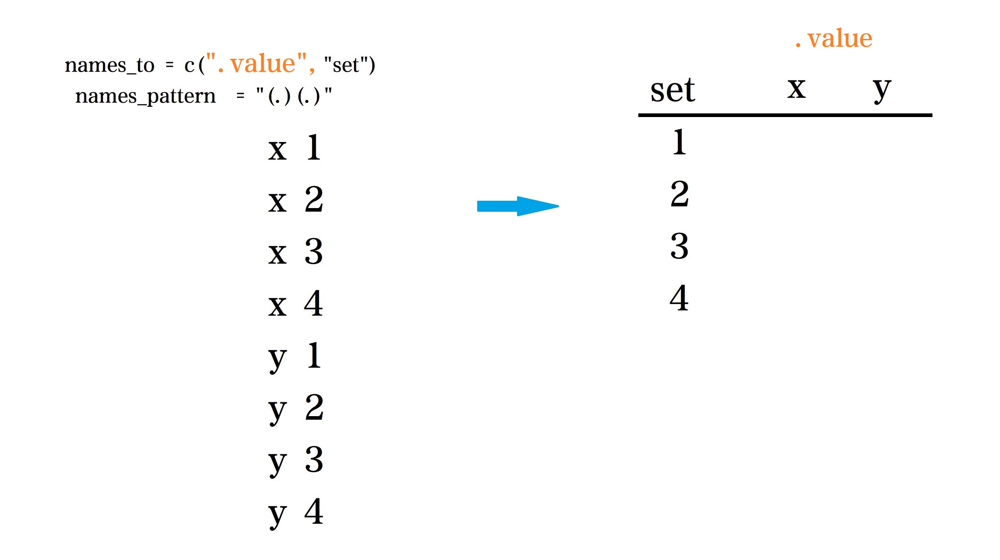
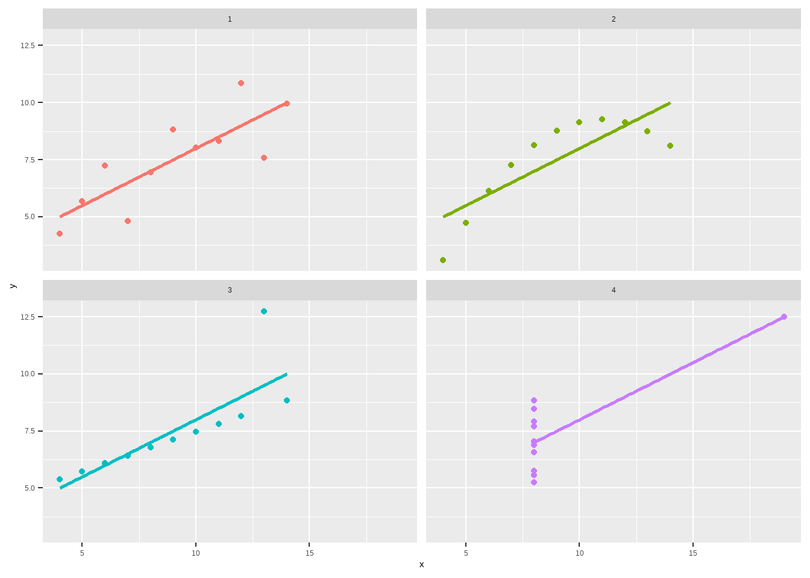

---
output:
  html_document: default
  pdf_document: default
---

# 探索性数据分析-anscombe数据集 {#eda-anscombe}


```r
?datasets::anscombe
```
::: {.rmdtip data-latex="{提示}"}
`anscombe`数据集：

1. 拥有四对(x、y)的数据集。

2. 拥有相同的传统统计属性——平均值、方差、相关性、回归线，但y的每个值均不同.
:::

本章我们用`tidyverse`包和tidy思想对`anscombe`数据进行探索。

- 规整数据

- 分组统计

- 建模

- 可视化

## 规整数据


```r
d <- datasets::anscombe
head(d)
```

```
##   x1 x2 x3 x4   y1   y2    y3   y4
## 1 10 10 10  8 8.04 9.14  7.46 6.58
## 2  8  8  8  8 6.95 8.14  6.77 5.76
## 3 13 13 13  8 7.58 8.74 12.74 7.71
## 4  9  9  9  8 8.81 8.77  7.11 8.84
## 5 11 11 11  8 8.33 9.26  7.81 8.47
## 6 14 14 14  8 9.96 8.10  8.84 7.04
```

```r
tidy_d <- d %>% 
  pivot_longer(
    cols = everything(),
    names_to = c(".value", "set"),
    names_pattern = "(.)(.)"
  )
tidy_d
```

```
## # A tibble: 44 x 3
##    set       x     y
##    <chr> <dbl> <dbl>
##  1 1        10  8.04
##  2 2        10  9.14
##  3 3        10  7.46
##  4 4         8  6.58
##  5 1         8  6.95
##  6 2         8  8.14
##  7 3         8  6.77
##  8 4         8  5.76
##  9 1        13  7.58
## 10 2        13  8.74
## # ... with 34 more rows
```

上面的规整思路如下图所示：

- 我们希望x1按照指定的正则表达式分成了两个部分`x`和`1`

- 将1放在set下，x传给`.value`当作变形后的列名


```r

```


- `cols = everything()` 表示选择所有列

- `names_to = c(".value", "set")` 希望变型后的列名是`c(".value", "set")`, 这里 `".value"`是个特殊的符号，代表着`names_pattern`匹配过来的值，一般情况下，是多个值，如果传给`".value"`的`"x, y, z"`，那么列名就会变成`c("x", "y", "z", "set")`

- `names_pattern = "(.)(.)"` 将变换前的列名按照指定的正则表达式匹配，并且传递给`names_to`的对应的参数，比如这里第一个`(.)`传递给`.value`；第二个`(.)`传递给set.

## 统计


```r
tidy_d_summary <- tidy_d %>% 
  group_by(set) %>% 
  summarise(across(
    .col = everything(),
    .fns = lst(mean, sd, var),
    .names = "{col}-{fn}"
  ))
tidy_d_summary
```

```
## # A tibble: 4 x 7
##   set   `x-mean` `x-sd` `x-var` `y-mean` `y-sd` `y-var`
##   <chr>    <dbl>  <dbl>   <dbl>    <dbl>  <dbl>   <dbl>
## 1 1            9   3.32      11     7.50   2.03    4.13
## 2 2            9   3.32      11     7.50   2.03    4.13
## 3 3            9   3.32      11     7.5    2.03    4.12
## 4 4            9   3.32      11     7.50   2.03    4.12
```

## 建模


```r
# 方法1
tidy_d %>% 
  group_by(set) %>% 
  group_modify(
    ~ broom::tidy(lm(y ~ x, data = .))
  )
```

```
## # A tibble: 8 x 6
## # Groups:   set [4]
##   set   term        estimate std.error statistic p.value
##   <chr> <chr>          <dbl>     <dbl>     <dbl>   <dbl>
## 1 1     (Intercept)    3.00      1.12       2.67 0.0257 
## 2 1     x              0.500     0.118      4.24 0.00217
## 3 2     (Intercept)    3.00      1.13       2.67 0.0258 
## 4 2     x              0.5       0.118      4.24 0.00218
## 5 3     (Intercept)    3.00      1.12       2.67 0.0256 
## 6 3     x              0.500     0.118      4.24 0.00218
## 7 4     (Intercept)    3.00      1.12       2.67 0.0256 
## 8 4     x              0.500     0.118      4.24 0.00216
```

```r
# 方法2
tidy_d %>% 
  group_by(set) %>% 
  summarise(
    broom::tidy(lm(y ~ x, data = cur_data())
  ))
```

```
## # A tibble: 8 x 6
## # Groups:   set [4]
##   set   term        estimate std.error statistic p.value
##   <chr> <chr>          <dbl>     <dbl>     <dbl>   <dbl>
## 1 1     (Intercept)    3.00      1.12       2.67 0.0257 
## 2 1     x              0.500     0.118      4.24 0.00217
## 3 2     (Intercept)    3.00      1.13       2.67 0.0258 
## 4 2     x              0.5       0.118      4.24 0.00218
## 5 3     (Intercept)    3.00      1.12       2.67 0.0256 
## 6 3     x              0.500     0.118      4.24 0.00218
## 7 4     (Intercept)    3.00      1.12       2.67 0.0256 
## 8 4     x              0.500     0.118      4.24 0.00216
```

## 可视化


```r
tidy_d %>% 
  ggplot(aes(x = x, y = y, color = set)) +
    geom_point() +
    geom_smooth(method = "lm", se = FALSE) +
    theme(legend.position = "none") +
    facet_wrap(~ set)
```



