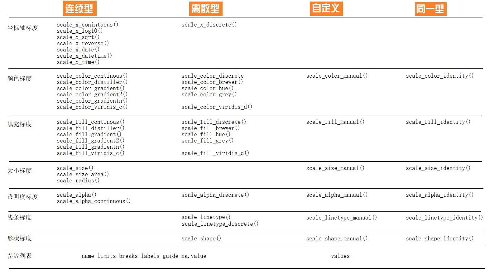

---
output:
  html_document: default
  pdf_document: default
---

# ggplot2 {#ggplot2}


## 几何形状


```r
df <- read_csv("datas/datasaurus.csv")
df
```

```
## # A tibble: 1,846 x 3
##    dataset     x     y
##    <chr>   <dbl> <dbl>
##  1 dino     55.4  97.2
##  2 dino     51.5  96.0
##  3 dino     46.2  94.5
##  4 dino     42.8  91.4
##  5 dino     40.8  88.3
##  6 dino     38.7  84.9
##  7 dino     35.6  79.9
##  8 dino     33.1  77.6
##  9 dino     29.0  74.5
## 10 dino     26.2  71.4
## # ... with 1,836 more rows
```

```r
# 计算数据中x和y的均值和方差，以及两者的相关系数
df %>% 
  group_by(dataset) %>% 
  summarise(
    across(everything(), list(mean = mean, sd = sd), 
           .names = "{fn}_{col}")
  ) %>% 
  mutate(
    across(where(is.numeric), round, 3)
  )
```

```
## # A tibble: 13 x 5
##    dataset    mean_x  sd_x mean_y  sd_y
##    <chr>       <dbl> <dbl>  <dbl> <dbl>
##  1 away         54.3  16.8   47.8  26.9
##  2 bullseye     54.3  16.8   47.8  26.9
##  3 circle       54.3  16.8   47.8  26.9
##  4 dino         54.3  16.8   47.8  26.9
##  5 dots         54.3  16.8   47.8  26.9
##  6 h_lines      54.3  16.8   47.8  26.9
##  7 high_lines   54.3  16.8   47.8  26.9
##  8 slant_down   54.3  16.8   47.8  26.9
##  9 slant_up     54.3  16.8   47.8  26.9
## 10 star         54.3  16.8   47.8  26.9
## 11 v_lines      54.3  16.8   47.8  26.9
## 12 wide_lines   54.3  16.8   47.8  26.9
## 13 x_shape      54.3  16.8   47.8  26.9
```
以上数据的sd和mean值基本相同，是否可以断定每个数据集基本是一样的呢？


```r
ggplot(df, aes(x, y)) + 
  geom_point(aes(color = dataset)) +
  theme_bw() +
  theme(legend.position = "NONE") +
  facet_wrap(~dataset)
```


事实上，每张图都相差很大。所以，这里想说明的是，眼见为实。换句话说，可视化是数据探索中非常重要的部分。本章的目的就是带领大家学习ggplot2基本的绘图技能。

### 图形部件

一张统计图形就是从数据到几何形状(geometric object，缩写geom)所包含的图形属性(aesthetic attribute，缩写aes)的一种映射。

1. `data`: 数据框data.frame (注意，不支持向量vector和列表list类型）

2. `aes`: 数据框中的数据变量**映射**到图形属性。什么叫图形属性？就是图中点的位置、形状，大小，颜色等眼睛能看到的东西。什么叫映射？就是一种对应关系，比如数学中的函数`b = f(a)`就是`a`和`b`之间的一种映射关系, `a`的值决定或者控制了`b`的值，在ggplot2语法里，`a`就是我们输入的数据变量，`b`就是图形属性， 这些图形属性包括：
    + x（x轴方向的位置）
    + y（y轴方向的位置）
    + color（点或者线等元素的颜色）
    + size（点或者线等元素的大小）
    + shape（点或者线等元素的形状）
    + alpha（点或者线等元素的透明度）
    
3. `geoms`: 几何形状，确定我们想画什么样的图，一个`geom_***`确定一种形状。更多几何形状推荐阅读[这里](https://ggplot2.tidyverse.org/reference/)

    + `geom_bar()`
    + `geom_density()`
    + `geom_freqpoly()`
    + `geom_histogram()`
    + `geom_violin()`
    + `geom_boxplot()`
    + `geom_col()`
    + `geom_point()`
    + `geom_smooth()`
    + `geom_tile()`
    + `geom_density2d()`
    + `geom_bin2d()`
    + `geom_hex()`
    + `geom_count()`
    + `geom_text()`
    + `geom_sf()`
    


4. `stats`:   统计变换
5. `scales`:  标度
6. `coord`:   坐标系统
7. `facet`:   分面
8. `layer`：  增加图层
9. `theme`:   主题风格
10. `save`:   保存图片


<div class="figure" style="text-align: center">

<p class="caption">(\#fig:unnamed-chunk-4)ggplot2语法</p>
</div>

<div class="figure" style="text-align: center">

<p class="caption">(\#fig:unnamed-chunk-5)ggplot2图层语法框架</p>
</div>


## 标度

ggplot2中的scales语法，可以阅读[《ggplot2: Elegant Graphics for Data Analysis》](https://ggplot2-book.org/)，但如果需要详细了解**标度**参数体系，还是要看[ggplot2官方文档](https://cran.r-project.org/web/packages/ggplot2/index.html)。

简单来说，标度是用于调整数据映射的图形属性。

### 丰富的标度体系

标度函数是由”_“分割的三个部分构成的：

- scale 

- 视觉属性名 (e.g., colour, shape or x) 

- 标度名 (e.g., continuous, discrete, brewer).

<div class="figure" style="text-align: center">

<p class="caption">(\#fig:unnamed-chunk-6)ggplot2标度函数一览</p>
</div>

每个标度函数内部都有丰富的参数系统：


```r
scale_colour_manual(
  palette = function(), 
  limits = NULL,
  name = waiver(),
  labels = waiver(),
  breaks = waiver(),
  minor_breaks = waiver(),
  values = waiver(),
  ...
)
```

- 参数`name`，坐标和图例的名字，如果不想要图例的名字，就可以 `name = NULL`。

- 参数`limits`, 坐标或图例的范围区间。连续性`c(n, m)`，离散型`c("a", "b", "c")`。

- 参数`breaks`, 控制显示在坐标轴或者图例上的值（元素）。

- 参数`labels`, 坐标和图例的间隔标签。
  - 一般情况下，内置函数会自动完成
  - 也可人工指定一个字符型向量，与`breaks`提供的字符型向量一一对应
  - 也可以是函数，把`breaks`提供的字符型向量当做函数的输入
  - `NULL`，就是去掉标签

- 参数`values` 指的是（颜色、形状等）视觉属性值, 
  - 要么，与数值的顺序一致；
  - 要么，与`breaks`提供的字符型向量长度一致
  - 要么，用命名向量`c("数据标签" = "视觉属性")`提供

- 参数`expand`, 控制参数溢出量

- 参数`range`, 设置尺寸大小范围，比如针对点的相对大小


<!-- 把scale理解make, scale_x_continuous() == 使得x坐标连续型的 -->

## 主题设置

`theme(element_name = element_function())`函数中的element_function参数有四个：

1. element_text()：文本，用于控制标签和标题的字体风格。

2. element_lint()：线条，用于控制线条/线段的颜色或类型

3. element_rect()：矩形区域，用于控制背景矩形颜色或边界线条类型。

4. element_blank()：空白，就是不分配相应的绘图空间，即删去这个地方的绘图元素。

这部分我们着重来看。


```r
df <- mpg %>% 
  as_tibble() %>% 
  filter(class != "2seater", 
         manufacturer %in% c("toyota", "volkswagen"))
df
```

```
## # A tibble: 61 x 11
##    manufacturer model displ  year   cyl trans drv     cty   hwy fl   
##    <chr>        <chr> <dbl> <int> <int> <chr> <chr> <int> <int> <chr>
##  1 toyota       4run~   2.7  1999     4 manu~ 4        15    20 r    
##  2 toyota       4run~   2.7  1999     4 auto~ 4        16    20 r    
##  3 toyota       4run~   3.4  1999     6 auto~ 4        15    19 r    
##  4 toyota       4run~   3.4  1999     6 manu~ 4        15    17 r    
##  5 toyota       4run~   4    2008     6 auto~ 4        16    20 r    
##  6 toyota       4run~   4.7  2008     8 auto~ 4        14    17 r    
##  7 toyota       camry   2.2  1999     4 manu~ f        21    29 r    
##  8 toyota       camry   2.2  1999     4 auto~ f        21    27 r    
##  9 toyota       camry   2.4  2008     4 manu~ f        21    31 r    
## 10 toyota       camry   2.4  2008     4 auto~ f        21    31 r    
## # ... with 51 more rows, and 1 more variable: class <chr>
```


```r
# 基础图形
ggplot(df, aes(x = displ, y = hwy, color = factor(cyl))) +
  geom_point() +
  facet_grid(vars(manufacturer), vars(class)) +
  ggtitle("This is my title") +
  labs(x = "x_displ", y = "y_hwy")
```


### 图形的整体元素

图形的整体元素包括：

1. 整个图形的背景：

| 描述     | 主题元素            | 类型             |
|--------|-----------------|----------------|
| 整个图形背景 | plot.background | element_rect() |
| 图形标题   | plot.title      | element_text() |
| 图形边距   | plot.margin     | margin()       |

