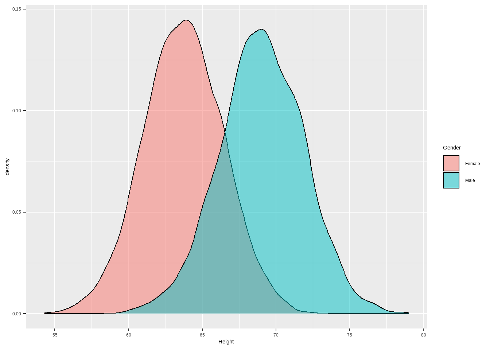
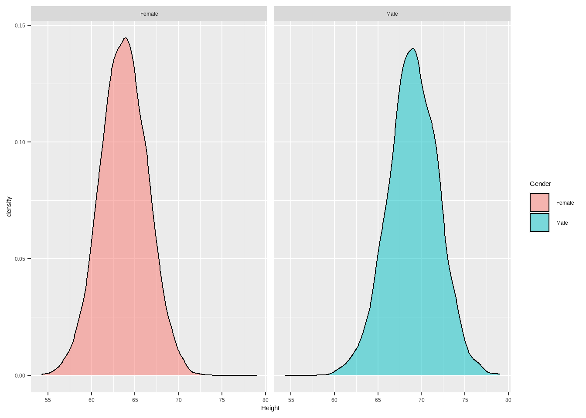
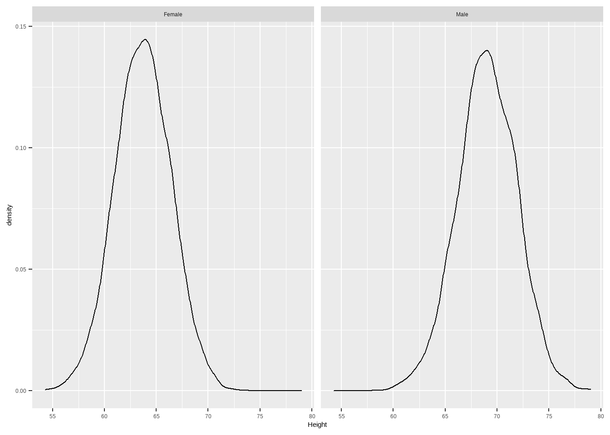
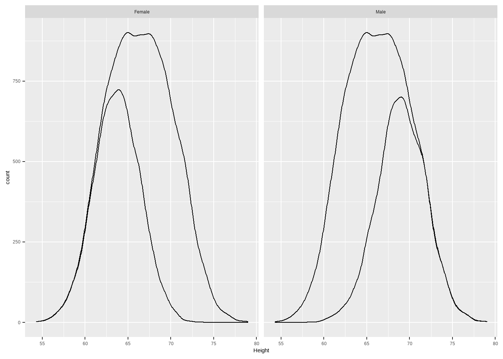
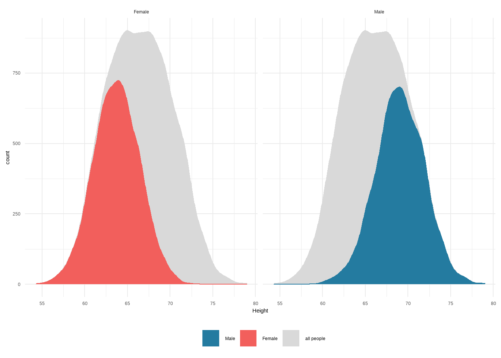
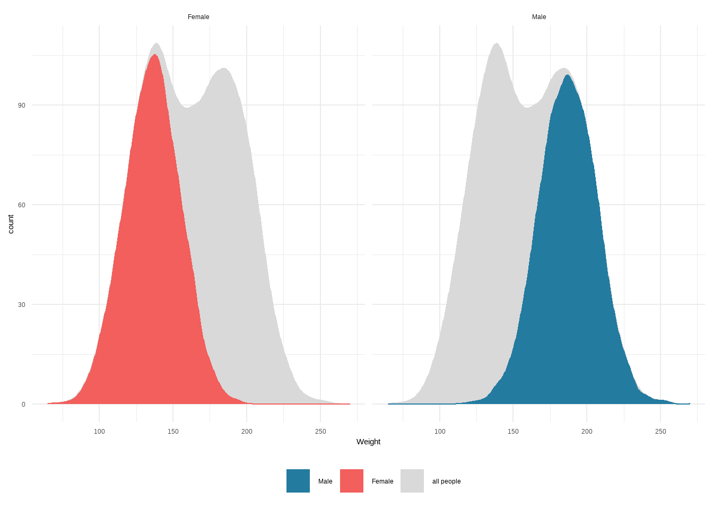
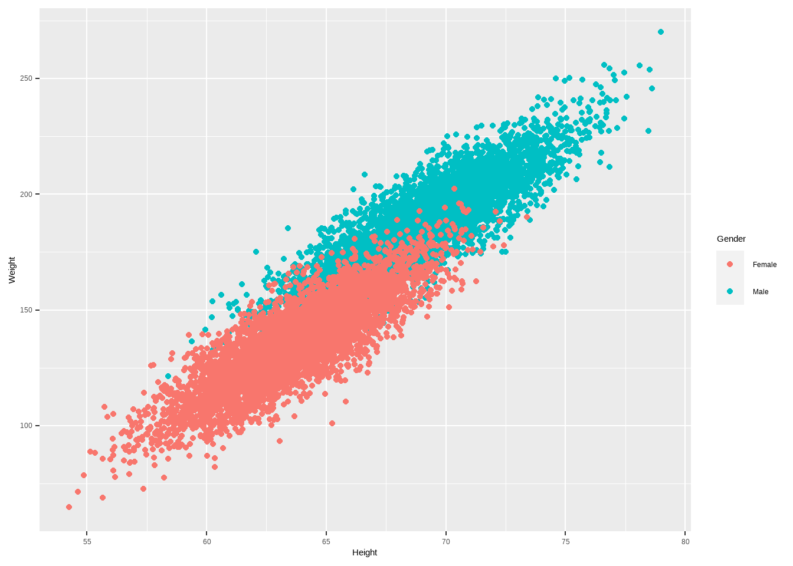

---
output:
  html_document: default
  pdf_document: default
---

# 探索性数据分析-身高体重关系 {#eda-height}


```r
d <- read.csv("datas/weight-height.csv")
d
```

```
##       Gender   Height    Weight
## 1       Male 73.84702 241.89356
## 2       Male 68.78190 162.31047
## 3       Male 74.11011 212.74086
## 4       Male 71.73098 220.04247
## 5       Male 69.88180 206.34980
## 6       Male 67.25302 152.21216
## 7       Male 68.78508 183.92789
## 8       Male 68.34852 167.97111
## 9       Male 67.01895 175.92944
## 10      Male 63.45649 156.39968
## 11      Male 71.19538 186.60493
## 12      Male 71.64081 213.74117
## 13      Male 64.76633 167.12746
## 14      Male 69.28307 189.44618
## 15      Male 69.24373 186.43417
## 16      Male 67.64562 172.18693
## 17      Male 72.41832 196.02851
## 18      Male 63.97433 172.88347
## 19      Male 69.64006 185.98396
## 20      Male 67.93600 182.42665
## 21      Male 67.91505 174.11593
## 22      Male 69.43944 197.73142
## 23      Male 66.14913 149.17357
## 24      Male 75.20597 228.76178
## 25      Male 67.89320 162.00665
## 26      Male 68.14403 192.34398
## 27      Male 69.08963 184.43517
## 28      Male 72.80084 206.82819
## 29      Male 67.42124 175.21392
## 30      Male 68.49642 154.34264
## 31      Male 68.61811 187.50684
## 32      Male 74.03381 212.91023
## 33      Male 71.52822 195.03224
## 34      Male 69.18016 205.18362
## 35      Male 69.57720 204.16413
## 36      Male 70.40093 192.90352
## 37      Male 69.07617 197.48824
## 38      Male 67.19352 183.81097
## 39      Male 65.80732 163.85182
## 40      Male 64.30419 163.10802
## 41      Male 67.97434 172.13560
## 42      Male 72.18943 194.04540
## 43      Male 65.27035 168.61775
## 44      Male 66.09018 161.19343
## 45      Male 67.51032 164.66028
## 46      Male 70.10479 188.92230
## 47      Male 68.25184 187.06055
## 48      Male 72.17271 209.07086
## 49      Male 69.17986 192.01434
## 50      Male 72.87036 211.34250
## 51      Male 64.78258 165.61163
## 52      Male 70.18355 201.07192
## 53      Male 68.49145 173.42396
## 54      Male 67.33083 181.40768
## 55      Male 66.99094 169.73771
## 56      Male 66.49955 163.30953
## 57      Male 68.35306 189.71021
## 58      Male 70.77446 192.12485
## 59      Male 71.21592 198.19846
## 60      Male 70.01337 209.52650
## 61      Male 71.40318 198.75979
## 62      Male 69.55201 198.07952
## 63      Male 73.81853 195.29061
## 64      Male 66.99688 164.94330
## 65      Male 71.41847 179.86390
## 66      Male 65.27930 155.25042
## 67      Male 68.27419 184.51939
## 68      Male 72.76537 220.67804
## 69      Male 68.09938 183.31266
## 70      Male 68.89671 196.45131
## 71      Male 69.28951 184.59561
## 72      Male 70.52322 207.53284
## 73      Male 69.66373 177.20093
## 74      Male 67.59527 163.10800
## 75      Male 72.50812 216.21823
## 76      Male 71.25299 204.65549
## 77      Male 71.80919 200.92057
## 78      Male 72.24517 220.90177
## 79      Male 66.51263 196.44986
## 80      Male 66.02903 168.64081
## 81      Male 67.57715 181.43271
## 82      Male 68.24657 198.65867
## 83      Male 73.82613 237.91674
## 84      Male 69.80246 173.04126
## 85      Male 65.95958 160.68392
## 86      Male 71.07902 188.60292
## 87      Male 66.59620 208.34569
## 88      Male 68.95154 193.43512
## 89      Male 68.24446 174.10969
## 90      Male 72.31683 197.36859
## 91      Male 71.81542 201.62067
## 92      Male 65.23705 181.01197
## 93      Male 70.64053 182.12249
## 94      Male 64.73193 177.54926
## 95      Male 67.10355 164.97458
## 96      Male 65.11748 165.71711
## 97      Male 71.70123 193.09416
## 98      Male 66.83288 180.68389
## 99      Male 66.47128 172.77372
## 100     Male 69.41153 177.47062
## 101     Male 70.05218 200.81874
## 102     Male 66.74360 167.73978
## 103     Male 66.27433 154.39562
## 104     Male 68.32845 177.98473
## 105     Male 70.07589 183.93886
## 106     Male 68.73299 179.20478
## 107     Male 67.55605 158.56799
## 108     Male 66.25363 166.50353
## 109     Male 69.18220 171.98368
## 110     Male 67.60910 174.36418
## 111     Male 69.29274 187.74535
## 112     Male 68.19068 201.48796
## 113     Male 71.60709 204.92701
## 114     Male 69.19686 178.68555
## 115     Male 67.26196 164.01443
## 116     Male 73.68519 223.27000
## 117     Male 69.53722 202.95831
## 118     Male 68.31156 189.39179
## 119     Male 67.73896 178.17056
## 120     Male 71.70576 223.29934
## 121     Male 63.63226 167.02871
## 122     Male 68.72120 180.46868
## 123     Male 66.94934 164.43915
## 124     Male 62.70699 149.96962
## 125     Male 72.25841 192.91027
## 126     Male 70.90865 201.88400
## 127     Male 67.60984 179.86803
## 128     Male 70.80156 196.46772
## 129     Male 69.30477 187.55165
## 130     Male 66.24290 171.69316
## 131     Male 67.49219 191.69960
## 132     Male 65.80625 165.85065
## 133     Male 71.44371 185.66274
## 134     Male 68.46441 178.28180
## 135     Male 63.98792 150.97905
## 136     Male 71.00190 209.92932
## 137     Male 68.13972 174.15780
## 138     Male 68.39540 179.87898
## 139     Male 68.09622 167.74714
## 140     Male 68.14059 183.04466
## 141     Male 68.86009 169.55682
## 142     Male 66.14885 173.43167
## 143     Male 66.20603 180.88955
## 144     Male 67.43212 183.50893
## 145     Male 69.47111 205.97791
## 146     Male 70.51586 183.75985
## 147     Male 71.33838 201.95450
## 148     Male 71.00194 216.12009
## 149     Male 66.20235 159.39032
## 150     Male 72.54331 210.33642
## 151     Male 67.47935 178.61835
## 152     Male 65.35041 146.73980
## 153     Male 70.84406 195.93701
## 154     Male 69.93848 170.17585
## 155     Male 64.73982 169.65405
## 156     Male 69.30840 198.37869
## 157     Male 68.83846 179.90772
## 158     Male 61.93732 147.26369
## 159     Male 68.59334 176.98425
## 160     Male 65.21858 185.46779
## 161     Male 64.33365 177.49380
## 162     Male 68.74891 169.82748
## 163     Male 72.48966 198.58170
## 164     Male 67.23393 203.35034
## 165     Male 67.26360 193.21767
## 166     Male 65.11850 178.13495
## 167     Male 66.26282 162.77958
## 168     Male 67.70168 159.28651
## 169     Male 65.53070 172.11431
## 170     Male 69.86897 201.83704
## 171     Male 68.48188 170.35233
## 172     Male 72.21396 205.38976
## 173     Male 68.17953 169.78777
## 174     Male 71.98121 200.43731
## 175     Male 66.06514 178.58895
## 176     Male 66.65616 168.01403
## 177     Male 67.59942 177.76643
## 178     Male 68.24594 193.27762
## 179     Male 64.80862 162.37954
## 180     Male 67.49222 183.38382
## 181     Male 68.18073 181.05610
## 182     Male 69.55338 210.87180
## 183     Male 66.40225 165.56850
## 184     Male 66.59216 196.14845
## 185     Male 71.93589 202.04643
## 186     Male 68.28704 170.41360
## 187     Male 69.95545 201.94809
## 188     Male 71.85113 193.38698
## 189     Male 65.75550 179.85569
## 190     Male 67.03185 156.48993
## 191     Male 76.70983 235.03542
## 192     Male 72.57112 230.56053
## 193     Male 69.72880 203.89565
## 194     Male 72.79922 218.21640
## 195     Male 72.53935 222.66718
## 196     Male 72.29474 208.47487
## 197     Male 67.25332 180.77978
## 198     Male 75.94446 231.92475
## 199     Male 66.31623 170.59386
## 200     Male 71.15605 188.27146
## 201     Male 71.19220 196.06153
## 202     Male 72.19751 214.60358
## 203     Male 75.14082 224.12427
## 204     Male 64.41153 158.57940
## 205     Male 64.73442 166.50111
## 206     Male 63.41459 160.14062
## 207     Male 67.84867 176.17263
## 208     Male 65.93178 174.48529
## 209     Male 70.96655 193.90650
## 210     Male 67.58075 186.99161
## 211     Male 68.58927 173.59580
## 212     Male 70.32475 193.34656
## 213     Male 72.39448 208.43651
## 214     Male 70.82086 206.03298
## 215     Male 65.90330 172.57523
## 216     Male 74.79538 232.63540
## 217     Male 67.68092 177.24015
## 218     Male 67.15596 175.64669
## 219     Male 71.77484 212.62610
## 220     Male 64.66523 166.96920
## 221     Male 68.12277 196.41442
## 222     Male 66.78693 165.43124
## 223     Male 66.80585 176.56582
## 224     Male 67.88601 174.65203
## 225     Male 69.17358 195.23753
## 226     Male 70.22492 205.68444
## 227     Male 64.85580 158.34144
## 228     Male 67.82109 169.08101
## 229     Male 63.44025 135.65588
## 230     Male 71.84843 218.15747
## 231     Male 66.72807 155.89954
## 232     Male 71.96831 201.52818
## 233     Male 76.02135 235.92606
## 234     Male 71.47610 195.39262
## 235     Male 67.36981 176.63616
## 236     Male 70.55524 198.46025
## 237     Male 69.86710 185.71691
## 238     Male 67.94757 177.34778
## 239     Male 74.10456 215.75970
## 240     Male 69.16784 187.02242
## 241     Male 66.55723 171.58788
## 242     Male 66.70160 172.83981
## 243     Male 67.24606 168.28029
## 244     Male 69.05139 163.82049
## 245     Male 70.67275 190.02343
## 246     Male 65.49900 156.86995
## 247     Male 65.18722 172.60648
## 248     Male 67.56814 169.06398
## 249     Male 73.81539 231.37451
## 250     Male 71.60656 207.25048
## 251     Male 67.72475 172.15277
## 252     Male 68.23113 199.82776
## 253     Male 65.92942 168.09041
## 254     Male 71.54850 197.81961
## 255     Male 69.16438 196.89232
## 256     Male 68.59766 180.22178
## 257     Male 71.05751 189.13401
## 258     Male 63.64406 158.42272
## 259     Male 71.18246 208.92268
## 260     Male 66.12867 187.14112
## 261     Male 65.05737 157.58243
## 262     Male 68.09137 181.64444
## 263     Male 70.99314 204.74668
## 264     Male 74.22117 231.13019
## 265     Male 69.32712 186.25843
## 266     Male 64.93134 181.09387
## 267     Male 68.34684 198.92098
## 268     Male 70.92913 203.37046
## 269     Male 61.47781 161.02875
## 270     Male 68.49081 189.80668
## 271     Male 72.04989 200.20283
## 272     Male 72.52167 221.86265
## 273     Male 71.23391 214.06015
## 274     Male 72.25912 201.70142
## 275     Male 67.56504 187.18709
## 276     Male 72.26761 196.52747
## 277     Male 62.60025 151.72070
## 278     Male 66.23644 167.29753
## 279     Male 69.65044 198.84370
## 280     Male 69.28592 178.78955
## 281     Male 70.72528 193.53925
## 282     Male 68.82861 197.73791
## 283     Male 66.01443 184.46181
## 284     Male 66.41488 155.19477
## 285     Male 66.61562 160.99199
## 286     Male 68.03482 189.08446
## 287     Male 70.50240 172.98578
## 288     Male 69.15773 195.89526
## 289     Male 70.79502 215.74646
## 290     Male 65.19438 166.70737
## 291     Male 74.78571 239.46434
## 292     Male 71.06691 184.27925
## 293     Male 69.33420 199.98389
## 294     Male 69.89920 191.41223
## 295     Male 64.42519 169.10940
## 296     Male 67.85213 194.74452
## 297     Male 67.54907 183.26653
## 298     Male 74.76745 210.36991
## 299     Male 71.41895 198.04248
## 300     Male 67.12034 172.66409
## 301     Male 69.85959 197.07086
## 302     Male 68.43081 190.50581
## 303     Male 67.93348 184.55548
## 304     Male 68.49534 179.92982
## 305     Male 65.24414 159.50322
## 306     Male 70.18535 197.88451
## 307     Male 71.10413 217.26961
## 308     Male 68.44758 187.90743
## 309     Male 65.42058 176.86168
## 310     Male 67.70079 185.14820
## 311     Male 74.22306 223.30804
## 312     Male 71.16725 206.94298
## 313     Male 67.23077 171.01694
## 314     Male 67.88056 175.22285
## 315     Male 67.37638 173.31040
## 316     Male 68.76125 181.12597
## 317     Male 71.70527 202.60901
## 318     Male 69.38099 199.85092
## 319     Male 73.71653 223.51472
## 320     Male 69.45338 219.26171
## 321     Male 70.78629 211.21608
## 322     Male 71.76846 200.79898
## 323     Male 69.34345 208.80978
## 324     Male 65.28603 161.42008
## 325     Male 70.92184 207.83594
## 326     Male 68.59666 180.83124
## 327     Male 68.60380 176.81548
## 328     Male 69.47874 194.60377
## 329     Male 65.93090 163.00843
## 330     Male 68.52335 173.27066
## 331     Male 73.92912 215.62004
## 332     Male 71.19794 210.13453
## 333     Male 66.55659 185.04232
## 334     Male 71.74228 187.96536
## 335     Male 69.74483 188.18112
## 336     Male 66.75065 179.54202
## 337     Male 69.69242 211.71843
## 338     Male 70.40352 197.69214
## 339     Male 69.01974 186.28799
## 340     Male 64.73229 166.10607
## 341     Male 70.99807 188.81177
## 342     Male 64.45981 161.37877
## 343     Male 69.74952 193.47626
## 344     Male 71.52685 189.28225
## 345     Male 68.32792 207.78492
## 346     Male 70.76472 199.32309
## 347     Male 71.41905 209.85826
## 348     Male 69.39047 180.17547
## 349     Male 72.00173 196.21441
## 350     Male 69.19147 189.43884
## 351     Male 66.16636 165.51461
## 352     Male 67.27214 182.39433
## 353     Male 70.91584 189.55764
## 354     Male 69.11989 189.62591
## 355     Male 67.40903 170.19133
## 356     Male 72.93865 216.09745
## 357     Male 70.49093 177.06777
## 358     Male 69.00826 196.05119
## 359     Male 66.76211 167.70050
## 360     Male 69.12066 179.60787
## 361     Male 73.12627 220.66141
## 362     Male 67.48682 164.29524
## 363     Male 64.95508 156.54479
## 364     Male 67.78249 183.68103
## 365     Male 67.66240 170.30549
## 366     Male 66.47640 168.62726
## 367     Male 72.98707 209.63797
## 368     Male 69.56323 195.34603
## 369     Male 71.00356 194.32260
## 370     Male 69.91564 219.36792
## 371     Male 71.69714 205.16175
## 372     Male 67.64994 178.88263
## 373     Male 68.29555 181.72493
## 374     Male 68.68726 203.56033
## 375     Male 68.91577 165.15590
## 376     Male 68.96088 197.93143
## 377     Male 67.24724 173.28403
## 378     Male 68.91586 183.94779
## 379     Male 65.83854 139.53405
## 380     Male 64.67108 160.18853
## 381     Male 66.29590 163.60400
## 382     Male 67.09759 193.95511
## 383     Male 66.99829 189.89334
## 384     Male 70.96197 184.22393
## 385     Male 68.42087 190.79554
## 386     Male 67.65253 188.20068
## 387     Male 75.62019 226.20778
## 388     Male 70.54924 197.87937
## 389     Male 68.89084 190.51349
## 390     Male 68.28453 176.24658
## 391     Male 64.99508 177.72709
## 392     Male 65.57577 173.69159
## 393     Male 69.30609 210.46369
## 394     Male 65.70472 170.10056
## 395     Male 67.80399 173.45989
## 396     Male 69.21615 184.93669
## 397     Male 68.01501 194.28695
## 398     Male 61.92695 149.14968
## 399     Male 67.26636 192.47077
## 400     Male 67.67682 179.75081
## 401     Male 69.97090 202.86329
## 402     Male 65.31346 163.35733
## 403     Male 71.90601 217.02771
## 404     Male 66.23390 183.16123
## 405     Male 65.81494 166.58361
## 406     Male 72.84495 205.25089
## 407     Male 70.94944 189.70309
## 408     Male 71.34381 218.58634
## 409     Male 71.05566 203.13943
## 410     Male 61.92555 139.90507
## 411     Male 68.76246 196.29381
## 412     Male 67.58394 179.93701
## 413     Male 67.36169 164.14592
## 414     Male 65.87916 168.17486
## 415     Male 68.69476 189.74254
## 416     Male 69.53486 195.17039
## 417     Male 66.63469 190.46796
## 418     Male 69.80990 204.42660
## 419     Male 68.67987 196.15162
## 420     Male 71.61518 209.67077
## 421     Male 69.68980 190.93340
## 422     Male 70.90109 197.94483
## 423     Male 68.00581 186.78034
## 424     Male 70.61574 188.66383
## 425     Male 71.57119 176.37664
## 426     Male 73.01286 209.32948
## 427     Male 60.74812 136.16787
## 428     Male 69.08212 190.93518
## 429     Male 69.33874 191.44565
## 430     Male 67.75714 184.93823
## 431     Male 76.02708 232.31347
## 432     Male 72.22762 201.77885
## 433     Male 68.92104 188.32881
## 434     Male 65.33493 174.65570
## 435     Male 65.93240 183.94334
## 436     Male 70.46669 187.51744
## 437     Male 73.18104 213.84745
## 438     Male 68.55088 175.21952
## 439     Male 68.52941 169.54481
## 440     Male 63.59646 144.59192
## 441     Male 67.14424 175.67919
## 442     Male 70.81637 197.19840
## 443     Male 73.53028 222.92592
## 444     Male 66.14107 165.40455
## 445     Male 67.90685 170.41723
## 446     Male 71.43338 216.63400
## 447     Male 67.11268 173.70750
## 448     Male 73.28392 217.89604
## 449     Male 63.67258 161.01315
## 450     Male 69.22532 193.75633
## 451     Male 69.67012 177.11916
## 452     Male 70.48545 204.82745
## 453     Male 69.00468 176.73189
## 454     Male 68.45789 192.76189
## 455     Male 66.02473 166.96102
## 456     Male 69.31817 186.73800
## 457     Male 69.07774 188.50618
## 458     Male 73.56227 208.36149
## 459     Male 66.08769 161.49581
## 460     Male 73.52598 214.96646
## 461     Male 69.67906 205.13344
## 462     Male 66.67678 183.19731
## 463     Male 72.96167 208.89504
## 464     Male 68.24687 207.92558
## 465     Male 71.95663 210.66383
## 466     Male 71.05863 204.27284
## 467     Male 66.97695 195.19873
## 468     Male 68.47800 190.68602
## 469     Male 71.28444 199.63533
## 470     Male 64.98046 166.82155
## 471     Male 66.76188 178.79751
## 472     Male 68.76616 185.77216
## 473     Male 68.99254 193.75499
## 474     Male 71.29519 228.80052
## 475     Male 69.04948 192.34970
## 476     Male 66.54148 175.98349
## 477     Male 68.51552 176.14124
## 478     Male 67.45972 177.48252
## 479     Male 71.35738 201.76078
## 480     Male 68.59041 176.84308
## 481     Male 69.73609 185.52426
## 482     Male 69.83386 188.04103
## 483     Male 72.41059 189.38444
## 484     Male 65.43460 166.09674
## 485     Male 66.26766 170.25018
## 486     Male 69.97430 212.80426
## 487     Male 71.20919 196.14551
## 488     Male 69.93740 202.27907
## 489     Male 71.38602 201.33201
## 490     Male 64.58878 158.45409
## 491     Male 68.79298 174.48949
## 492     Male 68.44575 183.78338
## 493     Male 69.20158 188.10351
## 494     Male 69.42602 176.19343
## 495     Male 69.60623 194.20071
## 496     Male 72.88171 194.19951
## 497     Male 62.17833 145.89884
## 498     Male 68.87471 191.83371
## 499     Male 71.08008 209.85355
## 500     Male 72.18253 201.26146
## 501     Male 72.06275 208.78185
## 502     Male 67.38006 182.67341
## 503     Male 67.93463 166.43507
## 504     Male 70.80193 193.39354
## 505     Male 65.54912 178.44818
## 506     Male 70.19122 205.94179
## 507     Male 71.77900 199.20984
## 508     Male 68.13029 192.02957
## 509     Male 68.35948 175.26086
## 510     Male 66.09036 170.00645
## 511     Male 71.58012 205.34760
## 512     Male 73.53667 196.04330
## 513     Male 71.11553 208.14526
## 514     Male 70.79430 202.89076
## 515     Male 71.72906 188.59502
## 516     Male 63.19653 162.42973
## 517     Male 68.10111 182.85240
## 518     Male 65.85610 157.31746
## 519     Male 68.34646 178.67599
## 520     Male 69.56023 187.21749
## 521     Male 68.72830 171.62097
## 522     Male 70.15828 200.53418
## 523     Male 68.92334 193.92736
## 524     Male 64.30017 155.48973
## 525     Male 70.45563 192.52790
## 526     Male 68.62406 159.86247
## 527     Male 69.66475 176.25927
## 528     Male 69.05888 171.70893
## 529     Male 67.22699 181.70962
## 530     Male 66.11580 171.38666
## 531     Male 68.61739 179.13202
## 532     Male 69.24901 187.46937
## 533     Male 69.64191 182.00452
## 534     Male 72.79703 214.47404
## 535     Male 75.04400 208.52643
## 536     Male 70.97268 190.22199
## 537     Male 74.38801 217.14379
## 538     Male 64.36216 156.07390
## 539     Male 71.32700 206.38519
## 540     Male 67.17202 178.15278
## 541     Male 74.40167 228.83840
## 542     Male 63.86792 174.47336
## 543     Male 68.88599 164.21490
## 544     Male 72.13199 212.15728
## 545     Male 68.40373 206.01494
## 546     Male 65.09266 167.43353
## 547     Male 69.22968 195.21864
## 548     Male 71.94779 209.17549
## 549     Male 67.46299 182.30129
## 550     Male 69.31291 190.18515
## 551     Male 63.73105 160.34490
## 552     Male 60.67982 129.30102
## 553     Male 70.66332 195.62632
## 554     Male 67.59403 186.75142
## 555     Male 74.64951 227.50065
## 556     Male 70.46708 197.18753
## 557     Male 71.94401 209.55628
## 558     Male 74.02575 209.75927
## 559     Male 70.78223 220.43679
## 560     Male 64.72726 169.20794
## 561     Male 68.38302 185.84562
## 562     Male 71.46922 192.69149
## 563     Male 66.94445 177.02609
## 564     Male 70.79698 199.94738
## 565     Male 65.29243 168.71029
## 566     Male 61.75401 123.52814
## 567     Male 62.48067 160.24224
## 568     Male 67.80568 197.08261
## 569     Male 69.52599 161.97094
## 570     Male 72.50076 201.65506
## 571     Male 70.48529 194.78620
## 572     Male 66.68974 162.56541
## 573     Male 71.29192 175.81097
## 574     Male 71.79677 209.37931
## 575     Male 73.05634 204.46033
## 576     Male 68.85335 210.86908
## 577     Male 66.04544 169.32628
## 578     Male 73.98590 223.32610
## 579     Male 69.25162 192.94689
## 580     Male 69.34066 172.90480
## 581     Male 70.97626 191.57215
## 582     Male 63.56128 157.11954
## 583     Male 69.77015 182.79549
## 584     Male 65.18848 151.88694
## 585     Male 69.97894 193.34108
## 586     Male 69.75060 185.42797
## 587     Male 71.17143 195.38231
## 588     Male 70.57200 174.19689
## 589     Male 65.65109 164.64981
## 590     Male 67.13841 163.84500
## 591     Male 65.91809 174.71996
## 592     Male 73.78664 212.90056
## 593     Male 67.73725 172.79426
## 594     Male 65.54408 171.98033
## 595     Male 71.21391 195.92342
## 596     Male 65.59235 174.81535
## 597     Male 65.66755 174.56686
## 598     Male 61.97274 140.27775
## 599     Male 73.89994 215.55970
## 600     Male 72.34218 215.85823
## 601     Male 70.31169 184.24386
## 602     Male 67.11556 168.20217
## 603     Male 65.93248 151.38462
## 604     Male 67.22775 185.97016
## 605     Male 70.11434 203.24173
## 606     Male 74.84150 223.94567
## 607     Male 64.52730 148.47219
## 608     Male 70.05125 207.19465
## 609     Male 71.83317 205.19306
## 610     Male 72.83674 209.42248
## 611     Male 73.30187 199.16693
## 612     Male 66.39319 165.06461
## 613     Male 66.51516 180.76053
## 614     Male 69.27281 202.29876
## 615     Male 68.23195 195.26199
## 616     Male 70.41387 184.23266
## 617     Male 69.72689 188.45376
## 618     Male 65.51073 157.20503
## 619     Male 69.13727 196.55232
## 620     Male 73.66619 208.36618
## 621     Male 65.89275 158.18499
## 622     Male 68.35443 184.59843
## 623     Male 70.42473 197.90752
## 624     Male 72.08020 202.86724
## 625     Male 71.71112 199.08078
## 626     Male 65.72916 156.22396
## 627     Male 63.89834 168.29954
## 628     Male 70.31601 201.51069
## 629     Male 65.78873 174.58488
## 630     Male 69.82746 196.93079
## 631     Male 68.33115 197.75677
## 632     Male 67.74159 165.64328
## 633     Male 75.03389 232.88612
## 634     Male 73.40406 192.73240
## 635     Male 69.55476 192.18167
## 636     Male 64.53904 157.12928
## 637     Male 67.54676 163.49520
## 638     Male 73.09648 205.15758
## 639     Male 66.55398 171.42859
## 640     Male 73.99160 208.96458
## 641     Male 70.86269 209.75911
## 642     Male 71.56873 206.26046
## 643     Male 65.83839 177.21170
## 644     Male 70.27553 211.71625
## 645     Male 61.77352 149.51484
## 646     Male 74.82495 220.33637
## 647     Male 71.60515 192.42791
## 648     Male 67.26010 163.38651
## 649     Male 70.92419 199.77837
## 650     Male 75.05967 218.58369
## 651     Male 73.10088 223.20645
## 652     Male 70.66199 217.95188
## 653     Male 67.14467 171.20778
## 654     Male 67.12315 147.53796
## 655     Male 69.52494 170.03719
## 656     Male 65.22469 160.83607
## 657     Male 68.41046 185.12774
## 658     Male 68.76346 177.08339
## 659     Male 67.93687 188.88410
## 660     Male 69.23783 159.24489
## 661     Male 68.46572 188.07928
## 662     Male 65.69429 150.96062
## 663     Male 69.43100 172.32588
## 664     Male 66.13539 166.36382
## 665     Male 70.87705 186.33982
## 666     Male 65.97306 187.65838
## 667     Male 64.93912 163.88020
## 668     Male 68.36860 196.94951
## 669     Male 69.52555 189.70740
## 670     Male 66.45560 188.97485
## 671     Male 69.47458 177.34392
## 672     Male 68.73010 184.13043
## 673     Male 73.78127 221.24010
## 674     Male 76.50188 217.88235
## 675     Male 71.22570 199.18276
## 676     Male 64.50621 164.50037
## 677     Male 66.50381 163.26989
## 678     Male 69.21041 187.62482
## 679     Male 63.54637 150.34666
## 680     Male 69.73113 202.70710
## 681     Male 68.60821 181.72484
## 682     Male 71.46413 206.59086
## 683     Male 69.50949 203.98542
## 684     Male 73.75964 231.60867
## 685     Male 68.27779 195.18993
## 686     Male 72.45463 200.29000
## 687     Male 70.76919 195.35306
## 688     Male 70.45214 188.09884
## 689     Male 68.90410 194.65977
## 690     Male 69.23843 197.41209
## 691     Male 67.27785 156.41634
## 692     Male 71.46376 207.76853
## 693     Male 68.84063 171.92115
## 694     Male 71.40596 216.92329
## 695     Male 70.14487 190.58538
## 696     Male 70.67969 206.11984
## 697     Male 68.54112 201.10889
## 698     Male 71.43473 206.59406
## 699     Male 65.22082 158.98719
## 700     Male 70.77315 208.22357
## 701     Male 69.76009 187.81206
## 702     Male 63.96253 168.34946
## 703     Male 70.30416 196.83505
## 704     Male 70.31685 205.52189
## 705     Male 67.40541 164.57439
## 706     Male 67.12150 167.19153
## 707     Male 68.37758 168.99732
## 708     Male 69.57824 184.21982
## 709     Male 62.53225 168.15333
## 710     Male 69.33682 184.11942
## 711     Male 66.78747 172.17547
## 712     Male 75.39129 218.60470
## 713     Male 70.21363 189.65827
## 714     Male 71.10356 196.75994
## 715     Male 69.79389 181.72319
## 716     Male 66.47184 175.38915
## 717     Male 70.71371 208.71044
## 718     Male 63.61872 162.67498
## 719     Male 70.54928 191.31881
## 720     Male 67.40282 192.67268
## 721     Male 71.43517 213.33777
## 722     Male 68.59341 187.40253
## 723     Male 71.45233 203.44827
## 724     Male 70.69879 189.98548
## 725     Male 71.39146 197.30706
## 726     Male 70.48564 193.35995
## 727     Male 74.40819 226.70102
## 728     Male 63.40042 185.18814
## 729     Male 68.39972 171.32911
## 730     Male 67.42985 175.12437
## 731     Male 70.81200 196.22111
## 732     Male 67.11027 194.75235
## 733     Male 67.72822 184.46845
## 734     Male 68.55083 179.55679
## 735     Male 68.61948 192.60564
## 736     Male 70.60576 197.34125
## 737     Male 67.08678 164.17570
## 738     Male 65.31171 167.32770
## 739     Male 69.92415 185.86658
## 740     Male 68.36463 193.98175
## 741     Male 70.86980 205.86393
## 742     Male 76.01230 235.43797
## 743     Male 67.96597 176.96673
## 744     Male 69.76509 199.02643
## 745     Male 69.56867 200.70405
## 746     Male 71.56002 213.97860
## 747     Male 70.95805 201.66334
## 748     Male 65.44092 144.13203
## 749     Male 70.97612 202.60319
## 750     Male 67.99285 183.95809
## 751     Male 70.51852 199.56844
## 752     Male 69.10919 176.04541
## 753     Male 71.60557 194.93257
## 754     Male 69.88956 203.51833
## 755     Male 66.45690 166.68465
## 756     Male 70.29135 207.50854
## 757     Male 62.61997 152.85297
## 758     Male 66.62168 146.23080
## 759     Male 65.35029 156.76134
## 760     Male 71.60674 209.96494
## 761     Male 69.41291 183.90211
## 762     Male 69.89381 200.79685
## 763     Male 65.66596 164.21564
## 764     Male 64.40827 154.64104
## 765     Male 68.62689 189.44924
## 766     Male 69.60028 176.59489
## 767     Male 67.45323 173.27222
## 768     Male 68.16999 185.25311
## 769     Male 69.55361 203.81109
## 770     Male 65.74730 182.05169
## 771     Male 73.12239 201.70378
## 772     Male 66.62093 177.84266
## 773     Male 69.14591 202.62820
## 774     Male 65.96580 186.22543
## 775     Male 67.20327 185.45401
## 776     Male 65.45396 175.84449
## 777     Male 73.03009 209.58780
## 778     Male 68.31724 179.37086
## 779     Male 66.33428 165.36828
## 780     Male 72.36198 198.26297
## 781     Male 67.71743 184.93180
## 782     Male 70.47759 200.24800
## 783     Male 71.16299 199.44399
## 784     Male 69.35478 202.33222
## 785     Male 70.09724 201.99373
## 786     Male 69.29729 197.35876
## 787     Male 63.30997 157.00354
## 788     Male 67.88723 183.34333
## 789     Male 73.20297 203.02312
## 790     Male 73.14116 193.92603
## 791     Male 70.89598 195.60137
## 792     Male 72.14269 214.85393
## 793     Male 72.13278 184.14719
## 794     Male 71.20662 193.74326
## 795     Male 66.25215 170.10950
## 796     Male 72.34159 205.69962
## 797     Male 68.06892 166.26350
## 798     Male 71.39731 198.40673
## 799     Male 65.72603 169.67526
## 800     Male 67.11045 160.05029
## 801     Male 72.21503 204.93776
## 802     Male 63.00978 147.90182
## 803     Male 69.56916 180.94982
## 804     Male 70.40400 217.83724
## 805     Male 68.03022 189.36164
## 806     Male 69.77791 176.09029
## 807     Male 62.07864 130.27727
## 808     Male 65.83442 159.31912
## 809     Male 70.78094 191.96818
## 810     Male 69.57143 182.15414
## 811     Male 67.32706 188.35173
## 812     Male 67.81460 191.76000
## 813     Male 66.68224 162.76697
## 814     Male 69.63971 197.59621
## 815     Male 64.77424 182.58984
## 816     Male 73.96294 200.00716
## 817     Male 67.93338 184.40952
## 818     Male 66.77004 165.48977
## 819     Male 68.93636 176.65218
## 820     Male 76.43456 228.87299
## 821     Male 68.99615 180.35092
## 822     Male 73.50184 225.97222
## 823     Male 69.60310 189.81664
## 824     Male 72.06738 202.26207
## 825     Male 70.48922 178.91871
## 826     Male 67.03485 167.04423
## 827     Male 66.18411 172.63761
## 828     Male 68.69421 179.96251
## 829     Male 66.65323 160.14744
## 830     Male 69.83866 178.39248
## 831     Male 66.24506 154.58869
## 832     Male 72.81103 208.84885
## 833     Male 64.47475 169.43063
## 834     Male 69.75448 181.64105
## 835     Male 70.66144 203.84479
## 836     Male 72.47062 184.44633
## 837     Male 68.17153 199.70181
## 838     Male 72.98717 206.62940
## 839     Male 70.53356 196.58435
## 840     Male 70.04695 190.00241
## 841     Male 69.01607 196.76391
## 842     Male 73.54916 222.29749
## 843     Male 68.11810 180.06561
## 844     Male 68.28764 178.43260
## 845     Male 71.52705 202.74874
## 846     Male 73.39654 220.94576
## 847     Male 69.84456 198.63028
## 848     Male 70.15197 203.73448
## 849     Male 66.29973 150.14936
## 850     Male 76.49293 227.13930
## 851     Male 71.03239 186.76249
## 852     Male 66.63104 170.42115
## 853     Male 66.07554 182.42800
## 854     Male 70.61316 187.47202
## 855     Male 65.20348 158.66456
## 856     Male 66.86186 175.79728
## 857     Male 73.75800 220.77023
## 858     Male 69.89809 195.75894
## 859     Male 69.52732 189.02737
## 860     Male 66.74448 154.12685
## 861     Male 69.07449 179.38682
## 862     Male 68.56175 172.19536
## 863     Male 70.32255 190.46178
## 864     Male 71.94912 208.08895
## 865     Male 70.91655 191.88327
## 866     Male 70.37112 197.38242
## 867     Male 67.79648 189.68315
## 868     Male 68.70000 208.06820
## 869     Male 69.11463 188.71727
## 870     Male 67.69710 187.42390
## 871     Male 71.28033 217.90360
## 872     Male 71.42758 201.84281
## 873     Male 71.04336 204.62773
## 874     Male 64.72626 143.34757
## 875     Male 67.14816 182.03125
## 876     Male 72.29170 202.10437
## 877     Male 70.24287 192.79611
## 878     Male 64.45786 158.91670
## 879     Male 74.46499 213.48210
## 880     Male 65.29892 162.81828
## 881     Male 72.74953 212.18072
## 882     Male 65.71818 155.17554
## 883     Male 68.89009 194.68143
## 884     Male 73.03841 209.47539
## 885     Male 69.86075 198.32183
## 886     Male 69.86120 179.66250
## 887     Male 71.76556 192.69038
## 888     Male 66.82085 179.80157
## 889     Male 67.78769 190.50680
## 890     Male 69.25071 196.14114
## 891     Male 68.92967 180.82646
## 892     Male 68.99711 186.63531
## 893     Male 66.37399 167.78439
## 894     Male 66.37652 179.46889
## 895     Male 69.05457 181.36035
## 896     Male 65.66748 161.42221
## 897     Male 62.75288 149.75971
## 898     Male 66.57799 161.20189
## 899     Male 67.27217 187.36337
## 900     Male 69.83655 176.01167
## 901     Male 74.21643 238.56945
## 902     Male 71.23053 209.03288
## 903     Male 70.76287 194.79657
## 904     Male 67.87895 163.72443
## 905     Male 67.11453 182.51245
## 906     Male 66.53981 175.09325
## 907     Male 67.09122 180.88072
## 908     Male 68.89342 172.65424
## 909     Male 71.88270 207.57561
## 910     Male 70.53188 194.00947
## 911     Male 69.20811 187.86710
## 912     Male 66.85474 161.22396
## 913     Male 77.16080 228.70730
## 914     Male 68.19854 176.45683
## 915     Male 66.79579 186.99390
## 916     Male 74.07021 218.42358
## 917     Male 69.69174 184.61895
## 918     Male 70.48276 199.35922
## 919     Male 66.20296 164.63446
## 920     Male 71.85789 193.42999
## 921     Male 65.97521 171.07683
## 922     Male 72.67696 217.56142
## 923     Male 69.81202 188.06498
## 924     Male 69.04315 178.18482
## 925     Male 63.85068 151.99666
## 926     Male 64.90979 145.17614
## 927     Male 65.04544 147.66026
## 928     Male 68.87440 183.43854
## 929     Male 69.98222 178.34844
## 930     Male 62.70930 152.82047
## 931     Male 66.92344 173.63426
## 932     Male 67.26904 180.03567
## 933     Male 72.12253 200.33681
## 934     Male 69.61140 170.29620
## 935     Male 65.18470 166.73855
## 936     Male 74.08027 194.77885
## 937     Male 61.12183 152.79113
## 938     Male 68.32145 206.42615
## 939     Male 63.95293 164.77148
## 940     Male 68.58137 181.16706
## 941     Male 64.92591 185.00185
## 942     Male 69.65975 209.52042
## 943     Male 71.12075 197.34544
## 944     Male 62.80419 148.60504
## 945     Male 70.81126 201.22428
## 946     Male 69.54951 199.19381
## 947     Male 67.03235 188.45969
## 948     Male 67.39683 178.30020
## 949     Male 69.37184 173.43017
## 950     Male 74.54514 218.43757
## 951     Male 66.55652 173.38683
## 952     Male 67.25995 186.32080
## 953     Male 66.00197 165.16772
## 954     Male 67.28351 203.13576
## 955     Male 67.92463 161.67083
## 956     Male 66.05763 164.47050
## 957     Male 65.84458 170.79236
## 958     Male 69.03106 170.31012
## 959     Male 70.32712 192.49716
## 960     Male 66.53431 166.37126
## 961     Male 71.47167 196.54096
## 962     Male 70.04693 183.61962
## 963     Male 68.60571 187.29139
## 964     Male 68.98238 178.28241
## 965     Male 73.78888 222.39756
## 966     Male 69.07281 190.58791
## 967     Male 73.18795 204.10382
## 968     Male 68.67738 192.19625
## 969     Male 64.92234 179.40909
## 970     Male 66.11123 192.76558
## 971     Male 67.74899 169.74027
## 972     Male 71.81390 192.81644
## 973     Male 69.19544 185.72920
## 974     Male 67.40717 188.59409
## 975     Male 69.87663 179.68093
## 976     Male 64.36668 162.49508
## 977     Male 67.49285 183.38378
## 978     Male 73.12243 221.44590
## 979     Male 67.65295 188.88986
## 980     Male 68.53790 191.82291
## 981     Male 70.72476 214.26152
## 982     Male 68.23015 182.38282
## 983     Male 67.69712 163.93988
## 984     Male 73.71674 198.46223
## 985     Male 68.85846 187.39509
## 986     Male 66.47377 175.94737
## 987     Male 69.97228 188.62591
## 988     Male 67.55618 200.77969
## 989     Male 74.27202 209.93749
## 990     Male 72.09386 201.86266
## 991     Male 69.56978 182.79484
## 992     Male 71.61409 206.16343
## 993     Male 67.13855 171.87697
## 994     Male 68.41565 171.32122
## 995     Male 78.09587 255.69083
## 996     Male 68.64263 178.81679
## 997     Male 70.02684 186.35870
## 998     Male 74.32568 220.84573
## 999     Male 72.23164 202.13716
## 1000    Male 67.66666 193.08165
## 1001    Male 66.42419 157.28809
## 1002    Male 65.07111 180.75653
## 1003    Male 69.15698 206.51519
## 1004    Male 67.80531 180.00455
## 1005    Male 68.23875 193.98382
## 1006    Male 72.54885 203.62758
## 1007    Male 74.05643 211.73052
## 1008    Male 73.23679 201.09980
## 1009    Male 72.83768 212.20404
## 1010    Male 68.26982 167.91073
## 1011    Male 70.07182 207.08668
## 1012    Male 71.73869 185.84262
## 1013    Male 68.67396 172.84718
## 1014    Male 70.18214 184.72333
## 1015    Male 66.94661 182.36972
## 1016    Male 67.67599 188.31139
## 1017    Male 67.90357 168.67791
## 1018    Male 67.19943 173.48860
## 1019    Male 66.99786 178.05734
## 1020    Male 66.02971 174.05824
## 1021    Male 67.81429 192.06639
## 1022    Male 71.44765 191.17716
## 1023    Male 70.07932 189.59596
## 1024    Male 73.72161 210.22350
## 1025    Male 66.38801 159.37693
## 1026    Male 68.19609 189.87493
## 1027    Male 68.27536 176.17907
## 1028    Male 65.93965 177.28541
## 1029    Male 66.87188 170.32396
## 1030    Male 66.19801 165.93333
## 1031    Male 73.30301 232.25064
## 1032    Male 69.28504 206.88339
## 1033    Male 71.76976 200.35645
## 1034    Male 63.63948 163.25790
## 1035    Male 72.16154 188.91333
## 1036    Male 72.00328 207.54212
## 1037    Male 68.16584 173.45646
## 1038    Male 69.08490 189.85679
## 1039    Male 67.18845 169.89082
## 1040    Male 63.61502 160.78765
## 1041    Male 71.72061 211.00758
## 1042    Male 70.47513 193.85736
## 1043    Male 72.86759 217.33525
## 1044    Male 68.16284 176.74183
## 1045    Male 69.67915 203.31701
## 1046    Male 63.00005 165.55597
## 1047    Male 71.75813 211.73744
## 1048    Male 71.62968 201.50381
## 1049    Male 71.06411 200.68416
## 1050    Male 70.11514 189.53293
## 1051    Male 70.44887 206.49974
## 1052    Male 68.54147 173.29972
## 1053    Male 71.33392 221.12203
## 1054    Male 67.18094 169.82945
## 1055    Male 73.10634 219.78660
## 1056    Male 70.88749 182.88795
## 1057    Male 71.91023 198.07883
## 1058    Male 73.56930 216.61778
## 1059    Male 69.80158 203.25838
## 1060    Male 70.62787 185.24698
## 1061    Male 66.31458 148.26573
## 1062    Male 70.26936 192.30703
## 1063    Male 70.97870 206.52297
## 1064    Male 70.31507 181.78941
## 1065    Male 71.51370 212.72870
## 1066    Male 70.99855 195.95904
## 1067    Male 66.69531 155.12896
## 1068    Male 72.65900 207.50638
## 1069    Male 66.51004 181.93818
## 1070    Male 66.57823 164.11703
## 1071    Male 66.72468 185.31391
## 1072    Male 69.29555 178.17537
## 1073    Male 68.32298 178.41319
## 1074    Male 65.79795 162.02774
## 1075    Male 70.12376 217.42567
## 1076    Male 69.06409 189.80665
## 1077    Male 70.90774 197.21655
## 1078    Male 66.75413 178.38281
## 1079    Male 68.58936 178.04531
## 1080    Male 70.97379 184.98260
## 1081    Male 63.17860 153.60683
## 1082    Male 69.90321 221.89762
## 1083    Male 67.73372 175.56434
## 1084    Male 71.09296 198.82912
## 1085    Male 70.12180 189.27952
## 1086    Male 65.78802 166.27699
## 1087    Male 71.50724 202.51846
## 1088    Male 71.71550 220.27390
## 1089    Male 71.45441 213.33659
## 1090    Male 69.38564 171.33125
## 1091    Male 70.15126 191.56826
## 1092    Male 72.10911 200.70173
## 1093    Male 71.62029 208.75572
## 1094    Male 69.20710 172.77516
## 1095    Male 71.10563 188.83929
## 1096    Male 67.06830 187.57349
## 1097    Male 75.99996 224.44046
## 1098    Male 67.98637 170.27625
## 1099    Male 69.38135 197.28144
## 1100    Male 71.42395 195.36492
## 1101    Male 70.47140 198.41914
## 1102    Male 71.85985 196.35130
## 1103    Male 72.71617 195.35643
## 1104    Male 72.92137 213.92449
## 1105    Male 71.76175 201.31577
## 1106    Male 74.66920 227.46030
## 1107    Male 67.32371 157.02994
## 1108    Male 70.55500 192.26075
## 1109    Male 65.18094 169.45963
## 1110    Male 69.73101 197.63955
## 1111    Male 71.75142 215.93539
## 1112    Male 68.97041 173.29234
## 1113    Male 65.04122 163.00414
## 1114    Male 70.02081 208.60978
## 1115    Male 71.03483 202.03945
## 1116    Male 72.87154 229.74075
## 1117    Male 71.92022 202.60927
## 1118    Male 73.96772 227.02235
## 1119    Male 65.66452 166.44368
## 1120    Male 70.85793 187.10536
## 1121    Male 68.15659 181.05174
## 1122    Male 67.17792 175.35211
## 1123    Male 70.85695 197.72730
## 1124    Male 63.81097 166.46104
## 1125    Male 66.94959 166.44138
## 1126    Male 70.28069 187.25869
## 1127    Male 70.32349 186.06553
## 1128    Male 70.56606 205.05269
## 1129    Male 69.29417 189.46336
## 1130    Male 74.38923 210.14431
## 1131    Male 66.89231 186.20401
## 1132    Male 73.62154 206.49221
## 1133    Male 69.09056 189.21365
## 1134    Male 67.54202 168.76148
## 1135    Male 62.92195 144.17064
## 1136    Male 68.85015 187.57870
## 1137    Male 69.61178 193.63537
## 1138    Male 69.51566 185.34884
## 1139    Male 69.10692 188.24510
## 1140    Male 66.82276 166.17119
## 1141    Male 71.11214 202.35772
## 1142    Male 67.76171 191.54463
## 1143    Male 66.56074 162.01809
## 1144    Male 67.10252 175.95798
## 1145    Male 69.58211 193.36720
## 1146    Male 72.28040 192.69152
## 1147    Male 69.20767 186.17747
## 1148    Male 69.02647 198.01438
## 1149    Male 65.43506 167.72796
## 1150    Male 68.46557 200.01016
## 1151    Male 71.96302 199.98162
## 1152    Male 73.75955 217.21980
## 1153    Male 70.53251 194.30226
## 1154    Male 69.01334 190.51351
## 1155    Male 73.61199 236.78054
## 1156    Male 68.49107 181.21124
## 1157    Male 64.09161 151.64310
## 1158    Male 67.97216 170.71569
## 1159    Male 70.83455 197.38867
## 1160    Male 71.64758 200.28651
## 1161    Male 67.31150 158.43521
## 1162    Male 68.24300 186.42320
## 1163    Male 65.47722 166.65414
## 1164    Male 70.71103 204.75578
## 1165    Male 67.17612 174.57902
## 1166    Male 67.74921 178.58363
## 1167    Male 68.45490 185.37767
## 1168    Male 72.30031 194.72325
## 1169    Male 65.40287 159.60544
## 1170    Male 65.64258 162.68552
## 1171    Male 69.44242 180.13752
## 1172    Male 67.99841 171.92363
## 1173    Male 71.69277 191.90210
## 1174    Male 73.60301 219.51252
## 1175    Male 67.27720 176.30872
## 1176    Male 72.12491 215.44340
## 1177    Male 68.61581 194.12084
## 1178    Male 65.22710 167.11546
## 1179    Male 66.32752 166.07971
## 1180    Male 70.07732 216.62421
## 1181    Male 66.63827 171.27511
## 1182    Male 72.97226 204.49179
## 1183    Male 74.75875 209.72355
## 1184    Male 65.84806 187.54690
## 1185    Male 66.60128 162.55744
## 1186    Male 68.23795 184.29256
## 1187    Male 69.64146 191.36377
## 1188    Male 65.25248 156.01058
## 1189    Male 66.58200 181.22798
## 1190    Male 68.25664 201.86814
## 1191    Male 69.00739 170.17157
## 1192    Male 70.06469 192.04522
## 1193    Male 71.08480 178.53549
## 1194    Male 71.10425 185.82710
## 1195    Male 68.54104 180.66616
## 1196    Male 69.02051 177.95238
## 1197    Male 66.88782 187.58163
## 1198    Male 68.88637 197.64224
## 1199    Male 68.37084 195.12263
## 1200    Male 66.20962 182.94642
## 1201    Male 64.68669 157.01681
## 1202    Male 67.99211 172.51553
## 1203    Male 64.73709 150.05081
## 1204    Male 70.08044 203.15966
## 1205    Male 66.46704 164.31804
## 1206    Male 72.17408 186.18884
## 1207    Male 64.58726 158.37409
## 1208    Male 74.40121 223.82551
## 1209    Male 71.28884 190.07800
## 1210    Male 65.37932 158.07206
## 1211    Male 68.06638 170.98601
## 1212    Male 64.69929 155.66426
## 1213    Male 69.59483 191.52596
## 1214    Male 72.42581 228.97465
## 1215    Male 66.72992 164.90776
## 1216    Male 68.67129 178.16839
## 1217    Male 69.56130 199.49434
## 1218    Male 72.77187 211.16423
## 1219    Male 69.47561 203.02128
## 1220    Male 69.41991 185.35913
## 1221    Male 65.80606 149.24041
## 1222    Male 71.68035 214.25929
## 1223    Male 66.35174 160.37274
## 1224    Male 66.46802 180.46383
## 1225    Male 70.47651 197.02918
## 1226    Male 68.10363 186.21089
## 1227    Male 65.83165 165.59220
## 1228    Male 69.19530 201.30370
## 1229    Male 72.88109 201.33319
## 1230    Male 67.77823 190.73079
## 1231    Male 70.02605 193.08974
## 1232    Male 71.35078 213.31332
## 1233    Male 71.46570 209.96040
## 1234    Male 69.21201 181.21407
## 1235    Male 68.03473 170.64841
## 1236    Male 71.96748 229.51450
## 1237    Male 71.33782 199.74156
## 1238    Male 72.39432 201.41093
## 1239    Male 60.36331 134.14685
## 1240    Male 70.46446 189.62628
## 1241    Male 71.71367 193.10895
## 1242    Male 70.54264 185.46988
## 1243    Male 73.12201 206.89764
## 1244    Male 62.06384 175.07117
## 1245    Male 69.08058 176.55614
## 1246    Male 71.51073 209.38120
## 1247    Male 70.58468 205.70788
## 1248    Male 65.03103 154.84114
## 1249    Male 67.91928 196.44770
## 1250    Male 68.89087 176.18684
## 1251    Male 70.70808 198.75913
## 1252    Male 64.57731 150.18347
## 1253    Male 70.96599 179.23162
## 1254    Male 68.79538 187.05091
## 1255    Male 65.41328 142.59307
## 1256    Male 65.20653 163.63360
## 1257    Male 69.93271 185.42902
## 1258    Male 66.90121 168.86355
## 1259    Male 67.25589 165.26481
## 1260    Male 68.50610 164.49992
## 1261    Male 67.75736 186.09902
## 1262    Male 66.38978 165.49981
## 1263    Male 70.20914 193.95312
## 1264    Male 68.70170 193.50927
## 1265    Male 70.77216 204.43954
## 1266    Male 74.95506 221.15947
## 1267    Male 66.35814 173.35593
## 1268    Male 66.07670 171.29298
## 1269    Male 66.83885 170.07777
## 1270    Male 72.16576 204.57744
## 1271    Male 68.25636 190.39038
## 1272    Male 69.44571 178.67560
## 1273    Male 70.43475 189.90658
## 1274    Male 72.39066 199.57405
## 1275    Male 69.22708 185.91602
## 1276    Male 67.10454 165.37382
## 1277    Male 70.34400 177.47328
## 1278    Male 72.38530 189.16559
## 1279    Male 70.58261 206.42575
## 1280    Male 67.40320 199.67971
## 1281    Male 73.43877 226.22570
## 1282    Male 67.20196 174.44082
## 1283    Male 74.02987 215.29350
## 1284    Male 68.90272 175.43530
## 1285    Male 63.87497 168.07790
## 1286    Male 68.07385 185.53376
## 1287    Male 67.77717 179.86480
## 1288    Male 69.51844 189.61745
## 1289    Male 68.40087 182.25961
## 1290    Male 68.88372 181.51200
## 1291    Male 69.76785 194.60406
## 1292    Male 65.71625 174.41336
## 1293    Male 66.22748 180.90358
## 1294    Male 62.77304 163.18603
## 1295    Male 67.12929 177.71980
## 1296    Male 69.89596 181.44813
## 1297    Male 67.68753 177.90969
## 1298    Male 69.60483 191.03342
## 1299    Male 69.70226 177.14909
## 1300    Male 67.43523 159.81247
## 1301    Male 68.14308 188.14514
## 1302    Male 70.49052 208.76490
## 1303    Male 70.98407 192.11132
## 1304    Male 71.24292 220.26189
## 1305    Male 68.48572 186.41294
## 1306    Male 69.28546 197.19455
## 1307    Male 64.60105 140.19596
## 1308    Male 68.70114 180.22394
## 1309    Male 68.29265 176.00714
## 1310    Male 65.71361 167.82876
## 1311    Male 67.84775 153.03132
## 1312    Male 67.40761 162.82294
## 1313    Male 66.09758 163.64150
## 1314    Male 67.61222 190.41650
## 1315    Male 66.24610 191.63671
## 1316    Male 67.72763 175.20996
## 1317    Male 69.04421 184.03998
## 1318    Male 78.46205 227.34256
## 1319    Male 70.61624 198.38775
## 1320    Male 70.40444 193.85677
## 1321    Male 67.87177 176.90460
## 1322    Male 70.85092 185.35153
## 1323    Male 67.90334 192.65160
## 1324    Male 74.72414 207.29833
## 1325    Male 68.38331 179.16487
## 1326    Male 75.75345 226.50334
## 1327    Male 71.02654 186.22924
## 1328    Male 70.75265 202.74166
## 1329    Male 76.29418 233.50381
## 1330    Male 69.60128 192.11316
## 1331    Male 69.56669 194.98426
## 1332    Male 69.58021 196.13553
## 1333    Male 65.82779 157.60794
## 1334    Male 67.79621 184.86291
## 1335    Male 68.39011 179.35218
## 1336    Male 64.92242 158.41256
## 1337    Male 68.44456 182.44941
## 1338    Male 72.67399 206.98022
## 1339    Male 66.05396 161.55763
## 1340    Male 61.31080 150.31645
## 1341    Male 68.27458 159.98231
## 1342    Male 75.26320 223.44999
## 1343    Male 66.47025 182.46806
## 1344    Male 66.52529 179.22297
## 1345    Male 67.75033 179.11588
## 1346    Male 71.77575 210.72885
## 1347    Male 68.99744 200.31302
## 1348    Male 68.30593 185.27962
## 1349    Male 73.96449 215.04389
## 1350    Male 68.75199 194.13235
## 1351    Male 73.57328 207.20946
## 1352    Male 66.92881 169.10356
## 1353    Male 69.35179 195.17081
## 1354    Male 67.01749 183.38130
## 1355    Male 72.06059 200.07404
## 1356    Male 67.87775 175.46266
## 1357    Male 63.94328 153.94720
## 1358    Male 66.12013 172.50866
## 1359    Male 73.81525 208.86603
## 1360    Male 64.75521 160.97502
## 1361    Male 67.01472 188.97463
## 1362    Male 70.87863 194.07397
## 1363    Male 67.41315 168.63498
## 1364    Male 66.93465 175.04067
## 1365    Male 64.68023 176.07422
## 1366    Male 67.32182 168.74476
## 1367    Male 68.30102 194.54608
## 1368    Male 73.80302 227.43518
## 1369    Male 66.25523 176.48623
## 1370    Male 67.70560 177.25700
## 1371    Male 65.85420 178.03146
## 1372    Male 71.80691 211.36083
## 1373    Male 65.34320 155.72938
## 1374    Male 67.96857 192.05987
## 1375    Male 75.15541 214.37058
## 1376    Male 63.40895 163.07435
## 1377    Male 65.10205 156.65846
## 1378    Male 67.72696 164.93311
## 1379    Male 72.31063 201.91266
## 1380    Male 69.44326 197.64565
## 1381    Male 64.87680 176.79611
## 1382    Male 66.97515 188.02472
## 1383    Male 66.90884 181.99629
## 1384    Male 68.12758 175.63654
## 1385    Male 70.38792 176.06487
## 1386    Male 70.50593 206.44094
## 1387    Male 69.76957 197.82836
## 1388    Male 68.40785 177.11074
## 1389    Male 67.29402 174.08773
## 1390    Male 68.22582 175.67098
## 1391    Male 67.53354 180.26969
## 1392    Male 74.40648 220.72018
## 1393    Male 68.99845 181.94132
## 1394    Male 68.34236 187.63346
## 1395    Male 69.00217 188.33090
## 1396    Male 64.83380 164.59658
## 1397    Male 73.06329 216.04006
## 1398    Male 71.60170 211.03165
## 1399    Male 70.25225 190.91637
## 1400    Male 71.01573 198.27209
## 1401    Male 69.36858 187.57106
## 1402    Male 64.12570 157.66362
## 1403    Male 70.53458 204.41873
## 1404    Male 63.39906 141.05699
## 1405    Male 71.40972 207.30350
## 1406    Male 69.87715 217.99484
## 1407    Male 66.87536 169.63564
## 1408    Male 71.25014 191.06762
## 1409    Male 73.57397 199.46932
## 1410    Male 68.16794 201.43883
## 1411    Male 73.57508 215.07087
## 1412    Male 69.89540 171.91904
## 1413    Male 64.87942 161.61102
## 1414    Male 72.03304 209.57367
## 1415    Male 67.40576 163.47651
## 1416    Male 67.62938 177.42951
## 1417    Male 69.55038 199.80785
## 1418    Male 66.30404 179.75974
## 1419    Male 68.69746 178.01509
## 1420    Male 70.55405 181.67992
## 1421    Male 66.34010 163.00127
## 1422    Male 68.36807 176.50530
## 1423    Male 72.36993 224.60381
## 1424    Male 67.19215 193.78882
## 1425    Male 67.53166 164.00435
## 1426    Male 68.61863 189.70219
## 1427    Male 68.55795 186.06485
## 1428    Male 70.30018 196.58506
## 1429    Male 68.90485 195.40855
## 1430    Male 69.38202 198.85009
## 1431    Male 72.61133 200.63369
## 1432    Male 67.56586 178.37183
## 1433    Male 69.23640 202.20323
## 1434    Male 70.06210 184.50518
## 1435    Male 69.30498 193.52961
## 1436    Male 74.68709 230.13692
## 1437    Male 67.55420 172.87035
## 1438    Male 67.04784 171.34575
## 1439    Male 72.74221 202.87368
## 1440    Male 68.35617 204.35887
## 1441    Male 67.09222 168.32050
## 1442    Male 74.20922 197.47483
## 1443    Male 60.82027 137.77531
## 1444    Male 69.63397 200.34281
## 1445    Male 67.73061 194.18044
## 1446    Male 69.79009 194.40074
## 1447    Male 69.98995 208.10778
## 1448    Male 64.43738 166.49022
## 1449    Male 64.80354 185.25953
## 1450    Male 69.55953 197.18823
## 1451    Male 68.00260 193.91152
## 1452    Male 70.49137 203.28504
## 1453    Male 74.05385 207.72820
## 1454    Male 71.81398 197.80278
## 1455    Male 67.27162 182.89812
## 1456    Male 67.59189 174.43499
## 1457    Male 62.29469 149.49725
## 1458    Male 71.95487 215.15576
## 1459    Male 68.41482 179.82834
## 1460    Male 69.56599 203.21593
## 1461    Male 71.08906 182.77741
## 1462    Male 72.12883 216.21681
## 1463    Male 72.54133 213.71696
## 1464    Male 64.72962 161.95243
## 1465    Male 70.95949 212.23014
## 1466    Male 70.73206 197.81188
## 1467    Male 66.35154 171.96379
## 1468    Male 70.67838 203.27463
## 1469    Male 66.85488 164.70110
## 1470    Male 70.17261 192.63163
## 1471    Male 71.61500 208.67187
## 1472    Male 70.24282 198.19996
## 1473    Male 67.84616 168.06702
## 1474    Male 72.08851 209.53243
## 1475    Male 68.88690 175.99202
## 1476    Male 69.73544 196.21817
## 1477    Male 69.33035 194.82739
## 1478    Male 68.56099 178.69177
## 1479    Male 68.63080 193.12883
## 1480    Male 74.09310 217.71253
## 1481    Male 72.37868 216.93837
## 1482    Male 68.41525 190.12821
## 1483    Male 68.61092 181.23054
## 1484    Male 65.05659 173.43476
## 1485    Male 75.57244 217.11802
## 1486    Male 70.34094 199.13343
## 1487    Male 73.42451 220.20766
## 1488    Male 73.27944 209.22885
## 1489    Male 65.35189 172.56738
## 1490    Male 74.68637 224.63042
## 1491    Male 68.95528 207.74449
## 1492    Male 69.72686 191.21177
## 1493    Male 66.93863 175.94261
## 1494    Male 73.99531 213.37158
## 1495    Male 70.53420 181.85520
## 1496    Male 72.77160 210.65767
## 1497    Male 69.63316 189.65156
## 1498    Male 69.75003 204.17976
## 1499    Male 66.66110 184.47044
## 1500    Male 68.87542 199.99462
## 1501    Male 67.90181 170.84676
## 1502    Male 71.97053 211.54278
## 1503    Male 75.46499 217.97105
## 1504    Male 63.66469 160.12591
## 1505    Male 69.10480 184.90189
## 1506    Male 71.05278 193.99962
## 1507    Male 75.69862 249.56563
## 1508    Male 71.14079 191.44174
## 1509    Male 69.92281 197.26638
## 1510    Male 67.78060 182.61155
## 1511    Male 67.98598 185.68796
## 1512    Male 70.76175 198.65582
## 1513    Male 65.63600 172.53908
## 1514    Male 73.85366 217.88692
## 1515    Male 71.79202 197.41701
## 1516    Male 62.16897 147.85965
## 1517    Male 64.80719 158.01084
## 1518    Male 62.75802 140.26663
## 1519    Male 69.00150 191.23895
## 1520    Male 69.71909 204.21702
## 1521    Male 67.55930 171.19698
## 1522    Male 73.27818 202.27906
## 1523    Male 69.77276 197.98477
## 1524    Male 70.88614 224.69516
## 1525    Male 67.52112 188.40943
## 1526    Male 71.05215 191.98025
## 1527    Male 70.37854 207.79541
## 1528    Male 70.79863 195.87584
## 1529    Male 69.44721 190.44770
## 1530    Male 65.09066 152.52479
## 1531    Male 72.61841 207.16123
## 1532    Male 68.96868 177.80903
## 1533    Male 66.54079 173.47440
## 1534    Male 75.81904 230.93945
## 1535    Male 72.27952 198.83651
## 1536    Male 66.85411 180.54438
## 1537    Male 63.64814 160.87511
## 1538    Male 68.37998 188.77554
## 1539    Male 69.63294 200.56261
## 1540    Male 72.70460 203.19218
## 1541    Male 73.73793 208.16238
## 1542    Male 65.93443 162.54968
## 1543    Male 66.62775 160.11737
## 1544    Male 68.46982 201.08601
## 1545    Male 73.45918 211.78901
## 1546    Male 63.18364 148.61867
## 1547    Male 67.94058 191.33065
## 1548    Male 74.70961 207.24385
## 1549    Male 64.63837 172.50132
## 1550    Male 71.19832 183.63728
## 1551    Male 67.39602 180.65964
## 1552    Male 67.36755 170.47795
## 1553    Male 70.83716 201.40340
## 1554    Male 68.51600 192.12224
## 1555    Male 71.14105 211.81602
## 1556    Male 67.19816 185.74559
## 1557    Male 70.71675 176.95506
## 1558    Male 69.18483 201.12219
## 1559    Male 73.44619 203.24058
## 1560    Male 71.64992 200.67716
## 1561    Male 69.94499 182.34622
## 1562    Male 74.69764 209.37313
## 1563    Male 67.86767 168.81757
## 1564    Male 71.69087 188.65634
## 1565    Male 72.20089 195.27554
## 1566    Male 68.09887 173.89624
## 1567    Male 66.57489 163.24125
## 1568    Male 70.19077 181.32011
## 1569    Male 76.45658 239.58139
## 1570    Male 66.14170 165.99743
## 1571    Male 65.92474 152.94949
## 1572    Male 71.84804 200.41342
## 1573    Male 69.11766 197.49180
## 1574    Male 73.35844 217.38954
## 1575    Male 69.05263 194.68090
## 1576    Male 71.86585 203.48880
## 1577    Male 71.85749 204.42263
## 1578    Male 60.79889 128.39022
## 1579    Male 69.04387 181.37702
## 1580    Male 68.30889 188.82959
## 1581    Male 70.99273 198.63674
## 1582    Male 71.94241 198.92651
## 1583    Male 69.94155 187.40360
## 1584    Male 71.91212 204.78091
## 1585    Male 71.00789 194.08061
## 1586    Male 72.28193 205.92710
## 1587    Male 66.27614 174.20976
## 1588    Male 68.24844 183.45423
## 1589    Male 72.36749 218.39455
## 1590    Male 67.49558 175.21030
## 1591    Male 70.75220 206.37837
## 1592    Male 71.66856 189.39284
## 1593    Male 71.52296 214.30246
## 1594    Male 66.07996 175.54771
## 1595    Male 70.47416 200.36128
## 1596    Male 70.95044 216.34113
## 1597    Male 66.62844 159.48283
## 1598    Male 65.26460 167.75587
## 1599    Male 69.72521 182.48169
## 1600    Male 71.85372 212.81466
## 1601    Male 66.96894 169.39280
## 1602    Male 69.23077 175.91159
## 1603    Male 65.25367 174.94398
## 1604    Male 72.69526 181.32533
## 1605    Male 72.81391 188.95147
## 1606    Male 66.57752 178.48816
## 1607    Male 62.58697 144.64142
## 1608    Male 67.76782 164.15789
## 1609    Male 68.48271 174.45555
## 1610    Male 67.72802 169.45809
## 1611    Male 76.61755 255.86333
## 1612    Male 73.57530 222.68614
## 1613    Male 67.65084 167.86414
## 1614    Male 69.75483 201.00855
## 1615    Male 65.71060 170.90068
## 1616    Male 68.76890 172.98095
## 1617    Male 70.69890 187.36819
## 1618    Male 69.20807 184.92929
## 1619    Male 74.63383 213.06904
## 1620    Male 70.35462 202.03496
## 1621    Male 68.11567 167.88072
## 1622    Male 71.09611 210.82119
## 1623    Male 69.98314 206.41441
## 1624    Male 65.27156 156.57980
## 1625    Male 67.68008 169.61156
## 1626    Male 74.06743 228.40744
## 1627    Male 68.75899 172.09420
## 1628    Male 69.25237 192.40890
## 1629    Male 68.80593 174.23971
## 1630    Male 67.74549 179.55421
## 1631    Male 71.47139 192.92911
## 1632    Male 70.65523 195.44186
## 1633    Male 68.36898 187.92305
## 1634    Male 71.46976 204.59573
## 1635    Male 69.37804 212.01703
## 1636    Male 74.45850 209.94877
## 1637    Male 72.27856 196.70902
## 1638    Male 73.07418 208.05804
## 1639    Male 68.10921 176.26119
## 1640    Male 67.42796 189.40420
## 1641    Male 70.82143 194.32715
## 1642    Male 67.24070 176.74631
## 1643    Male 71.22363 209.73354
## 1644    Male 65.79605 158.46032
## 1645    Male 64.52085 171.30350
## 1646    Male 67.47703 180.29482
## 1647    Male 71.35663 211.39564
## 1648    Male 68.17631 190.13273
## 1649    Male 67.47310 178.36573
## 1650    Male 65.65692 163.19512
## 1651    Male 67.70036 155.16259
## 1652    Male 62.20883 130.83807
## 1653    Male 67.44508 186.83887
## 1654    Male 69.57909 194.09456
## 1655    Male 69.92624 204.87569
## 1656    Male 68.86108 199.28131
## 1657    Male 70.94350 192.20615
## 1658    Male 71.57472 207.81694
## 1659    Male 66.50290 161.75718
## 1660    Male 69.01116 191.02674
## 1661    Male 68.06849 171.05629
## 1662    Male 70.41996 188.24298
## 1663    Male 71.22183 200.70847
## 1664    Male 70.18570 188.52940
## 1665    Male 66.48160 165.58910
## 1666    Male 70.38920 178.85135
## 1667    Male 68.84631 174.88737
## 1668    Male 69.56662 187.46899
## 1669    Male 69.21387 201.52775
## 1670    Male 71.67843 206.40178
## 1671    Male 68.50781 200.87728
## 1672    Male 70.05933 225.01437
## 1673    Male 70.90374 199.36235
## 1674    Male 67.11436 170.78916
## 1675    Male 67.62848 174.86545
## 1676    Male 70.98741 214.79299
## 1677    Male 66.87852 175.36625
## 1678    Male 68.47746 187.20539
## 1679    Male 66.26706 163.63815
## 1680    Male 65.77401 156.96807
## 1681    Male 64.46135 158.90043
## 1682    Male 65.85496 154.96540
## 1683    Male 69.90276 177.71297
## 1684    Male 69.13440 196.33031
## 1685    Male 70.48162 194.16178
## 1686    Male 73.50736 209.69804
## 1687    Male 72.31478 194.89159
## 1688    Male 73.74875 203.99970
## 1689    Male 73.54118 212.03038
## 1690    Male 63.09448 154.88890
## 1691    Male 72.26709 209.63332
## 1692    Male 71.11909 174.55234
## 1693    Male 72.00571 205.96192
## 1694    Male 66.70348 189.43003
## 1695    Male 63.57141 144.81503
## 1696    Male 70.69801 187.01846
## 1697    Male 75.68281 232.10448
## 1698    Male 68.16215 183.23271
## 1699    Male 70.22525 191.70907
## 1700    Male 71.56526 194.72186
## 1701    Male 71.65766 204.42626
## 1702    Male 74.67043 207.90806
## 1703    Male 66.80503 174.33549
## 1704    Male 68.02457 185.40485
## 1705    Male 68.21314 168.16850
## 1706    Male 72.05959 203.92588
## 1707    Male 66.70498 164.17949
## 1708    Male 65.09964 180.79371
## 1709    Male 68.22761 174.71243
## 1710    Male 70.27759 198.72852
## 1711    Male 68.99299 166.79521
## 1712    Male 72.81764 202.94800
## 1713    Male 70.48329 190.52204
## 1714    Male 69.26514 172.30039
## 1715    Male 66.11806 181.01411
## 1716    Male 60.96672 134.82283
## 1717    Male 66.08291 169.61720
## 1718    Male 69.33830 198.38955
## 1719    Male 70.79635 192.29317
## 1720    Male 64.84153 161.19305
## 1721    Male 66.91489 169.88249
## 1722    Male 71.19659 191.68384
## 1723    Male 67.66042 173.38472
## 1724    Male 68.49613 182.18299
## 1725    Male 67.14019 188.84850
## 1726    Male 68.03117 176.66535
## 1727    Male 71.03062 217.49096
## 1728    Male 65.62492 168.03524
## 1729    Male 68.67903 177.52193
## 1730    Male 72.26421 204.41613
## 1731    Male 69.80728 217.18974
## 1732    Male 66.39813 170.21745
## 1733    Male 67.59017 174.00915
## 1734    Male 71.08910 188.11605
## 1735    Male 65.81998 172.74636
## 1736    Male 68.56085 186.40110
## 1737    Male 69.71864 205.14930
## 1738    Male 72.05521 205.67644
## 1739    Male 67.65253 180.87114
## 1740    Male 69.76288 189.82831
## 1741    Male 66.91634 175.20393
## 1742    Male 71.69388 196.72628
## 1743    Male 69.03407 183.55705
## 1744    Male 68.63977 203.00590
## 1745    Male 68.21129 190.58420
## 1746    Male 67.45627 166.39066
## 1747    Male 68.16423 191.83023
## 1748    Male 70.94684 193.50634
## 1749    Male 70.68625 194.94366
## 1750    Male 70.96759 212.82635
## 1751    Male 74.60467 249.94628
## 1752    Male 64.94855 168.53419
## 1753    Male 67.39264 174.03095
## 1754    Male 70.67452 193.55919
## 1755    Male 71.70358 207.11057
## 1756    Male 70.67821 205.81730
## 1757    Male 70.47368 199.35614
## 1758    Male 68.42359 178.62003
## 1759    Male 70.41809 189.57947
## 1760    Male 71.67637 200.20621
## 1761    Male 67.90442 165.76393
## 1762    Male 63.00618 151.35057
## 1763    Male 66.80072 174.98819
## 1764    Male 66.01759 174.61210
## 1765    Male 64.90985 166.24392
## 1766    Male 68.50326 193.98206
## 1767    Male 70.02471 189.91196
## 1768    Male 64.54897 148.78747
## 1769    Male 72.46153 223.31551
## 1770    Male 69.96391 191.06545
## 1771    Male 69.31944 172.45510
## 1772    Male 69.57326 191.54718
## 1773    Male 69.67437 192.09168
## 1774    Male 69.22922 177.59270
## 1775    Male 64.44839 162.61910
## 1776    Male 67.45121 177.84599
## 1777    Male 73.49486 214.81985
## 1778    Male 70.96856 204.41016
## 1779    Male 74.69552 225.51239
## 1780    Male 68.18810 190.26843
## 1781    Male 69.85602 207.91669
## 1782    Male 67.19751 177.31356
## 1783    Male 67.84179 192.74169
## 1784    Male 70.87699 218.23154
## 1785    Male 71.24311 192.01726
## 1786    Male 74.46299 219.81291
## 1787    Male 69.55327 183.75110
## 1788    Male 70.60703 183.57738
## 1789    Male 67.94563 183.70418
## 1790    Male 72.18599 215.86861
## 1791    Male 68.07265 177.55486
## 1792    Male 68.64033 176.01196
## 1793    Male 68.82922 200.33082
## 1794    Male 68.02019 181.98673
## 1795    Male 73.63143 215.55456
## 1796    Male 67.35327 171.16045
## 1797    Male 73.84188 214.03250
## 1798    Male 66.35812 170.05383
## 1799    Male 72.17356 198.68502
## 1800    Male 71.40852 205.61896
## 1801    Male 70.66886 198.02356
## 1802    Male 65.83817 164.98899
## 1803    Male 71.76580 202.23060
## 1804    Male 70.86877 201.93154
## 1805    Male 69.84381 188.68625
## 1806    Male 70.40875 198.73887
## 1807    Male 70.82560 173.96358
## 1808    Male 66.67561 183.43834
## 1809    Male 65.98697 183.83096
## 1810    Male 68.52706 170.88843
## 1811    Male 68.31206 184.77885
## 1812    Male 68.26285 169.22503
## 1813    Male 66.47556 197.64641
## 1814    Male 64.36248 149.45759
## 1815    Male 68.77134 174.33661
## 1816    Male 72.43375 200.08523
## 1817    Male 70.95201 194.28867
## 1818    Male 72.50943 206.74917
## 1819    Male 70.38183 197.43151
## 1820    Male 72.33757 216.71348
## 1821    Male 72.05664 220.13452
## 1822    Male 70.03711 175.97808
## 1823    Male 69.24254 189.62785
## 1824    Male 64.36945 154.00809
## 1825    Male 69.49494 188.41922
## 1826    Male 64.60810 172.31597
## 1827    Male 71.41147 210.43061
## 1828    Male 68.75379 175.36797
## 1829    Male 67.51752 157.91862
## 1830    Male 69.44034 202.30830
## 1831    Male 66.53435 176.18928
## 1832    Male 68.08994 178.45301
## 1833    Male 68.01908 174.26516
## 1834    Male 66.17479 166.68061
## 1835    Male 70.80441 196.26846
## 1836    Male 68.21251 192.81518
## 1837    Male 70.69384 199.96286
## 1838    Male 71.89704 216.05305
## 1839    Male 71.27946 209.90013
## 1840    Male 65.09904 164.25846
## 1841    Male 66.48893 173.35246
## 1842    Male 72.02197 202.74664
## 1843    Male 68.36301 179.94909
## 1844    Male 69.92214 181.73183
## 1845    Male 73.18776 201.21932
## 1846    Male 68.64407 172.54859
## 1847    Male 69.80036 184.29207
## 1848    Male 65.42071 167.55203
## 1849    Male 68.78657 175.83880
## 1850    Male 66.27441 158.38731
## 1851    Male 72.38757 199.44690
## 1852    Male 68.03962 174.36948
## 1853    Male 71.76036 211.56167
## 1854    Male 70.92014 196.83530
## 1855    Male 72.69562 220.86637
## 1856    Male 71.08386 207.58558
## 1857    Male 70.09134 220.52341
## 1858    Male 71.61389 210.03992
## 1859    Male 75.98117 226.47403
## 1860    Male 71.29966 199.27227
## 1861    Male 66.91683 160.43221
## 1862    Male 71.11362 202.99331
## 1863    Male 70.59838 195.54344
## 1864    Male 68.50819 183.64725
## 1865    Male 63.84472 147.88702
## 1866    Male 68.81943 184.71850
## 1867    Male 67.09742 187.09860
## 1868    Male 66.32660 163.74715
## 1869    Male 70.02606 200.91745
## 1870    Male 65.64192 170.21411
## 1871    Male 67.23170 186.27480
## 1872    Male 71.29393 202.94477
## 1873    Male 69.46083 202.97050
## 1874    Male 68.89702 196.13627
## 1875    Male 69.61776 180.50693
## 1876    Male 69.13768 188.63007
## 1877    Male 68.61212 187.73919
## 1878    Male 64.82116 158.87727
## 1879    Male 66.94500 171.10500
## 1880    Male 68.93958 185.77875
## 1881    Male 64.03169 157.85043
## 1882    Male 66.93308 151.19915
## 1883    Male 69.74866 195.24132
## 1884    Male 71.09427 188.68139
## 1885    Male 73.04960 218.71133
## 1886    Male 74.34901 206.01729
## 1887    Male 70.18488 189.91587
## 1888    Male 71.52692 212.25443
## 1889    Male 68.87913 171.85047
## 1890    Male 67.67586 179.29923
## 1891    Male 71.70112 212.03901
## 1892    Male 68.79205 197.67945
## 1893    Male 66.68699 174.73929
## 1894    Male 73.05846 195.59289
## 1895    Male 73.54269 206.10037
## 1896    Male 71.82778 198.97357
## 1897    Male 76.47288 246.23232
## 1898    Male 70.93325 213.24500
## 1899    Male 72.43950 230.23411
## 1900    Male 72.09919 212.84561
## 1901    Male 68.22697 192.45168
## 1902    Male 67.76009 172.21645
## 1903    Male 61.76451 135.54420
## 1904    Male 68.69499 195.11590
## 1905    Male 71.47775 214.98051
## 1906    Male 71.65293 207.06912
## 1907    Male 71.75148 198.11907
## 1908    Male 72.16237 207.86432
## 1909    Male 70.44802 183.23898
## 1910    Male 68.25705 185.64660
## 1911    Male 66.80278 165.11017
## 1912    Male 67.45286 160.00941
## 1913    Male 69.78151 188.07080
## 1914    Male 67.44822 174.38787
## 1915    Male 65.69283 168.23259
## 1916    Male 61.79533 135.89445
## 1917    Male 73.60836 220.03378
## 1918    Male 64.18148 169.80014
## 1919    Male 69.32486 193.27927
## 1920    Male 70.40472 195.42271
## 1921    Male 63.05530 157.43790
## 1922    Male 67.70488 170.13643
## 1923    Male 77.44662 232.65108
## 1924    Male 69.67461 177.59801
## 1925    Male 71.17481 185.21211
## 1926    Male 67.97335 185.02506
## 1927    Male 68.96189 184.02570
## 1928    Male 74.86091 225.28082
## 1929    Male 65.73577 148.14060
## 1930    Male 67.44504 162.84452
## 1931    Male 65.92282 175.42403
## 1932    Male 67.66159 172.05956
## 1933    Male 69.68548 181.93670
## 1934    Male 71.32148 192.94787
## 1935    Male 71.35821 195.93707
## 1936    Male 65.28274 163.95763
## 1937    Male 71.54249 203.78343
## 1938    Male 67.06412 178.51482
## 1939    Male 63.90164 140.43471
## 1940    Male 71.16515 194.06058
## 1941    Male 68.29956 182.23336
## 1942    Male 68.79288 179.08653
## 1943    Male 59.98187 112.90294
## 1944    Male 68.36201 188.78617
## 1945    Male 68.25857 171.35032
## 1946    Male 75.00994 221.45409
## 1947    Male 68.44619 199.38288
## 1948    Male 64.98550 159.11231
## 1949    Male 70.71530 209.16147
## 1950    Male 74.43050 228.37518
## 1951    Male 62.27340 154.28069
## 1952    Male 66.90478 164.35996
## 1953    Male 70.19000 195.71789
## 1954    Male 71.07777 183.72710
## 1955    Male 76.11667 240.63810
## 1956    Male 71.27670 205.17611
## 1957    Male 69.34237 197.21794
## 1958    Male 68.04680 177.12399
## 1959    Male 69.29593 172.34649
## 1960    Male 73.49120 218.67376
## 1961    Male 66.32097 167.21463
## 1962    Male 71.87325 211.32278
## 1963    Male 67.30657 172.06522
## 1964    Male 68.87855 182.30910
## 1965    Male 70.78670 194.69557
## 1966    Male 69.98440 192.14411
## 1967    Male 67.65911 171.70295
## 1968    Male 69.16247 190.84907
## 1969    Male 69.21363 205.69946
## 1970    Male 68.00063 177.60180
## 1971    Male 66.36164 153.32169
## 1972    Male 67.67141 174.72453
## 1973    Male 67.78454 198.31176
## 1974    Male 66.86304 189.40912
## 1975    Male 70.86687 199.65718
## 1976    Male 72.24472 203.36988
## 1977    Male 67.60606 180.25482
## 1978    Male 69.69845 197.05236
## 1979    Male 68.06435 188.37575
## 1980    Male 63.11825 160.75670
## 1981    Male 70.50546 187.13575
## 1982    Male 74.29792 229.09432
## 1983    Male 66.51859 167.07664
## 1984    Male 70.46566 182.80281
## 1985    Male 67.65327 182.48123
## 1986    Male 68.32438 183.21521
## 1987    Male 75.53321 227.94525
## 1988    Male 65.47827 164.48710
## 1989    Male 71.36590 214.99875
## 1990    Male 72.17514 203.96389
## 1991    Male 67.41824 166.54214
## 1992    Male 63.70326 152.57118
## 1993    Male 72.08990 210.12596
## 1994    Male 65.51362 173.17883
## 1995    Male 64.01117 151.13131
## 1996    Male 66.65949 182.74651
## 1997    Male 72.61047 216.59056
## 1998    Male 67.00648 197.79930
## 1999    Male 69.66712 192.55890
## 2000    Male 65.07852 174.74351
## 2001    Male 69.21820 189.19950
## 2002    Male 67.24770 188.00267
## 2003    Male 70.21495 192.87749
## 2004    Male 67.17036 186.98874
## 2005    Male 69.43765 195.44739
## 2006    Male 70.69342 184.94195
## 2007    Male 65.05718 150.58088
## 2008    Male 68.37178 188.42780
## 2009    Male 66.41641 193.60109
## 2010    Male 71.11618 202.65592
## 2011    Male 70.43387 186.55023
## 2012    Male 67.75178 188.47532
## 2013    Male 68.82198 197.61679
## 2014    Male 72.66441 219.87730
## 2015    Male 78.99874 269.98970
## 2016    Male 67.17597 176.44750
## 2017    Male 66.73559 166.25197
## 2018    Male 67.04612 160.15612
## 2019    Male 74.01301 227.94050
## 2020    Male 65.19475 154.74169
## 2021    Male 67.52710 167.20959
## 2022    Male 67.76929 170.29676
## 2023    Male 69.36006 177.74243
## 2024    Male 69.43562 178.36655
## 2025    Male 64.98109 151.01384
## 2026    Male 68.03773 175.44514
## 2027    Male 72.36523 195.01384
## 2028    Male 70.13361 202.98806
## 2029    Male 67.99520 152.62287
## 2030    Male 67.04059 188.60510
## 2031    Male 73.16408 213.50949
## 2032    Male 70.57511 194.79254
## 2033    Male 69.15778 177.72398
## 2034    Male 73.98669 217.57916
## 2035    Male 69.44639 198.82782
## 2036    Male 69.47030 183.29561
## 2037    Male 71.53180 218.20326
## 2038    Male 72.28440 207.54051
## 2039    Male 67.77574 174.09801
## 2040    Male 67.79980 182.19327
## 2041    Male 71.03560 214.47599
## 2042    Male 68.39516 169.63440
## 2043    Male 68.77499 191.47641
## 2044    Male 71.23404 200.77990
## 2045    Male 67.44842 174.72031
## 2046    Male 66.85672 169.37582
## 2047    Male 66.18398 171.56191
## 2048    Male 66.87491 168.44968
## 2049    Male 68.59102 178.92904
## 2050    Male 63.97866 158.20741
## 2051    Male 66.48311 169.61147
## 2052    Male 65.86937 167.76824
## 2053    Male 69.21278 188.94763
## 2054    Male 73.52231 212.86610
## 2055    Male 65.19886 147.36027
## 2056    Male 70.33623 214.22589
## 2057    Male 69.76430 196.01459
## 2058    Male 70.68040 199.50866
## 2059    Male 67.91865 183.54380
## 2060    Male 71.88350 211.85170
## 2061    Male 71.12736 175.50776
## 2062    Male 67.07793 181.52649
## 2063    Male 68.02337 169.78670
## 2064    Male 67.96813 194.95345
## 2065    Male 66.87778 186.88096
## 2066    Male 70.38809 206.90273
## 2067    Male 73.56705 219.40377
## 2068    Male 65.80656 154.87763
## 2069    Male 70.56497 180.47629
## 2070    Male 68.08592 187.31048
## 2071    Male 77.46557 252.55669
## 2072    Male 72.39351 209.42095
## 2073    Male 65.43804 178.44642
## 2074    Male 65.90853 168.22101
## 2075    Male 75.62403 241.20233
## 2076    Male 69.64341 195.03370
## 2077    Male 69.72975 205.22871
## 2078    Male 69.01064 177.58683
## 2079    Male 69.01022 208.53620
## 2080    Male 68.69818 184.21670
## 2081    Male 70.41446 185.15733
## 2082    Male 67.88884 169.25023
## 2083    Male 71.52242 194.26426
## 2084    Male 67.83993 166.14611
## 2085    Male 70.29339 189.24921
## 2086    Male 70.82738 197.92535
## 2087    Male 69.15689 190.69553
## 2088    Male 74.14786 211.23797
## 2089    Male 69.39490 192.70850
## 2090    Male 72.59766 205.09554
## 2091    Male 69.32960 180.35884
## 2092    Male 64.25975 161.31162
## 2093    Male 62.41843 162.54169
## 2094    Male 66.22910 156.67667
## 2095    Male 64.23730 135.17179
## 2096    Male 72.08530 210.63652
## 2097    Male 70.24836 202.92136
## 2098    Male 65.82820 168.42128
## 2099    Male 75.20902 227.58143
## 2100    Male 73.46280 223.07018
## 2101    Male 66.62895 174.88779
## 2102    Male 67.16447 193.39231
## 2103    Male 67.99021 188.11511
## 2104    Male 64.12477 152.83865
## 2105    Male 70.17696 189.20685
## 2106    Male 69.52257 173.97666
## 2107    Male 71.60882 204.48841
## 2108    Male 68.27776 182.20542
## 2109    Male 74.56460 210.68781
## 2110    Male 72.63311 208.06626
## 2111    Male 73.00610 201.74567
## 2112    Male 71.96055 208.81506
## 2113    Male 69.28442 189.93625
## 2114    Male 67.36206 177.37501
## 2115    Male 67.28545 179.00908
## 2116    Male 70.09412 167.30141
## 2117    Male 64.33679 175.68328
## 2118    Male 69.86888 195.71469
## 2119    Male 63.99290 154.96317
## 2120    Male 66.69312 185.37062
## 2121    Male 72.43516 201.61490
## 2122    Male 69.67653 211.71339
## 2123    Male 67.64199 166.26347
## 2124    Male 68.41487 188.99702
## 2125    Male 72.08936 200.43533
## 2126    Male 70.24509 193.01205
## 2127    Male 71.37001 205.53850
## 2128    Male 71.10346 201.84948
## 2129    Male 69.37566 196.22509
## 2130    Male 70.13695 192.78215
## 2131    Male 67.28153 174.97414
## 2132    Male 70.74308 201.12938
## 2133    Male 66.36754 166.40189
## 2134    Male 67.22593 177.30647
## 2135    Male 68.26965 172.07730
## 2136    Male 68.17049 178.71911
## 2137    Male 67.67279 183.73995
## 2138    Male 66.47484 168.89752
## 2139    Male 76.56927 229.85810
## 2140    Male 68.96353 187.51951
## 2141    Male 72.44635 196.63224
## 2142    Male 68.04146 203.16160
## 2143    Male 66.71742 181.82469
## 2144    Male 70.67291 185.75988
## 2145    Male 71.47300 190.55237
## 2146    Male 71.58255 207.92495
## 2147    Male 67.42170 181.11235
## 2148    Male 69.53360 200.67782
## 2149    Male 70.76460 188.79246
## 2150    Male 67.60266 149.56717
## 2151    Male 71.23828 205.38571
## 2152    Male 69.58211 214.60606
## 2153    Male 73.36589 216.69599
## 2154    Male 73.49841 223.41322
## 2155    Male 69.40999 187.08489
## 2156    Male 71.78788 221.70251
## 2157    Male 67.59912 168.82638
## 2158    Male 67.67104 179.18725
## 2159    Male 68.59056 182.08123
## 2160    Male 71.35273 208.33705
## 2161    Male 67.93551 207.68386
## 2162    Male 67.43805 173.23066
## 2163    Male 69.99429 212.05698
## 2164    Male 68.51758 187.90137
## 2165    Male 66.69267 158.73341
## 2166    Male 68.48131 185.76587
## 2167    Male 73.98785 200.58419
## 2168    Male 73.33411 222.86620
## 2169    Male 72.56082 208.65795
## 2170    Male 67.67515 193.58654
## 2171    Male 69.93859 204.18119
## 2172    Male 65.32533 163.05514
## 2173    Male 68.16611 197.17957
## 2174    Male 69.26276 206.73353
## 2175    Male 70.03144 197.69276
## 2176    Male 69.02892 174.47994
## 2177    Male 69.14227 175.83245
## 2178    Male 66.78219 176.61199
## 2179    Male 69.45414 194.82067
## 2180    Male 71.45614 209.67779
## 2181    Male 70.35200 187.82047
## 2182    Male 72.08818 219.29660
## 2183    Male 69.25078 176.25174
## 2184    Male 66.70032 164.03422
## 2185    Male 68.07462 176.97743
## 2186    Male 63.41517 156.12923
## 2187    Male 67.42751 177.11533
## 2188    Male 70.50979 191.35712
## 2189    Male 68.66359 184.26280
## 2190    Male 67.12614 170.04360
## 2191    Male 69.51460 174.21500
## 2192    Male 59.93865 141.45958
## 2193    Male 68.02526 160.08529
## 2194    Male 67.62448 193.76978
## 2195    Male 69.66772 216.73163
## 2196    Male 67.35001 189.58386
## 2197    Male 67.24072 181.66224
## 2198    Male 71.37918 205.87246
## 2199    Male 68.70012 186.81206
## 2200    Male 63.39935 152.13051
## 2201    Male 72.21874 198.38827
## 2202    Male 69.93227 185.78730
## 2203    Male 64.48957 166.70432
## 2204    Male 71.58255 192.72704
## 2205    Male 69.71194 201.15285
## 2206    Male 69.96822 188.76651
## 2207    Male 72.25407 187.61218
## 2208    Male 71.79532 204.26026
## 2209    Male 66.96490 190.37360
## 2210    Male 68.26901 196.84333
## 2211    Male 67.03593 175.45217
## 2212    Male 65.74097 178.10627
## 2213    Male 69.12306 179.02465
## 2214    Male 71.16322 203.27941
## 2215    Male 68.20968 174.32183
## 2216    Male 69.47323 206.74434
## 2217    Male 68.14476 181.26582
## 2218    Male 63.45886 165.74783
## 2219    Male 67.51136 176.08542
## 2220    Male 65.93735 160.49029
## 2221    Male 71.89374 203.22087
## 2222    Male 64.80414 165.60449
## 2223    Male 71.72961 203.62121
## 2224    Male 65.70454 173.05882
## 2225    Male 72.85808 216.06475
## 2226    Male 70.22278 185.94501
## 2227    Male 65.56280 162.52192
## 2228    Male 67.49702 178.78691
## 2229    Male 64.82117 166.77684
## 2230    Male 69.59878 173.92213
## 2231    Male 67.67198 182.01523
## 2232    Male 71.90659 212.87602
## 2233    Male 66.45204 174.91382
## 2234    Male 68.10600 186.58254
## 2235    Male 65.07790 165.31381
## 2236    Male 73.07198 206.79014
## 2237    Male 66.65652 172.93796
## 2238    Male 66.93341 183.08538
## 2239    Male 69.61299 184.19845
## 2240    Male 69.10450 183.40469
## 2241    Male 65.48267 174.52906
## 2242    Male 64.72162 150.61946
## 2243    Male 69.03049 183.85204
## 2244    Male 62.94895 154.05913
## 2245    Male 68.00346 186.36995
## 2246    Male 67.52511 180.05655
## 2247    Male 65.19399 156.28620
## 2248    Male 69.77067 169.74952
## 2249    Male 74.88031 236.36068
## 2250    Male 67.67265 169.81067
## 2251    Male 70.48962 188.79829
## 2252    Male 64.48539 159.37863
## 2253    Male 74.39746 212.63617
## 2254    Male 65.09406 165.86294
## 2255    Male 71.41075 189.20480
## 2256    Male 71.65152 184.98181
## 2257    Male 67.00408 190.55559
## 2258    Male 69.34647 181.85158
## 2259    Male 68.53658 181.29526
## 2260    Male 72.60770 221.17560
## 2261    Male 68.23589 186.74265
## 2262    Male 71.13670 191.31727
## 2263    Male 68.32367 183.58686
## 2264    Male 70.57333 213.05985
## 2265    Male 69.03077 183.72888
## 2266    Male 68.26659 186.28979
## 2267    Male 71.17061 200.35664
## 2268    Male 70.32470 199.01327
## 2269    Male 62.10864 145.76822
## 2270    Male 69.15511 178.75173
## 2271    Male 64.25739 158.02862
## 2272    Male 69.50932 192.59423
## 2273    Male 73.58468 215.75510
## 2274    Male 73.40536 209.26076
## 2275    Male 66.16647 174.17518
## 2276    Male 71.86027 198.40715
## 2277    Male 68.58655 187.28848
## 2278    Male 66.62274 166.63175
## 2279    Male 70.28874 192.73793
## 2280    Male 70.40232 190.82804
## 2281    Male 73.48730 209.97496
## 2282    Male 64.36014 175.08513
## 2283    Male 67.77808 182.16443
## 2284    Male 71.84328 202.15296
## 2285    Male 68.91629 192.63240
## 2286    Male 68.05540 176.24966
## 2287    Male 63.77036 161.00212
## 2288    Male 66.89124 191.10299
## 2289    Male 68.78387 187.63546
## 2290    Male 67.80360 158.34725
## 2291    Male 63.27315 143.24867
## 2292    Male 67.37832 186.67709
## 2293    Male 64.06295 166.68511
## 2294    Male 74.03460 217.81580
## 2295    Male 71.31765 198.75247
## 2296    Male 70.40944 206.34694
## 2297    Male 69.56003 187.49150
## 2298    Male 62.34672 139.19662
## 2299    Male 71.35321 209.30988
## 2300    Male 70.86881 199.50865
## 2301    Male 63.75415 156.46063
## 2302    Male 66.68583 179.29768
## 2303    Male 67.05480 169.81453
## 2304    Male 72.73859 190.28276
## 2305    Male 63.47241 141.09682
## 2306    Male 71.17059 185.05173
## 2307    Male 64.46455 157.31048
## 2308    Male 66.40872 177.14642
## 2309    Male 67.20411 168.98209
## 2310    Male 71.25354 205.35393
## 2311    Male 66.48827 170.98983
## 2312    Male 71.72349 202.26828
## 2313    Male 67.97996 184.37488
## 2314    Male 67.58113 180.85394
## 2315    Male 68.03510 162.12443
## 2316    Male 64.96377 165.07058
## 2317    Male 68.54173 187.32164
## 2318    Male 67.95084 178.70206
## 2319    Male 76.80634 227.22034
## 2320    Male 65.76349 163.23084
## 2321    Male 70.36539 185.29712
## 2322    Male 68.31252 186.12000
## 2323    Male 69.48925 187.84325
## 2324    Male 71.49614 192.88729
## 2325    Male 61.22683 153.52098
## 2326    Male 70.02405 197.25538
## 2327    Male 75.99336 231.34740
## 2328    Male 65.73996 145.99168
## 2329    Male 67.36082 198.89388
## 2330    Male 70.39987 203.53719
## 2331    Male 66.38423 162.01703
## 2332    Male 67.85654 191.71033
## 2333    Male 75.69431 235.13667
## 2334    Male 61.46101 135.51112
## 2335    Male 59.38065 136.39101
## 2336    Male 66.39285 186.06668
## 2337    Male 71.09133 198.03096
## 2338    Male 69.57657 192.46636
## 2339    Male 67.28560 182.51820
## 2340    Male 73.62168 225.29314
## 2341    Male 70.45630 187.51814
## 2342    Male 65.13417 138.65483
## 2343    Male 68.36007 176.41350
## 2344    Male 64.84630 157.71844
## 2345    Male 71.15940 192.35112
## 2346    Male 62.81316 153.49590
## 2347    Male 65.60877 152.91306
## 2348    Male 72.96588 202.62489
## 2349    Male 66.04427 170.79874
## 2350    Male 70.34106 206.23547
## 2351    Male 64.93999 133.51198
## 2352    Male 65.87323 174.49856
## 2353    Male 64.61398 153.28121
## 2354    Male 66.98354 173.66357
## 2355    Male 70.01950 196.25033
## 2356    Male 65.10544 149.10692
## 2357    Male 67.25920 181.67335
## 2358    Male 71.98001 191.01616
## 2359    Male 68.49723 192.33974
## 2360    Male 70.94711 202.04711
## 2361    Male 64.68291 160.78986
## 2362    Male 69.08067 174.39109
## 2363    Male 67.04767 173.81637
## 2364    Male 67.13517 177.98436
## 2365    Male 69.74264 199.89127
## 2366    Male 68.89453 180.69182
## 2367    Male 70.25340 189.27187
## 2368    Male 62.30744 149.43910
## 2369    Male 70.46201 185.02122
## 2370    Male 63.71495 139.41115
## 2371    Male 73.45961 199.86821
## 2372    Male 71.64831 199.03929
## 2373    Male 70.14339 182.83220
## 2374    Male 66.64157 155.76381
## 2375    Male 70.75201 197.83890
## 2376    Male 68.15253 193.15935
## 2377    Male 68.95372 178.28779
## 2378    Male 71.12083 193.80489
## 2379    Male 68.84761 178.25691
## 2380    Male 71.33435 184.52004
## 2381    Male 74.34021 209.23751
## 2382    Male 69.32985 178.95437
## 2383    Male 71.10459 206.23975
## 2384    Male 71.50521 205.88350
## 2385    Male 71.57970 200.39312
## 2386    Male 70.34776 194.32879
## 2387    Male 66.40240 165.95593
## 2388    Male 74.51788 201.95797
## 2389    Male 72.22990 206.22354
## 2390    Male 73.10606 207.23955
## 2391    Male 69.55805 181.32130
## 2392    Male 72.65807 221.88594
## 2393    Male 65.70477 160.20331
## 2394    Male 68.01175 175.01509
## 2395    Male 70.18877 192.86002
## 2396    Male 70.83912 213.73614
## 2397    Male 66.07186 179.70441
## 2398    Male 66.55811 154.62759
## 2399    Male 74.52097 216.53319
## 2400    Male 63.73244 162.22102
## 2401    Male 69.89622 187.05677
## 2402    Male 75.85011 227.27797
## 2403    Male 68.38887 185.43984
## 2404    Male 71.00854 207.55028
## 2405    Male 68.26572 184.98850
## 2406    Male 72.39194 215.67527
## 2407    Male 67.16719 158.46990
## 2408    Male 69.37895 194.48894
## 2409    Male 68.46437 182.90401
## 2410    Male 68.43299 196.10308
## 2411    Male 68.98829 180.36596
## 2412    Male 70.61636 185.44487
## 2413    Male 65.03853 170.63254
## 2414    Male 73.02421 205.28149
## 2415    Male 68.72024 182.45592
## 2416    Male 68.92531 200.06000
## 2417    Male 75.14691 221.32923
## 2418    Male 63.15427 119.24286
## 2419    Male 64.49773 169.84102
## 2420    Male 69.16948 181.81592
## 2421    Male 67.11787 178.26654
## 2422    Male 64.57290 176.71892
## 2423    Male 69.98189 193.71859
## 2424    Male 67.29078 154.71834
## 2425    Male 67.57874 167.58136
## 2426    Male 70.03067 198.69630
## 2427    Male 67.28573 199.00661
## 2428    Male 67.71795 175.15920
## 2429    Male 71.25242 196.31716
## 2430    Male 70.98161 191.13885
## 2431    Male 66.79898 173.20863
## 2432    Male 66.38358 172.74145
## 2433    Male 73.51359 210.39977
## 2434    Male 69.37416 183.93686
## 2435    Male 68.72061 173.88810
## 2436    Male 71.53930 207.30792
## 2437    Male 73.06920 207.65263
## 2438    Male 69.50523 187.36818
## 2439    Male 67.26886 190.36150
## 2440    Male 69.01627 198.70776
## 2441    Male 72.88887 220.90814
## 2442    Male 70.71094 202.06798
## 2443    Male 68.96437 181.53767
## 2444    Male 70.47220 200.57574
## 2445    Male 69.00630 190.81810
## 2446    Male 66.44642 162.94104
## 2447    Male 68.87488 177.13314
## 2448    Male 68.42317 180.25798
## 2449    Male 74.24229 232.23265
## 2450    Male 69.06904 198.77219
## 2451    Male 73.40103 208.22106
## 2452    Male 70.27382 185.71838
## 2453    Male 74.34086 210.11154
## 2454    Male 67.70533 196.93327
## 2455    Male 66.45444 162.81108
## 2456    Male 69.05575 204.25875
## 2457    Male 68.03572 172.43621
## 2458    Male 68.76377 209.28145
## 2459    Male 70.89252 201.41804
## 2460    Male 70.86582 201.51154
## 2461    Male 69.22412 167.73825
## 2462    Male 68.43958 190.81568
## 2463    Male 68.25349 179.25216
## 2464    Male 72.22673 203.39017
## 2465    Male 70.84682 196.30631
## 2466    Male 68.78713 187.95280
## 2467    Male 68.87478 168.35903
## 2468    Male 66.74300 170.66233
## 2469    Male 61.67541 144.76301
## 2470    Male 63.33123 138.14759
## 2471    Male 64.91493 148.90691
## 2472    Male 72.96316 204.18110
## 2473    Male 70.07430 205.38791
## 2474    Male 66.01496 169.09904
## 2475    Male 66.68375 174.57133
## 2476    Male 62.40153 144.54506
## 2477    Male 69.58728 194.49836
## 2478    Male 73.08489 230.67878
## 2479    Male 70.64894 193.51985
## 2480    Male 72.37207 199.37623
## 2481    Male 69.26343 178.35412
## 2482    Male 66.20572 167.62966
## 2483    Male 64.60281 149.93771
## 2484    Male 68.36860 164.90333
## 2485    Male 68.89078 192.43869
## 2486    Male 65.05530 174.35575
## 2487    Male 71.53606 207.19956
## 2488    Male 73.05978 196.05917
## 2489    Male 65.33533 154.11506
## 2490    Male 69.79846 181.41807
## 2491    Male 71.89871 203.45877
## 2492    Male 69.89304 194.53282
## 2493    Male 69.26029 197.41178
## 2494    Male 68.57093 192.60672
## 2495    Male 74.15306 212.27633
## 2496    Male 67.50297 189.00657
## 2497    Male 72.79349 217.16328
## 2498    Male 68.90949 184.61554
## 2499    Male 68.72053 195.67017
## 2500    Male 68.31234 169.78084
## 2501    Male 61.07449 122.68011
## 2502    Male 69.57359 165.78474
## 2503    Male 71.16502 198.71152
## 2504    Male 71.76882 182.07224
## 2505    Male 68.16193 170.47613
## 2506    Male 64.89043 157.24929
## 2507    Male 66.47328 176.60053
## 2508    Male 67.17293 165.02628
## 2509    Male 62.56214 164.05198
## 2510    Male 70.04970 176.58938
## 2511    Male 69.32619 177.36359
## 2512    Male 65.60018 146.33438
## 2513    Male 69.07758 188.25913
## 2514    Male 64.87257 162.31028
## 2515    Male 70.70409 202.91060
## 2516    Male 63.74473 146.15921
## 2517    Male 66.10604 170.26231
## 2518    Male 64.56436 164.88843
## 2519    Male 71.99317 188.56498
## 2520    Male 73.07566 203.80926
## 2521    Male 66.03496 160.19376
## 2522    Male 70.80320 191.94780
## 2523    Male 65.20452 177.04966
## 2524    Male 66.24282 161.68038
## 2525    Male 65.99646 183.47068
## 2526    Male 67.51677 158.11334
## 2527    Male 66.30707 162.50604
## 2528    Male 60.26911 126.45561
## 2529    Male 68.69712 171.14303
## 2530    Male 66.73417 181.49316
## 2531    Male 67.27329 185.28508
## 2532    Male 66.56010 164.96343
## 2533    Male 67.51637 173.52005
## 2534    Male 69.14878 182.75357
## 2535    Male 69.41612 194.33475
## 2536    Male 71.61648 208.33931
## 2537    Male 70.31094 196.74979
## 2538    Male 68.39519 197.78794
## 2539    Male 67.77764 191.49822
## 2540    Male 70.48905 174.04261
## 2541    Male 74.70696 215.22551
## 2542    Male 67.11570 187.07388
## 2543    Male 67.61949 194.51882
## 2544    Male 69.07131 193.43466
## 2545    Male 69.45866 187.91088
## 2546    Male 65.51954 178.28946
## 2547    Male 71.46296 174.34736
## 2548    Male 67.42424 176.48509
## 2549    Male 72.44885 213.35953
## 2550    Male 72.08811 192.82050
## 2551    Male 71.33131 194.40108
## 2552    Male 69.27970 173.27301
## 2553    Male 70.76876 188.71104
## 2554    Male 65.40915 143.41801
## 2555    Male 62.78899 137.32418
## 2556    Male 68.27884 183.42906
## 2557    Male 66.10890 182.87535
## 2558    Male 69.05064 191.52227
## 2559    Male 71.21208 198.04555
## 2560    Male 67.59396 173.83087
## 2561    Male 65.40907 167.62908
## 2562    Male 71.27333 209.11300
## 2563    Male 72.43262 204.56448
## 2564    Male 70.85779 199.96639
## 2565    Male 70.17148 192.34784
## 2566    Male 72.12278 200.90715
## 2567    Male 70.04142 201.54642
## 2568    Male 70.24665 187.65570
## 2569    Male 69.44075 184.43600
## 2570    Male 68.44835 191.82460
## 2571    Male 72.68851 194.24174
## 2572    Male 70.17118 207.77655
## 2573    Male 73.43395 218.69210
## 2574    Male 69.89562 200.12036
## 2575    Male 73.18107 223.39757
## 2576    Male 68.41127 184.14865
## 2577    Male 70.11697 209.97599
## 2578    Male 68.58013 196.41901
## 2579    Male 64.57508 160.16579
## 2580    Male 64.91152 159.19511
## 2581    Male 69.65497 189.60986
## 2582    Male 69.58244 199.26786
## 2583    Male 70.03507 181.32478
## 2584    Male 67.17471 178.67494
## 2585    Male 70.66234 189.13971
## 2586    Male 68.00008 181.14604
## 2587    Male 69.13004 179.00633
## 2588    Male 68.05003 173.19627
## 2589    Male 66.73793 193.72628
## 2590    Male 70.44177 194.90177
## 2591    Male 69.39965 189.93991
## 2592    Male 69.94764 188.31497
## 2593    Male 68.74246 188.75704
## 2594    Male 65.21912 155.13755
## 2595    Male 67.50490 171.97504
## 2596    Male 64.84516 154.44112
## 2597    Male 69.10690 191.14881
## 2598    Male 68.95744 182.19251
## 2599    Male 65.55142 175.89863
## 2600    Male 65.75249 167.66706
## 2601    Male 67.56494 156.18134
## 2602    Male 64.82807 146.95452
## 2603    Male 66.18188 156.49089
## 2604    Male 71.17287 193.72004
## 2605    Male 70.48223 215.48757
## 2606    Male 67.97906 179.41581
## 2607    Male 72.30926 203.24503
## 2608    Male 74.81405 232.20938
## 2609    Male 74.01690 207.71076
## 2610    Male 70.23649 184.27763
## 2611    Male 68.52851 172.51504
## 2612    Male 65.38609 156.86574
## 2613    Male 67.29040 185.85773
## 2614    Male 65.89269 175.25807
## 2615    Male 74.11788 217.35414
## 2616    Male 68.48708 193.72661
## 2617    Male 71.45649 179.44319
## 2618    Male 69.24445 175.23283
## 2619    Male 65.49351 170.81030
## 2620    Male 66.81626 176.83068
## 2621    Male 71.79872 205.89926
## 2622    Male 68.07462 171.69551
## 2623    Male 70.21235 185.71276
## 2624    Male 76.84268 211.72417
## 2625    Male 63.72473 165.97942
## 2626    Male 63.22282 172.02481
## 2627    Male 67.17137 158.36876
## 2628    Male 68.94972 181.78326
## 2629    Male 70.41573 216.21491
## 2630    Male 70.09858 176.67115
## 2631    Male 68.22486 186.19725
## 2632    Male 65.07178 174.70511
## 2633    Male 64.62640 135.89446
## 2634    Male 68.37453 190.92024
## 2635    Male 65.75940 164.08641
## 2636    Male 71.94849 208.20444
## 2637    Male 66.70567 173.95786
## 2638    Male 68.27902 184.81391
## 2639    Male 72.97521 218.57280
## 2640    Male 68.13127 175.01765
## 2641    Male 68.60241 186.96559
## 2642    Male 65.52163 159.93644
## 2643    Male 71.42910 205.70363
## 2644    Male 74.14111 219.05173
## 2645    Male 65.59991 165.22952
## 2646    Male 73.03581 196.65501
## 2647    Male 71.05996 189.32467
## 2648    Male 65.66112 169.95879
## 2649    Male 69.56924 182.86656
## 2650    Male 75.25946 227.43714
## 2651    Male 71.91091 204.03174
## 2652    Male 73.54161 214.34329
## 2653    Male 65.38963 178.43795
## 2654    Male 67.89478 178.17730
## 2655    Male 67.91967 179.24588
## 2656    Male 66.65876 183.17153
## 2657    Male 73.18177 208.83916
## 2658    Male 70.12789 192.08113
## 2659    Male 72.73179 213.68394
## 2660    Male 68.96722 175.55212
## 2661    Male 69.47508 183.12480
## 2662    Male 62.18293 152.79183
## 2663    Male 68.04853 182.75582
## 2664    Male 65.59430 171.22403
## 2665    Male 70.33021 185.58874
## 2666    Male 72.50441 204.62716
## 2667    Male 71.15472 190.86098
## 2668    Male 68.00543 194.75419
## 2669    Male 72.97945 202.17678
## 2670    Male 67.71839 182.36140
## 2671    Male 68.52223 188.05333
## 2672    Male 66.35133 171.68517
## 2673    Male 68.18009 172.96211
## 2674    Male 71.87872 211.04121
## 2675    Male 71.76556 200.80092
## 2676    Male 71.15352 210.04841
## 2677    Male 66.09432 175.64876
## 2678    Male 70.81588 186.59790
## 2679    Male 71.30184 206.16472
## 2680    Male 69.80629 186.67352
## 2681    Male 65.52239 175.57131
## 2682    Male 68.55835 191.08894
## 2683    Male 72.26741 211.46449
## 2684    Male 63.58057 142.17476
## 2685    Male 71.04476 205.84334
## 2686    Male 65.67839 163.14205
## 2687    Male 65.20735 151.87567
## 2688    Male 64.83819 142.72587
## 2689    Male 69.96481 186.45154
## 2690    Male 67.37852 170.00135
## 2691    Male 63.23081 164.50224
## 2692    Male 70.37534 180.29836
## 2693    Male 71.60856 193.07014
## 2694    Male 67.08755 176.41724
## 2695    Male 63.97356 160.06350
## 2696    Male 67.57547 180.41953
## 2697    Male 65.19286 185.34821
## 2698    Male 71.78200 205.16924
## 2699    Male 72.10030 206.22403
## 2700    Male 72.37219 210.18729
## 2701    Male 73.09928 215.70911
## 2702    Male 69.91053 181.59118
## 2703    Male 64.56083 161.88977
## 2704    Male 70.34610 197.68332
## 2705    Male 68.53898 179.57147
## 2706    Male 67.78938 186.11904
## 2707    Male 72.62912 192.32897
## 2708    Male 67.19652 179.20919
## 2709    Male 75.94687 237.56761
## 2710    Male 63.95623 152.64585
## 2711    Male 69.01266 196.32253
## 2712    Male 64.96635 172.52497
## 2713    Male 72.05532 202.33470
## 2714    Male 66.97667 193.82378
## 2715    Male 70.28009 186.92228
## 2716    Male 67.19317 179.72274
## 2717    Male 65.90309 167.61669
## 2718    Male 73.69686 232.71868
## 2719    Male 67.97468 171.72546
## 2720    Male 65.62990 179.99512
## 2721    Male 65.82395 163.58580
## 2722    Male 71.71587 190.99431
## 2723    Male 73.50427 205.47309
## 2724    Male 64.03232 147.37128
## 2725    Male 68.27991 199.60284
## 2726    Male 74.33874 220.38345
## 2727    Male 69.81152 206.28558
## 2728    Male 71.41795 209.22657
## 2729    Male 73.29151 228.55879
## 2730    Male 72.08703 205.38906
## 2731    Male 63.91454 167.84239
## 2732    Male 72.24732 193.51170
## 2733    Male 70.59702 188.45067
## 2734    Male 70.86562 214.98139
## 2735    Male 71.95839 198.40418
## 2736    Male 68.15370 178.16580
## 2737    Male 68.92954 189.58343
## 2738    Male 66.29919 180.20127
## 2739    Male 65.27354 149.93461
## 2740    Male 68.48403 180.89629
## 2741    Male 65.64154 170.10065
## 2742    Male 68.86875 178.81883
## 2743    Male 68.45943 181.36340
## 2744    Male 69.32131 194.33000
## 2745    Male 70.46432 203.25848
## 2746    Male 72.66524 219.09517
## 2747    Male 69.33967 181.90482
## 2748    Male 68.56896 185.97583
## 2749    Male 71.61782 201.67935
## 2750    Male 68.90394 175.44506
## 2751    Male 72.66450 188.39518
## 2752    Male 71.38031 217.36849
## 2753    Male 70.28116 211.57950
## 2754    Male 70.71041 197.06088
## 2755    Male 68.52125 186.71880
## 2756    Male 61.74066 140.00998
## 2757    Male 68.77246 187.55083
## 2758    Male 73.56864 205.35946
## 2759    Male 66.55973 179.21657
## 2760    Male 70.30978 208.49650
## 2761    Male 72.56422 211.76643
## 2762    Male 73.68981 228.44883
## 2763    Male 68.14164 170.79995
## 2764    Male 68.45706 186.20857
## 2765    Male 73.83893 229.33951
## 2766    Male 66.66789 176.88264
## 2767    Male 74.40066 240.94227
## 2768    Male 67.76651 172.66957
## 2769    Male 64.06949 155.34480
## 2770    Male 66.63511 170.37222
## 2771    Male 69.38030 194.74952
## 2772    Male 70.00198 190.08806
## 2773    Male 74.59474 227.11658
## 2774    Male 68.46138 175.62462
## 2775    Male 69.58170 187.02875
## 2776    Male 67.04770 183.06306
## 2777    Male 71.22342 194.94141
## 2778    Male 67.07350 167.28490
## 2779    Male 73.11969 208.57848
## 2780    Male 66.46344 169.96515
## 2781    Male 67.78633 164.33627
## 2782    Male 70.34950 195.97148
## 2783    Male 71.12575 205.63605
## 2784    Male 72.29758 212.05825
## 2785    Male 68.95533 193.82844
## 2786    Male 67.14351 165.14392
## 2787    Male 69.96680 189.83862
## 2788    Male 68.57268 189.12658
## 2789    Male 68.09296 169.93660
## 2790    Male 75.88543 224.13319
## 2791    Male 71.99164 211.01911
## 2792    Male 68.45675 185.53402
## 2793    Male 72.46702 208.29459
## 2794    Male 67.73715 166.35234
## 2795    Male 70.03482 174.32484
## 2796    Male 72.19291 216.19648
## 2797    Male 69.59294 187.86307
## 2798    Male 71.05092 200.73458
## 2799    Male 70.80956 181.56369
## 2800    Male 68.06191 189.36882
## 2801    Male 73.39099 203.51341
## 2802    Male 75.34158 218.53302
## 2803    Male 72.25270 205.23440
## 2804    Male 66.17587 176.47934
## 2805    Male 61.67848 156.44547
## 2806    Male 71.89222 199.82970
## 2807    Male 62.47680 148.91429
## 2808    Male 67.96641 186.60655
## 2809    Male 69.69341 201.48147
## 2810    Male 62.94868 150.67094
## 2811    Male 71.35947 197.47266
## 2812    Male 67.33238 187.70857
## 2813    Male 67.77967 192.19979
## 2814    Male 69.16140 175.29697
## 2815    Male 68.86321 201.79550
## 2816    Male 67.07585 203.49369
## 2817    Male 67.30339 187.34664
## 2818    Male 67.52464 174.39973
## 2819    Male 68.56837 179.79597
## 2820    Male 71.56652 198.02679
## 2821    Male 73.22912 210.54597
## 2822    Male 69.43986 169.49651
## 2823    Male 71.62310 220.33716
## 2824    Male 65.76852 171.40523
## 2825    Male 72.74454 208.38154
## 2826    Male 67.23126 178.07306
## 2827    Male 70.87783 192.34952
## 2828    Male 69.96281 189.02275
## 2829    Male 65.87235 178.21668
## 2830    Male 70.85919 184.49325
## 2831    Male 71.59493 197.88706
## 2832    Male 70.05099 184.83352
## 2833    Male 67.50007 175.87980
## 2834    Male 65.14869 140.51279
## 2835    Male 69.02297 187.56869
## 2836    Male 70.82192 184.44767
## 2837    Male 70.85935 190.79919
## 2838    Male 68.05445 177.03191
## 2839    Male 69.83698 186.28393
## 2840    Male 63.49210 160.49030
## 2841    Male 66.63140 164.05916
## 2842    Male 70.88467 191.88804
## 2843    Male 67.35660 181.37297
## 2844    Male 70.44071 225.79752
## 2845    Male 69.42761 196.24970
## 2846    Male 68.84512 187.02783
## 2847    Male 71.32990 196.61982
## 2848    Male 75.28285 219.11321
## 2849    Male 68.31419 174.24349
## 2850    Male 66.77872 158.71587
## 2851    Male 70.56946 185.96400
## 2852    Male 66.99117 159.76166
## 2853    Male 67.60807 178.88620
## 2854    Male 72.77821 201.18508
## 2855    Male 72.35825 175.16551
## 2856    Male 70.63998 189.80977
## 2857    Male 68.56218 190.36547
## 2858    Male 68.13843 192.57036
## 2859    Male 63.39316 136.67264
## 2860    Male 63.67129 161.57864
## 2861    Male 69.57803 195.32268
## 2862    Male 69.10198 194.58105
## 2863    Male 70.96337 178.55119
## 2864    Male 70.35969 196.13803
## 2865    Male 69.24464 179.36646
## 2866    Male 68.93207 187.62661
## 2867    Male 72.42276 204.70610
## 2868    Male 68.43412 194.60705
## 2869    Male 71.59583 196.67256
## 2870    Male 72.97028 200.51073
## 2871    Male 68.72182 186.42542
## 2872    Male 70.59742 200.37258
## 2873    Male 70.54401 209.70673
## 2874    Male 61.13648 125.82702
## 2875    Male 70.81930 204.58070
## 2876    Male 67.83799 192.36878
## 2877    Male 72.35477 224.60365
## 2878    Male 70.08775 198.70218
## 2879    Male 65.51391 162.72985
## 2880    Male 69.36822 187.33348
## 2881    Male 70.43474 188.75843
## 2882    Male 69.16319 200.60624
## 2883    Male 69.08245 194.28007
## 2884    Male 65.62501 188.31859
## 2885    Male 70.25426 176.04864
## 2886    Male 74.26188 218.50834
## 2887    Male 73.42797 223.19070
## 2888    Male 68.95308 180.48226
## 2889    Male 69.30950 191.41503
## 2890    Male 71.96960 210.49400
## 2891    Male 69.26368 196.37578
## 2892    Male 69.32222 206.07789
## 2893    Male 64.57102 167.44414
## 2894    Male 69.60588 187.53190
## 2895    Male 71.97790 203.07648
## 2896    Male 71.38258 205.54579
## 2897    Male 68.91425 186.71457
## 2898    Male 70.64714 207.55641
## 2899    Male 71.59068 201.61149
## 2900    Male 71.86062 202.90686
## 2901    Male 64.14970 153.88138
## 2902    Male 68.08255 162.51047
## 2903    Male 71.18791 192.96928
## 2904    Male 68.26002 186.30460
## 2905    Male 68.15547 179.25357
## 2906    Male 66.27026 159.00899
## 2907    Male 64.76226 177.22483
## 2908    Male 64.59446 161.63610
## 2909    Male 67.40595 158.75363
## 2910    Male 72.11776 184.68353
## 2911    Male 68.14398 167.29454
## 2912    Male 69.55204 186.90231
## 2913    Male 71.80367 196.20626
## 2914    Male 68.07179 172.70626
## 2915    Male 68.50306 205.89123
## 2916    Male 69.24164 192.10004
## 2917    Male 62.80721 139.31057
## 2918    Male 63.78640 169.07274
## 2919    Male 71.45866 189.17617
## 2920    Male 70.35852 201.60181
## 2921    Male 70.43922 194.09613
## 2922    Male 68.38439 168.15356
## 2923    Male 70.94947 185.97165
## 2924    Male 71.10558 206.49361
## 2925    Male 70.13527 186.10841
## 2926    Male 60.93574 140.15172
## 2927    Male 71.70239 199.94615
## 2928    Male 71.15954 197.25866
## 2929    Male 71.12708 207.57518
## 2930    Male 70.45159 182.85621
## 2931    Male 72.36335 216.05650
## 2932    Male 67.90676 167.72619
## 2933    Male 67.72494 180.05186
## 2934    Male 71.77421 190.40899
## 2935    Male 72.79673 196.50414
## 2936    Male 70.40367 188.59441
## 2937    Male 73.14318 217.23823
## 2938    Male 70.43893 197.17759
## 2939    Male 68.52205 176.70736
## 2940    Male 62.49473 144.46172
## 2941    Male 69.32588 218.90656
## 2942    Male 71.91830 203.84658
## 2943    Male 72.06318 205.94164
## 2944    Male 72.70722 204.36510
## 2945    Male 67.89481 178.32724
## 2946    Male 69.89315 200.12067
## 2947    Male 68.31919 173.77719
## 2948    Male 71.70422 202.99513
## 2949    Male 65.54030 145.91354
## 2950    Male 64.82150 166.12961
## 2951    Male 68.69037 200.30731
## 2952    Male 75.42716 222.18397
## 2953    Male 70.59373 217.64415
## 2954    Male 71.00675 195.23040
## 2955    Male 67.36349 178.17383
## 2956    Male 67.16702 186.35492
## 2957    Male 72.58802 204.34319
## 2958    Male 67.71981 171.73193
## 2959    Male 71.77374 200.12982
## 2960    Male 60.93624 152.34938
## 2961    Male 68.27549 181.45446
## 2962    Male 68.65022 176.03007
## 2963    Male 67.83761 185.73380
## 2964    Male 72.39195 206.67271
## 2965    Male 69.35749 187.40143
## 2966    Male 69.50818 200.24248
## 2967    Male 66.97029 180.63669
## 2968    Male 68.05884 187.77908
## 2969    Male 73.84753 205.47937
## 2970    Male 70.42847 199.14418
## 2971    Male 68.36061 187.92329
## 2972    Male 75.15688 250.31715
## 2973    Male 66.11876 184.13054
## 2974    Male 67.77379 187.16367
## 2975    Male 60.26719 132.94818
## 2976    Male 70.77967 193.75993
## 2977    Male 65.11935 165.83905
## 2978    Male 66.21466 180.57533
## 2979    Male 69.01738 191.81367
## 2980    Male 67.14453 185.78787
## 2981    Male 69.47615 209.17758
## 2982    Male 69.74160 183.67690
## 2983    Male 68.30454 203.23065
## 2984    Male 71.05256 191.00776
## 2985    Male 67.96294 190.96477
## 2986    Male 65.77566 170.21995
## 2987    Male 70.54598 195.17927
## 2988    Male 68.85486 196.71928
## 2989    Male 67.61638 165.95595
## 2990    Male 63.76405 157.51194
## 2991    Male 69.71714 201.47133
## 2992    Male 69.55905 188.24123
## 2993    Male 70.00897 184.06180
## 2994    Male 68.11110 163.70081
## 2995    Male 72.09347 207.13011
## 2996    Male 73.07534 211.11481
## 2997    Male 73.90367 206.64122
## 2998    Male 67.00356 171.53655
## 2999    Male 65.73888 166.62273
## 3000    Male 63.86155 157.41315
## 3001    Male 67.78266 189.90967
## 3002    Male 68.03291 182.74196
## 3003    Male 66.52827 164.72493
## 3004    Male 69.35798 200.94192
## 3005    Male 65.87694 174.30125
## 3006    Male 68.35987 194.46617
## 3007    Male 75.53722 212.00874
## 3008    Male 67.80204 187.28980
## 3009    Male 67.86431 175.60271
## 3010    Male 66.49982 162.62433
## 3011    Male 64.95081 162.90024
## 3012    Male 69.35343 180.52058
## 3013    Male 67.94279 185.00961
## 3014    Male 67.44866 170.50575
## 3015    Male 69.63974 190.25104
## 3016    Male 72.44521 209.32342
## 3017    Male 67.45990 182.62935
## 3018    Male 69.94810 196.47375
## 3019    Male 71.67929 215.87515
## 3020    Male 64.98809 169.40965
## 3021    Male 60.21702 146.95665
## 3022    Male 71.41434 192.57355
## 3023    Male 68.91462 202.73771
## 3024    Male 73.60911 211.46048
## 3025    Male 68.68952 180.93260
## 3026    Male 74.31989 210.04170
## 3027    Male 67.35202 174.62999
## 3028    Male 68.36286 189.20392
## 3029    Male 69.68364 188.15217
## 3030    Male 68.84301 153.46805
## 3031    Male 66.55029 179.09725
## 3032    Male 68.99208 186.02566
## 3033    Male 67.31855 178.07836
## 3034    Male 64.96118 164.29544
## 3035    Male 71.36359 212.59487
## 3036    Male 68.74839 174.65496
## 3037    Male 69.91509 196.42954
## 3038    Male 73.97251 216.85976
## 3039    Male 69.06809 183.58166
## 3040    Male 68.74699 195.11624
## 3041    Male 67.97172 166.31193
## 3042    Male 65.80601 178.97248
## 3043    Male 64.57972 156.91731
## 3044    Male 70.46230 191.92073
## 3045    Male 71.33055 198.42328
## 3046    Male 70.96853 183.19671
## 3047    Male 65.23964 158.61976
## 3048    Male 69.50122 186.59551
## 3049    Male 70.19241 198.14118
## 3050    Male 68.49944 184.66064
## 3051    Male 69.19182 166.25328
## 3052    Male 70.56336 189.70297
## 3053    Male 69.42648 199.33986
## 3054    Male 69.77788 191.49790
## 3055    Male 67.47117 181.55299
## 3056    Male 64.43457 166.66957
## 3057    Male 66.90026 192.01568
## 3058    Male 70.15002 200.14770
## 3059    Male 66.68704 170.71223
## 3060    Male 61.61112 136.66851
## 3061    Male 68.16332 194.17798
## 3062    Male 69.21957 218.31445
## 3063    Male 70.06593 195.85701
## 3064    Male 69.88345 181.67474
## 3065    Male 69.03382 180.80445
## 3066    Male 70.71744 205.54967
## 3067    Male 69.08270 183.40553
## 3068    Male 68.41337 184.01027
## 3069    Male 70.10225 191.99569
## 3070    Male 72.19723 193.79099
## 3071    Male 71.63697 200.71327
## 3072    Male 68.64741 178.40397
## 3073    Male 66.37841 163.78370
## 3074    Male 69.07218 207.01810
## 3075    Male 68.85868 185.54012
## 3076    Male 72.28960 213.89669
## 3077    Male 65.48976 172.46709
## 3078    Male 70.63945 210.79826
## 3079    Male 71.95919 209.78398
## 3080    Male 71.05325 215.25878
## 3081    Male 69.78016 191.95913
## 3082    Male 69.43126 200.21849
## 3083    Male 72.31126 199.75143
## 3084    Male 65.80991 191.56349
## 3085    Male 65.91497 167.72263
## 3086    Male 70.64519 204.86829
## 3087    Male 65.23410 167.37298
## 3088    Male 70.19692 214.00444
## 3089    Male 64.06836 147.19719
## 3090    Male 66.81925 178.16909
## 3091    Male 74.11230 240.85173
## 3092    Male 69.00154 211.12483
## 3093    Male 69.99666 196.50774
## 3094    Male 67.46777 170.48440
## 3095    Male 74.44661 213.70138
## 3096    Male 70.11910 180.24371
## 3097    Male 68.78632 179.93770
## 3098    Male 67.72725 178.30051
## 3099    Male 70.83987 201.39076
## 3100    Male 70.33272 190.40983
## 3101    Male 69.47741 191.76385
## 3102    Male 70.96727 194.19781
## 3103    Male 64.14422 159.63374
## 3104    Male 70.66470 201.80279
## 3105    Male 69.49152 185.68359
## 3106    Male 68.48916 182.33149
## 3107    Male 66.93374 177.60345
## 3108    Male 66.85719 180.34434
## 3109    Male 69.86144 183.81380
## 3110    Male 66.69530 157.72811
## 3111    Male 70.56722 205.28130
## 3112    Male 64.32858 163.97724
## 3113    Male 64.99140 144.55104
## 3114    Male 68.12899 177.89734
## 3115    Male 71.95468 207.69309
## 3116    Male 68.73325 184.51002
## 3117    Male 70.96204 188.73094
## 3118    Male 70.89952 193.45416
## 3119    Male 71.83447 208.69324
## 3120    Male 65.71298 162.29122
## 3121    Male 68.49131 193.45854
## 3122    Male 70.12038 182.41742
## 3123    Male 66.86725 166.39812
## 3124    Male 72.44563 202.99333
## 3125    Male 70.89389 194.68710
## 3126    Male 68.30937 171.30547
## 3127    Male 71.59478 201.26063
## 3128    Male 68.87918 192.34505
## 3129    Male 69.35332 194.45056
## 3130    Male 70.03716 199.49912
## 3131    Male 68.67146 186.12992
## 3132    Male 66.46738 180.76591
## 3133    Male 70.29959 213.47257
## 3134    Male 72.35024 201.91485
## 3135    Male 70.37993 189.71705
## 3136    Male 65.01090 157.61147
## 3137    Male 68.15631 177.00376
## 3138    Male 69.92371 207.07491
## 3139    Male 73.43274 208.87092
## 3140    Male 63.72026 156.76961
## 3141    Male 62.25864 129.29198
## 3142    Male 72.21015 202.09104
## 3143    Male 74.24412 222.24680
## 3144    Male 70.11469 216.94655
## 3145    Male 72.20120 201.87766
## 3146    Male 68.09285 175.15560
## 3147    Male 68.04105 186.05764
## 3148    Male 71.42289 188.95990
## 3149    Male 72.87320 219.02614
## 3150    Male 69.64182 192.94207
## 3151    Male 67.68433 188.22310
## 3152    Male 67.38314 180.09230
## 3153    Male 63.41876 150.85691
## 3154    Male 65.21556 174.93114
## 3155    Male 69.46586 192.97853
## 3156    Male 68.93073 186.78100
## 3157    Male 69.21701 188.08994
## 3158    Male 68.94166 172.38255
## 3159    Male 67.45277 195.15431
## 3160    Male 65.37644 152.28984
## 3161    Male 69.63931 174.15763
## 3162    Male 64.79045 157.00046
## 3163    Male 68.86299 192.02753
## 3164    Male 67.08326 182.00891
## 3165    Male 67.03887 167.91279
## 3166    Male 67.29535 189.80976
## 3167    Male 70.54915 194.21082
## 3168    Male 65.40489 176.15555
## 3169    Male 67.11010 159.31129
## 3170    Male 66.86273 173.53270
## 3171    Male 71.95536 205.56407
## 3172    Male 64.03776 163.04893
## 3173    Male 61.62586 147.86682
## 3174    Male 70.95959 202.11628
## 3175    Male 66.91186 166.90151
## 3176    Male 69.22067 168.52157
## 3177    Male 67.37476 188.77215
## 3178    Male 71.54108 211.83646
## 3179    Male 71.89066 203.89546
## 3180    Male 73.61022 216.40226
## 3181    Male 64.09633 161.80954
## 3182    Male 70.96262 195.01721
## 3183    Male 70.28027 203.46519
## 3184    Male 67.44445 171.38060
## 3185    Male 69.47310 187.12095
## 3186    Male 68.74365 189.78028
## 3187    Male 70.90146 200.46628
## 3188    Male 66.66873 157.48818
## 3189    Male 67.78880 173.64304
## 3190    Male 68.45704 183.52252
## 3191    Male 69.50985 193.22320
## 3192    Male 69.76960 188.84417
## 3193    Male 66.48723 176.00908
## 3194    Male 72.72662 219.13323
## 3195    Male 71.49018 189.99013
## 3196    Male 71.47357 198.07720
## 3197    Male 64.63945 165.07140
## 3198    Male 69.68985 186.37745
## 3199    Male 70.00489 187.71678
## 3200    Male 67.03283 157.45154
## 3201    Male 69.88530 185.72944
## 3202    Male 65.35776 158.04323
## 3203    Male 64.44510 138.09264
## 3204    Male 68.28643 181.40481
## 3205    Male 69.93645 177.38177
## 3206    Male 68.38252 191.59362
## 3207    Male 67.51095 182.89736
## 3208    Male 71.87258 193.13808
## 3209    Male 72.03894 181.29048
## 3210    Male 68.68893 178.50750
## 3211    Male 68.68886 187.32257
## 3212    Male 67.55915 192.95773
## 3213    Male 69.51564 189.42507
## 3214    Male 72.20388 194.86754
## 3215    Male 71.30571 196.97272
## 3216    Male 69.63453 175.39083
## 3217    Male 69.20635 196.26871
## 3218    Male 67.19208 187.11414
## 3219    Male 72.16981 199.03957
## 3220    Male 69.62856 206.01726
## 3221    Male 67.90087 184.20742
## 3222    Male 64.76657 159.07659
## 3223    Male 69.02650 180.70275
## 3224    Male 69.38050 192.75988
## 3225    Male 63.01245 162.69059
## 3226    Male 69.77392 197.62808
## 3227    Male 70.22947 195.14631
## 3228    Male 64.93574 145.76503
## 3229    Male 76.26867 247.38674
## 3230    Male 66.46341 166.01574
## 3231    Male 68.41195 179.42793
## 3232    Male 71.78106 199.71442
## 3233    Male 67.38315 198.55058
## 3234    Male 70.09518 196.18805
## 3235    Male 72.72060 206.39660
## 3236    Male 70.55055 190.36518
## 3237    Male 64.48402 164.64647
## 3238    Male 68.41998 189.60311
## 3239    Male 67.39678 179.57330
## 3240    Male 69.76193 188.95583
## 3241    Male 66.81180 179.53704
## 3242    Male 69.39499 204.58673
## 3243    Male 70.41969 190.84050
## 3244    Male 62.69332 153.88934
## 3245    Male 71.20166 210.16987
## 3246    Male 65.03579 168.61868
## 3247    Male 69.57589 206.60044
## 3248    Male 73.79894 211.76414
## 3249    Male 68.08805 177.37282
## 3250    Male 71.44719 192.91481
## 3251    Male 68.03768 178.11325
## 3252    Male 67.77487 159.08887
## 3253    Male 68.17920 170.54140
## 3254    Male 72.99092 205.64992
## 3255    Male 69.90708 183.28081
## 3256    Male 68.19880 188.20232
## 3257    Male 68.78472 192.40784
## 3258    Male 67.56839 186.05673
## 3259    Male 70.82464 184.51669
## 3260    Male 73.68247 211.28556
## 3261    Male 62.95115 145.69436
## 3262    Male 65.45585 161.32823
## 3263    Male 72.73629 211.17029
## 3264    Male 68.84021 181.55256
## 3265    Male 67.46709 162.47596
## 3266    Male 61.32850 139.82798
## 3267    Male 73.35838 212.25625
## 3268    Male 65.15944 157.69050
## 3269    Male 71.98183 220.75726
## 3270    Male 70.86380 185.42278
## 3271    Male 67.61920 181.90532
## 3272    Male 68.33824 182.67604
## 3273    Male 70.34762 211.49080
## 3274    Male 70.48268 197.28769
## 3275    Male 67.78378 182.62173
## 3276    Male 72.46061 203.42168
## 3277    Male 70.43205 193.23760
## 3278    Male 71.05337 212.11088
## 3279    Male 69.62292 186.35437
## 3280    Male 65.68236 186.27077
## 3281    Male 70.42760 174.04635
## 3282    Male 69.57853 180.71444
## 3283    Male 68.08499 183.32903
## 3284    Male 72.61704 199.05625
## 3285    Male 70.95699 196.56031
## 3286    Male 78.52821 253.88900
## 3287    Male 66.77598 156.88110
## 3288    Male 69.23705 197.56003
## 3289    Male 67.72418 176.26915
## 3290    Male 72.14053 204.63544
## 3291    Male 67.79965 177.78608
## 3292    Male 71.45666 200.59258
## 3293    Male 66.04551 170.23731
## 3294    Male 67.67386 185.09940
## 3295    Male 66.73363 171.52404
## 3296    Male 69.58596 176.16570
## 3297    Male 65.12074 156.37704
## 3298    Male 67.44154 168.43187
## 3299    Male 69.81610 203.22332
## 3300    Male 73.41321 222.22035
## 3301    Male 66.22252 163.57104
## 3302    Male 69.94097 180.47346
## 3303    Male 71.83944 189.03269
## 3304    Male 73.20534 220.66339
## 3305    Male 73.84689 228.27518
## 3306    Male 67.32078 163.29243
## 3307    Male 71.52404 194.08787
## 3308    Male 71.31943 210.27057
## 3309    Male 68.19420 181.02840
## 3310    Male 64.70379 155.87819
## 3311    Male 74.84287 213.33489
## 3312    Male 67.89041 162.95517
## 3313    Male 69.35611 185.91664
## 3314    Male 70.95103 196.69967
## 3315    Male 69.19755 191.54233
## 3316    Male 69.26790 172.32131
## 3317    Male 68.82445 190.76401
## 3318    Male 66.94630 174.16659
## 3319    Male 69.92082 194.72470
## 3320    Male 69.13308 192.17214
## 3321    Male 71.84331 196.50581
## 3322    Male 74.06688 214.34247
## 3323    Male 66.67790 174.74178
## 3324    Male 61.89036 140.80410
## 3325    Male 67.25038 166.59457
## 3326    Male 63.00872 158.31603
## 3327    Male 72.07552 202.84964
## 3328    Male 74.88522 211.16627
## 3329    Male 70.66025 185.75506
## 3330    Male 65.73781 179.48949
## 3331    Male 72.76171 200.50736
## 3332    Male 67.63921 164.58305
## 3333    Male 60.72108 123.62836
## 3334    Male 63.87341 152.55462
## 3335    Male 63.77486 160.62793
## 3336    Male 72.36211 207.39483
## 3337    Male 70.40617 200.84225
## 3338    Male 68.63316 193.93730
## 3339    Male 66.40478 168.28913
## 3340    Male 66.34988 172.73476
## 3341    Male 70.35503 182.68809
## 3342    Male 67.52433 185.29938
## 3343    Male 69.55888 196.48085
## 3344    Male 66.03018 168.87599
## 3345    Male 68.50781 183.59506
## 3346    Male 71.23093 198.06651
## 3347    Male 67.88041 177.24915
## 3348    Male 66.87303 173.06134
## 3349    Male 65.95226 185.92800
## 3350    Male 70.02011 182.56452
## 3351    Male 68.29578 171.91674
## 3352    Male 70.01378 184.37450
## 3353    Male 69.17056 173.84793
## 3354    Male 69.77669 203.45511
## 3355    Male 68.08790 170.12524
## 3356    Male 69.60830 181.55860
## 3357    Male 69.75511 180.16761
## 3358    Male 69.84421 195.89267
## 3359    Male 71.30418 192.84710
## 3360    Male 65.36217 158.87721
## 3361    Male 67.32880 189.21579
## 3362    Male 69.86206 191.91302
## 3363    Male 68.76849 187.84486
## 3364    Male 70.27258 188.91658
## 3365    Male 68.16894 200.00644
## 3366    Male 68.76864 187.70615
## 3367    Male 65.50482 161.74507
## 3368    Male 69.99335 185.67810
## 3369    Male 72.31817 211.76134
## 3370    Male 72.65963 186.19000
## 3371    Male 69.11383 184.33808
## 3372    Male 70.03076 205.84778
## 3373    Male 67.65554 178.91594
## 3374    Male 71.16090 194.37937
## 3375    Male 65.07775 177.71521
## 3376    Male 72.54599 199.16883
## 3377    Male 65.92496 148.38642
## 3378    Male 72.35050 203.04221
## 3379    Male 63.52963 156.78929
## 3380    Male 72.32370 209.45091
## 3381    Male 68.46621 192.53334
## 3382    Male 67.74471 176.26474
## 3383    Male 67.29748 166.80784
## 3384    Male 64.06696 145.86409
## 3385    Male 69.52967 187.53367
## 3386    Male 70.10664 201.87943
## 3387    Male 66.77492 161.55930
## 3388    Male 67.95758 169.05549
## 3389    Male 66.71727 183.71581
## 3390    Male 71.41519 197.86267
## 3391    Male 71.40507 211.17279
## 3392    Male 69.32921 196.13953
## 3393    Male 70.97649 199.80988
## 3394    Male 68.20554 178.90530
## 3395    Male 68.79343 170.52354
## 3396    Male 62.45338 150.71589
## 3397    Male 65.54251 168.30003
## 3398    Male 71.42857 184.34075
## 3399    Male 69.08980 198.41063
## 3400    Male 66.19377 176.58534
## 3401    Male 71.14671 205.76489
## 3402    Male 64.97072 166.75311
## 3403    Male 68.14562 197.47693
## 3404    Male 62.67249 166.10243
## 3405    Male 64.52634 156.54093
## 3406    Male 69.41121 178.59184
## 3407    Male 66.16653 187.30837
## 3408    Male 70.18702 182.90430
## 3409    Male 70.98227 183.74310
## 3410    Male 69.74837 178.50234
## 3411    Male 68.99068 195.42112
## 3412    Male 67.99399 187.69537
## 3413    Male 69.12602 190.69211
## 3414    Male 69.16399 174.39515
## 3415    Male 67.90151 173.91582
## 3416    Male 67.69143 177.11335
## 3417    Male 72.43047 189.17901
## 3418    Male 66.52961 180.29652
## 3419    Male 67.39323 185.55656
## 3420    Male 71.81611 205.92514
## 3421    Male 65.56187 172.80813
## 3422    Male 68.28100 186.67768
## 3423    Male 73.64914 223.28981
## 3424    Male 67.93499 182.27102
## 3425    Male 67.42983 188.43684
## 3426    Male 72.00577 213.07002
## 3427    Male 70.39688 199.98520
## 3428    Male 67.98961 181.78255
## 3429    Male 71.58327 193.08549
## 3430    Male 68.31248 184.53287
## 3431    Male 69.59118 197.36313
## 3432    Male 70.09494 196.63927
## 3433    Male 69.71018 184.05596
## 3434    Male 69.74148 176.99582
## 3435    Male 65.42698 189.94311
## 3436    Male 68.30663 178.62888
## 3437    Male 67.17823 172.46963
## 3438    Male 71.67805 200.89605
## 3439    Male 67.39177 174.65893
## 3440    Male 71.63550 200.75532
## 3441    Male 69.71655 181.94289
## 3442    Male 67.17457 170.30258
## 3443    Male 70.43570 186.80920
## 3444    Male 70.79063 200.36498
## 3445    Male 68.23174 167.93041
## 3446    Male 69.70322 191.70376
## 3447    Male 70.69160 184.68952
## 3448    Male 69.78132 184.84158
## 3449    Male 67.95605 166.55297
## 3450    Male 72.26832 207.58587
## 3451    Male 75.44106 230.98702
## 3452    Male 68.57813 181.48745
## 3453    Male 71.67539 193.44174
## 3454    Male 68.77721 177.35639
## 3455    Male 69.84142 190.27087
## 3456    Male 72.38449 228.20989
## 3457    Male 70.31505 192.96776
## 3458    Male 72.11625 203.05379
## 3459    Male 64.70401 173.58515
## 3460    Male 67.99271 167.17605
## 3461    Male 67.41486 164.86786
## 3462    Male 70.06577 186.91394
## 3463    Male 68.42937 184.25254
## 3464    Male 66.34274 176.30957
## 3465    Male 73.00591 193.08647
## 3466    Male 68.20584 200.75449
## 3467    Male 67.17283 181.88624
## 3468    Male 71.47206 201.44868
## 3469    Male 70.01437 179.77416
## 3470    Male 74.40320 227.82492
## 3471    Male 71.45374 210.69215
## 3472    Male 64.04262 154.42373
## 3473    Male 65.55975 163.01169
## 3474    Male 67.54557 195.86032
## 3475    Male 64.21782 152.75669
## 3476    Male 72.54190 198.73393
## 3477    Male 67.49730 167.47475
## 3478    Male 66.69961 177.29248
## 3479    Male 69.38466 198.51661
## 3480    Male 72.58737 189.10405
## 3481    Male 70.28858 195.91787
## 3482    Male 71.70236 214.78770
## 3483    Male 71.33006 205.81536
## 3484    Male 66.71395 170.06548
## 3485    Male 73.41212 218.75576
## 3486    Male 71.79581 209.12840
## 3487    Male 68.83233 172.26928
## 3488    Male 74.97194 237.57531
## 3489    Male 63.27590 164.55385
## 3490    Male 70.88411 190.55424
## 3491    Male 69.13988 181.75613
## 3492    Male 67.26999 171.47445
## 3493    Male 69.89356 190.10084
## 3494    Male 73.66527 222.52839
## 3495    Male 65.52886 184.42820
## 3496    Male 68.50885 191.39576
## 3497    Male 69.29683 185.64909
## 3498    Male 70.54220 210.19884
## 3499    Male 73.91255 202.42996
## 3500    Male 67.39602 144.27767
## 3501    Male 72.73897 187.22291
## 3502    Male 72.17719 217.51754
## 3503    Male 68.99511 182.89812
## 3504    Male 66.66880 175.19272
## 3505    Male 70.88161 181.98886
## 3506    Male 70.77641 203.24119
## 3507    Male 70.07118 188.26300
## 3508    Male 67.08930 164.54865
## 3509    Male 66.06755 153.05666
## 3510    Male 70.87479 219.80124
## 3511    Male 70.99626 185.89529
## 3512    Male 68.72757 191.60845
## 3513    Male 69.75964 196.73137
## 3514    Male 67.38418 183.54057
## 3515    Male 67.19619 176.95074
## 3516    Male 67.07126 177.33525
## 3517    Male 71.29198 187.96472
## 3518    Male 62.47060 146.04553
## 3519    Male 69.54170 182.81642
## 3520    Male 70.09042 173.80842
## 3521    Male 71.15458 194.38301
## 3522    Male 66.88131 173.55465
## 3523    Male 64.98085 151.44974
## 3524    Male 70.02887 198.09597
## 3525    Male 66.14587 202.13027
## 3526    Male 73.25668 205.57528
## 3527    Male 69.20176 185.25834
## 3528    Male 71.69548 197.37567
## 3529    Male 67.70944 168.91983
## 3530    Male 70.41896 201.67308
## 3531    Male 73.52617 202.31057
## 3532    Male 75.82446 230.43824
## 3533    Male 71.36999 214.28358
## 3534    Male 68.14647 192.15370
## 3535    Male 67.11626 180.82522
## 3536    Male 70.05301 186.58603
## 3537    Male 65.41908 171.93577
## 3538    Male 71.59383 203.23149
## 3539    Male 71.68739 203.56185
## 3540    Male 65.41149 160.96955
## 3541    Male 69.76217 187.11682
## 3542    Male 74.22832 219.70908
## 3543    Male 65.85758 174.76342
## 3544    Male 72.92187 209.74880
## 3545    Male 70.36514 206.57952
## 3546    Male 66.27342 178.61429
## 3547    Male 66.08945 166.50664
## 3548    Male 61.31453 149.87707
## 3549    Male 73.97601 214.20329
## 3550    Male 71.96516 213.69737
## 3551    Male 74.13366 204.36711
## 3552    Male 71.60302 208.01966
## 3553    Male 69.12951 206.83891
## 3554    Male 65.76588 161.08547
## 3555    Male 71.88718 200.29945
## 3556    Male 66.72832 167.79496
## 3557    Male 67.28347 184.11692
## 3558    Male 71.81610 205.75637
## 3559    Male 64.78473 173.90051
## 3560    Male 70.07460 176.61226
## 3561    Male 63.23448 159.16823
## 3562    Male 68.23795 173.26397
## 3563    Male 68.97979 195.12215
## 3564    Male 71.67126 213.10583
## 3565    Male 69.25855 184.65413
## 3566    Male 70.91347 205.37674
## 3567    Male 66.28605 191.27916
## 3568    Male 71.04092 207.26063
## 3569    Male 66.22768 169.25034
## 3570    Male 66.58509 175.05623
## 3571    Male 64.87444 164.09278
## 3572    Male 68.57354 199.48727
## 3573    Male 68.93868 178.20930
## 3574    Male 72.25235 193.48731
## 3575    Male 72.11865 210.90744
## 3576    Male 68.37480 184.63441
## 3577    Male 70.25353 208.06389
## 3578    Male 72.55682 215.28201
## 3579    Male 70.60609 197.85467
## 3580    Male 69.92624 197.00245
## 3581    Male 69.69169 190.14586
## 3582    Male 67.54319 169.88704
## 3583    Male 66.44515 163.29339
## 3584    Male 66.15284 168.26367
## 3585    Male 71.80221 190.35421
## 3586    Male 76.45372 213.73235
## 3587    Male 63.63123 158.68588
## 3588    Male 69.28214 177.80432
## 3589    Male 72.85421 210.49935
## 3590    Male 67.06576 175.08856
## 3591    Male 69.14285 186.85697
## 3592    Male 67.38345 164.20035
## 3593    Male 68.98884 186.03570
## 3594    Male 71.45278 196.14263
## 3595    Male 67.17477 174.35670
## 3596    Male 67.07119 176.91257
## 3597    Male 74.14864 224.93533
## 3598    Male 68.91631 213.14315
## 3599    Male 69.97116 195.23722
## 3600    Male 64.73910 171.39003
## 3601    Male 63.52619 154.12433
## 3602    Male 66.34014 179.77170
## 3603    Male 68.99433 199.78240
## 3604    Male 64.99191 153.65521
## 3605    Male 69.71392 185.13122
## 3606    Male 65.37785 171.14174
## 3607    Male 65.22038 161.71957
## 3608    Male 66.44138 185.99547
## 3609    Male 72.55019 224.74748
## 3610    Male 63.61281 155.43325
## 3611    Male 68.37127 185.53656
## 3612    Male 68.96122 191.35418
## 3613    Male 68.94004 171.91034
## 3614    Male 65.23166 176.92998
## 3615    Male 71.62227 194.41923
## 3616    Male 72.47299 228.74963
## 3617    Male 69.56677 175.44859
## 3618    Male 68.40106 202.86609
## 3619    Male 67.90470 176.63248
## 3620    Male 71.85545 213.08410
## 3621    Male 69.51304 177.20155
## 3622    Male 69.64966 211.91475
## 3623    Male 70.88968 195.77308
## 3624    Male 68.89135 191.88140
## 3625    Male 68.92872 167.41555
## 3626    Male 73.07712 210.21014
## 3627    Male 70.18259 213.67605
## 3628    Male 67.79707 171.24102
## 3629    Male 69.92437 211.74000
## 3630    Male 67.89324 188.62355
## 3631    Male 67.29028 187.00102
## 3632    Male 68.53122 192.52515
## 3633    Male 68.26792 193.46510
## 3634    Male 66.47256 178.30220
## 3635    Male 71.56798 177.92417
## 3636    Male 69.56316 168.66674
## 3637    Male 68.05452 182.21352
## 3638    Male 69.97640 197.91616
## 3639    Male 66.82274 189.23610
## 3640    Male 72.43715 210.70560
## 3641    Male 69.17632 196.60530
## 3642    Male 69.33180 182.12325
## 3643    Male 69.94425 172.89885
## 3644    Male 70.20780 194.20552
## 3645    Male 74.60459 227.69898
## 3646    Male 66.92827 164.23020
## 3647    Male 70.34760 190.81751
## 3648    Male 65.23985 167.45317
## 3649    Male 66.46922 185.69256
## 3650    Male 69.70164 181.21988
## 3651    Male 72.21554 212.11994
## 3652    Male 69.74036 181.15203
## 3653    Male 72.14585 191.87417
## 3654    Male 72.75521 206.71092
## 3655    Male 72.79081 198.33725
## 3656    Male 66.52154 165.44275
## 3657    Male 67.44596 174.37936
## 3658    Male 74.56873 234.80918
## 3659    Male 70.12350 186.75902
## 3660    Male 70.48575 196.54118
## 3661    Male 73.37507 224.35549
## 3662    Male 67.81025 170.45783
## 3663    Male 66.37278 167.96446
## 3664    Male 67.61885 190.74087
## 3665    Male 62.55768 132.26298
## 3666    Male 69.03576 190.21401
## 3667    Male 67.75310 172.64014
## 3668    Male 68.28009 177.63011
## 3669    Male 72.34615 213.12967
## 3670    Male 77.00834 251.42505
## 3671    Male 67.49522 188.95667
## 3672    Male 67.07519 182.24153
## 3673    Male 71.82029 217.39396
## 3674    Male 67.88565 173.59894
## 3675    Male 65.21670 166.09350
## 3676    Male 69.38749 210.48511
## 3677    Male 70.20938 198.64164
## 3678    Male 65.92707 159.28149
## 3679    Male 66.19376 176.01962
## 3680    Male 66.34221 165.69939
## 3681    Male 69.75701 181.15509
## 3682    Male 68.75389 183.17349
## 3683    Male 67.01818 164.89357
## 3684    Male 68.74135 183.40107
## 3685    Male 66.96627 166.43324
## 3686    Male 63.93231 158.92578
## 3687    Male 70.06417 197.17822
## 3688    Male 72.53558 205.56179
## 3689    Male 71.43425 199.43792
## 3690    Male 66.25471 179.25258
## 3691    Male 68.12378 182.79693
## 3692    Male 69.43202 200.34127
## 3693    Male 67.93026 174.33447
## 3694    Male 72.19898 218.06375
## 3695    Male 71.47086 202.83916
## 3696    Male 73.78280 224.63049
## 3697    Male 70.40248 175.67296
## 3698    Male 72.41697 217.72261
## 3699    Male 69.23783 178.33660
## 3700    Male 69.63719 205.29711
## 3701    Male 65.53877 158.70314
## 3702    Male 69.48171 206.82493
## 3703    Male 67.88189 203.45487
## 3704    Male 67.92814 183.47522
## 3705    Male 67.50535 166.38873
## 3706    Male 70.71242 182.04572
## 3707    Male 68.91679 170.65832
## 3708    Male 71.40147 202.53922
## 3709    Male 67.02424 187.76963
## 3710    Male 65.44827 157.10323
## 3711    Male 70.47831 192.79346
## 3712    Male 68.23330 181.61411
## 3713    Male 71.17416 209.21632
## 3714    Male 64.43070 168.79561
## 3715    Male 65.74074 173.87596
## 3716    Male 68.19301 166.52111
## 3717    Male 70.28406 183.78989
## 3718    Male 73.36693 224.71770
## 3719    Male 73.69569 218.41550
## 3720    Male 71.85663 213.72791
## 3721    Male 73.84729 208.35796
## 3722    Male 74.58346 213.20261
## 3723    Male 70.05251 194.97412
## 3724    Male 71.62410 193.36591
## 3725    Male 68.92357 186.49290
## 3726    Male 67.15565 176.21928
## 3727    Male 70.50597 214.26941
## 3728    Male 67.10176 153.21246
## 3729    Male 68.06149 168.51976
## 3730    Male 69.55634 174.85685
## 3731    Male 67.30533 173.10555
## 3732    Male 69.67418 189.52558
## 3733    Male 67.37249 187.19416
## 3734    Male 67.60122 179.06505
## 3735    Male 68.48695 181.50079
## 3736    Male 68.90895 192.42807
## 3737    Male 71.41517 196.50049
## 3738    Male 70.04517 180.42460
## 3739    Male 71.71250 211.57916
## 3740    Male 65.01415 162.12795
## 3741    Male 69.15663 193.17892
## 3742    Male 66.57817 184.75585
## 3743    Male 64.59050 163.65365
## 3744    Male 67.88211 186.50355
## 3745    Male 69.85366 201.86665
## 3746    Male 66.92572 182.80283
## 3747    Male 68.98262 183.24592
## 3748    Male 69.14689 202.24249
## 3749    Male 66.31226 168.37407
## 3750    Male 70.53355 212.43524
## 3751    Male 70.57681 198.18272
## 3752    Male 63.92852 154.26098
## 3753    Male 70.55680 184.37945
## 3754    Male 72.69318 224.80783
## 3755    Male 72.44290 200.85766
## 3756    Male 63.18051 144.77333
## 3757    Male 66.95390 172.93539
## 3758    Male 78.62137 245.73378
## 3759    Male 68.55418 194.28474
## 3760    Male 65.07597 149.33389
## 3761    Male 72.04204 206.98090
## 3762    Male 67.96434 190.36352
## 3763    Male 71.35220 207.89151
## 3764    Male 70.45162 200.94272
## 3765    Male 73.68617 220.71189
## 3766    Male 63.76715 159.29409
## 3767    Male 66.75337 181.92342
## 3768    Male 70.35250 185.86459
## 3769    Male 71.94184 198.67270
## 3770    Male 72.41073 210.36409
## 3771    Male 67.78830 180.07779
## 3772    Male 70.57876 192.50321
## 3773    Male 71.46204 201.90309
## 3774    Male 67.90361 177.35259
## 3775    Male 74.99175 227.01008
## 3776    Male 67.86475 202.44104
## 3777    Male 67.45713 167.55450
## 3778    Male 73.24936 217.42666
## 3779    Male 64.20040 174.87388
## 3780    Male 73.04232 212.34896
## 3781    Male 68.73951 199.84252
## 3782    Male 70.49568 203.90742
## 3783    Male 69.15834 155.32403
## 3784    Male 70.26576 192.68938
## 3785    Male 69.81029 199.68198
## 3786    Male 71.17708 205.61948
## 3787    Male 65.45803 173.81626
## 3788    Male 67.03178 188.15562
## 3789    Male 70.20408 199.70406
## 3790    Male 69.12159 192.37365
## 3791    Male 64.24835 153.12006
## 3792    Male 71.12429 196.27803
## 3793    Male 63.61749 168.94490
## 3794    Male 69.43403 214.58832
## 3795    Male 68.95057 177.02319
## 3796    Male 69.36856 182.09328
## 3797    Male 68.91285 177.23586
## 3798    Male 68.23195 176.58332
## 3799    Male 73.36289 202.23557
## 3800    Male 70.01893 201.21317
## 3801    Male 74.30889 210.26789
## 3802    Male 72.19914 218.29273
## 3803    Male 69.00742 185.87950
## 3804    Male 71.96814 207.85305
## 3805    Male 69.41734 195.30636
## 3806    Male 62.96001 154.43451
## 3807    Male 63.17485 139.90207
## 3808    Male 67.74580 197.92325
## 3809    Male 73.03718 211.72086
## 3810    Male 66.38332 183.23936
## 3811    Male 66.80129 182.77501
## 3812    Male 65.97607 177.33984
## 3813    Male 67.54642 159.55769
## 3814    Male 64.07288 156.79786
## 3815    Male 68.98172 164.72131
## 3816    Male 67.99732 177.61986
## 3817    Male 76.71998 236.14673
## 3818    Male 70.96683 197.23584
## 3819    Male 70.30410 196.19062
## 3820    Male 69.87038 200.36663
## 3821    Male 73.74419 215.16253
## 3822    Male 72.03113 208.69621
## 3823    Male 66.11539 186.84836
## 3824    Male 66.77644 178.62005
## 3825    Male 71.44888 210.20448
## 3826    Male 66.63711 155.76445
## 3827    Male 71.85254 203.62043
## 3828    Male 73.61497 207.67903
## 3829    Male 68.89307 201.86768
## 3830    Male 72.75805 211.74966
## 3831    Male 74.19558 225.32778
## 3832    Male 72.49739 175.17210
## 3833    Male 69.75179 184.15855
## 3834    Male 62.20279 142.25255
## 3835    Male 66.86239 171.73329
## 3836    Male 66.42974 191.94649
## 3837    Male 70.41053 178.57551
## 3838    Male 69.91301 188.35378
## 3839    Male 70.78754 206.58696
## 3840    Male 70.18308 201.37873
## 3841    Male 71.30785 202.48516
## 3842    Male 64.85351 160.23940
## 3843    Male 62.75349 148.10212
## 3844    Male 67.61853 175.43651
## 3845    Male 72.93364 224.30508
## 3846    Male 68.67664 182.18398
## 3847    Male 65.21339 158.85180
## 3848    Male 63.82897 148.91694
## 3849    Male 72.10703 204.03813
## 3850    Male 70.25485 213.90306
## 3851    Male 70.45499 190.82494
## 3852    Male 73.09969 213.43173
## 3853    Male 69.23425 193.07101
## 3854    Male 69.90942 198.99941
## 3855    Male 71.01795 203.86091
## 3856    Male 70.92955 205.69575
## 3857    Male 70.32349 183.82179
## 3858    Male 69.49606 203.35390
## 3859    Male 69.07871 204.24487
## 3860    Male 75.03841 224.30351
## 3861    Male 69.95872 188.78736
## 3862    Male 72.43601 207.63783
## 3863    Male 71.69353 206.94073
## 3864    Male 72.65740 191.92882
## 3865    Male 71.18238 204.65740
## 3866    Male 68.96405 192.85834
## 3867    Male 67.34214 197.53228
## 3868    Male 71.79252 199.89850
## 3869    Male 69.04806 187.46816
## 3870    Male 66.32495 166.61554
## 3871    Male 69.66596 182.38725
## 3872    Male 65.74065 159.95750
## 3873    Male 63.95396 155.99344
## 3874    Male 65.64175 156.28817
## 3875    Male 69.05392 171.77598
## 3876    Male 66.42378 167.39326
## 3877    Male 69.32232 208.98497
## 3878    Male 67.99746 185.12352
## 3879    Male 68.91521 172.93034
## 3880    Male 71.65618 202.53077
## 3881    Male 64.76837 169.89873
## 3882    Male 71.35590 203.37635
## 3883    Male 67.55323 175.65890
## 3884    Male 65.34677 162.68771
## 3885    Male 66.07455 178.33205
## 3886    Male 63.94742 149.32990
## 3887    Male 69.23147 173.82961
## 3888    Male 73.88458 209.62657
## 3889    Male 70.24753 190.88294
## 3890    Male 64.11789 147.39959
## 3891    Male 67.02214 191.87457
## 3892    Male 69.67482 194.45559
## 3893    Male 69.29491 198.95608
## 3894    Male 67.69845 179.28703
## 3895    Male 64.61851 169.02110
## 3896    Male 63.97770 142.34371
## 3897    Male 71.23023 212.75286
## 3898    Male 71.63882 196.42017
## 3899    Male 67.03198 171.73294
## 3900    Male 62.64297 140.04202
## 3901    Male 70.64751 201.26559
## 3902    Male 66.88825 174.08688
## 3903    Male 76.23937 229.29475
## 3904    Male 71.82717 212.86796
## 3905    Male 69.06768 194.82209
## 3906    Male 71.30122 224.35753
## 3907    Male 71.59035 210.04639
## 3908    Male 68.13321 191.58822
## 3909    Male 69.84245 174.21340
## 3910    Male 77.06736 249.11024
## 3911    Male 67.28202 182.26997
## 3912    Male 66.79604 161.58559
## 3913    Male 66.14878 170.79378
## 3914    Male 68.18617 171.52834
## 3915    Male 71.84578 192.39048
## 3916    Male 67.62428 178.23307
## 3917    Male 68.65649 188.58957
## 3918    Male 65.60555 190.00541
## 3919    Male 76.53716 243.26750
## 3920    Male 70.44016 214.17251
## 3921    Male 61.51413 136.47151
## 3922    Male 69.50365 198.72184
## 3923    Male 63.82082 155.18743
## 3924    Male 67.19210 175.59088
## 3925    Male 69.10259 192.43373
## 3926    Male 69.16929 186.30630
## 3927    Male 67.15186 183.68983
## 3928    Male 67.81908 189.72035
## 3929    Male 68.91623 183.10921
## 3930    Male 66.11664 146.18997
## 3931    Male 67.45869 182.95922
## 3932    Male 68.33196 204.68143
## 3933    Male 67.73008 175.95380
## 3934    Male 71.78171 196.52215
## 3935    Male 67.22745 182.54614
## 3936    Male 68.80269 184.76581
## 3937    Male 69.52410 184.10973
## 3938    Male 68.48233 178.54721
## 3939    Male 70.56219 181.18637
## 3940    Male 69.56935 199.82928
## 3941    Male 64.71762 167.11167
## 3942    Male 69.82749 206.59218
## 3943    Male 70.78563 198.93679
## 3944    Male 68.22960 189.84198
## 3945    Male 67.03042 183.24961
## 3946    Male 66.63469 165.46138
## 3947    Male 70.46662 187.28325
## 3948    Male 74.29304 222.32798
## 3949    Male 69.25672 173.27917
## 3950    Male 69.11992 188.98315
## 3951    Male 74.38372 213.65377
## 3952    Male 69.60350 193.72690
## 3953    Male 69.01991 174.41174
## 3954    Male 70.70601 203.19061
## 3955    Male 74.35044 204.41296
## 3956    Male 71.13757 198.82417
## 3957    Male 72.12375 203.37297
## 3958    Male 63.45086 147.44517
## 3959    Male 68.18535 181.65097
## 3960    Male 68.86630 190.38536
## 3961    Male 68.72923 188.33929
## 3962    Male 66.79774 172.53003
## 3963    Male 62.33256 140.46327
## 3964    Male 73.20803 221.77928
## 3965    Male 69.27243 172.76790
## 3966    Male 68.92341 196.27498
## 3967    Male 66.31375 163.46663
## 3968    Male 70.90946 201.35860
## 3969    Male 73.64004 198.89430
## 3970    Male 72.85964 200.99148
## 3971    Male 70.22509 196.94913
## 3972    Male 67.64029 186.93528
## 3973    Male 65.06124 157.03039
## 3974    Male 69.69657 181.20664
## 3975    Male 72.28654 189.18018
## 3976    Male 72.93477 210.05486
## 3977    Male 70.42894 196.72704
## 3978    Male 73.87389 217.62507
## 3979    Male 65.85604 169.67627
## 3980    Male 67.47978 184.20950
## 3981    Male 66.40795 181.90181
## 3982    Male 69.11980 174.56481
## 3983    Male 74.31701 229.56548
## 3984    Male 69.50596 192.84211
## 3985    Male 70.64865 199.89417
## 3986    Male 68.11517 171.45292
## 3987    Male 70.88162 190.67852
## 3988    Male 71.46918 197.41669
## 3989    Male 67.81708 183.67867
## 3990    Male 70.56454 193.32111
## 3991    Male 69.05095 181.41066
## 3992    Male 65.55380 164.51565
## 3993    Male 69.75421 193.45998
## 3994    Male 66.64848 172.31751
## 3995    Male 68.17188 194.99020
## 3996    Male 73.33917 203.06474
## 3997    Male 61.47037 128.72405
## 3998    Male 69.01230 177.05781
## 3999    Male 69.87250 179.66496
## 4000    Male 72.31614 203.98829
## 4001    Male 68.66214 178.08584
## 4002    Male 72.78343 200.83279
## 4003    Male 68.63296 185.53802
## 4004    Male 68.91960 194.27845
## 4005    Male 70.93997 199.64826
## 4006    Male 73.27433 221.43107
## 4007    Male 66.39231 188.19200
## 4008    Male 67.39335 173.12746
## 4009    Male 73.97228 201.20510
## 4010    Male 69.95734 191.49553
## 4011    Male 65.42608 165.84803
## 4012    Male 69.11805 203.59670
## 4013    Male 74.30896 212.15685
## 4014    Male 67.43491 158.43905
## 4015    Male 70.04867 204.77950
## 4016    Male 65.84825 158.19345
## 4017    Male 69.54611 181.67165
## 4018    Male 64.87420 172.81872
## 4019    Male 66.05755 167.98202
## 4020    Male 66.53387 159.65665
## 4021    Male 66.34307 171.69012
## 4022    Male 71.60223 209.01870
## 4023    Male 66.13418 162.68273
## 4024    Male 72.07724 213.18886
## 4025    Male 67.38278 184.71631
## 4026    Male 69.20149 176.22087
## 4027    Male 66.75172 166.36626
## 4028    Male 73.28104 201.40702
## 4029    Male 68.58531 191.02624
## 4030    Male 71.77873 195.02427
## 4031    Male 71.31843 211.98334
## 4032    Male 67.08404 167.89318
## 4033    Male 71.42714 215.15499
## 4034    Male 65.76997 170.57252
## 4035    Male 67.41205 195.47266
## 4036    Male 65.82930 163.10592
## 4037    Male 73.29535 223.87018
## 4038    Male 65.18612 165.02801
## 4039    Male 65.34859 156.27480
## 4040    Male 72.35645 199.97246
## 4041    Male 66.98813 176.19873
## 4042    Male 66.62652 179.05368
## 4043    Male 69.08146 176.86760
## 4044    Male 72.10956 206.60343
## 4045    Male 74.79329 215.23544
## 4046    Male 71.79438 199.31604
## 4047    Male 66.11324 172.40302
## 4048    Male 69.03952 192.09245
## 4049    Male 64.80530 147.36335
## 4050    Male 71.11078 184.14471
## 4051    Male 67.33257 173.05921
## 4052    Male 69.07644 173.36327
## 4053    Male 71.09036 181.03064
## 4054    Male 63.93180 162.24708
## 4055    Male 69.92222 183.77910
## 4056    Male 69.74124 206.63644
## 4057    Male 65.12689 167.30026
## 4058    Male 71.60825 210.32595
## 4059    Male 72.90682 212.79904
## 4060    Male 66.68707 169.20732
## 4061    Male 69.62455 171.39666
## 4062    Male 64.08483 164.46274
## 4063    Male 72.43632 211.94272
## 4064    Male 71.23797 208.49408
## 4065    Male 69.05507 176.14189
## 4066    Male 75.55355 218.88728
## 4067    Male 66.89699 177.57345
## 4068    Male 73.29834 194.94858
## 4069    Male 65.86403 175.56258
## 4070    Male 68.77986 174.57933
## 4071    Male 69.34261 186.20628
## 4072    Male 67.96447 173.91138
## 4073    Male 69.20824 188.38488
## 4074    Male 68.50915 199.89656
## 4075    Male 71.05187 189.59498
## 4076    Male 71.04782 206.68959
## 4077    Male 69.50424 188.66514
## 4078    Male 74.97695 248.84887
## 4079    Male 68.50319 183.73129
## 4080    Male 70.62675 196.41598
## 4081    Male 67.39428 168.52074
## 4082    Male 65.04245 178.30160
## 4083    Male 70.81389 196.34803
## 4084    Male 70.75081 196.29664
## 4085    Male 72.49958 198.94000
## 4086    Male 70.42118 205.46548
## 4087    Male 75.57944 239.33384
## 4088    Male 65.12404 170.05618
## 4089    Male 69.37118 191.40571
## 4090    Male 68.07474 187.33514
## 4091    Male 71.93484 215.28029
## 4092    Male 72.12115 204.45745
## 4093    Male 73.91291 227.25709
## 4094    Male 65.67761 181.38242
## 4095    Male 73.37968 200.01126
## 4096    Male 73.74954 197.60587
## 4097    Male 64.59880 173.99209
## 4098    Male 66.30837 181.98782
## 4099    Male 65.97414 177.66432
## 4100    Male 68.60286 179.18780
## 4101    Male 67.13676 182.96224
## 4102    Male 68.62993 184.28973
## 4103    Male 71.48415 229.63986
## 4104    Male 71.54782 199.79738
## 4105    Male 68.61757 183.13822
## 4106    Male 72.63059 204.76197
## 4107    Male 69.74381 186.70576
## 4108    Male 66.63825 168.03924
## 4109    Male 68.01728 180.15838
## 4110    Male 70.60368 188.42381
## 4111    Male 67.36680 167.29199
## 4112    Male 71.78994 193.43753
## 4113    Male 66.41397 182.71015
## 4114    Male 68.17140 190.23569
## 4115    Male 67.95302 181.59576
## 4116    Male 65.33407 183.76961
## 4117    Male 69.85765 186.42848
## 4118    Male 65.80899 170.70484
## 4119    Male 70.89660 215.06227
## 4120    Male 71.50045 195.47600
## 4121    Male 74.16131 223.61295
## 4122    Male 71.98355 215.45396
## 4123    Male 65.97898 168.45037
## 4124    Male 69.00430 196.36234
## 4125    Male 68.46516 183.67287
## 4126    Male 65.03850 164.33013
## 4127    Male 73.68096 223.60914
## 4128    Male 69.55301 176.28241
## 4129    Male 68.92105 180.79743
## 4130    Male 67.73027 168.54508
## 4131    Male 66.95048 174.84540
## 4132    Male 69.54312 188.09087
## 4133    Male 70.44779 199.38345
## 4134    Male 65.70124 173.21161
## 4135    Male 64.81271 163.42812
## 4136    Male 75.07608 229.23367
## 4137    Male 67.54293 166.33480
## 4138    Male 69.99010 206.66095
## 4139    Male 73.43173 216.01518
## 4140    Male 70.20189 192.52806
## 4141    Male 72.15209 181.24365
## 4142    Male 71.81893 207.70916
## 4143    Male 68.26710 190.46947
## 4144    Male 68.99360 188.77562
## 4145    Male 68.93343 199.63294
## 4146    Male 69.74653 195.52657
## 4147    Male 66.22625 166.05264
## 4148    Male 64.49971 164.72313
## 4149    Male 71.10620 203.98305
## 4150    Male 70.33414 187.24785
## 4151    Male 68.04221 169.43085
## 4152    Male 67.11288 175.77635
## 4153    Male 71.84169 207.95783
## 4154    Male 71.74367 197.93683
## 4155    Male 67.44950 192.58556
## 4156    Male 65.71571 163.00804
## 4157    Male 69.37532 204.97355
## 4158    Male 66.64325 167.81350
## 4159    Male 67.77991 173.38797
## 4160    Male 73.36585 206.03386
## 4161    Male 69.15719 185.41444
## 4162    Male 73.74214 199.51307
## 4163    Male 69.70167 197.35049
## 4164    Male 65.84488 164.27692
## 4165    Male 75.45633 206.50356
## 4166    Male 65.68266 180.49044
## 4167    Male 70.43359 199.06840
## 4168    Male 72.20379 195.57643
## 4169    Male 71.03551 192.75610
## 4170    Male 72.46476 225.63370
## 4171    Male 60.24372 153.83143
## 4172    Male 71.48407 193.00976
## 4173    Male 68.62660 163.38745
## 4174    Male 70.64280 187.50657
## 4175    Male 70.10983 219.85761
## 4176    Male 67.13344 175.15237
## 4177    Male 66.80124 175.04376
## 4178    Male 66.05438 162.51707
## 4179    Male 65.44213 169.37971
## 4180    Male 68.65378 194.93986
## 4181    Male 69.53394 175.81897
## 4182    Male 73.93388 218.55009
## 4183    Male 68.04153 185.18334
## 4184    Male 69.82731 200.23202
## 4185    Male 68.57013 192.32928
## 4186    Male 68.98555 186.34190
## 4187    Male 68.51688 186.36241
## 4188    Male 70.10899 184.13544
## 4189    Male 65.82545 156.80422
## 4190    Male 66.28230 163.83644
## 4191    Male 67.72149 177.66376
## 4192    Male 68.67304 182.16356
## 4193    Male 72.86667 215.45327
## 4194    Male 68.99961 171.40947
## 4195    Male 74.34849 210.36903
## 4196    Male 70.87947 186.27038
## 4197    Male 70.18785 194.40025
## 4198    Male 69.35183 174.35960
## 4199    Male 70.68104 195.98590
## 4200    Male 63.76911 165.70173
## 4201    Male 71.25361 193.82956
## 4202    Male 69.38506 194.61546
## 4203    Male 71.46433 203.63295
## 4204    Male 71.78562 192.55082
## 4205    Male 65.00541 152.80131
## 4206    Male 65.97565 178.29510
## 4207    Male 68.28075 178.06236
## 4208    Male 67.68112 179.13173
## 4209    Male 64.60060 165.46335
## 4210    Male 71.95436 205.01292
## 4211    Male 71.65370 203.56018
## 4212    Male 68.44497 170.04648
## 4213    Male 63.85301 163.02071
## 4214    Male 67.94518 176.93596
## 4215    Male 68.78954 176.93619
## 4216    Male 71.59524 207.79614
## 4217    Male 69.49895 197.45628
## 4218    Male 66.17148 150.02347
## 4219    Male 67.24026 180.41003
## 4220    Male 71.98863 203.61989
## 4221    Male 66.85801 177.40338
## 4222    Male 67.57597 175.89196
## 4223    Male 68.99198 194.35011
## 4224    Male 74.62910 226.89215
## 4225    Male 70.81216 206.29337
## 4226    Male 70.85355 195.25167
## 4227    Male 68.55071 197.01105
## 4228    Male 65.03838 154.10478
## 4229    Male 69.98921 185.84596
## 4230    Male 71.99375 206.33733
## 4231    Male 70.39854 179.42488
## 4232    Male 68.41379 194.38523
## 4233    Male 67.08611 177.54311
## 4234    Male 70.84758 195.96933
## 4235    Male 67.90756 179.31023
## 4236    Male 66.35291 172.30139
## 4237    Male 62.47626 140.16066
## 4238    Male 67.06002 187.72568
## 4239    Male 66.75603 165.98978
## 4240    Male 70.18595 188.00139
## 4241    Male 69.21121 183.09662
## 4242    Male 71.17657 204.47592
## 4243    Male 71.63541 211.60786
## 4244    Male 70.87281 179.36853
## 4245    Male 72.18956 214.68648
## 4246    Male 64.39848 146.68385
## 4247    Male 67.69430 178.15915
## 4248    Male 70.47554 197.89476
## 4249    Male 71.54283 204.71680
## 4250    Male 70.10785 199.45143
## 4251    Male 64.05962 161.01515
## 4252    Male 69.46272 179.69792
## 4253    Male 68.79306 197.11493
## 4254    Male 66.35951 166.12286
## 4255    Male 67.24980 182.84275
## 4256    Male 71.97014 206.82361
## 4257    Male 72.71522 207.24658
## 4258    Male 65.18657 172.45369
## 4259    Male 71.56700 211.15357
## 4260    Male 65.84064 162.48487
## 4261    Male 67.94233 169.92750
## 4262    Male 72.55837 198.80919
## 4263    Male 69.09620 180.78017
## 4264    Male 65.93409 157.70669
## 4265    Male 63.80718 167.36294
## 4266    Male 67.31952 177.16161
## 4267    Male 71.87954 196.63857
## 4268    Male 68.70426 184.27716
## 4269    Male 67.93466 182.68802
## 4270    Male 69.26983 175.04684
## 4271    Male 64.86827 163.19821
## 4272    Male 67.18005 177.82166
## 4273    Male 73.15864 230.99490
## 4274    Male 65.75532 166.96535
## 4275    Male 63.36976 141.90178
## 4276    Male 76.86685 240.53680
## 4277    Male 68.27105 172.94125
## 4278    Male 65.48086 150.29231
## 4279    Male 71.40815 208.05937
## 4280    Male 67.67864 186.50435
## 4281    Male 68.67139 170.43187
## 4282    Male 67.24090 174.29530
## 4283    Male 64.81501 159.94042
## 4284    Male 68.02380 180.12853
## 4285    Male 72.74692 204.61432
## 4286    Male 67.53831 181.86504
## 4287    Male 71.75999 211.48085
## 4288    Male 66.28724 180.91493
## 4289    Male 75.18479 222.47521
## 4290    Male 63.48868 156.73243
## 4291    Male 67.23001 163.47627
## 4292    Male 67.79589 169.03922
## 4293    Male 66.38186 172.78182
## 4294    Male 67.19582 194.23544
## 4295    Male 71.48073 202.67154
## 4296    Male 68.17907 165.11324
## 4297    Male 73.29458 225.26018
## 4298    Male 77.10087 240.45535
## 4299    Male 62.60503 152.72655
## 4300    Male 69.57617 203.28913
## 4301    Male 75.42369 220.75711
## 4302    Male 63.09029 140.51704
## 4303    Male 76.69096 233.15869
## 4304    Male 66.92767 169.53512
## 4305    Male 64.11643 146.23740
## 4306    Male 69.57833 191.37725
## 4307    Male 71.19030 183.84551
## 4308    Male 67.51937 200.89702
## 4309    Male 73.19301 206.75050
## 4310    Male 71.62560 179.75394
## 4311    Male 67.76860 190.32022
## 4312    Male 72.27518 227.26935
## 4313    Male 65.41812 160.73665
## 4314    Male 69.54380 207.87484
## 4315    Male 68.79120 167.67043
## 4316    Male 75.18126 218.51328
## 4317    Male 72.30881 209.45555
## 4318    Male 69.32693 212.28930
## 4319    Male 64.93053 149.83768
## 4320    Male 69.48629 199.53413
## 4321    Male 66.79048 186.93037
## 4322    Male 70.96179 181.05098
## 4323    Male 72.99330 190.90415
## 4324    Male 71.73234 198.63598
## 4325    Male 60.97203 150.86501
## 4326    Male 67.52489 177.02091
## 4327    Male 68.31468 186.63219
## 4328    Male 69.33978 193.04136
## 4329    Male 67.92639 168.68599
## 4330    Male 69.45425 205.55057
## 4331    Male 68.02042 172.54690
## 4332    Male 76.84876 254.20907
## 4333    Male 70.50137 180.13532
## 4334    Male 69.98234 176.46493
## 4335    Male 65.89522 151.18370
## 4336    Male 69.61845 189.58496
## 4337    Male 68.45108 166.83280
## 4338    Male 68.24080 163.63252
## 4339    Male 70.69376 194.23061
## 4340    Male 67.74913 171.87590
## 4341    Male 72.00252 189.38630
## 4342    Male 72.71349 207.45968
## 4343    Male 66.14774 183.93507
## 4344    Male 68.37683 189.46594
## 4345    Male 71.58722 184.45793
## 4346    Male 70.35617 185.02451
## 4347    Male 65.88895 159.00586
## 4348    Male 62.52578 144.75008
## 4349    Male 68.55628 189.03650
## 4350    Male 69.19698 194.25775
## 4351    Male 63.84605 161.69769
## 4352    Male 73.14334 205.72186
## 4353    Male 71.92511 198.67466
## 4354    Male 69.60403 185.63951
## 4355    Male 68.56609 180.88958
## 4356    Male 74.04078 217.12269
## 4357    Male 67.56291 171.26643
## 4358    Male 73.02832 225.56408
## 4359    Male 63.75616 158.74721
## 4360    Male 71.78978 207.49369
## 4361    Male 67.72562 201.11640
## 4362    Male 71.52900 220.94065
## 4363    Male 66.68774 184.50824
## 4364    Male 75.04449 222.03456
## 4365    Male 70.78970 186.57563
## 4366    Male 67.49727 180.74246
## 4367    Male 72.07478 195.04663
## 4368    Male 69.10585 190.21399
## 4369    Male 69.14853 190.34561
## 4370    Male 69.33698 180.23952
## 4371    Male 66.87829 172.28531
## 4372    Male 71.16441 199.04292
## 4373    Male 70.23598 196.46141
## 4374    Male 69.84542 178.67404
## 4375    Male 64.73734 161.65024
## 4376    Male 72.92397 204.22021
## 4377    Male 71.18456 200.83710
## 4378    Male 63.12193 153.94473
## 4379    Male 66.43368 173.99501
## 4380    Male 69.60644 184.64416
## 4381    Male 70.25104 190.65409
## 4382    Male 69.69960 182.70081
## 4383    Male 67.86274 170.79505
## 4384    Male 67.36022 174.58615
## 4385    Male 70.98367 182.13644
## 4386    Male 72.87126 221.75666
## 4387    Male 62.34832 150.72199
## 4388    Male 63.21836 142.15888
## 4389    Male 70.17429 201.71303
## 4390    Male 68.95553 204.42751
## 4391    Male 70.15640 189.50902
## 4392    Male 66.67387 174.15926
## 4393    Male 69.94408 196.17810
## 4394    Male 64.09801 164.48223
## 4395    Male 66.29944 159.23599
## 4396    Male 70.55734 204.28020
## 4397    Male 73.30023 206.10316
## 4398    Male 67.01785 156.54481
## 4399    Male 71.41954 199.66748
## 4400    Male 69.26203 162.28824
## 4401    Male 76.60018 239.69721
## 4402    Male 68.71142 195.39186
## 4403    Male 61.09075 147.26646
## 4404    Male 71.85034 202.66970
## 4405    Male 65.25257 170.52275
## 4406    Male 67.22672 158.12546
## 4407    Male 74.85316 229.40204
## 4408    Male 64.87091 154.93569
## 4409    Male 67.84136 179.64784
## 4410    Male 68.68178 188.27342
## 4411    Male 68.84999 193.76210
## 4412    Male 70.03776 190.71537
## 4413    Male 67.54362 196.49332
## 4414    Male 68.42940 172.91531
## 4415    Male 67.68001 171.61712
## 4416    Male 69.16896 191.82057
## 4417    Male 71.81028 203.27107
## 4418    Male 73.86589 223.46475
## 4419    Male 69.76290 186.23675
## 4420    Male 66.60947 191.84185
## 4421    Male 66.16882 154.59403
## 4422    Male 67.14365 182.60914
## 4423    Male 76.48232 230.79420
## 4424    Male 69.54970 184.49483
## 4425    Male 70.00123 200.50068
## 4426    Male 73.84622 222.62066
## 4427    Male 68.98845 173.09843
## 4428    Male 70.64319 198.49117
## 4429    Male 65.14691 153.29644
## 4430    Male 65.23277 168.73990
## 4431    Male 70.10316 186.67547
## 4432    Male 67.79446 179.91377
## 4433    Male 68.77550 199.60151
## 4434    Male 68.02912 167.54195
## 4435    Male 68.78923 187.05679
## 4436    Male 68.29951 184.84008
## 4437    Male 66.93745 169.45039
## 4438    Male 65.34371 166.95856
## 4439    Male 66.21243 176.74791
## 4440    Male 68.94986 196.03569
## 4441    Male 69.72370 188.24951
## 4442    Male 62.02804 149.23128
## 4443    Male 67.26234 167.07460
## 4444    Male 65.28591 161.14823
## 4445    Male 69.42534 188.77945
## 4446    Male 66.07114 162.20184
## 4447    Male 69.05084 198.37179
## 4448    Male 68.12469 186.90766
## 4449    Male 72.71761 210.36536
## 4450    Male 71.30022 189.79453
## 4451    Male 70.78164 209.51191
## 4452    Male 69.78353 180.13729
## 4453    Male 70.52405 193.09469
## 4454    Male 67.63697 161.54411
## 4455    Male 69.12836 184.14228
## 4456    Male 69.34749 180.28571
## 4457    Male 68.09676 189.26635
## 4458    Male 73.76866 216.96824
## 4459    Male 72.09890 207.53991
## 4460    Male 72.38610 212.21252
## 4461    Male 69.53868 189.53317
## 4462    Male 71.36207 189.15679
## 4463    Male 67.42550 187.95260
## 4464    Male 63.70136 169.75977
## 4465    Male 71.66934 208.33551
## 4466    Male 74.46069 217.63187
## 4467    Male 68.50740 167.86130
## 4468    Male 68.11781 171.70678
## 4469    Male 63.03417 131.80070
## 4470    Male 68.73713 190.14900
## 4471    Male 72.03727 209.93471
## 4472    Male 69.41066 180.71826
## 4473    Male 70.94977 194.25685
## 4474    Male 71.01461 192.87351
## 4475    Male 73.10531 206.81803
## 4476    Male 69.19387 182.42762
## 4477    Male 69.89327 196.07564
## 4478    Male 71.07482 198.02169
## 4479    Male 65.56610 162.37423
## 4480    Male 67.22934 161.70354
## 4481    Male 72.24775 217.37850
## 4482    Male 69.44230 174.88573
## 4483    Male 74.10099 217.18761
## 4484    Male 69.59248 181.61684
## 4485    Male 68.64302 181.37172
## 4486    Male 73.89532 208.03770
## 4487    Male 72.03192 198.95358
## 4488    Male 68.48521 184.65714
## 4489    Male 66.75522 141.67498
## 4490    Male 69.28989 179.56186
## 4491    Male 72.12193 199.12086
## 4492    Male 71.31699 199.15769
## 4493    Male 67.25284 174.17500
## 4494    Male 65.64084 154.50318
## 4495    Male 65.84980 165.54269
## 4496    Male 65.59461 162.29160
## 4497    Male 68.83693 183.69783
## 4498    Male 64.45121 147.04466
## 4499    Male 67.38177 179.31926
## 4500    Male 71.36637 199.88159
## 4501    Male 69.30053 202.83870
## 4502    Male 70.20435 176.65909
## 4503    Male 66.71039 174.99011
## 4504    Male 72.43208 210.72295
## 4505    Male 69.93619 187.72876
## 4506    Male 68.50237 192.57838
## 4507    Male 63.65151 159.60427
## 4508    Male 72.26118 216.86747
## 4509    Male 65.90451 186.01551
## 4510    Male 74.09119 215.99456
## 4511    Male 69.65651 182.94229
## 4512    Male 71.86160 194.76454
## 4513    Male 69.01203 182.68668
## 4514    Male 68.56137 175.04195
## 4515    Male 70.23041 207.41283
## 4516    Male 65.79678 175.91229
## 4517    Male 66.29642 176.25280
## 4518    Male 67.79858 184.71688
## 4519    Male 68.21166 196.05900
## 4520    Male 72.79322 209.80612
## 4521    Male 68.72122 190.12024
## 4522    Male 67.04290 182.72145
## 4523    Male 70.77036 197.33261
## 4524    Male 67.52266 172.86773
## 4525    Male 72.96223 207.50146
## 4526    Male 66.55399 171.46748
## 4527    Male 64.39583 145.39863
## 4528    Male 69.99746 198.81751
## 4529    Male 69.21763 197.35600
## 4530    Male 71.45374 195.53817
## 4531    Male 71.93850 217.55978
## 4532    Male 68.99566 192.51316
## 4533    Male 65.03410 163.99559
## 4534    Male 70.03049 196.01834
## 4535    Male 68.30500 181.17356
## 4536    Male 73.11318 211.41978
## 4537    Male 70.72429 197.36125
## 4538    Male 68.84948 189.79134
## 4539    Male 65.93692 180.50049
## 4540    Male 71.52734 206.54395
## 4541    Male 72.65314 223.93545
## 4542    Male 67.52597 175.47002
## 4543    Male 70.22165 203.99532
## 4544    Male 73.22307 216.14922
## 4545    Male 69.68446 201.62572
## 4546    Male 69.74492 197.65527
## 4547    Male 69.51147 198.95595
## 4548    Male 69.81272 196.61314
## 4549    Male 62.53714 159.64600
## 4550    Male 71.57051 200.54657
## 4551    Male 70.45995 199.18353
## 4552    Male 68.18616 184.09524
## 4553    Male 70.15601 185.25782
## 4554    Male 69.67262 203.03822
## 4555    Male 68.38445 178.30750
## 4556    Male 61.97669 137.66653
## 4557    Male 67.10707 186.87919
## 4558    Male 65.10293 159.10475
## 4559    Male 68.59195 196.18401
## 4560    Male 66.37462 166.92341
## 4561    Male 68.10611 187.42009
## 4562    Male 67.18905 168.69515
## 4563    Male 64.70895 184.42661
## 4564    Male 68.73351 186.99224
## 4565    Male 68.10846 178.46117
## 4566    Male 75.69038 223.58755
## 4567    Male 65.66251 170.93286
## 4568    Male 70.72251 198.12118
## 4569    Male 67.55332 178.24778
## 4570    Male 77.54719 242.04117
## 4571    Male 68.01529 186.09446
## 4572    Male 70.76280 196.76526
## 4573    Male 67.87840 152.89696
## 4574    Male 68.07019 169.31569
## 4575    Male 68.46457 182.13088
## 4576    Male 68.13855 187.07847
## 4577    Male 70.83048 204.69766
## 4578    Male 73.16664 232.76117
## 4579    Male 64.74617 176.94843
## 4580    Male 64.77848 158.17255
## 4581    Male 69.34762 185.66703
## 4582    Male 68.44444 183.81841
## 4583    Male 69.28424 206.33254
## 4584    Male 72.33348 210.96444
## 4585    Male 66.74727 156.09727
## 4586    Male 67.52289 179.04671
## 4587    Male 69.08886 196.73871
## 4588    Male 67.45525 192.83559
## 4589    Male 70.37498 179.37421
## 4590    Male 70.32909 209.58529
## 4591    Male 68.60876 201.78198
## 4592    Male 71.00690 192.79456
## 4593    Male 70.94423 190.75103
## 4594    Male 67.76079 178.82034
## 4595    Male 71.80477 220.39813
## 4596    Male 72.93974 199.09517
## 4597    Male 71.36889 205.21692
## 4598    Male 72.85360 199.81471
## 4599    Male 65.75733 167.66743
## 4600    Male 68.76436 185.93478
## 4601    Male 68.66716 206.51576
## 4602    Male 67.53603 177.05652
## 4603    Male 71.97404 211.98785
## 4604    Male 65.86925 176.18129
## 4605    Male 66.90883 195.40520
## 4606    Male 70.53117 176.99308
## 4607    Male 67.38581 171.05608
## 4608    Male 70.51323 205.72538
## 4609    Male 72.43046 208.14154
## 4610    Male 70.54239 197.04186
## 4611    Male 70.19658 194.69919
## 4612    Male 71.19296 206.19618
## 4613    Male 63.57718 156.82041
## 4614    Male 67.83959 169.45931
## 4615    Male 67.00858 168.92679
## 4616    Male 65.49726 175.42725
## 4617    Male 65.53180 177.61822
## 4618    Male 68.79788 186.85784
## 4619    Male 70.89117 182.28371
## 4620    Male 66.32770 156.60605
## 4621    Male 64.23991 169.85077
## 4622    Male 65.97905 173.88676
## 4623    Male 66.03644 172.14080
## 4624    Male 70.85238 221.05323
## 4625    Male 68.97780 190.14868
## 4626    Male 68.92536 191.06568
## 4627    Male 63.86502 161.74026
## 4628    Male 68.47662 176.76277
## 4629    Male 72.13655 214.53657
## 4630    Male 72.95490 214.51176
## 4631    Male 67.89021 168.82493
## 4632    Male 67.72232 175.63488
## 4633    Male 68.48608 203.00924
## 4634    Male 69.88974 203.39080
## 4635    Male 67.65689 192.12152
## 4636    Male 71.43987 182.17436
## 4637    Male 73.28097 225.20744
## 4638    Male 59.86808 117.80384
## 4639    Male 70.83694 215.94700
## 4640    Male 65.00081 149.28768
## 4641    Male 69.03183 188.25860
## 4642    Male 69.96052 199.81681
## 4643    Male 67.16606 162.80106
## 4644    Male 72.76191 226.73616
## 4645    Male 68.53477 186.70310
## 4646    Male 66.17146 149.99908
## 4647    Male 69.16345 189.14686
## 4648    Male 69.34939 184.31609
## 4649    Male 69.80558 208.43522
## 4650    Male 67.42891 172.11208
## 4651    Male 73.63134 212.48515
## 4652    Male 68.52573 194.11067
## 4653    Male 66.67568 169.25394
## 4654    Male 69.38305 200.56666
## 4655    Male 69.06138 172.03524
## 4656    Male 71.25062 209.48212
## 4657    Male 70.60241 216.51115
## 4658    Male 65.88014 157.45058
## 4659    Male 66.53175 168.24744
## 4660    Male 69.08579 194.64318
## 4661    Male 72.83899 221.08042
## 4662    Male 69.15310 201.99403
## 4663    Male 67.92331 173.34865
## 4664    Male 67.90152 184.05966
## 4665    Male 64.48593 160.67763
## 4666    Male 67.00135 183.82676
## 4667    Male 68.48851 184.00679
## 4668    Male 67.17889 179.44445
## 4669    Male 71.91505 182.67158
## 4670    Male 69.82350 189.80860
## 4671    Male 69.76865 199.67284
## 4672    Male 66.55736 153.37263
## 4673    Male 68.38000 190.50094
## 4674    Male 71.69718 212.50906
## 4675    Male 67.89928 186.38129
## 4676    Male 66.79401 165.25964
## 4677    Male 67.90758 173.89809
## 4678    Male 70.64358 180.66887
## 4679    Male 61.83485 143.42146
## 4680    Male 68.73525 181.95487
## 4681    Male 67.60442 179.38901
## 4682    Male 69.92971 199.72162
## 4683    Male 67.41021 178.83336
## 4684    Male 67.46478 180.87586
## 4685    Male 68.82933 195.16204
## 4686    Male 68.38843 180.73776
## 4687    Male 71.32970 210.66450
## 4688    Male 70.23273 184.02513
## 4689    Male 67.29797 175.33866
## 4690    Male 70.59578 197.31456
## 4691    Male 69.84167 188.51223
## 4692    Male 65.11112 183.86226
## 4693    Male 73.70603 231.69789
## 4694    Male 69.30813 195.17648
## 4695    Male 67.90593 174.08673
## 4696    Male 72.35950 213.29789
## 4697    Male 68.93035 187.80134
## 4698    Male 70.87667 209.24025
## 4699    Male 64.63663 162.40703
## 4700    Male 69.06413 176.35521
## 4701    Male 67.68549 178.55692
## 4702    Male 76.73245 241.68660
## 4703    Male 67.88200 181.04621
## 4704    Male 63.15013 154.80197
## 4705    Male 68.31326 175.22665
## 4706    Male 71.52842 192.07295
## 4707    Male 68.51189 175.43311
## 4708    Male 66.61549 165.35010
## 4709    Male 68.06687 187.03834
## 4710    Male 70.28738 203.53151
## 4711    Male 67.92221 177.02133
## 4712    Male 71.45193 199.23444
## 4713    Male 68.08894 173.82876
## 4714    Male 69.14577 184.48783
## 4715    Male 69.83297 196.34778
## 4716    Male 71.77502 189.63931
## 4717    Male 67.90800 199.47946
## 4718    Male 66.34148 166.10747
## 4719    Male 69.20343 186.39376
## 4720    Male 67.77701 179.78408
## 4721    Male 71.28374 211.62754
## 4722    Male 75.33085 240.44082
## 4723    Male 68.17140 174.87334
## 4724    Male 66.75242 176.10027
## 4725    Male 68.54089 190.13123
## 4726    Male 66.72049 169.68409
## 4727    Male 72.44798 213.23911
## 4728    Male 65.24164 152.22370
## 4729    Male 67.12950 155.52071
## 4730    Male 65.11617 153.12807
## 4731    Male 63.75083 154.66601
## 4732    Male 65.45246 174.91033
## 4733    Male 66.99014 160.17897
## 4734    Male 67.30930 195.01213
## 4735    Male 65.00190 157.55902
## 4736    Male 67.69910 185.00678
## 4737    Male 67.26674 178.63468
## 4738    Male 68.21137 174.89872
## 4739    Male 67.22247 176.53823
## 4740    Male 70.03001 208.27274
## 4741    Male 68.28416 185.53760
## 4742    Male 68.39148 181.69534
## 4743    Male 71.92934 215.04966
## 4744    Male 69.13169 167.82576
## 4745    Male 69.85933 202.80598
## 4746    Male 68.54184 180.35323
## 4747    Male 68.85701 176.64242
## 4748    Male 73.59653 229.55464
## 4749    Male 68.33260 195.87682
## 4750    Male 68.26274 183.07895
## 4751    Male 71.43330 196.38070
## 4752    Male 71.27924 192.67551
## 4753    Male 67.17228 168.18301
## 4754    Male 68.42215 178.17141
## 4755    Male 69.46945 202.64982
## 4756    Male 69.37072 175.93715
## 4757    Male 65.07829 163.67248
## 4758    Male 70.31983 190.04788
## 4759    Male 70.12003 192.55396
## 4760    Male 68.66079 182.35904
## 4761    Male 68.43166 166.11451
## 4762    Male 71.18938 202.78274
## 4763    Male 67.99190 179.39056
## 4764    Male 65.34446 174.25868
## 4765    Male 68.91988 189.91857
## 4766    Male 69.59855 186.89857
## 4767    Male 71.64834 211.24033
## 4768    Male 66.32906 175.68359
## 4769    Male 67.63532 196.62479
## 4770    Male 66.88782 181.56709
## 4771    Male 67.49301 171.60606
## 4772    Male 68.48641 172.54607
## 4773    Male 74.67747 218.84503
## 4774    Male 64.31806 157.78302
## 4775    Male 68.60210 191.95890
## 4776    Male 72.49958 212.97030
## 4777    Male 72.55374 222.36113
## 4778    Male 64.41603 158.08818
## 4779    Male 71.68753 202.82154
## 4780    Male 69.68991 177.98882
## 4781    Male 68.20763 184.02798
## 4782    Male 70.04707 179.72349
## 4783    Male 70.65444 184.38360
## 4784    Male 67.27265 190.30285
## 4785    Male 64.79439 153.62612
## 4786    Male 70.51884 202.46860
## 4787    Male 68.90271 191.83582
## 4788    Male 71.22953 182.80873
## 4789    Male 70.68894 186.79236
## 4790    Male 67.95292 171.21714
## 4791    Male 73.92143 211.16305
## 4792    Male 66.18358 180.11206
## 4793    Male 65.31600 189.42073
## 4794    Male 70.14231 175.18049
## 4795    Male 58.40690 121.33832
## 4796    Male 72.45072 201.91956
## 4797    Male 67.49526 165.25026
## 4798    Male 67.00180 165.60332
## 4799    Male 68.10479 186.90802
## 4800    Male 68.25414 178.92960
## 4801    Male 68.60585 169.54813
## 4802    Male 72.11910 205.49123
## 4803    Male 67.23698 175.90865
## 4804    Male 72.69338 203.45360
## 4805    Male 63.17565 139.13298
## 4806    Male 66.57077 189.84371
## 4807    Male 72.90065 222.50905
## 4808    Male 74.52945 225.54008
## 4809    Male 69.42856 169.57462
## 4810    Male 72.78377 201.66804
## 4811    Male 70.29481 191.98661
## 4812    Male 72.21230 188.93591
## 4813    Male 70.38775 181.00236
## 4814    Male 71.57378 215.29745
## 4815    Male 67.56446 168.54042
## 4816    Male 67.51248 186.29128
## 4817    Male 72.87544 190.34192
## 4818    Male 67.65279 165.10377
## 4819    Male 61.76726 146.39697
## 4820    Male 69.16223 179.81777
## 4821    Male 65.65950 151.62743
## 4822    Male 65.85453 160.11200
## 4823    Male 69.76886 186.33284
## 4824    Male 67.01219 166.63167
## 4825    Male 67.66845 193.30407
## 4826    Male 74.97523 214.49549
## 4827    Male 73.50426 188.87589
## 4828    Male 65.67364 170.06279
## 4829    Male 67.16586 182.68035
## 4830    Male 70.37861 193.94509
## 4831    Male 70.79827 198.38800
## 4832    Male 71.22176 204.35992
## 4833    Male 66.75287 163.69069
## 4834    Male 69.35946 185.28481
## 4835    Male 63.00957 135.63088
## 4836    Male 67.07697 182.55528
## 4837    Male 71.17115 213.45723
## 4838    Male 66.66156 172.01454
## 4839    Male 68.50294 195.04532
## 4840    Male 70.09954 181.95600
## 4841    Male 69.59979 208.94877
## 4842    Male 70.69500 192.02579
## 4843    Male 71.20857 204.24218
## 4844    Male 74.65054 213.32052
## 4845    Male 72.19749 199.49199
## 4846    Male 66.37566 175.69136
## 4847    Male 65.82764 192.88164
## 4848    Male 67.68322 192.15004
## 4849    Male 71.22018 210.45650
## 4850    Male 73.10336 214.37216
## 4851    Male 68.17396 179.07034
## 4852    Male 67.88452 182.22633
## 4853    Male 66.78580 186.30474
## 4854    Male 65.94112 181.06918
## 4855    Male 65.38863 165.54621
## 4856    Male 70.29444 183.82395
## 4857    Male 66.76547 168.07451
## 4858    Male 67.41428 183.83922
## 4859    Male 69.02190 198.62299
## 4860    Male 66.73075 174.15689
## 4861    Male 65.09196 160.47074
## 4862    Male 72.72581 225.98468
## 4863    Male 70.53467 203.76329
## 4864    Male 68.47459 183.37513
## 4865    Male 67.93046 178.96596
## 4866    Male 71.54281 212.44351
## 4867    Male 70.03504 193.77548
## 4868    Male 67.54360 187.35416
## 4869    Male 70.93093 188.70389
## 4870    Male 72.49518 225.37859
## 4871    Male 69.96989 203.27569
## 4872    Male 66.42865 176.21820
## 4873    Male 70.41797 190.32444
## 4874    Male 71.38702 198.82265
## 4875    Male 62.43028 152.84134
## 4876    Male 72.17531 188.63066
## 4877    Male 67.83000 172.77657
## 4878    Male 70.43635 196.17555
## 4879    Male 68.41677 188.11770
## 4880    Male 71.48344 209.91474
## 4881    Male 72.15351 196.53847
## 4882    Male 68.90865 185.05513
## 4883    Male 66.02231 167.37882
## 4884    Male 74.21052 204.75934
## 4885    Male 64.58526 157.55661
## 4886    Male 71.87001 219.19788
## 4887    Male 63.95850 138.57656
## 4888    Male 65.52008 166.42211
## 4889    Male 71.97369 205.85637
## 4890    Male 67.36664 167.93753
## 4891    Male 66.42425 169.40562
## 4892    Male 71.58552 193.97862
## 4893    Male 72.76032 219.52125
## 4894    Male 68.80992 186.90882
## 4895    Male 68.37910 179.63249
## 4896    Male 70.47481 193.64746
## 4897    Male 70.04064 199.03768
## 4898    Male 70.17831 198.36761
## 4899    Male 72.83143 206.66531
## 4900    Male 66.41623 177.67688
## 4901    Male 73.80177 218.97973
## 4902    Male 64.27649 159.73867
## 4903    Male 66.72444 182.19841
## 4904    Male 70.41492 192.68306
## 4905    Male 65.39918 146.14673
## 4906    Male 68.21523 183.14338
## 4907    Male 68.51489 169.13507
## 4908    Male 66.66978 180.46874
## 4909    Male 73.68336 213.54669
## 4910    Male 70.37207 192.07825
## 4911    Male 67.85146 181.71889
## 4912    Male 70.55513 205.98940
## 4913    Male 66.81403 186.32484
## 4914    Male 74.21709 222.82985
## 4915    Male 67.67288 173.80742
## 4916    Male 67.28401 172.67687
## 4917    Male 72.61446 205.37425
## 4918    Male 65.37337 172.94298
## 4919    Male 72.16939 204.98551
## 4920    Male 68.08378 194.14305
## 4921    Male 66.14161 170.89803
## 4922    Male 67.88908 170.93020
## 4923    Male 68.13017 194.92527
## 4924    Male 63.79145 147.14496
## 4925    Male 67.07166 164.80661
## 4926    Male 69.38873 194.23043
## 4927    Male 69.57691 182.88871
## 4928    Male 72.55970 210.86364
## 4929    Male 68.00799 171.22208
## 4930    Male 68.55410 172.21575
## 4931    Male 67.63747 194.82704
## 4932    Male 66.06712 167.48580
## 4933    Male 68.38765 179.65176
## 4934    Male 69.61340 188.86878
## 4935    Male 69.78963 192.43832
## 4936    Male 70.75078 212.64767
## 4937    Male 70.51041 174.88488
## 4938    Male 72.98322 224.37252
## 4939    Male 67.01383 176.46521
## 4940    Male 70.35856 183.38377
## 4941    Male 65.67308 181.59563
## 4942    Male 64.53374 153.58345
## 4943    Male 63.86204 155.08124
## 4944    Male 70.80983 203.97842
## 4945    Male 67.80901 179.93447
## 4946    Male 67.61595 185.57996
## 4947    Male 67.90244 173.39753
## 4948    Male 72.67889 216.68632
## 4949    Male 65.25561 145.33526
## 4950    Male 67.51220 177.42282
## 4951    Male 68.73722 169.64174
## 4952    Male 70.36731 202.57158
## 4953    Male 72.04083 199.17360
## 4954    Male 66.99586 166.56736
## 4955    Male 71.53118 199.97354
## 4956    Male 69.68209 187.57605
## 4957    Male 66.19024 170.41434
## 4958    Male 66.82315 173.61074
## 4959    Male 65.85142 169.60686
## 4960    Male 74.00796 219.89574
## 4961    Male 66.38144 172.73591
## 4962    Male 69.82845 195.97902
## 4963    Male 70.14476 194.83140
## 4964    Male 71.70931 205.64845
## 4965    Male 67.53061 167.61378
## 4966    Male 66.00807 167.01163
## 4967    Male 67.44514 165.27424
## 4968    Male 68.93180 182.36430
## 4969    Male 66.53084 189.36140
## 4970    Male 71.16945 195.33060
## 4971    Male 68.91283 180.82314
## 4972    Male 65.41833 160.77031
## 4973    Male 70.43718 200.20473
## 4974    Male 71.26893 189.30746
## 4975    Male 68.35981 174.19829
## 4976    Male 73.33959 217.06105
## 4977    Male 72.30019 213.22945
## 4978    Male 74.04329 219.33791
## 4979    Male 68.30284 193.70269
## 4980    Male 65.14231 171.61671
## 4981    Male 60.61411 156.45835
## 4982    Male 68.97448 192.12988
## 4983    Male 69.48456 188.85521
## 4984    Male 65.00141 161.02942
## 4985    Male 70.21338 197.50002
## 4986    Male 64.99289 138.92417
## 4987    Male 71.64442 190.06329
## 4988    Male 72.61682 224.85790
## 4989    Male 71.04656 191.27456
## 4990    Male 72.72634 218.76629
## 4991    Male 69.11983 176.66596
## 4992    Male 68.97394 182.31221
## 4993    Male 71.53098 203.82026
## 4994    Male 65.32734 171.76252
## 4995    Male 73.09287 193.94418
## 4996    Male 68.86006 177.13105
## 4997    Male 68.97342 159.28523
## 4998    Male 67.01379 199.19540
## 4999    Male 71.55772 185.90591
## 5000    Male 70.35188 198.90301
## 5001  Female 58.91073 102.08833
## 5002  Female 65.23001 141.30582
## 5003  Female 63.36900 131.04140
## 5004  Female 64.48000 128.17151
## 5005  Female 61.79310 129.78141
## 5006  Female 65.96802 156.80208
## 5007  Female 62.85038 114.96904
## 5008  Female 65.65216 165.08300
## 5009  Female 61.89023 111.67620
## 5010  Female 63.67787 104.15156
## 5011  Female 68.10117 166.57566
## 5012  Female 61.79888 106.23369
## 5013  Female 63.37146 128.11817
## 5014  Female 58.89589 101.68261
## 5015  Female 58.43825  98.19262
## 5016  Female 60.80980 126.91546
## 5017  Female 70.12865 151.25427
## 5018  Female 62.25743 115.79739
## 5019  Female 61.73509 107.86687
## 5020  Female 63.05956 145.58993
## 5021  Female 62.28684 139.52271
## 5022  Female 61.82748 122.76617
## 5023  Female 66.34754 157.38096
## 5024  Female 65.32063 145.03738
## 5025  Female 66.10387 148.64518
## 5026  Female 64.52718 132.68087
## 5027  Female 56.54797  84.87212
## 5028  Female 62.73928 138.53042
## 5029  Female 61.58520 137.42529
## 5030  Female 62.02442 124.60394
## 5031  Female 65.31133 140.26670
## 5032  Female 61.20496 108.29010
## 5033  Female 67.02509 150.21918
## 5034  Female 60.21117 119.03753
## 5035  Female 63.93997 139.49596
## 5036  Female 63.35781 125.61324
## 5037  Female 63.68507 132.28298
## 5038  Female 60.28887 130.44081
## 5039  Female 63.40729 128.84839
## 5040  Female 60.63160 109.71970
## 5041  Female 67.37360 146.02330
## 5042  Female 66.87274 158.85519
## 5043  Female 60.04715 114.60353
## 5044  Female 64.15447 133.13836
## 5045  Female 63.46166 128.95096
## 5046  Female 67.24387 154.06157
## 5047  Female 66.21359 139.00113
## 5048  Female 64.69282 138.68081
## 5049  Female 66.19928 180.69832
## 5050  Female 65.85338 149.11853
## 5051  Female 65.04952 145.07354
## 5052  Female 64.47762 144.63825
## 5053  Female 62.54008 139.47864
## 5054  Female 61.59623 129.97715
## 5055  Female 60.95033 117.42259
## 5056  Female 63.55322 137.49207
## 5057  Female 62.24835 138.38241
## 5058  Female 66.19059 141.27196
## 5059  Female 62.54806 123.71285
## 5060  Female 66.62983 145.59471
## 5061  Female 59.60856 109.81316
## 5062  Female 64.49339 159.45607
## 5063  Female 64.93656 152.41935
## 5064  Female 61.37926 141.42745
## 5065  Female 66.07079 147.75233
## 5066  Female 63.91443 131.51370
## 5067  Female 69.61981 157.02373
## 5068  Female 67.18154 156.95085
## 5069  Female 63.39905 143.84043
## 5070  Female 61.21317  98.70749
## 5071  Female 59.66785 126.35526
## 5072  Female 64.08941 134.21102
## 5073  Female 60.57806 118.24281
## 5074  Female 62.11487 145.33736
## 5075  Female 56.15946  90.81526
## 5076  Female 67.44927 170.83035
## 5077  Female 65.06514 156.16313
## 5078  Female 65.52886 138.98954
## 5079  Female 63.14965 124.19377
## 5080  Female 58.87430 102.92708
## 5081  Female 66.02123 141.65625
## 5082  Female 61.52509 133.52851
## 5083  Female 63.58431 133.18940
## 5084  Female 59.78676 116.90487
## 5085  Female 67.14921 139.55281
## 5086  Female 62.32309 127.13091
## 5087  Female 65.14766 134.66202
## 5088  Female 70.62860 170.14847
## 5089  Female 67.38745 164.89266
## 5090  Female 68.13041 177.24013
## 5091  Female 63.48846 124.05287
## 5092  Female 61.16307 107.23544
## 5093  Female 70.71014 161.36348
## 5094  Female 65.20885 137.70304
## 5095  Female 61.35949 123.42013
## 5096  Female 62.07172 142.66362
## 5097  Female 65.40488 144.02594
## 5098  Female 61.82337 112.00186
## 5099  Female 62.94720 123.68424
## 5100  Female 64.36303 133.18393
## 5101  Female 64.03854 147.24056
## 5102  Female 69.78833 167.43766
## 5103  Female 62.82235 126.81604
## 5104  Female 71.99126 177.36600
## 5105  Female 61.99409 134.41729
## 5106  Female 65.80461 139.48321
## 5107  Female 60.03061 104.49733
## 5108  Female 64.49887 146.12536
## 5109  Female 62.04964 119.86538
## 5110  Female 64.56798 137.53416
## 5111  Female 60.50432 116.38197
## 5112  Female 61.21445 128.26650
## 5113  Female 65.78061 146.85635
## 5114  Female 60.67428 115.80504
## 5115  Female 64.78985 124.17253
## 5116  Female 62.99658 131.00428
## 5117  Female 63.80948 142.42178
## 5118  Female 62.27990 133.25526
## 5119  Female 61.71103 108.02881
## 5120  Female 64.82265 142.69704
## 5121  Female 65.53509 146.13554
## 5122  Female 61.33666 127.34182
## 5123  Female 57.10387  93.50632
## 5124  Female 56.44569  96.64024
## 5125  Female 60.81556 132.17482
## 5126  Female 61.46478 137.29917
## 5127  Female 61.92406 126.43170
## 5128  Female 66.66459 153.94851
## 5129  Female 65.08267 141.12535
## 5130  Female 63.49314 160.55460
## 5131  Female 64.59029 140.17608
## 5132  Female 61.02434 134.19371
## 5133  Female 62.24708 117.23034
## 5134  Female 65.06013 140.98525
## 5135  Female 63.21982 142.97341
## 5136  Female 63.22902 131.23813
## 5137  Female 63.27893 134.82759
## 5138  Female 66.05067 138.90638
## 5139  Female 63.03770 127.07039
## 5140  Female 62.62808 121.72475
## 5141  Female 61.66857 111.61961
## 5142  Female 63.44406 126.50763
## 5143  Female 62.06942 121.96128
## 5144  Female 68.00680 161.16471
## 5145  Female 66.53496 163.56150
## 5146  Female 62.54985 118.90320
## 5147  Female 65.18224 133.51401
## 5148  Female 65.22690 123.17338
## 5149  Female 63.95483 121.88864
## 5150  Female 63.82604 149.36912
## 5151  Female 64.09121 130.97221
## 5152  Female 59.64565 116.55187
## 5153  Female 64.29922 140.10681
## 5154  Female 66.15763 143.70918
## 5155  Female 59.08869 129.27261
## 5156  Female 63.96154 140.76219
## 5157  Female 62.40706 120.30335
## 5158  Female 65.46078 141.88513
## 5159  Female 64.98198 157.82915
## 5160  Female 61.81766 121.61500
## 5161  Female 63.82602 153.84611
## 5162  Female 64.27077 134.13882
## 5163  Female 57.96194 112.22698
## 5164  Female 58.59723 104.79746
## 5165  Female 62.43087 127.76525
## 5166  Female 61.21845 119.27543
## 5167  Female 61.70639 110.92334
## 5168  Female 67.40788 159.72821
## 5169  Female 63.04200 122.08725
## 5170  Female 63.91772 135.69728
## 5171  Female 66.25956 138.83994
## 5172  Female 60.96732 113.79525
## 5173  Female 62.38285 125.34710
## 5174  Female 65.75281 160.29005
## 5175  Female 66.25260 150.09645
## 5176  Female 65.95376 163.59712
## 5177  Female 62.02837 103.27503
## 5178  Female 61.52061 127.39066
## 5179  Female 65.14362 141.57530
## 5180  Female 65.27433 136.50851
## 5181  Female 57.44257 104.48664
## 5182  Female 64.56611 129.77546
## 5183  Female 57.31390  95.13905
## 5184  Female 61.83923 110.41416
## 5185  Female 63.61782 122.59036
## 5186  Female 64.48516 150.40290
## 5187  Female 66.11416 158.95393
## 5188  Female 61.66852 112.93559
## 5189  Female 63.30959 144.01752
## 5190  Female 60.84551 135.95645
## 5191  Female 60.44740 117.65379
## 5192  Female 58.86163  90.72856
## 5193  Female 66.56377 156.83219
## 5194  Female 66.34567 158.28513
## 5195  Female 62.69643 134.39598
## 5196  Female 63.11387 124.81853
## 5197  Female 61.74305 111.96409
## 5198  Female 61.62999 111.17247
## 5199  Female 61.52602 124.88243
## 5200  Female 64.23447 130.21964
## 5201  Female 61.75955 131.02223
## 5202  Female 64.83019 148.98431
## 5203  Female 66.75907 150.88133
## 5204  Female 67.19076 176.43290
## 5205  Female 62.95527 150.58252
## 5206  Female 64.27624 123.29880
## 5207  Female 60.77916 110.88005
## 5208  Female 60.62850 130.99982
## 5209  Female 59.02809 111.83355
## 5210  Female 63.30602 134.32377
## 5211  Female 61.61995 113.17016
## 5212  Female 61.19722 115.90640
## 5213  Female 63.21876 140.40786
## 5214  Female 61.97993 119.91085
## 5215  Female 56.78543  83.99308
## 5216  Female 62.80620 116.73332
## 5217  Female 58.75125  97.72249
## 5218  Female 61.23625 111.50271
## 5219  Female 63.31982 119.31599
## 5220  Female 66.90945 151.61289
## 5221  Female 68.27673 177.08524
## 5222  Female 58.64866 100.23425
## 5223  Female 64.06287 142.86947
## 5224  Female 64.49324 141.73568
## 5225  Female 64.31879 136.11311
## 5226  Female 66.53753 162.02451
## 5227  Female 62.67409 147.51790
## 5228  Female 64.31633 135.15422
## 5229  Female 58.06155 113.06072
## 5230  Female 58.92650 105.32990
## 5231  Female 66.25530 148.83246
## 5232  Female 65.66565 131.33976
## 5233  Female 61.34958 120.50004
## 5234  Female 64.58686 147.17938
## 5235  Female 65.46555 150.46916
## 5236  Female 63.01407 129.18901
## 5237  Female 64.85255 140.22860
## 5238  Female 63.18190 144.68499
## 5239  Female 62.02736 131.35866
## 5240  Female 64.77087 139.03458
## 5241  Female 61.45650 119.54850
## 5242  Female 65.27138 145.24508
## 5243  Female 64.39271 133.31836
## 5244  Female 62.59891 119.14617
## 5245  Female 63.85001 149.76189
## 5246  Female 65.29687 150.25365
## 5247  Female 65.12907 147.77248
## 5248  Female 64.49042 157.11697
## 5249  Female 62.45709 124.43653
## 5250  Female 67.40316 154.25907
## 5251  Female 70.39274 184.65861
## 5252  Female 61.79189 118.16639
## 5253  Female 65.33364 149.72539
## 5254  Female 68.17489 144.81791
## 5255  Female 64.46707 143.66338
## 5256  Female 63.60048 131.04087
## 5257  Female 65.06001 144.75896
## 5258  Female 61.12473 117.38895
## 5259  Female 64.67688 131.18215
## 5260  Female 65.67062 158.04433
## 5261  Female 65.62992 130.13436
## 5262  Female 62.81191 129.82238
## 5263  Female 61.75270 112.90995
## 5264  Female 63.47587 127.16070
## 5265  Female 60.89452 128.10342
## 5266  Female 62.93493 132.61653
## 5267  Female 64.96002 154.73903
## 5268  Female 68.50493 155.72065
## 5269  Female 68.48137 180.92245
## 5270  Female 66.11008 176.35278
## 5271  Female 61.10421 133.18410
## 5272  Female 62.50136 128.58109
## 5273  Female 63.98671 146.26581
## 5274  Female 65.50272 150.30095
## 5275  Female 61.46870 128.74297
## 5276  Female 63.30609 128.72969
## 5277  Female 63.01236 128.14881
## 5278  Female 66.66829 145.34609
## 5279  Female 59.52879 114.75210
## 5280  Female 58.98714 100.74301
## 5281  Female 63.96594 130.61187
## 5282  Female 61.65992 104.34247
## 5283  Female 65.87502 146.96272
## 5284  Female 70.43546 163.21806
## 5285  Female 62.64504 117.46064
## 5286  Female 62.96592 130.02453
## 5287  Female 63.92178 135.66599
## 5288  Female 67.40853 157.85332
## 5289  Female 64.07247 153.46504
## 5290  Female 60.85962 112.09075
## 5291  Female 62.51741 128.66105
## 5292  Female 63.59937 130.04857
## 5293  Female 60.96991 115.22817
## 5294  Female 63.18686 132.97707
## 5295  Female 67.15119 166.52012
## 5296  Female 60.80771 117.18353
## 5297  Female 65.56472 155.25604
## 5298  Female 68.58419 165.80787
## 5299  Female 66.98698 155.33023
## 5300  Female 59.30401 124.66794
## 5301  Female 57.39774 106.58756
## 5302  Female 63.30001 121.94822
## 5303  Female 63.93043 134.40916
## 5304  Female 66.39488 162.30340
## 5305  Female 65.37997 142.87514
## 5306  Female 61.45864 109.20833
## 5307  Female 62.07040 119.29899
## 5308  Female 60.91177 131.71081
## 5309  Female 67.04197 139.99337
## 5310  Female 58.44507  90.40667
## 5311  Female 62.22450 133.87524
## 5312  Female 60.71778 120.56958
## 5313  Female 63.56876 154.14541
## 5314  Female 62.19170 112.93546
## 5315  Female 59.77646 120.74364
## 5316  Female 61.62735 123.63723
## 5317  Female 62.42696 127.61651
## 5318  Female 60.24336 131.66111
## 5319  Female 61.09968 117.19678
## 5320  Female 63.80356 146.06979
## 5321  Female 60.12149 110.27740
## 5322  Female 62.15154 117.62264
## 5323  Female 60.84551 107.44605
## 5324  Female 60.81493 110.14121
## 5325  Female 66.64069 133.00694
## 5326  Female 63.97345 149.40899
## 5327  Female 62.11035 136.87086
## 5328  Female 64.62329 134.61102
## 5329  Female 65.23591 128.44641
## 5330  Female 62.97479 137.47457
## 5331  Female 64.72079 143.84084
## 5332  Female 61.99110 124.26305
## 5333  Female 63.03449 125.46702
## 5334  Female 61.72208 107.22471
## 5335  Female 66.23547 149.41347
## 5336  Female 64.94854 155.13319
## 5337  Female 68.00471 142.28925
## 5338  Female 63.56499 134.11137
## 5339  Female 65.90474 126.27704
## 5340  Female 61.58267 127.68652
## 5341  Female 60.85088 108.94584
## 5342  Female 61.47094 114.67428
## 5343  Female 63.23652 132.17549
## 5344  Female 67.94539 162.16397
## 5345  Female 64.36352 155.57350
## 5346  Female 55.33649  88.36658
## 5347  Female 61.58720 117.47815
## 5348  Female 67.09858 160.69333
## 5349  Female 66.47085 161.37493
## 5350  Female 65.04972 128.03909
## 5351  Female 61.17798 121.32706
## 5352  Female 65.94266 157.02299
## 5353  Female 62.19602 124.15729
## 5354  Female 66.93513 154.94731
## 5355  Female 61.43240 127.84452
## 5356  Female 62.99607 141.07208
## 5357  Female 62.73209 126.37378
## 5358  Female 62.16490 119.30421
## 5359  Female 62.92548 120.19243
## 5360  Female 62.45572 138.36077
## 5361  Female 55.66820  68.98253
## 5362  Female 60.96015 124.87680
## 5363  Female 65.47109 144.37912
## 5364  Female 60.89293 134.71356
## 5365  Female 59.80509 102.14723
## 5366  Female 64.44350 151.52395
## 5367  Female 69.00783 159.08687
## 5368  Female 66.65464 156.76429
## 5369  Female 64.32832 134.74471
## 5370  Female 63.78504 152.55920
## 5371  Female 66.55610 154.39342
## 5372  Female 65.56745 166.95983
## 5373  Female 67.80379 162.50949
## 5374  Female 68.31712 150.53320
## 5375  Female 67.46060 165.86694
## 5376  Female 61.45528 101.80110
## 5377  Female 59.97372 111.22429
## 5378  Female 62.78673 107.69585
## 5379  Female 62.07120 122.63379
## 5380  Female 57.88298 110.72597
## 5381  Female 59.23920 111.18124
## 5382  Female 60.84834 114.95000
## 5383  Female 59.76340 112.74136
## 5384  Female 63.68470 134.26388
## 5385  Female 62.63593 119.78916
## 5386  Female 65.12522 141.59722
## 5387  Female 57.86970  93.53375
## 5388  Female 69.90946 162.46543
## 5389  Female 62.86163 135.52054
## 5390  Female 59.63191 109.28164
## 5391  Female 64.32541 156.80050
## 5392  Female 62.77453 144.90621
## 5393  Female 63.64205 118.18672
## 5394  Female 69.82583 171.48637
## 5395  Female 60.16251  94.23233
## 5396  Female 62.28511 132.09150
## 5397  Female 64.32849 135.81909
## 5398  Female 62.51823 129.27957
## 5399  Female 62.89283 131.13045
## 5400  Female 62.39615 127.03275
## 5401  Female 60.12117 113.40697
## 5402  Female 62.09109 123.69790
## 5403  Female 64.25565 142.50346
## 5404  Female 66.35137 131.27799
## 5405  Female 64.74466 125.77581
## 5406  Female 64.40449 142.16140
## 5407  Female 69.32175 157.16189
## 5408  Female 61.86354 127.01897
## 5409  Female 64.56049 134.19815
## 5410  Female 66.82441 165.96623
## 5411  Female 64.78581 147.19094
## 5412  Female 63.73111 135.59859
## 5413  Female 66.32392 153.22004
## 5414  Female 66.25725 142.71529
## 5415  Female 61.70558 126.78730
## 5416  Female 64.68759 124.72849
## 5417  Female 69.79499 182.45117
## 5418  Female 61.16192 119.04016
## 5419  Female 63.37101 139.29993
## 5420  Female 66.41887 134.24493
## 5421  Female 64.64261 128.60625
## 5422  Female 63.29130 126.40999
## 5423  Female 61.82451 133.69268
## 5424  Female 67.03247 179.72733
## 5425  Female 59.33511 120.81987
## 5426  Female 61.23699 114.16075
## 5427  Female 57.92316 100.54004
## 5428  Female 63.40608 129.37221
## 5429  Female 64.42842 142.20586
## 5430  Female 65.23632 143.93935
## 5431  Female 66.53501 147.50191
## 5432  Female 65.74773 145.57625
## 5433  Female 63.73173 114.26975
## 5434  Female 61.57978 117.90363
## 5435  Female 59.25273 139.14081
## 5436  Female 61.45626 117.02872
## 5437  Female 62.61187 134.76590
## 5438  Female 68.75964 153.68974
## 5439  Female 64.59743 144.33032
## 5440  Female 60.60301 100.00159
## 5441  Female 64.65794 134.44478
## 5442  Female 62.45382 132.69732
## 5443  Female 62.40534 116.60231
## 5444  Female 64.78555 148.43118
## 5445  Female 65.08774 148.26430
## 5446  Female 62.07752 128.49302
## 5447  Female 66.46518 160.08386
## 5448  Female 62.54788 125.59803
## 5449  Female 65.97858 141.11393
## 5450  Female 60.88968 116.56749
## 5451  Female 62.75100 120.54515
## 5452  Female 63.73556 142.49120
## 5453  Female 63.19920 125.46725
## 5454  Female 62.14867 131.11413
## 5455  Female 63.97147 150.37740
## 5456  Female 61.47211 118.91811
## 5457  Female 64.94855 141.68975
## 5458  Female 62.11217 118.97933
## 5459  Female 63.91052 140.73095
## 5460  Female 65.24107 150.22990
## 5461  Female 64.31786 114.06501
## 5462  Female 65.03761 140.19019
## 5463  Female 57.31302  93.87644
## 5464  Female 63.21573 127.00516
## 5465  Female 66.89274 161.09898
## 5466  Female 63.97392 133.45950
## 5467  Female 60.54178 118.37638
## 5468  Female 65.26311 138.07490
## 5469  Female 63.45805 133.57526
## 5470  Female 65.05338 150.10649
## 5471  Female 63.22191 140.27283
## 5472  Female 65.65295 151.18210
## 5473  Female 60.55213 113.23234
## 5474  Female 60.58582 112.59949
## 5475  Female 66.67436 132.00428
## 5476  Female 63.20656 129.95414
## 5477  Female 68.30676 166.78119
## 5478  Female 63.58028 135.78021
## 5479  Female 60.91803 119.77263
## 5480  Female 61.29236 118.33055
## 5481  Female 64.82910 154.85657
## 5482  Female 63.26398 139.07114
## 5483  Female 64.30821 140.87946
## 5484  Female 62.58712 153.57435
## 5485  Female 67.31092 160.39579
## 5486  Female 64.06258 137.25452
## 5487  Female 64.24111 142.57901
## 5488  Female 60.51155 123.69372
## 5489  Female 64.55084 133.31106
## 5490  Female 66.03699 150.99456
## 5491  Female 61.69894 117.00371
## 5492  Female 63.67197 149.15595
## 5493  Female 62.96752 124.81070
## 5494  Female 68.26927 155.58715
## 5495  Female 63.39179 144.04939
## 5496  Female 62.48804 138.39384
## 5497  Female 65.31368 136.88095
## 5498  Female 65.41105 146.97708
## 5499  Female 65.82002 155.94197
## 5500  Female 66.33234 147.72570
## 5501  Female 65.58196 143.54124
## 5502  Female 64.34092 137.84107
## 5503  Female 64.62376 148.92293
## 5504  Female 65.17625 139.99635
## 5505  Female 61.83482 141.03983
## 5506  Female 64.40019 140.03350
## 5507  Female 64.80221 149.63195
## 5508  Female 66.70065 173.53252
## 5509  Female 63.92143 142.84310
## 5510  Female 64.65394 135.07389
## 5511  Female 66.22926 169.10169
## 5512  Female 60.93644 118.61854
## 5513  Female 62.41723 130.79570
## 5514  Female 62.98525 122.32200
## 5515  Female 60.55835 121.46521
## 5516  Female 62.79296 144.87540
## 5517  Female 67.30341 165.01863
## 5518  Female 59.39028 123.83041
## 5519  Female 63.67448 134.66023
## 5520  Female 65.81901 170.62712
## 5521  Female 62.62234 106.59399
## 5522  Female 64.15158 130.43456
## 5523  Female 70.15512 164.00337
## 5524  Female 68.25931 171.85604
## 5525  Female 59.96842 115.47681
## 5526  Female 58.41716  96.42217
## 5527  Female 61.30745 137.06508
## 5528  Female 63.55107 133.37870
## 5529  Female 65.42851 128.03970
## 5530  Female 61.49446 129.42092
## 5531  Female 62.13175 132.80835
## 5532  Female 63.43559 120.18468
## 5533  Female 66.97101 166.39839
## 5534  Female 64.48289 143.33987
## 5535  Female 64.17616 129.60220
## 5536  Female 67.01341 166.43664
## 5537  Female 62.68135 144.19948
## 5538  Female 65.28205 160.48573
## 5539  Female 66.13906 151.50075
## 5540  Female 64.29801 121.33944
## 5541  Female 62.63326 137.97690
## 5542  Female 63.08417 148.95519
## 5543  Female 63.23242 131.90607
## 5544  Female 64.81808 151.49359
## 5545  Female 61.00854 118.03805
## 5546  Female 64.74327 141.43500
## 5547  Female 63.14417 120.55502
## 5548  Female 63.14121 138.65148
## 5549  Female 64.36619 149.66019
## 5550  Female 63.21749 135.60101
## 5551  Female 60.80777 112.43634
## 5552  Female 60.43596 118.09887
## 5553  Female 66.37704 151.30918
## 5554  Female 67.62913 163.11227
## 5555  Female 63.09170 121.00887
## 5556  Female 67.53541 175.01956
## 5557  Female 65.40104 158.22483
## 5558  Female 58.99694 113.73440
## 5559  Female 66.56894 149.08248
## 5560  Female 67.12988 146.60428
## 5561  Female 61.99156 129.32153
## 5562  Female 65.11106 129.07036
## 5563  Female 65.22080 151.56978
## 5564  Female 61.60060 136.60935
## 5565  Female 66.29540 154.69673
## 5566  Female 62.61646 114.98839
## 5567  Female 69.32992 167.58285
## 5568  Female 63.23807 115.98536
## 5569  Female 65.01344 140.60083
## 5570  Female 60.67486 128.61581
## 5571  Female 65.38669 154.23936
## 5572  Female 63.10285 153.52036
## 5573  Female 63.02422 131.63925
## 5574  Female 64.49549 142.49585
## 5575  Female 63.66911 141.91493
## 5576  Female 62.10976 124.48395
## 5577  Female 67.06881 152.45687
## 5578  Female 64.55640 146.41154
## 5579  Female 66.00500 146.66881
## 5580  Female 63.82605 125.55601
## 5581  Female 67.61667 171.11220
## 5582  Female 66.53849 164.16186
## 5583  Female 62.53766 124.92028
## 5584  Female 69.05833 174.72765
## 5585  Female 64.19816 130.29618
## 5586  Female 65.06591 154.49313
## 5587  Female 63.17674 133.30596
## 5588  Female 62.89248 142.89563
## 5589  Female 61.50049 126.08834
## 5590  Female 62.50921 132.12207
## 5591  Female 65.81760 138.71051
## 5592  Female 62.69928 126.63987
## 5593  Female 62.00451 136.97540
## 5594  Female 64.15710 130.62420
## 5595  Female 61.02522 121.05528
## 5596  Female 62.74305 135.35291
## 5597  Female 62.76372 134.61908
## 5598  Female 65.54881 150.06969
## 5599  Female 63.11527 127.50814
## 5600  Female 63.73878 136.20402
## 5601  Female 67.48170 170.61708
## 5602  Female 59.76216  95.50033
## 5603  Female 64.02696 138.87641
## 5604  Female 63.93239 130.93686
## 5605  Female 68.26186 173.39569
## 5606  Female 60.27626  92.03794
## 5607  Female 63.23852 109.19785
## 5608  Female 65.33972 161.43166
## 5609  Female 62.06933 132.65470
## 5610  Female 65.98761 166.84411
## 5611  Female 63.60015 142.68283
## 5612  Female 58.62120 105.68256
## 5613  Female 62.35162 147.77663
## 5614  Female 62.06446 135.55389
## 5615  Female 65.13300 163.39077
## 5616  Female 63.78045 125.96497
## 5617  Female 61.59570 125.69045
## 5618  Female 63.14072 134.74966
## 5619  Female 61.38769 139.32530
## 5620  Female 62.40406 132.85967
## 5621  Female 63.09965 127.89708
## 5622  Female 65.28710 145.46924
## 5623  Female 67.83345 180.28983
## 5624  Female 60.90110 117.06921
## 5625  Female 62.01186 122.70938
## 5626  Female 68.00609 160.49887
## 5627  Female 64.41866 159.95111
## 5628  Female 64.74200 146.04700
## 5629  Female 61.17742 119.02620
## 5630  Female 69.12881 173.74343
## 5631  Female 59.76170 106.18155
## 5632  Female 63.88291 133.27427
## 5633  Female 63.59889 124.82955
## 5634  Female 66.50028 164.21238
## 5635  Female 64.39724 148.36905
## 5636  Female 67.55590 154.43698
## 5637  Female 63.48764 152.93928
## 5638  Female 62.19893 134.41677
## 5639  Female 65.32797 139.04544
## 5640  Female 66.76616 152.94441
## 5641  Female 64.12315 144.45776
## 5642  Female 66.54854 155.94031
## 5643  Female 63.79158 137.41318
## 5644  Female 66.18376 146.07756
## 5645  Female 65.03454 145.70606
## 5646  Female 58.39927 114.91452
## 5647  Female 62.75526 143.67907
## 5648  Female 61.01691 122.55113
## 5649  Female 60.41061 106.64229
## 5650  Female 65.23814 135.64821
## 5651  Female 66.21368 142.91653
## 5652  Female 63.37462 130.40334
## 5653  Female 65.88857 136.80256
## 5654  Female 62.08863 112.74811
## 5655  Female 63.92566 146.80506
## 5656  Female 58.78176  90.77471
## 5657  Female 65.60317 152.79364
## 5658  Female 66.29052 139.93939
## 5659  Female 65.42024 142.72679
## 5660  Female 68.12702 155.43101
## 5661  Female 67.39905 161.38736
## 5662  Female 68.30162 168.78694
## 5663  Female 68.82143 188.69186
## 5664  Female 64.16434 139.64470
## 5665  Female 66.58674 143.99842
## 5666  Female 68.19780 172.38127
## 5667  Female 67.91059 164.39526
## 5668  Female 69.37973 177.70004
## 5669  Female 64.55621 146.33590
## 5670  Female 64.99761 123.86843
## 5671  Female 60.73256 129.93165
## 5672  Female 66.66710 161.03453
## 5673  Female 65.42593 142.45112
## 5674  Female 65.05633 148.80574
## 5675  Female 66.24517 165.61656
## 5676  Female 65.32868 133.69367
## 5677  Female 63.76142 117.55199
## 5678  Female 66.61571 148.70795
## 5679  Female 64.70544 146.84871
## 5680  Female 60.68085 113.64206
## 5681  Female 63.78491 140.41074
## 5682  Female 60.85835 117.69649
## 5683  Female 64.85997 140.78484
## 5684  Female 65.80003 151.55695
## 5685  Female 62.63301 127.53666
## 5686  Female 63.38666 114.50456
## 5687  Female 62.57349 120.58344
## 5688  Female 70.66430 162.28156
## 5689  Female 62.72135 119.48652
## 5690  Female 67.39193 167.48823
## 5691  Female 59.55965 110.91823
## 5692  Female 63.68804 130.33655
## 5693  Female 63.74143 140.45405
## 5694  Female 66.21731 143.04257
## 5695  Female 61.51138 135.05158
## 5696  Female 62.78105 135.62879
## 5697  Female 61.94552 110.65714
## 5698  Female 66.20483 137.16488
## 5699  Female 63.78487 134.22837
## 5700  Female 63.12804 136.59280
## 5701  Female 63.88944 144.37597
## 5702  Female 66.83723 152.91982
## 5703  Female 66.05547 150.99567
## 5704  Female 64.26466 162.80412
## 5705  Female 61.48963 119.33034
## 5706  Female 66.83024 165.35273
## 5707  Female 60.10786 122.36379
## 5708  Female 65.17710 134.67125
## 5709  Female 62.45879 136.09892
## 5710  Female 61.36405 115.17575
## 5711  Female 63.62357 137.90463
## 5712  Female 60.77205 103.27454
## 5713  Female 64.54225 162.41346
## 5714  Female 65.59818 145.08040
## 5715  Female 67.51704 169.30889
## 5716  Female 61.83144 144.91276
## 5717  Female 57.65489  98.87672
## 5718  Female 66.16293 158.17236
## 5719  Female 65.69232 174.79447
## 5720  Female 58.64289  91.13630
## 5721  Female 66.21507 175.08099
## 5722  Female 59.00174 102.47866
## 5723  Female 67.96527 147.30404
## 5724  Female 68.25824 165.84578
## 5725  Female 64.13260 150.51830
## 5726  Female 65.05627 141.16010
## 5727  Female 60.21340 109.66281
## 5728  Female 61.12012 123.58116
## 5729  Female 69.11929 168.86440
## 5730  Female 66.73988 152.93662
## 5731  Female 61.71227 129.77713
## 5732  Female 66.16852 172.00700
## 5733  Female 56.07870  94.48837
## 5734  Female 67.95981 175.35345
## 5735  Female 63.34999 139.22315
## 5736  Female 61.45028 100.81800
## 5737  Female 68.50544 176.90492
## 5738  Female 61.46810 122.86850
## 5739  Female 68.46972 172.57736
## 5740  Female 65.40303 146.95039
## 5741  Female 56.10890  80.53126
## 5742  Female 67.46437 175.83726
## 5743  Female 63.91660 145.62429
## 5744  Female 64.80669 138.48522
## 5745  Female 61.22446 130.53905
## 5746  Female 63.57207 139.18975
## 5747  Female 58.50382 102.12446
## 5748  Female 68.16016 158.09618
## 5749  Female 63.75602 148.87832
## 5750  Female 66.39969 148.63315
## 5751  Female 59.56762 130.11925
## 5752  Female 64.06072 137.79869
## 5753  Female 61.82296 151.62175
## 5754  Female 67.76350 154.04176
## 5755  Female 59.55077 132.98839
## 5756  Female 62.66758 124.03398
## 5757  Female 65.94179 142.83965
## 5758  Female 60.78688 133.23554
## 5759  Female 67.38247 158.81750
## 5760  Female 62.81405 114.33392
## 5761  Female 63.36656 128.03724
## 5762  Female 67.35717 163.66718
## 5763  Female 62.56573 128.87120
## 5764  Female 63.07117 141.21498
## 5765  Female 62.23463 118.85271
## 5766  Female 60.67946 120.95234
## 5767  Female 62.14069 117.28723
## 5768  Female 60.50333 117.67318
## 5769  Female 62.18398 131.65912
## 5770  Female 64.48938 141.92612
## 5771  Female 65.26841 148.20108
## 5772  Female 66.78882 152.41070
## 5773  Female 59.89140 108.62558
## 5774  Female 66.20660 169.08976
## 5775  Female 67.90225 150.72445
## 5776  Female 59.08667 101.03715
## 5777  Female 69.12916 164.81908
## 5778  Female 66.81189 139.78648
## 5779  Female 64.15040 144.98515
## 5780  Female 63.26327 137.36490
## 5781  Female 62.61769 138.08248
## 5782  Female 64.72560 157.97188
## 5783  Female 63.44052 140.14343
## 5784  Female 63.40292 118.27169
## 5785  Female 64.29586 120.11582
## 5786  Female 60.26615 106.13827
## 5787  Female 64.92362 122.48580
## 5788  Female 66.51734 143.07420
## 5789  Female 64.32892 140.18127
## 5790  Female 65.34104 148.72140
## 5791  Female 62.24221 133.32458
## 5792  Female 60.62639 128.61738
## 5793  Female 64.46942 135.19397
## 5794  Female 66.41458 150.95770
## 5795  Female 68.97499 167.21994
## 5796  Female 61.98423 117.64045
## 5797  Female 62.16085 118.51231
## 5798  Female 61.41059 139.89982
## 5799  Female 64.74715 124.54669
## 5800  Female 63.84406 140.00824
## 5801  Female 66.25826 160.53005
## 5802  Female 64.60458 151.03097
## 5803  Female 64.40979 136.24506
## 5804  Female 67.82472 153.26957
## 5805  Female 63.73285 144.77766
## 5806  Female 69.27198 168.18174
## 5807  Female 67.64354 145.90797
## 5808  Female 60.56848 110.49072
## 5809  Female 60.03729 117.60587
## 5810  Female 59.62660 107.47173
## 5811  Female 68.33345 175.13454
## 5812  Female 65.68791 158.84072
## 5813  Female 68.16799 164.96135
## 5814  Female 67.51840 151.76431
## 5815  Female 63.46262 126.68985
## 5816  Female 63.74304 126.29396
## 5817  Female 67.07366 160.45976
## 5818  Female 62.69468 126.69271
## 5819  Female 67.23465 153.42651
## 5820  Female 62.80323 126.01057
## 5821  Female 62.11751 137.28218
## 5822  Female 57.80732 107.70503
## 5823  Female 63.41385 121.20085
## 5824  Female 62.38553 137.53367
## 5825  Female 62.05014 127.05103
## 5826  Female 63.77808 149.89495
## 5827  Female 68.71742 166.79998
## 5828  Female 65.07797 148.73315
## 5829  Female 61.56061 116.62680
## 5830  Female 61.71892 121.60651
## 5831  Female 64.52161 147.02501
## 5832  Female 60.77106 109.83739
## 5833  Female 65.25473 140.50539
## 5834  Female 63.25467 135.86566
## 5835  Female 65.04222 142.90425
## 5836  Female 63.78387 139.34054
## 5837  Female 62.92005 131.57368
## 5838  Female 63.27172 149.12273
## 5839  Female 64.42434 136.97695
## 5840  Female 65.15508 137.80617
## 5841  Female 64.24282 138.40650
## 5842  Female 61.89366 117.64610
## 5843  Female 62.75596 122.51532
## 5844  Female 67.71123 145.40845
## 5845  Female 66.29392 168.14351
## 5846  Female 58.57758 109.05163
## 5847  Female 61.65177 129.02824
## 5848  Female 58.47098 103.04595
## 5849  Female 64.95634 144.75909
## 5850  Female 57.94709  91.46900
## 5851  Female 68.11142 154.78588
## 5852  Female 60.14387 107.16605
## 5853  Female 65.64262 155.91102
## 5854  Female 63.82272 138.89571
## 5855  Female 67.54666 150.88787
## 5856  Female 67.45028 168.51707
## 5857  Female 64.96415 125.82007
## 5858  Female 62.14930 131.11497
## 5859  Female 64.60136 168.90789
## 5860  Female 65.11422 142.97191
## 5861  Female 64.31051 158.74513
## 5862  Female 62.65934 124.25721
## 5863  Female 63.96323 110.58100
## 5864  Female 64.93464 129.21935
## 5865  Female 66.69035 157.79383
## 5866  Female 68.02228 162.65253
## 5867  Female 62.90273 137.04179
## 5868  Female 63.66580 122.14825
## 5869  Female 58.37681  96.57921
## 5870  Female 62.24385 113.29064
## 5871  Female 67.27725 155.64260
## 5872  Female 61.92370 134.68213
## 5873  Female 61.64664 134.47577
## 5874  Female 63.13234 130.51474
## 5875  Female 65.67831 146.51338
## 5876  Female 61.82728 129.68531
## 5877  Female 61.66644 120.60616
## 5878  Female 65.69813 145.62518
## 5879  Female 59.26441 117.53523
## 5880  Female 64.52063 133.29424
## 5881  Female 63.90565 169.07913
## 5882  Female 60.61439 130.37001
## 5883  Female 65.93943 157.16036
## 5884  Female 59.27965  86.89071
## 5885  Female 66.80249 152.06777
## 5886  Female 63.79053 122.12120
## 5887  Female 65.68203 137.06723
## 5888  Female 67.41306 146.09004
## 5889  Female 64.76545 150.56068
## 5890  Female 66.32397 148.93846
## 5891  Female 63.69531 120.96558
## 5892  Female 61.75031 141.28550
## 5893  Female 62.34461 128.73239
## 5894  Female 66.38744 124.27755
## 5895  Female 61.59547 140.37680
## 5896  Female 67.94174 142.96198
## 5897  Female 64.71546 146.18949
## 5898  Female 64.50565 143.04346
## 5899  Female 62.78887 130.07193
## 5900  Female 69.24676 168.21802
## 5901  Female 60.94956 114.79140
## 5902  Female 65.77744 167.68623
## 5903  Female 70.08392 165.77132
## 5904  Female 64.39909 141.73051
## 5905  Female 62.26718 129.35165
## 5906  Female 65.34153 164.03042
## 5907  Female 65.88001 131.76144
## 5908  Female 60.68039 119.19570
## 5909  Female 64.38706 133.11521
## 5910  Female 68.05931 150.97968
## 5911  Female 63.98969 141.48775
## 5912  Female 64.10201 141.74505
## 5913  Female 64.74901 149.33149
## 5914  Female 63.15163 119.19119
## 5915  Female 60.93870 135.60157
## 5916  Female 61.69434 122.74649
## 5917  Female 65.74771 139.83836
## 5918  Female 68.66867 168.54076
## 5919  Female 61.68554 126.00734
## 5920  Female 64.37462 135.62395
## 5921  Female 60.44379 109.68833
## 5922  Female 65.60635 156.04309
## 5923  Female 62.78428 109.02969
## 5924  Female 61.10052 114.95581
## 5925  Female 65.02031 156.73569
## 5926  Female 57.48139  87.49657
## 5927  Female 59.52720 123.04467
## 5928  Female 62.19627 120.00820
## 5929  Female 59.99807 113.94499
## 5930  Female 62.01501 121.23944
## 5931  Female 62.59053 119.54159
## 5932  Female 68.62134 161.35036
## 5933  Female 60.85431 140.81151
## 5934  Female 62.14586 128.96800
## 5935  Female 59.18173 106.77249
## 5936  Female 61.35111 121.96634
## 5937  Female 68.60384 179.18192
## 5938  Female 64.83145 128.34459
## 5939  Female 63.01326 121.78757
## 5940  Female 59.83771 127.94775
## 5941  Female 61.96280 133.37476
## 5942  Female 61.24583 102.91803
## 5943  Female 61.73904 127.16058
## 5944  Female 62.61886 118.71617
## 5945  Female 65.48082 144.64303
## 5946  Female 62.21184 114.85076
## 5947  Female 59.99853  96.85649
## 5948  Female 65.53155 158.59883
## 5949  Female 64.24667 145.02802
## 5950  Female 64.09069 140.53017
## 5951  Female 62.50450 142.63964
## 5952  Female 62.64352 142.88738
## 5953  Female 66.64463 145.54019
## 5954  Female 68.12290 163.34463
## 5955  Female 62.00808 136.99722
## 5956  Female 65.59356 150.93505
## 5957  Female 63.57793 140.76094
## 5958  Female 65.56336 141.29178
## 5959  Female 56.75760  88.88485
## 5960  Female 58.04839  92.32583
## 5961  Female 68.59067 171.17534
## 5962  Female 63.70114 152.90496
## 5963  Female 63.17885 139.05210
## 5964  Female 67.63213 164.86761
## 5965  Female 66.54002 159.99203
## 5966  Female 62.23131 136.68124
## 5967  Female 60.57863  97.97755
## 5968  Female 63.35034 136.18192
## 5969  Female 67.04924 160.73810
## 5970  Female 67.51869 170.33089
## 5971  Female 65.65171 159.49016
## 5972  Female 62.62385 142.94683
## 5973  Female 63.50045 137.19870
## 5974  Female 65.87104 156.43238
## 5975  Female 64.84723 144.90689
## 5976  Female 60.25749 110.10114
## 5977  Female 70.93219 175.95440
## 5978  Female 59.66434 107.32225
## 5979  Female 62.19591 137.28403
## 5980  Female 66.30910 147.58650
## 5981  Female 65.67901 148.29215
## 5982  Female 58.85840  98.54936
## 5983  Female 63.69030 132.97111
## 5984  Female 63.16674 130.74093
## 5985  Female 60.59773 106.96969
## 5986  Female 62.82508 111.61509
## 5987  Female 62.71365 119.78978
## 5988  Female 62.20504 122.91788
## 5989  Female 63.85710 125.40172
## 5990  Female 60.97801 125.10434
## 5991  Female 66.70007 135.85601
## 5992  Female 60.30344 134.69486
## 5993  Female 62.55949 129.43923
## 5994  Female 63.00807 139.39337
## 5995  Female 61.39921 118.24321
## 5996  Female 64.01365 121.81272
## 5997  Female 62.10010 109.34903
## 5998  Female 65.25369 149.53112
## 5999  Female 68.04014 161.88184
## 6000  Female 65.60558 136.14375
## 6001  Female 65.17483 139.98993
## 6002  Female 63.71597 144.25679
## 6003  Female 64.96709 134.72497
## 6004  Female 62.58646 132.73225
## 6005  Female 66.07387 162.94994
## 6006  Female 60.66682 121.59817
## 6007  Female 64.84664 149.66837
## 6008  Female 62.32120 132.11859
## 6009  Female 63.52498 147.02685
## 6010  Female 61.08638 127.16658
## 6011  Female 64.17108 127.21231
## 6012  Female 66.26153 153.76102
## 6013  Female 57.20795  99.49482
## 6014  Female 63.32285 130.87512
## 6015  Female 58.98057 105.97176
## 6016  Female 64.39369 152.22340
## 6017  Female 66.36039 152.75708
## 6018  Female 64.53705 130.67026
## 6019  Female 66.59514 154.31800
## 6020  Female 64.76123 151.94226
## 6021  Female 59.76540 133.47948
## 6022  Female 63.34942 156.00541
## 6023  Female 63.91972 146.83264
## 6024  Female 65.26856 161.47774
## 6025  Female 66.39160 148.05564
## 6026  Female 64.85320 135.01385
## 6027  Female 66.89563 151.53128
## 6028  Female 65.89727 150.47885
## 6029  Female 63.74925 133.51154
## 6030  Female 62.49568 137.53681
## 6031  Female 66.05957 141.30111
## 6032  Female 62.37259 135.72231
## 6033  Female 63.44221 134.80197
## 6034  Female 64.52900 131.12079
## 6035  Female 64.24834 139.25234
## 6036  Female 63.45612 124.03169
## 6037  Female 64.74579 147.31887
## 6038  Female 63.90216 150.18760
## 6039  Female 61.07244 111.76590
## 6040  Female 63.18086 117.01026
## 6041  Female 64.21825 137.60634
## 6042  Female 61.49889 102.69697
## 6043  Female 63.97683 142.37288
## 6044  Female 61.25757 131.46928
## 6045  Female 65.65613 136.88198
## 6046  Female 64.12417 135.00335
## 6047  Female 67.72908 147.50587
## 6048  Female 56.63041  89.48048
## 6049  Female 58.21361  98.86925
## 6050  Female 60.04078 125.68164
## 6051  Female 59.49741 125.60127
## 6052  Female 65.55626 133.35216
## 6053  Female 63.06842 131.15707
## 6054  Female 62.86463 120.24715
## 6055  Female 65.47690 138.12437
## 6056  Female 67.32041 149.07883
## 6057  Female 60.40689 122.22334
## 6058  Female 62.79050 145.99205
## 6059  Female 64.48249 140.01083
## 6060  Female 63.79484 124.65564
## 6061  Female 63.37414 138.02480
## 6062  Female 62.79478 123.51781
## 6063  Female 62.89484 129.94321
## 6064  Female 63.12514 120.27419
## 6065  Female 61.38842 130.73418
## 6066  Female 65.05815 142.30852
## 6067  Female 60.64711 121.88026
## 6068  Female 63.88488 126.93887
## 6069  Female 65.20736 150.49858
## 6070  Female 67.96302 162.40999
## 6071  Female 62.30250 128.38711
## 6072  Female 66.77172 126.36023
## 6073  Female 65.22314 129.13607
## 6074  Female 64.81429 145.90598
## 6075  Female 61.30515 122.53474
## 6076  Female 64.53286 148.20674
## 6077  Female 62.02462 116.97146
## 6078  Female 61.78145 119.95620
## 6079  Female 64.23556 141.40135
## 6080  Female 62.34180 137.49214
## 6081  Female 59.03030 107.70125
## 6082  Female 65.25944 149.59960
## 6083  Female 63.68318 127.59752
## 6084  Female 66.89411 140.34606
## 6085  Female 59.16960 112.04394
## 6086  Female 59.13909 113.46873
## 6087  Female 60.96626 109.94633
## 6088  Female 65.79752 134.34274
## 6089  Female 66.42212 156.75263
## 6090  Female 57.54027  96.19051
## 6091  Female 61.90592 114.56838
## 6092  Female 65.20448 143.56334
## 6093  Female 69.19026 164.04459
## 6094  Female 64.00888 154.05143
## 6095  Female 63.95731 127.44497
## 6096  Female 66.26930 141.90202
## 6097  Female 65.17268 143.87803
## 6098  Female 61.93235 124.78016
## 6099  Female 66.81368 168.59793
## 6100  Female 62.90082 137.42046
## 6101  Female 62.37542 134.87091
## 6102  Female 66.84290 151.46465
## 6103  Female 63.88752 124.75338
## 6104  Female 66.84758 165.27251
## 6105  Female 66.50465 144.21083
## 6106  Female 58.70632 101.99047
## 6107  Female 63.17740 138.02259
## 6108  Female 65.15148 122.75165
## 6109  Female 63.08502 124.45963
## 6110  Female 62.09985 133.71422
## 6111  Female 64.58808 129.39318
## 6112  Female 63.29383 159.82130
## 6113  Female 64.09109 142.16255
## 6114  Female 62.20596 130.52688
## 6115  Female 61.19198 103.58639
## 6116  Female 67.25580 142.86625
## 6117  Female 71.43895 175.03549
## 6118  Female 60.55060 108.21588
## 6119  Female 62.61166 125.09402
## 6120  Female 61.87946 108.13664
## 6121  Female 62.31575 123.78356
## 6122  Female 64.06332 116.47144
## 6123  Female 60.19490 127.86000
## 6124  Female 68.23055 161.33423
## 6125  Female 65.42018 134.61272
## 6126  Female 65.64048 148.49892
## 6127  Female 59.51298 106.63643
## 6128  Female 64.98120 129.83959
## 6129  Female 65.87787 159.81547
## 6130  Female 59.30779 108.42599
## 6131  Female 66.07219 142.59528
## 6132  Female 65.19086 152.49976
## 6133  Female 65.69359 140.60841
## 6134  Female 62.58643 133.92818
## 6135  Female 66.41091 161.99139
## 6136  Female 65.12953 132.06378
## 6137  Female 65.38331 129.37550
## 6138  Female 67.17976 159.31864
## 6139  Female 64.26200 148.39048
## 6140  Female 64.17253 142.43342
## 6141  Female 61.10322 120.40935
## 6142  Female 68.24471 158.25172
## 6143  Female 63.41995 125.96212
## 6144  Female 65.88076 159.87320
## 6145  Female 65.00251 156.05718
## 6146  Female 61.70957 120.60434
## 6147  Female 69.43689 170.13886
## 6148  Female 65.43170 153.81874
## 6149  Female 64.84259 142.87918
## 6150  Female 64.88969 153.58625
## 6151  Female 61.82517 144.55548
## 6152  Female 63.94262 125.19412
## 6153  Female 63.92118 140.88383
## 6154  Female 60.71819 116.69022
## 6155  Female 63.97982 156.62455
## 6156  Female 68.63608 156.41309
## 6157  Female 61.29848 137.99448
## 6158  Female 60.88950 113.06246
## 6159  Female 64.12266 141.05194
## 6160  Female 68.21107 145.48690
## 6161  Female 67.02237 162.02655
## 6162  Female 70.26627 158.23460
## 6163  Female 60.84274 131.30543
## 6164  Female 62.81735 143.24877
## 6165  Female 67.69056 177.50063
## 6166  Female 61.25244 122.82411
## 6167  Female 66.07668 156.20071
## 6168  Female 69.33674 167.63579
## 6169  Female 60.57921 127.35450
## 6170  Female 61.65417 141.49632
## 6171  Female 63.73768 139.67498
## 6172  Female 62.23071 108.19200
## 6173  Female 65.18289 143.76413
## 6174  Female 65.49759 151.54212
## 6175  Female 65.24244 144.75720
## 6176  Female 65.91904 165.06497
## 6177  Female 55.85121 103.76714
## 6178  Female 58.80965  93.05409
## 6179  Female 63.70007 142.32204
## 6180  Female 62.85233 145.31550
## 6181  Female 64.89686 143.34469
## 6182  Female 63.39063 110.51318
## 6183  Female 64.23522 143.31359
## 6184  Female 63.53547 137.62296
## 6185  Female 66.20404 153.41371
## 6186  Female 60.39464 130.78543
## 6187  Female 69.62626 159.86787
## 6188  Female 67.29725 161.64476
## 6189  Female 62.59002 132.32169
## 6190  Female 64.83275 136.43073
## 6191  Female 61.92450 113.66111
## 6192  Female 64.11050 146.75626
## 6193  Female 61.14475 118.79823
## 6194  Female 64.58780 140.77467
## 6195  Female 64.36125 141.20105
## 6196  Female 66.06649 158.50398
## 6197  Female 59.83026  99.72474
## 6198  Female 64.00784 135.66742
## 6199  Female 64.11092 134.16484
## 6200  Female 61.77437 122.40536
## 6201  Female 64.05698 139.43620
## 6202  Female 65.93556 152.12057
## 6203  Female 63.11859 122.11511
## 6204  Female 68.80466 167.94617
## 6205  Female 70.27402 187.00179
## 6206  Female 62.32556 144.94233
## 6207  Female 59.81505 112.09742
## 6208  Female 62.99648 122.56470
## 6209  Female 61.98344 110.51444
## 6210  Female 64.15939 136.84760
## 6211  Female 60.52291 124.74229
## 6212  Female 64.13586 132.99180
## 6213  Female 63.72747 140.02529
## 6214  Female 66.16754 153.75044
## 6215  Female 67.73668 152.70619
## 6216  Female 67.83274 160.35477
## 6217  Female 58.10966  96.26625
## 6218  Female 61.53300 115.20231
## 6219  Female 62.89449 151.34747
## 6220  Female 63.10445 138.33571
## 6221  Female 64.07292 127.22319
## 6222  Female 62.41063 143.34746
## 6223  Female 64.31687 143.85957
## 6224  Female 65.88107 166.34879
## 6225  Female 66.62488 141.18726
## 6226  Female 62.02648 123.17268
## 6227  Female 61.46733 137.14354
## 6228  Female 60.82577 113.61940
## 6229  Female 60.58880 109.30613
## 6230  Female 60.12417 119.05743
## 6231  Female 56.85608  97.36498
## 6232  Female 61.30392 128.26926
## 6233  Female 59.70748 109.92362
## 6234  Female 69.59811 173.52994
## 6235  Female 66.94262 136.13222
## 6236  Female 58.64633  96.52485
## 6237  Female 60.70979 117.33317
## 6238  Female 61.83971 127.32763
## 6239  Female 66.88732 162.87245
## 6240  Female 61.04191 131.70231
## 6241  Female 62.95232 134.73375
## 6242  Female 66.36788 157.61601
## 6243  Female 65.67418 159.89041
## 6244  Female 60.67078 100.55984
## 6245  Female 63.16698 120.94458
## 6246  Female 65.64671 164.55752
## 6247  Female 58.96407  91.78555
## 6248  Female 63.55212 131.29864
## 6249  Female 66.64672 151.44554
## 6250  Female 65.07542 140.05298
## 6251  Female 59.90027 118.46895
## 6252  Female 62.03126 128.74869
## 6253  Female 68.68723 173.11581
## 6254  Female 67.24822 172.71362
## 6255  Female 62.52361 127.14973
## 6256  Female 60.79782 125.93442
## 6257  Female 58.68839 119.59900
## 6258  Female 64.86132 137.82951
## 6259  Female 70.54431 196.10712
## 6260  Female 66.25075 140.53443
## 6261  Female 62.75918 134.74476
## 6262  Female 60.43405 118.48162
## 6263  Female 64.83136 143.08626
## 6264  Female 61.63064 141.98045
## 6265  Female 64.89688 149.54520
## 6266  Female 63.26558 148.98422
## 6267  Female 64.43523 122.56365
## 6268  Female 61.76457 147.95772
## 6269  Female 60.12987 107.91932
## 6270  Female 59.31253  92.04309
## 6271  Female 66.94105 135.01004
## 6272  Female 63.03869 141.17073
## 6273  Female 65.53746 149.29418
## 6274  Female 63.03426 143.32495
## 6275  Female 63.36454 135.90035
## 6276  Female 65.22239 153.45044
## 6277  Female 60.36017 127.84181
## 6278  Female 68.16927 160.34723
## 6279  Female 64.74364 141.98065
## 6280  Female 65.39713 141.50602
## 6281  Female 62.94681 131.26740
## 6282  Female 67.10984 161.54825
## 6283  Female 61.26650 101.24492
## 6284  Female 65.08949 133.31350
## 6285  Female 65.28495 129.29360
## 6286  Female 64.99171 137.80197
## 6287  Female 64.84122 154.42530
## 6288  Female 60.19086 117.95552
## 6289  Female 69.64038 157.01429
## 6290  Female 57.67518 125.94187
## 6291  Female 61.56947 128.53931
## 6292  Female 57.55871 105.17392
## 6293  Female 65.79854 143.79020
## 6294  Female 62.95254 120.67346
## 6295  Female 69.05118 166.45194
## 6296  Female 64.02743 146.78999
## 6297  Female 59.49908 128.91566
## 6298  Female 64.23395 151.54079
## 6299  Female 65.78672 159.37392
## 6300  Female 62.19871 122.54893
## 6301  Female 62.82825 123.07118
## 6302  Female 60.67343 112.71543
## 6303  Female 60.78482 114.89233
## 6304  Female 60.15951 116.10638
## 6305  Female 58.64461  95.78797
## 6306  Female 64.29470 148.06610
## 6307  Female 60.75092 113.41840
## 6308  Female 66.19050 151.32174
## 6309  Female 65.68294 144.23619
## 6310  Female 61.55011 129.75437
## 6311  Female 63.39650 150.54204
## 6312  Female 61.94548 125.22471
## 6313  Female 64.05124 135.79407
## 6314  Female 64.57327 148.47555
## 6315  Female 63.49707 134.91544
## 6316  Female 62.67016 111.08066
## 6317  Female 62.81039 124.26759
## 6318  Female 62.65662 123.87049
## 6319  Female 59.43615 111.86414
## 6320  Female 64.49394 127.70466
## 6321  Female 60.69341 130.01785
## 6322  Female 63.70996 135.84992
## 6323  Female 59.79859 102.78783
## 6324  Female 63.52419 129.91075
## 6325  Female 68.46058 170.10671
## 6326  Female 66.64836 159.59354
## 6327  Female 66.71938 146.89158
## 6328  Female 65.15745 136.75435
## 6329  Female 69.50040 178.02067
## 6330  Female 63.03745 131.04885
## 6331  Female 60.67972 114.83103
## 6332  Female 59.10420 103.41892
## 6333  Female 60.00246 114.44572
## 6334  Female 62.79257 119.17340
## 6335  Female 61.55086 122.88344
## 6336  Female 67.48074 164.45534
## 6337  Female 64.79102 140.40091
## 6338  Female 62.44093 121.42773
## 6339  Female 66.55390 150.01688
## 6340  Female 62.18522 111.09932
## 6341  Female 65.31044 136.43439
## 6342  Female 67.83640 156.27430
## 6343  Female 63.78122 166.10580
## 6344  Female 61.33403 107.44566
## 6345  Female 66.31824 138.53701
## 6346  Female 64.11602 134.30142
## 6347  Female 63.10435 116.90277
## 6348  Female 58.21216 101.75702
## 6349  Female 63.00143 120.18589
## 6350  Female 59.34001 110.18322
## 6351  Female 63.03064 126.73353
## 6352  Female 63.52057 130.42911
## 6353  Female 62.09876 136.38233
## 6354  Female 63.18262 132.24609
## 6355  Female 65.06597 153.57052
## 6356  Female 68.68566 165.92432
## 6357  Female 63.03629 130.11752
## 6358  Female 63.25835 124.21717
## 6359  Female 63.91326 131.02918
## 6360  Female 58.19009 107.05714
## 6361  Female 57.80077  86.19096
## 6362  Female 65.36747 139.19569
## 6363  Female 62.05968 122.19704
## 6364  Female 62.59865 114.76688
## 6365  Female 63.71115 140.61945
## 6366  Female 60.11392 127.71245
## 6367  Female 67.61251 157.76081
## 6368  Female 58.38727  85.79309
## 6369  Female 60.91002 120.27196
## 6370  Female 66.98592 142.92039
## 6371  Female 60.56853 106.79125
## 6372  Female 61.62199 123.23377
## 6373  Female 62.46081 126.67959
## 6374  Female 61.83172 116.79502
## 6375  Female 60.87059 115.13224
## 6376  Female 66.15718 162.33916
## 6377  Female 60.94279 110.92133
## 6378  Female 60.49619 111.83168
## 6379  Female 66.16773 153.67784
## 6380  Female 64.51722 139.01268
## 6381  Female 63.43683 141.57921
## 6382  Female 62.31067 131.36327
## 6383  Female 62.89841 125.04089
## 6384  Female 64.51206 132.62737
## 6385  Female 64.74866 133.54142
## 6386  Female 63.33818 144.70434
## 6387  Female 62.81173 123.09129
## 6388  Female 63.49730 146.22944
## 6389  Female 64.05481 149.75347
## 6390  Female 64.34763 138.81526
## 6391  Female 63.08249 135.94696
## 6392  Female 64.40193 139.12480
## 6393  Female 64.68248 138.85407
## 6394  Female 67.19207 158.34222
## 6395  Female 63.86806 126.83467
## 6396  Female 63.31342 137.27696
## 6397  Female 59.33082 102.51597
## 6398  Female 62.63584 134.41886
## 6399  Female 60.42138 116.10126
## 6400  Female 61.65845 114.56994
## 6401  Female 60.83424 107.28104
## 6402  Female 64.61909 121.57526
## 6403  Female 60.62378 120.38257
## 6404  Female 64.17734 146.63683
## 6405  Female 64.70672 161.67790
## 6406  Female 59.96820 103.61682
## 6407  Female 65.29417 138.80770
## 6408  Female 63.84230 129.55597
## 6409  Female 63.16865 142.01038
## 6410  Female 65.95969 149.89544
## 6411  Female 66.14846 162.24446
## 6412  Female 62.79141 120.42010
## 6413  Female 65.74860 142.06744
## 6414  Female 60.97202 138.42851
## 6415  Female 64.09552 149.27410
## 6416  Female 66.81442 156.83858
## 6417  Female 66.42394 132.61628
## 6418  Female 65.86452 158.16717
## 6419  Female 59.76137 103.94402
## 6420  Female 64.10618 144.76594
## 6421  Female 59.69302 110.37035
## 6422  Female 62.78952 141.71821
## 6423  Female 65.92887 125.51585
## 6424  Female 63.19434 139.53125
## 6425  Female 66.62714 160.13514
## 6426  Female 64.53148 144.08852
## 6427  Female 61.75934 110.02579
## 6428  Female 67.38506 162.55061
## 6429  Female 63.27696 116.76184
## 6430  Female 61.12205 123.59795
## 6431  Female 64.26376 132.28315
## 6432  Female 69.99520 176.55087
## 6433  Female 68.36544 153.74264
## 6434  Female 67.50784 171.59168
## 6435  Female 64.04359 165.32642
## 6436  Female 62.50734 121.54640
## 6437  Female 63.53958 143.36363
## 6438  Female 63.04028 129.54520
## 6439  Female 65.73606 139.64035
## 6440  Female 66.12764 150.43369
## 6441  Female 66.19435 167.73470
## 6442  Female 65.63280 138.33340
## 6443  Female 62.68294 134.89986
## 6444  Female 63.73767 137.94029
## 6445  Female 60.79827 109.09696
## 6446  Female 63.51015 114.08760
## 6447  Female 63.43361 145.97390
## 6448  Female 62.06020 115.38154
## 6449  Female 64.39337 127.74331
## 6450  Female 63.82207 153.64620
## 6451  Female 62.24921 116.60580
## 6452  Female 63.45040 133.51549
## 6453  Female 64.08287 133.45135
## 6454  Female 63.89622 112.42514
## 6455  Female 62.64491 133.11008
## 6456  Female 66.43590 145.78496
## 6457  Female 63.86322 137.15345
## 6458  Female 63.67962 154.91221
## 6459  Female 64.75194 138.39318
## 6460  Female 66.25309 153.85309
## 6461  Female 62.49246 117.30707
## 6462  Female 65.48152 147.73995
## 6463  Female 61.16738 111.57277
## 6464  Female 64.38840 130.92690
## 6465  Female 62.71921 138.23023
## 6466  Female 60.96781 115.50247
## 6467  Female 62.76313 117.65408
## 6468  Female 62.21140 126.00149
## 6469  Female 66.19557 167.79117
## 6470  Female 63.77260 136.29824
## 6471  Female 65.80485 156.36251
## 6472  Female 63.59179 128.61468
## 6473  Female 59.48142 108.89581
## 6474  Female 63.70999 129.27267
## 6475  Female 60.53184 110.36380
## 6476  Female 67.84874 163.58038
## 6477  Female 60.01556 117.66695
## 6478  Female 64.35442 139.31517
## 6479  Female 64.29528 131.23865
## 6480  Female 60.65966 117.93112
## 6481  Female 62.19218 119.82429
## 6482  Female 60.17654 109.25842
## 6483  Female 59.64053 100.52775
## 6484  Female 63.88195 142.99214
## 6485  Female 64.44934 140.33712
## 6486  Female 64.08878 135.82199
## 6487  Female 62.48034 153.28622
## 6488  Female 62.26659 138.38168
## 6489  Female 59.70873 114.93663
## 6490  Female 65.54154 134.69906
## 6491  Female 66.34694 156.78940
## 6492  Female 63.24477 125.69373
## 6493  Female 62.81992 102.40037
## 6494  Female 68.41012 153.46533
## 6495  Female 62.71683 108.59269
## 6496  Female 64.28050 162.29900
## 6497  Female 61.92420 125.82169
## 6498  Female 62.73719 141.34310
## 6499  Female 63.09309 137.11227
## 6500  Female 58.43127 114.50444
## 6501  Female 69.35849 181.62093
## 6502  Female 67.46079 157.25867
## 6503  Female 62.83568 128.85067
## 6504  Female 60.28060 116.46815
## 6505  Female 67.28136 151.00683
## 6506  Female 69.38225 182.30853
## 6507  Female 60.39879 123.83141
## 6508  Female 62.43243 116.16149
## 6509  Female 62.23140 142.15566
## 6510  Female 60.07624 139.08460
## 6511  Female 65.49901 146.78445
## 6512  Female 61.23838 130.52765
## 6513  Female 60.18098 126.34571
## 6514  Female 61.47814 116.27715
## 6515  Female 68.55457 151.78604
## 6516  Female 67.97802 157.83363
## 6517  Female 60.50077 120.99698
## 6518  Female 62.04832 141.22455
## 6519  Female 60.18344  99.35504
## 6520  Female 66.24697 154.40637
## 6521  Female 65.92407 137.19915
## 6522  Female 63.64157 121.49469
## 6523  Female 62.15775 133.95189
## 6524  Female 67.03122 145.52519
## 6525  Female 62.71798 113.62207
## 6526  Female 58.59655 107.04841
## 6527  Female 66.87497 146.05797
## 6528  Female 65.17926 149.94705
## 6529  Female 63.67610 122.34465
## 6530  Female 63.21669 134.89612
## 6531  Female 63.46612 132.36184
## 6532  Female 66.08104 150.70590
## 6533  Female 64.56168 142.84177
## 6534  Female 67.09966 148.56271
## 6535  Female 65.03874 129.51081
## 6536  Female 62.32127 139.32093
## 6537  Female 68.37545 163.80975
## 6538  Female 61.51199 136.42450
## 6539  Female 63.15852 132.23441
## 6540  Female 62.21584 133.61515
## 6541  Female 65.56432 134.62092
## 6542  Female 64.56263 137.44009
## 6543  Female 65.09531 156.06240
## 6544  Female 61.81552 118.32588
## 6545  Female 64.65580 136.04422
## 6546  Female 66.23046 152.31263
## 6547  Female 63.71493 127.87687
## 6548  Female 61.81966 121.58038
## 6549  Female 63.55289 141.95306
## 6550  Female 63.85309 137.14869
## 6551  Female 63.55635 134.75059
## 6552  Female 66.15592 151.56710
## 6553  Female 62.38950 110.80563
## 6554  Female 68.87427 165.59220
## 6555  Female 65.24837 137.16431
## 6556  Female 59.71810 109.81665
## 6557  Female 61.01861 120.82670
## 6558  Female 59.10925 104.87707
## 6559  Female 61.66700 115.67789
## 6560  Female 62.36455 128.41963
## 6561  Female 66.03475 132.26117
## 6562  Female 64.26084 131.39556
## 6563  Female 61.55137 124.51424
## 6564  Female 61.62721 134.33528
## 6565  Female 65.25542 137.41554
## 6566  Female 64.68860 120.08889
## 6567  Female 64.20538 143.62330
## 6568  Female 61.53892 125.49722
## 6569  Female 62.77482 137.51000
## 6570  Female 60.12478 111.57686
## 6571  Female 66.79101 142.77582
## 6572  Female 64.10941 131.77917
## 6573  Female 60.13285 129.73513
## 6574  Female 64.54717 143.19066
## 6575  Female 64.75537 146.11565
## 6576  Female 63.57910 144.05509
## 6577  Female 61.95170 127.31332
## 6578  Female 62.15356 134.02791
## 6579  Female 64.90380 152.57286
## 6580  Female 62.94336 136.77316
## 6581  Female 58.51016 113.78859
## 6582  Female 65.68692 144.49925
## 6583  Female 62.33662 134.11215
## 6584  Female 59.90354 119.58085
## 6585  Female 64.68403 144.40488
## 6586  Female 64.85398 158.44560
## 6587  Female 60.66751 123.62492
## 6588  Female 63.78790 128.20412
## 6589  Female 68.07803 182.70044
## 6590  Female 62.71808 116.05634
## 6591  Female 60.92579 114.78440
## 6592  Female 63.35510 122.11605
## 6593  Female 67.20437 156.17223
## 6594  Female 58.32375 117.05316
## 6595  Female 68.01439 171.79828
## 6596  Female 60.01386 133.32753
## 6597  Female 64.11320 146.89123
## 6598  Female 69.44539 164.36988
## 6599  Female 65.72053 140.02486
## 6600  Female 66.37859 153.44707
## 6601  Female 64.76237 135.78023
## 6602  Female 62.83092 142.56470
## 6603  Female 56.94942 107.17186
## 6604  Female 61.75316 113.00626
## 6605  Female 67.74290 152.65010
## 6606  Female 65.25745 155.16455
## 6607  Female 63.04198 119.93729
## 6608  Female 63.42845 132.35767
## 6609  Female 59.94212 123.49849
## 6610  Female 67.42648 156.66503
## 6611  Female 63.55140 129.16202
## 6612  Female 63.59517 145.47754
## 6613  Female 63.95142 132.10632
## 6614  Female 62.64237 146.73756
## 6615  Female 58.61998 114.05061
## 6616  Female 62.04893 116.51407
## 6617  Female 65.08458 149.19409
## 6618  Female 64.55493 134.54666
## 6619  Female 62.18100 133.88406
## 6620  Female 60.40071 118.71381
## 6621  Female 56.67814  97.26997
## 6622  Female 62.44847 132.33708
## 6623  Female 65.16350 151.97845
## 6624  Female 61.92105 115.87482
## 6625  Female 54.61686  71.39375
## 6626  Female 55.73974 108.12197
## 6627  Female 62.27668 130.09096
## 6628  Female 62.57079 126.18147
## 6629  Female 62.40812 142.76442
## 6630  Female 60.17735  98.74504
## 6631  Female 61.66769 134.73266
## 6632  Female 67.33627 164.92904
## 6633  Female 68.78012 176.45082
## 6634  Female 60.54187 102.54579
## 6635  Female 63.80604 145.42965
## 6636  Female 65.73793 144.08992
## 6637  Female 60.21884 109.19053
## 6638  Female 62.89382 118.21764
## 6639  Female 66.68250 147.15282
## 6640  Female 62.73046 110.24211
## 6641  Female 65.44911 140.60863
## 6642  Female 61.70629 124.81224
## 6643  Female 67.53086 157.71530
## 6644  Female 61.61238 117.10315
## 6645  Female 63.93993 149.85725
## 6646  Female 66.29406 153.13869
## 6647  Female 68.22541 162.92477
## 6648  Female 66.64332 162.16009
## 6649  Female 64.32256 148.65147
## 6650  Female 67.29627 162.52818
## 6651  Female 61.86561 106.73205
## 6652  Female 61.63989 117.84863
## 6653  Female 62.07339 103.14110
## 6654  Female 64.36759 126.51912
## 6655  Female 69.13614 165.68183
## 6656  Female 63.42265 138.42796
## 6657  Female 65.88097 151.06532
## 6658  Female 63.34215 138.94561
## 6659  Female 66.20842 147.85595
## 6660  Female 68.78657 168.94493
## 6661  Female 64.70436 152.58001
## 6662  Female 64.74190 152.97857
## 6663  Female 65.60787 154.22907
## 6664  Female 66.23509 145.21718
## 6665  Female 65.10812 157.58444
## 6666  Female 65.76964 152.68316
## 6667  Female 66.67378 148.42913
## 6668  Female 61.92388 130.76725
## 6669  Female 66.06276 160.29225
## 6670  Female 67.16181 160.20103
## 6671  Female 56.97513  89.16985
## 6672  Female 64.08127 157.58914
## 6673  Female 63.20683 140.45794
## 6674  Female 57.98151  92.11843
## 6675  Female 62.63602 129.57320
## 6676  Female 67.27750 146.49190
## 6677  Female 69.08276 163.63203
## 6678  Female 62.37965 130.78139
## 6679  Female 64.86066 159.56823
## 6680  Female 62.23360 122.75963
## 6681  Female 70.64214 183.28728
## 6682  Female 65.38992 140.72009
## 6683  Female 63.30954 134.41768
## 6684  Female 66.26522 158.74292
## 6685  Female 66.28294 132.75579
## 6686  Female 63.24274 119.22951
## 6687  Female 64.41585 117.33659
## 6688  Female 70.01484 188.61788
## 6689  Female 69.73507 159.62965
## 6690  Female 61.89056 110.91969
## 6691  Female 64.21087 158.20621
## 6692  Female 62.50747 126.11493
## 6693  Female 64.25529 124.90018
## 6694  Female 62.80506 124.76544
## 6695  Female 62.25272 122.58007
## 6696  Female 63.06074 133.94354
## 6697  Female 61.95724 130.97164
## 6698  Female 59.17661 115.44882
## 6699  Female 66.38287 150.14230
## 6700  Female 65.07412 149.23033
## 6701  Female 60.71608 130.64772
## 6702  Female 62.64422 123.79290
## 6703  Female 60.95549 105.88058
## 6704  Female 68.85026 178.29546
## 6705  Female 63.59371 144.41919
## 6706  Female 64.21682 145.60347
## 6707  Female 64.45090 153.02178
## 6708  Female 56.78939  95.32809
## 6709  Female 67.00819 151.73524
## 6710  Female 68.99169 183.63858
## 6711  Female 59.76093 100.36209
## 6712  Female 64.40860 131.52442
## 6713  Female 61.58004 137.05306
## 6714  Female 63.15075 140.68038
## 6715  Female 58.03742 100.49683
## 6716  Female 66.58414 143.29639
## 6717  Female 66.98290 140.01662
## 6718  Female 66.04040 137.87457
## 6719  Female 64.60314 148.63881
## 6720  Female 65.93552 135.92673
## 6721  Female 65.65513 143.53313
## 6722  Female 60.26641 113.06957
## 6723  Female 62.93589 130.84364
## 6724  Female 66.11894 167.57356
## 6725  Female 64.30622 132.86407
## 6726  Female 64.17331 149.32657
## 6727  Female 64.03550 138.70132
## 6728  Female 62.64635 122.33602
## 6729  Female 63.56537 134.80072
## 6730  Female 61.30737 119.63203
## 6731  Female 64.64086 119.32933
## 6732  Female 63.89753 126.61451
## 6733  Female 59.33957 105.29866
## 6734  Female 66.12384 143.37141
## 6735  Female 64.66524 145.97948
## 6736  Female 60.31505 111.97487
## 6737  Female 66.85498 164.24319
## 6738  Female 62.85937 134.05164
## 6739  Female 60.17490 110.77609
## 6740  Female 63.28199 128.48985
## 6741  Female 63.13687 117.30501
## 6742  Female 67.21296 165.07888
## 6743  Female 60.16167 130.82081
## 6744  Female 68.96690 152.43094
## 6745  Female 61.89508 153.46582
## 6746  Female 67.73892 172.36280
## 6747  Female 62.06412 125.14364
## 6748  Female 62.19289 121.58920
## 6749  Female 64.73573 132.59425
## 6750  Female 63.95906 159.70928
## 6751  Female 63.92473 139.65346
## 6752  Female 63.01446 144.44014
## 6753  Female 63.34919 144.07271
## 6754  Female 61.73689 106.43857
## 6755  Female 65.31895 154.48091
## 6756  Female 61.83567 118.36136
## 6757  Female 66.15189 145.17666
## 6758  Female 66.42167 142.12282
## 6759  Female 63.52684 131.80633
## 6760  Female 65.20007 148.07810
## 6761  Female 65.20445 130.22820
## 6762  Female 67.46229 156.30731
## 6763  Female 62.98018 129.92301
## 6764  Female 62.15935 121.78893
## 6765  Female 65.39302 142.92417
## 6766  Female 68.82369 175.03181
## 6767  Female 68.18681 159.03359
## 6768  Female 60.04242  97.03466
## 6769  Female 61.43469 119.59912
## 6770  Female 67.42681 166.93712
## 6771  Female 63.57898 117.70924
## 6772  Female 65.79040 119.67067
## 6773  Female 62.63846 136.62953
## 6774  Female 63.82306 136.82595
## 6775  Female 64.90454 134.81897
## 6776  Female 62.42518 117.92991
## 6777  Female 59.74710 102.35486
## 6778  Female 63.89226 148.97111
## 6779  Female 65.17695 145.33991
## 6780  Female 65.78115 136.66143
## 6781  Female 61.27477 110.28734
## 6782  Female 57.20266 103.96271
## 6783  Female 65.01125 143.39789
## 6784  Female 62.49096 137.08632
## 6785  Female 59.73569 129.00442
## 6786  Female 66.48190 148.54970
## 6787  Female 60.95867 123.15781
## 6788  Female 62.49330 118.64629
## 6789  Female 65.24094 155.40005
## 6790  Female 63.77319 128.27880
## 6791  Female 58.87203  92.26820
## 6792  Female 59.82171 139.52812
## 6793  Female 64.47242 146.84196
## 6794  Female 62.61621 127.96525
## 6795  Female 64.26172 122.38343
## 6796  Female 65.52641 128.92334
## 6797  Female 62.36109 148.71396
## 6798  Female 65.02561 136.85311
## 6799  Female 63.32730 144.27338
## 6800  Female 68.93770 157.53764
## 6801  Female 63.46411 134.04573
## 6802  Female 65.08417 137.16812
## 6803  Female 60.58564 116.43007
## 6804  Female 63.20434 133.68187
## 6805  Female 61.62578 118.76293
## 6806  Female 58.38658 102.06391
## 6807  Female 66.65054 158.22130
## 6808  Female 58.52329 128.77774
## 6809  Female 63.25134 143.82309
## 6810  Female 69.44593 169.81991
## 6811  Female 62.44733 122.60681
## 6812  Female 63.06820  93.42424
## 6813  Female 63.28751 121.25041
## 6814  Female 66.09788 154.56024
## 6815  Female 64.52975 124.97002
## 6816  Female 64.06079 131.30769
## 6817  Female 63.87243 130.21171
## 6818  Female 69.61101 170.02564
## 6819  Female 67.39002 169.62661
## 6820  Female 62.85045 127.51889
## 6821  Female 62.93872 124.29219
## 6822  Female 66.16088 155.90689
## 6823  Female 63.40121 145.31658
## 6824  Female 65.47099 155.58044
## 6825  Female 59.99769 115.81282
## 6826  Female 62.57608 111.37947
## 6827  Female 60.81759 133.87948
## 6828  Female 64.08574 126.99463
## 6829  Female 62.24630 122.03418
## 6830  Female 64.48784 148.22584
## 6831  Female 60.39852 126.98308
## 6832  Female 61.48015 108.04318
## 6833  Female 64.49666 139.81416
## 6834  Female 59.92216 125.54719
## 6835  Female 56.06664  89.57120
## 6836  Female 67.42602 157.30392
## 6837  Female 62.64002 114.82280
## 6838  Female 59.76290 105.15252
## 6839  Female 65.99794 141.89078
## 6840  Female 59.80953 109.65744
## 6841  Female 67.69151 163.90305
## 6842  Female 61.01223 108.96786
## 6843  Female 61.78961 123.68189
## 6844  Female 63.42528 132.63902
## 6845  Female 61.33258 139.79221
## 6846  Female 63.99932 145.68953
## 6847  Female 69.31338 154.48454
## 6848  Female 61.59407 122.22154
## 6849  Female 64.88575 130.61585
## 6850  Female 66.26437 141.29945
## 6851  Female 64.07856 132.36649
## 6852  Female 61.92651 131.73599
## 6853  Female 63.75307 129.87299
## 6854  Female 63.99530 130.57766
## 6855  Female 60.30387 120.62236
## 6856  Female 66.05475 157.67553
## 6857  Female 68.44057 153.58423
## 6858  Female 64.68754 119.02465
## 6859  Female 63.61243 123.74334
## 6860  Female 57.96850 118.72059
## 6861  Female 62.99355 136.67391
## 6862  Female 62.65704 131.73138
## 6863  Female 65.78808 160.83103
## 6864  Female 60.24553 135.51196
## 6865  Female 64.51635 124.59250
## 6866  Female 64.43671 151.92377
## 6867  Female 61.82565 121.27761
## 6868  Female 62.93727 127.72529
## 6869  Female 61.03549 111.32696
## 6870  Female 63.41117 129.19615
## 6871  Female 57.47225  96.31356
## 6872  Female 62.93042 136.59676
## 6873  Female 66.20276 151.35779
## 6874  Female 59.60115 115.22799
## 6875  Female 63.86337 116.94833
## 6876  Female 62.98115 154.42848
## 6877  Female 63.01726 132.00818
## 6878  Female 66.41660 142.94012
## 6879  Female 64.98616 148.17178
## 6880  Female 59.26630 100.64852
## 6881  Female 68.71007 165.11046
## 6882  Female 64.43414 138.00208
## 6883  Female 63.07520 127.70205
## 6884  Female 67.07090 160.41371
## 6885  Female 62.74736 139.88586
## 6886  Female 66.36732 156.42112
## 6887  Female 60.12966 122.92409
## 6888  Female 62.74552 132.73378
## 6889  Female 67.44472 162.43636
## 6890  Female 64.75602 142.12589
## 6891  Female 62.19067 119.76715
## 6892  Female 63.33846 126.38166
## 6893  Female 66.27930 144.89426
## 6894  Female 59.89492 129.17384
## 6895  Female 63.21696 142.42647
## 6896  Female 69.09970 177.01815
## 6897  Female 66.16373 138.03208
## 6898  Female 61.28646 119.53604
## 6899  Female 60.27423 106.85392
## 6900  Female 63.21793 139.74599
## 6901  Female 63.51650 120.81005
## 6902  Female 61.81615 116.24739
## 6903  Female 66.55589 158.66141
## 6904  Female 64.48509 133.32258
## 6905  Female 60.87204 120.32973
## 6906  Female 63.60802 136.64274
## 6907  Female 61.30618 121.88918
## 6908  Female 63.05901 116.46114
## 6909  Female 56.09825 104.95410
## 6910  Female 63.19208 126.33190
## 6911  Female 63.03469 139.28128
## 6912  Female 66.92154 145.87231
## 6913  Female 64.80219 159.87714
## 6914  Female 64.50669 134.61371
## 6915  Female 69.30311 178.77911
## 6916  Female 61.37310 111.30789
## 6917  Female 65.77593 160.86175
## 6918  Female 68.45891 176.15265
## 6919  Female 60.09859 122.74489
## 6920  Female 62.54776 123.96516
## 6921  Female 65.60045 151.46225
## 6922  Female 67.65222 174.83461
## 6923  Female 64.37525 129.30534
## 6924  Female 60.91327 123.82760
## 6925  Female 61.99048 110.92597
## 6926  Female 59.13331 129.53771
## 6927  Female 62.86657 111.46996
## 6928  Female 65.10485 142.29271
## 6929  Female 61.66263 112.56558
## 6930  Female 58.63272 102.46909
## 6931  Female 69.63593 177.58935
## 6932  Female 67.55240 160.72651
## 6933  Female 62.18032 135.61083
## 6934  Female 62.31153 136.23683
## 6935  Female 60.85899 114.21403
## 6936  Female 66.16688 146.67895
## 6937  Female 58.12602  98.40285
## 6938  Female 65.64706 143.92998
## 6939  Female 66.47546 149.20517
## 6940  Female 63.62472 144.04626
## 6941  Female 62.41477 137.05363
## 6942  Female 65.46010 159.04316
## 6943  Female 63.42293 124.68905
## 6944  Female 61.36805 124.91582
## 6945  Female 64.12106 146.80110
## 6946  Female 59.34747 100.09210
## 6947  Female 65.44863 149.81724
## 6948  Female 57.79039 103.31206
## 6949  Female 59.02595 116.81151
## 6950  Female 66.17911 142.62859
## 6951  Female 64.01459 136.70339
## 6952  Female 64.59172 154.93195
## 6953  Female 65.09688 142.36971
## 6954  Female 60.73154 113.23050
## 6955  Female 62.41659 129.75382
## 6956  Female 59.44743 112.11836
## 6957  Female 58.49047  93.19244
## 6958  Female 63.11405 145.26880
## 6959  Female 62.39609 121.51278
## 6960  Female 64.21832 168.54646
## 6961  Female 62.98418 138.92406
## 6962  Female 62.63921 123.99148
## 6963  Female 59.73528 124.84266
## 6964  Female 62.70479 135.59064
## 6965  Female 58.13450  89.35723
## 6966  Female 65.73435 135.64265
## 6967  Female 60.84686  97.72460
## 6968  Female 63.16690 138.02980
## 6969  Female 63.50469 123.50433
## 6970  Female 63.11083 135.80486
## 6971  Female 69.18296 175.99286
## 6972  Female 65.11385 153.88019
## 6973  Female 62.67521 109.14761
## 6974  Female 63.98047 137.03343
## 6975  Female 63.65044 125.59216
## 6976  Female 65.34431 140.58710
## 6977  Female 64.06974 128.56947
## 6978  Female 68.37820 157.52437
## 6979  Female 61.11661 101.09750
## 6980  Female 64.56680 137.43164
## 6981  Female 69.35189 182.65937
## 6982  Female 63.39385 134.33175
## 6983  Female 56.76446  79.17438
## 6984  Female 63.83251 132.50746
## 6985  Female 58.85029 119.45202
## 6986  Female 66.24759 163.57703
## 6987  Female 63.07400 134.44570
## 6988  Female 63.76258 132.61107
## 6989  Female 62.51458 129.17432
## 6990  Female 61.82760 123.82284
## 6991  Female 63.49127 123.18663
## 6992  Female 61.01847 120.44230
## 6993  Female 63.48964 133.14245
## 6994  Female 61.52821 117.65474
## 6995  Female 62.65295 122.75639
## 6996  Female 64.19308 137.84019
## 6997  Female 65.79956 157.29374
## 6998  Female 63.78705 120.83853
## 6999  Female 61.18626 109.58236
## 7000  Female 59.35383 106.10828
## 7001  Female 62.70492 142.78950
## 7002  Female 61.92625 113.64801
## 7003  Female 61.99107 131.41073
## 7004  Female 58.16246 105.14702
## 7005  Female 67.41183 147.36081
## 7006  Female 62.07478 119.65932
## 7007  Female 65.49806 159.08978
## 7008  Female 62.61528 128.16814
## 7009  Female 64.43376 162.52450
## 7010  Female 63.44921 132.01878
## 7011  Female 64.03601 144.48963
## 7012  Female 62.86798 122.78182
## 7013  Female 61.84497 110.98163
## 7014  Female 62.79582 128.80629
## 7015  Female 60.39683 112.88271
## 7016  Female 61.93096 141.44131
## 7017  Female 66.47257 162.58095
## 7018  Female 61.61140 124.53168
## 7019  Female 62.57932 141.37510
## 7020  Female 62.03532 119.41813
## 7021  Female 61.87303 122.53853
## 7022  Female 64.83347 138.52167
## 7023  Female 58.91796 111.33436
## 7024  Female 63.52296 136.57049
## 7025  Female 62.35334 124.06739
## 7026  Female 65.87311 155.91554
## 7027  Female 64.96207 141.48251
## 7028  Female 66.72244 122.79373
## 7029  Female 61.31119 113.51961
## 7030  Female 63.50180 123.07556
## 7031  Female 64.65585 143.82679
## 7032  Female 69.42028 181.85380
## 7033  Female 62.33796 107.00388
## 7034  Female 63.94441 126.97857
## 7035  Female 67.61463 174.32249
## 7036  Female 67.11709 154.17258
## 7037  Female 60.51918 133.53921
## 7038  Female 61.83565 141.57965
## 7039  Female 66.47796 146.57958
## 7040  Female 68.45242 171.57326
## 7041  Female 68.17866 144.33358
## 7042  Female 61.11887 108.43900
## 7043  Female 63.39579 145.61502
## 7044  Female 66.32447 148.67080
## 7045  Female 66.04561 143.32783
## 7046  Female 64.74244 167.14160
## 7047  Female 67.51136 159.94973
## 7048  Female 61.77511 113.15373
## 7049  Female 65.18693 135.43234
## 7050  Female 60.42563 130.62937
## 7051  Female 63.46075 127.30571
## 7052  Female 62.09292 116.76423
## 7053  Female 63.66450 132.29555
## 7054  Female 60.05085 115.65621
## 7055  Female 64.22887 140.99771
## 7056  Female 64.33411 138.73945
## 7057  Female 60.60735 109.05141
## 7058  Female 63.92489 132.96049
## 7059  Female 63.76781 134.75164
## 7060  Female 61.20713 104.51458
## 7061  Female 64.22636 152.97211
## 7062  Female 62.01192 125.28616
## 7063  Female 62.17552 144.18461
## 7064  Female 59.85024 101.71616
## 7065  Female 63.64260 135.42280
## 7066  Female 64.98581 141.28835
## 7067  Female 62.47643 132.51846
## 7068  Female 60.18554 102.09873
## 7069  Female 64.62829 137.17487
## 7070  Female 61.42411 148.11481
## 7071  Female 64.37410 155.08274
## 7072  Female 61.46463 120.71516
## 7073  Female 64.65082 135.03363
## 7074  Female 64.18746 133.35063
## 7075  Female 68.71084 178.87075
## 7076  Female 64.29327 146.70162
## 7077  Female 63.58220 147.65048
## 7078  Female 65.21911 138.56999
## 7079  Female 66.36590 137.28761
## 7080  Female 61.61687 117.13359
## 7081  Female 64.79543 152.91827
## 7082  Female 60.68438 118.07770
## 7083  Female 69.53430 163.79614
## 7084  Female 66.17809 157.79242
## 7085  Female 65.42759 143.33633
## 7086  Female 59.16704 109.87010
## 7087  Female 65.29602 141.55124
## 7088  Female 60.25778 115.38979
## 7089  Female 64.43205 159.33594
## 7090  Female 59.38480 109.68844
## 7091  Female 64.83956 137.70009
## 7092  Female 65.61561 123.49826
## 7093  Female 66.93463 143.20378
## 7094  Female 63.67417 135.83095
## 7095  Female 57.76481  89.79000
## 7096  Female 68.75218 174.58038
## 7097  Female 65.96219 150.76355
## 7098  Female 64.27186 121.74134
## 7099  Female 66.54081 150.97136
## 7100  Female 66.83549 155.99511
## 7101  Female 66.72763 162.59882
## 7102  Female 63.88280 139.20283
## 7103  Female 57.15803  94.26320
## 7104  Female 66.79393 127.09678
## 7105  Female 60.80972 120.94020
## 7106  Female 67.62792 169.68793
## 7107  Female 63.04338 117.03398
## 7108  Female 59.90653 105.64977
## 7109  Female 61.52958 126.35212
## 7110  Female 66.01200 147.19605
## 7111  Female 65.83137 147.15046
## 7112  Female 62.05499 115.76714
## 7113  Female 67.04492 140.81552
## 7114  Female 62.13057 125.28348
## 7115  Female 60.28480 126.95670
## 7116  Female 64.98150 140.40077
## 7117  Female 61.72454 134.25554
## 7118  Female 67.92276 172.16829
## 7119  Female 64.84396 143.46298
## 7120  Female 65.01138 151.18908
## 7121  Female 65.05641 151.11350
## 7122  Female 65.22021 150.44130
## 7123  Female 68.33326 159.08948
## 7124  Female 66.43653 129.35895
## 7125  Female 57.79553 112.45817
## 7126  Female 63.06769 131.49246
## 7127  Female 59.77273 127.06555
## 7128  Female 58.11870 116.39678
## 7129  Female 57.93667  97.70828
## 7130  Female 58.82326 108.35961
## 7131  Female 65.54462 142.70363
## 7132  Female 65.33505 147.10240
## 7133  Female 63.01373 115.96186
## 7134  Female 65.72858 137.83990
## 7135  Female 66.46982 152.80940
## 7136  Female 63.63796 131.42070
## 7137  Female 59.62371 107.37524
## 7138  Female 63.95732 148.36941
## 7139  Female 62.36355 113.92688
## 7140  Female 64.08886 136.79249
## 7141  Female 64.84646 139.16926
## 7142  Female 62.55458 135.66555
## 7143  Female 61.27881 135.08116
## 7144  Female 63.23142 138.83125
## 7145  Female 63.41744 144.87394
## 7146  Female 60.12417 109.38893
## 7147  Female 67.84410 171.73660
## 7148  Female 63.07118 145.87064
## 7149  Female 63.40033 147.60494
## 7150  Female 62.68793 116.27154
## 7151  Female 62.67827 120.90594
## 7152  Female 63.58764 117.44081
## 7153  Female 63.33191 126.10833
## 7154  Female 58.55851 131.40422
## 7155  Female 65.06804 160.80073
## 7156  Female 63.87960 143.90891
## 7157  Female 65.48405 144.41007
## 7158  Female 65.20336 125.19870
## 7159  Female 64.55962 151.29199
## 7160  Female 60.45991 125.46391
## 7161  Female 64.92024 152.89924
## 7162  Female 67.12242 165.32490
## 7163  Female 72.42977 177.96953
## 7164  Female 65.23156 174.47064
## 7165  Female 60.81506 108.70842
## 7166  Female 61.67518 134.70812
## 7167  Female 65.49994 171.13121
## 7168  Female 63.83449 133.77690
## 7169  Female 64.25826 144.08061
## 7170  Female 61.70867 132.91509
## 7171  Female 63.91102 128.09407
## 7172  Female 59.02626 106.37054
## 7173  Female 64.79939 146.03684
## 7174  Female 65.45026 150.33879
## 7175  Female 61.89317 128.55720
## 7176  Female 56.88597  99.87359
## 7177  Female 59.14125 103.02662
## 7178  Female 63.47690 127.33670
## 7179  Female 60.66417 111.16579
## 7180  Female 62.98598 129.44924
## 7181  Female 69.80909 162.65068
## 7182  Female 66.47571 164.86539
## 7183  Female 61.11350 114.43344
## 7184  Female 66.37021 149.47895
## 7185  Female 67.38180 144.30671
## 7186  Female 64.40327 162.56118
## 7187  Female 63.50083 126.86058
## 7188  Female 66.19057 149.58180
## 7189  Female 62.38105 117.81998
## 7190  Female 63.97034 146.30267
## 7191  Female 63.53531 121.11593
## 7192  Female 65.27142 133.57331
## 7193  Female 62.02901 113.88870
## 7194  Female 63.80413 120.60796
## 7195  Female 66.05966 158.53563
## 7196  Female 65.40630 158.05537
## 7197  Female 59.39465 124.21218
## 7198  Female 65.13074 130.16005
## 7199  Female 62.82344 126.79698
## 7200  Female 65.28000 157.97998
## 7201  Female 60.39901 115.41677
## 7202  Female 59.17069 106.13964
## 7203  Female 63.99362 139.86775
## 7204  Female 62.48908 124.17546
## 7205  Female 65.62424 153.82697
## 7206  Female 64.33766 135.04390
## 7207  Female 67.91705 157.97182
## 7208  Female 63.76821 143.72379
## 7209  Female 61.01947 106.85529
## 7210  Female 61.30911 115.78885
## 7211  Female 63.10953 117.89585
## 7212  Female 68.29772 150.14673
## 7213  Female 60.68920 125.56960
## 7214  Female 57.55275  98.64396
## 7215  Female 58.70724 120.25351
## 7216  Female 62.70362 100.23480
## 7217  Female 64.56780 153.56826
## 7218  Female 63.08074 128.47844
## 7219  Female 67.05399 144.34736
## 7220  Female 61.41531 106.29500
## 7221  Female 66.53551 155.37087
## 7222  Female 63.79596 145.87876
## 7223  Female 63.12614 136.23993
## 7224  Female 61.75766 115.58155
## 7225  Female 66.19213 145.57921
## 7226  Female 61.68868 117.63137
## 7227  Female 60.91830 114.03310
## 7228  Female 62.36677 131.74046
## 7229  Female 67.33435 168.62630
## 7230  Female 67.44366 160.28817
## 7231  Female 65.69746 142.15768
## 7232  Female 64.49729 126.58464
## 7233  Female 67.21772 153.98957
## 7234  Female 64.67369 143.77526
## 7235  Female 66.08540 140.32240
## 7236  Female 61.74570 132.59568
## 7237  Female 64.97788 123.69968
## 7238  Female 63.19235 140.38670
## 7239  Female 61.73773 123.08006
## 7240  Female 64.21729 137.00151
## 7241  Female 66.18921 126.37630
## 7242  Female 62.78875 126.42273
## 7243  Female 62.30307 139.19429
## 7244  Female 61.97631 141.85583
## 7245  Female 63.17995 124.90602
## 7246  Female 63.56266 151.29524
## 7247  Female 63.80648 122.77940
## 7248  Female 58.72052 106.06686
## 7249  Female 65.44009 146.95888
## 7250  Female 63.31715 129.30627
## 7251  Female 63.13238 126.48379
## 7252  Female 62.19019 126.91252
## 7253  Female 61.21435 112.91521
## 7254  Female 64.71529 143.93972
## 7255  Female 66.73873 144.41200
## 7256  Female 61.86273 132.60223
## 7257  Female 63.15505 141.48742
## 7258  Female 67.41984 148.60573
## 7259  Female 62.65729 121.08748
## 7260  Female 67.99080 172.21765
## 7261  Female 63.13886 141.76975
## 7262  Female 64.13034 121.29260
## 7263  Female 57.07266  93.74614
## 7264  Female 68.41438 163.78514
## 7265  Female 62.59476 145.98779
## 7266  Female 69.40649 156.87670
## 7267  Female 63.15343 136.62159
## 7268  Female 58.11787 102.08897
## 7269  Female 65.28486 125.13105
## 7270  Female 60.76069 116.97543
## 7271  Female 67.58884 150.38060
## 7272  Female 64.42829 138.22574
## 7273  Female 61.15387 135.42542
## 7274  Female 61.81139 127.24829
## 7275  Female 67.12200 148.82649
## 7276  Female 62.54949 131.11118
## 7277  Female 67.14373 155.83156
## 7278  Female 64.79896 152.82871
## 7279  Female 65.96527 148.80060
## 7280  Female 62.08759 125.45026
## 7281  Female 64.18915 112.50701
## 7282  Female 64.62429 138.11233
## 7283  Female 62.26483 147.96439
## 7284  Female 62.77852 140.38794
## 7285  Female 63.07403 155.27811
## 7286  Female 64.26471 150.07134
## 7287  Female 67.41829 156.68184
## 7288  Female 64.35534 138.31132
## 7289  Female 65.96228 156.09607
## 7290  Female 63.73237 151.23879
## 7291  Female 70.36012 185.84872
## 7292  Female 66.05447 145.13948
## 7293  Female 63.87808 125.17359
## 7294  Female 65.81717 153.34155
## 7295  Female 54.87373  78.60667
## 7296  Female 62.19995 127.22961
## 7297  Female 67.43486 170.95504
## 7298  Female 67.07071 154.71146
## 7299  Female 64.05349 142.99938
## 7300  Female 58.40403 106.77111
## 7301  Female 59.15051 103.99898
## 7302  Female 65.48183 134.95443
## 7303  Female 62.09718 124.41084
## 7304  Female 66.35896 154.01911
## 7305  Female 67.86895 147.86563
## 7306  Female 65.42523 147.02104
## 7307  Female 63.79996 134.94703
## 7308  Female 67.02293 181.79307
## 7309  Female 65.86063 165.41414
## 7310  Female 62.35637 120.66253
## 7311  Female 58.72222 110.53842
## 7312  Female 73.38959 190.07873
## 7313  Female 64.25834 140.23677
## 7314  Female 61.19072 124.46327
## 7315  Female 60.38028 115.02723
## 7316  Female 66.62045 152.27536
## 7317  Female 63.95333 131.45308
## 7318  Female 65.94667 145.09814
## 7319  Female 61.86092 132.47354
## 7320  Female 66.68351 142.95680
## 7321  Female 68.26421 158.79373
## 7322  Female 68.73195 164.11019
## 7323  Female 62.31175 105.14636
## 7324  Female 63.07502 146.90556
## 7325  Female 56.81032  84.17069
## 7326  Female 64.09322 128.41774
## 7327  Female 65.33745 139.27728
## 7328  Female 61.96829 132.76564
## 7329  Female 68.09769 152.17922
## 7330  Female 62.74526 133.29283
## 7331  Female 61.86656 118.76449
## 7332  Female 61.72793 132.71155
## 7333  Female 66.20945 140.50641
## 7334  Female 67.15134 156.30231
## 7335  Female 66.13817 152.08312
## 7336  Female 64.44600 142.82122
## 7337  Female 62.36930 129.34496
## 7338  Female 60.64027 118.13673
## 7339  Female 64.51847 129.80372
## 7340  Female 60.38865 124.98220
## 7341  Female 59.93998 102.46695
## 7342  Female 60.91620 120.94325
## 7343  Female 67.99910 158.57201
## 7344  Female 65.90905 149.05945
## 7345  Female 62.98801 142.54395
## 7346  Female 63.38351 125.66208
## 7347  Female 68.61112 174.97817
## 7348  Female 64.09621 146.64055
## 7349  Female 67.11174 162.60479
## 7350  Female 59.51589 124.88962
## 7351  Female 62.23575 120.42133
## 7352  Female 64.93939 149.16291
## 7353  Female 67.72459 161.35331
## 7354  Female 63.93570 142.98776
## 7355  Female 65.21523 155.61144
## 7356  Female 63.75811 152.03954
## 7357  Female 63.99770 143.34166
## 7358  Female 65.88151 138.89778
## 7359  Female 67.67987 175.01280
## 7360  Female 64.39017 125.61000
## 7361  Female 67.03116 154.48436
## 7362  Female 57.11254  98.79404
## 7363  Female 62.89953 117.42267
## 7364  Female 64.04509 138.76117
## 7365  Female 67.78128 162.15557
## 7366  Female 60.01308 113.87835
## 7367  Female 61.44066 126.29991
## 7368  Female 59.74228  95.93329
## 7369  Female 64.33506 138.70205
## 7370  Female 61.04345 113.18254
## 7371  Female 64.63379 138.14613
## 7372  Female 66.09496 153.26419
## 7373  Female 59.60563 109.39184
## 7374  Female 65.49935 152.92706
## 7375  Female 66.10550 154.59545
## 7376  Female 67.10685 151.91138
## 7377  Female 61.30179 127.06694
## 7378  Female 60.82212 127.44143
## 7379  Female 61.37895 128.44453
## 7380  Female 68.93766 155.68983
## 7381  Female 64.91213 151.49181
## 7382  Female 65.30241 149.46282
## 7383  Female 62.48569 116.46081
## 7384  Female 67.47905 160.88268
## 7385  Female 59.42491  94.74701
## 7386  Female 66.90286 141.31755
## 7387  Female 62.84716 152.61038
## 7388  Female 61.43533 125.97877
## 7389  Female 64.65040 143.51079
## 7390  Female 59.36814 118.76452
## 7391  Female 64.83044 152.94298
## 7392  Female 63.50589 138.22163
## 7393  Female 59.90854 115.52592
## 7394  Female 67.20874 171.18491
## 7395  Female 60.14332 118.79766
## 7396  Female 64.28160 135.96615
## 7397  Female 67.94567 168.89447
## 7398  Female 61.45448 104.31345
## 7399  Female 62.34378 129.96618
## 7400  Female 61.95896 132.69241
## 7401  Female 70.74209 180.05387
## 7402  Female 62.03305 108.17402
## 7403  Female 64.26914 140.57114
## 7404  Female 63.14844 125.38693
## 7405  Female 63.71273 138.94004
## 7406  Female 63.98176 147.81287
## 7407  Female 64.92690 147.92396
## 7408  Female 63.33685 137.97502
## 7409  Female 69.86143 178.39184
## 7410  Female 65.91222 159.23177
## 7411  Female 67.12519 168.06393
## 7412  Female 66.22233 144.68630
## 7413  Female 63.32843 136.39324
## 7414  Female 61.91700 126.87845
## 7415  Female 57.78323 126.14360
## 7416  Female 58.73843  96.76194
## 7417  Female 63.02030 137.89901
## 7418  Female 61.01799 120.13965
## 7419  Female 67.67446 156.51334
## 7420  Female 60.83468 123.80501
## 7421  Female 63.33258 163.07904
## 7422  Female 66.49987 143.75801
## 7423  Female 60.92587 131.93943
## 7424  Female 62.81778 122.41269
## 7425  Female 62.84467 132.36898
## 7426  Female 65.69014 142.53236
## 7427  Female 60.94210 126.71365
## 7428  Female 60.33197  86.05905
## 7429  Female 65.07387 141.81007
## 7430  Female 64.54825 124.97578
## 7431  Female 65.37717 136.19978
## 7432  Female 62.25156 135.93237
## 7433  Female 65.56946 138.53932
## 7434  Female 68.30323 167.99955
## 7435  Female 64.71589 139.52276
## 7436  Female 62.98086 132.09661
## 7437  Female 60.75422 110.13372
## 7438  Female 59.99781 113.65111
## 7439  Female 61.21784 115.65572
## 7440  Female 66.18554 154.32080
## 7441  Female 61.28621 132.27430
## 7442  Female 62.83402 132.16924
## 7443  Female 63.09946 133.56811
## 7444  Female 63.81485 132.21342
## 7445  Female 66.17221 145.79812
## 7446  Female 65.14538 138.42264
## 7447  Female 57.25812 101.71418
## 7448  Female 58.42523 105.75490
## 7449  Female 66.81935 149.65888
## 7450  Female 63.69488 125.92995
## 7451  Female 61.26696 127.88041
## 7452  Female 69.43435 162.55210
## 7453  Female 62.98393 129.15838
## 7454  Female 64.06310 114.05962
## 7455  Female 64.85349 147.52796
## 7456  Female 67.81182 138.09770
## 7457  Female 62.81975 125.44118
## 7458  Female 60.57091 122.91218
## 7459  Female 61.62234 109.72529
## 7460  Female 66.29541 134.61534
## 7461  Female 61.25358 109.68176
## 7462  Female 66.32522 157.63802
## 7463  Female 65.43167 139.71750
## 7464  Female 63.68800 136.35342
## 7465  Female 60.29870 119.48335
## 7466  Female 63.61121 136.64586
## 7467  Female 63.54011 133.59094
## 7468  Female 63.85369 147.66915
## 7469  Female 64.85237 140.30452
## 7470  Female 64.67312 130.31204
## 7471  Female 61.38777 123.01855
## 7472  Female 62.82995 146.45415
## 7473  Female 60.18188 131.38010
## 7474  Female 63.47643 130.64785
## 7475  Female 63.91369 140.64293
## 7476  Female 63.67784 149.89701
## 7477  Female 61.21120 118.39613
## 7478  Female 63.85166 144.76017
## 7479  Female 64.65857 131.11985
## 7480  Female 62.72472 158.28546
## 7481  Female 60.05136 124.67915
## 7482  Female 64.08354 134.31371
## 7483  Female 65.21151 148.99433
## 7484  Female 64.05016 144.66200
## 7485  Female 67.10773 161.96922
## 7486  Female 62.84232 134.99146
## 7487  Female 66.98173 158.84796
## 7488  Female 64.00175 118.45962
## 7489  Female 67.32482 158.56179
## 7490  Female 60.22859 120.97045
## 7491  Female 61.71993 120.22946
## 7492  Female 62.80749 137.58004
## 7493  Female 61.44295 127.60175
## 7494  Female 64.50683 138.61477
## 7495  Female 63.45655 138.20675
## 7496  Female 66.44922 152.48261
## 7497  Female 62.35600 124.72353
## 7498  Female 63.62006 134.72377
## 7499  Female 65.16889 150.71729
## 7500  Female 57.14820  91.64547
## 7501  Female 64.52415 129.20151
## 7502  Female 59.95690 101.50375
## 7503  Female 64.94538 124.23194
## 7504  Female 70.45440 175.05900
## 7505  Female 66.53339 151.82781
## 7506  Female 62.56696 142.37616
## 7507  Female 62.36128 143.55778
## 7508  Female 62.35773 122.11206
## 7509  Female 66.93835 156.02156
## 7510  Female 64.75628 137.34847
## 7511  Female 65.67321 138.47353
## 7512  Female 67.10084 159.59070
## 7513  Female 61.41543 128.02957
## 7514  Female 60.14956 100.75124
## 7515  Female 61.26997 103.71822
## 7516  Female 63.33799 131.73718
## 7517  Female 60.85995 107.38893
## 7518  Female 66.83426 165.09293
## 7519  Female 64.75314 141.38935
## 7520  Female 57.27015  94.49963
## 7521  Female 65.59141 150.63777
## 7522  Female 62.16641 132.24080
## 7523  Female 58.62225  98.53688
## 7524  Female 63.23741 122.22907
## 7525  Female 66.21831 142.65580
## 7526  Female 62.67049 148.76123
## 7527  Female 65.04316 141.85389
## 7528  Female 70.83710 192.16058
## 7529  Female 60.57384 116.81111
## 7530  Female 61.98487 138.86950
## 7531  Female 57.64752  99.39603
## 7532  Female 58.68066  91.54600
## 7533  Female 59.08320  99.33138
## 7534  Female 64.59838 141.47763
## 7535  Female 63.36831 149.11550
## 7536  Female 65.56738 137.02239
## 7537  Female 62.33786 129.25656
## 7538  Female 63.44758 136.32450
## 7539  Female 58.53125 110.58978
## 7540  Female 63.76936 145.40369
## 7541  Female 62.79989 131.11080
## 7542  Female 69.16935 172.79530
## 7543  Female 65.15223 147.69163
## 7544  Female 56.74174 103.54049
## 7545  Female 62.39741 134.21071
## 7546  Female 62.96852 126.82273
## 7547  Female 60.32074 112.03326
## 7548  Female 65.20355 142.42123
## 7549  Female 64.61947 149.67312
## 7550  Female 58.91383 116.42114
## 7551  Female 65.02242 149.59412
## 7552  Female 65.94966 155.85348
## 7553  Female 61.65083 107.72354
## 7554  Female 63.89154 133.29069
## 7555  Female 64.95506 125.13092
## 7556  Female 60.68468 101.13236
## 7557  Female 61.13521 109.50911
## 7558  Female 62.07406 121.95199
## 7559  Female 61.52461 125.01823
## 7560  Female 60.16802 113.04644
## 7561  Female 64.57431 149.40141
## 7562  Female 68.70901 151.33791
## 7563  Female 63.47093 130.29166
## 7564  Female 62.53423 126.16246
## 7565  Female 61.73606 145.55946
## 7566  Female 66.48907 138.50914
## 7567  Female 57.55351 108.15169
## 7568  Female 62.32104 123.96278
## 7569  Female 65.36374 145.92867
## 7570  Female 67.21839 167.44999
## 7571  Female 65.25241 143.88833
## 7572  Female 67.75797 148.49040
## 7573  Female 60.94685 136.65584
## 7574  Female 58.83909 102.84805
## 7575  Female 63.53354 130.42915
## 7576  Female 67.01601 145.55918
## 7577  Female 61.35009 123.90850
## 7578  Female 62.98920 142.54956
## 7579  Female 62.04404 114.47872
## 7580  Female 60.30522 107.97831
## 7581  Female 62.59363 136.76057
## 7582  Female 65.65552 140.94252
## 7583  Female 63.92885 142.20387
## 7584  Female 64.03571 139.32503
## 7585  Female 64.74013 147.26967
## 7586  Female 67.06991 163.45165
## 7587  Female 56.73718  91.60544
## 7588  Female 69.89413 172.12161
## 7589  Female 63.47253 136.91858
## 7590  Female 64.37891 127.38635
## 7591  Female 62.81110 117.18170
## 7592  Female 62.70634 126.98432
## 7593  Female 65.40027 144.76808
## 7594  Female 67.86314 163.02281
## 7595  Female 67.77051 166.77950
## 7596  Female 66.08850 155.81565
## 7597  Female 65.78849 156.86750
## 7598  Female 60.23639 123.86321
## 7599  Female 65.86524 155.24890
## 7600  Female 61.19005 114.72796
## 7601  Female 70.02025 167.31236
## 7602  Female 66.56418 165.93140
## 7603  Female 64.46789 127.85274
## 7604  Female 63.61929 138.50877
## 7605  Female 66.22813 141.60486
## 7606  Female 59.44304 117.17465
## 7607  Female 62.16860 126.80969
## 7608  Female 65.22218 154.34041
## 7609  Female 63.11289 133.51425
## 7610  Female 59.63282 101.45513
## 7611  Female 58.97212 112.97563
## 7612  Female 66.29735 165.01496
## 7613  Female 69.64177 186.20646
## 7614  Female 66.42598 153.32661
## 7615  Female 65.63837 141.23239
## 7616  Female 65.07267 145.66853
## 7617  Female 64.45631 144.85070
## 7618  Female 55.14856  88.81241
## 7619  Female 64.52043 138.78981
## 7620  Female 63.65251 132.68821
## 7621  Female 63.88455 135.84619
## 7622  Female 63.72077 130.08617
## 7623  Female 66.59774 152.24296
## 7624  Female 68.03591 152.12502
## 7625  Female 64.63020 155.22081
## 7626  Female 68.74855 165.90090
## 7627  Female 64.12862 145.23681
## 7628  Female 65.00926 145.82320
## 7629  Female 60.75491 112.40512
## 7630  Female 59.49020 102.81453
## 7631  Female 61.96796 133.26253
## 7632  Female 61.98497 118.21546
## 7633  Female 63.08879 125.86708
## 7634  Female 60.41931 101.54018
## 7635  Female 60.10134 106.86989
## 7636  Female 65.36771 163.35206
## 7637  Female 63.92445 150.01982
## 7638  Female 64.43393 135.26994
## 7639  Female 61.69933 121.05364
## 7640  Female 67.93589 154.10435
## 7641  Female 60.15003 103.97916
## 7642  Female 67.75512 162.90724
## 7643  Female 69.32361 166.63756
## 7644  Female 68.98447 157.32504
## 7645  Female 66.61353 148.60525
## 7646  Female 63.09583 142.56536
## 7647  Female 63.05020 128.22789
## 7648  Female 60.64699 123.86243
## 7649  Female 66.48433 161.06369
## 7650  Female 63.08292 134.26530
## 7651  Female 63.75773 134.72499
## 7652  Female 66.79407 144.83683
## 7653  Female 62.96100 137.24597
## 7654  Female 66.10896 164.70095
## 7655  Female 60.82620 104.23211
## 7656  Female 62.75439 131.29288
## 7657  Female 61.43925 124.26007
## 7658  Female 62.11997 136.72154
## 7659  Female 58.08710  94.94483
## 7660  Female 60.68617 114.04683
## 7661  Female 62.38843 129.62380
## 7662  Female 66.18645 156.38092
## 7663  Female 61.67320 133.18898
## 7664  Female 60.94110 112.42899
## 7665  Female 65.37486 136.98608
## 7666  Female 62.32564 110.96351
## 7667  Female 61.68690 118.73864
## 7668  Female 63.94974 142.36426
## 7669  Female 65.89999 159.84982
## 7670  Female 59.57719  99.65849
## 7671  Female 63.04338 118.64168
## 7672  Female 65.69074 139.17999
## 7673  Female 64.65256 162.59328
## 7674  Female 66.23445 147.55301
## 7675  Female 66.68983 174.32840
## 7676  Female 61.74444 125.44854
## 7677  Female 64.34170 138.29728
## 7678  Female 63.98514 141.06736
## 7679  Female 60.33417 131.04901
## 7680  Female 65.27043 145.61415
## 7681  Female 64.90851 142.55031
## 7682  Female 62.24288 139.40035
## 7683  Female 59.33711 121.18600
## 7684  Female 62.96969 102.85390
## 7685  Female 64.16787 143.41325
## 7686  Female 63.19576 114.12722
## 7687  Female 64.41672 134.42999
## 7688  Female 61.49434 121.27260
## 7689  Female 68.53381 156.70227
## 7690  Female 61.62639 108.38145
## 7691  Female 65.93983 153.10153
## 7692  Female 59.24257 114.74094
## 7693  Female 63.95779 138.38611
## 7694  Female 64.20652 150.67059
## 7695  Female 59.41311 103.38616
## 7696  Female 66.50376 165.80836
## 7697  Female 66.98663 163.57334
## 7698  Female 60.97479 122.74801
## 7699  Female 65.82086 150.94672
## 7700  Female 63.86002 147.64232
## 7701  Female 67.11340 165.50125
## 7702  Female 65.84928 163.49887
## 7703  Female 66.65087 156.03705
## 7704  Female 60.95316 119.18324
## 7705  Female 65.40878 142.90453
## 7706  Female 63.41414 118.77126
## 7707  Female 63.87091 129.58786
## 7708  Female 61.19393 110.70134
## 7709  Female 64.61636 146.54764
## 7710  Female 62.38505 118.97719
## 7711  Female 70.66486 184.51796
## 7712  Female 63.26153 126.42679
## 7713  Female 66.88976 162.40100
## 7714  Female 66.07818 144.58553
## 7715  Female 58.99639 105.44679
## 7716  Female 64.92201 126.69734
## 7717  Female 65.30609 141.37921
## 7718  Female 66.10900 156.92075
## 7719  Female 69.12527 165.83001
## 7720  Female 61.80349 130.44254
## 7721  Female 66.53896 164.09244
## 7722  Female 65.51163 169.34888
## 7723  Female 63.99025 156.37951
## 7724  Female 59.39492 131.37997
## 7725  Female 61.38346 125.75442
## 7726  Female 63.89742 138.19028
## 7727  Female 61.97212 132.90741
## 7728  Female 63.24925 131.64777
## 7729  Female 69.44362 178.27673
## 7730  Female 63.65530 128.28343
## 7731  Female 61.20578 124.42308
## 7732  Female 61.98753 126.40943
## 7733  Female 60.22034 120.42993
## 7734  Female 64.17228 139.82387
## 7735  Female 63.70466 134.09341
## 7736  Female 65.26465 151.60551
## 7737  Female 63.46700 132.36854
## 7738  Female 62.73142 108.65617
## 7739  Female 62.02116 136.01354
## 7740  Female 61.57662 109.07632
## 7741  Female 64.56815 143.23684
## 7742  Female 61.45241 121.98009
## 7743  Female 63.57314 128.55850
## 7744  Female 61.08363 122.44286
## 7745  Female 64.67878 131.65229
## 7746  Female 65.55185 139.38314
## 7747  Female 60.78329 113.59400
## 7748  Female 63.81219 149.82558
## 7749  Female 64.96064 142.09348
## 7750  Female 60.19217  96.35878
## 7751  Female 61.51053 117.84030
## 7752  Female 66.70617 148.35141
## 7753  Female 62.11460 110.91734
## 7754  Female 66.91783 181.59242
## 7755  Female 66.33766 141.38753
## 7756  Female 58.59214 105.80819
## 7757  Female 65.33533 130.57321
## 7758  Female 63.05599 128.39897
## 7759  Female 61.92783 116.79256
## 7760  Female 64.92501 142.11817
## 7761  Female 68.29162 164.18300
## 7762  Female 62.68903 122.99826
## 7763  Female 62.68084 125.89249
## 7764  Female 66.31776 151.21197
## 7765  Female 65.07035 135.60552
## 7766  Female 62.43378 137.17460
## 7767  Female 64.18521 130.08783
## 7768  Female 66.52981 157.92968
## 7769  Female 62.18078 111.85059
## 7770  Female 61.64899 108.03387
## 7771  Female 64.81942 132.57871
## 7772  Female 61.41294 123.96229
## 7773  Female 65.28602 143.37308
## 7774  Female 67.31160 153.91029
## 7775  Female 66.33766 155.66874
## 7776  Female 62.28100 122.53350
## 7777  Female 62.94166 127.24882
## 7778  Female 61.07945 124.80293
## 7779  Female 65.24857 154.90931
## 7780  Female 67.98353 153.43811
## 7781  Female 60.47409 126.68353
## 7782  Female 64.74751 136.53069
## 7783  Female 63.21728 140.15903
## 7784  Female 67.38710 153.13439
## 7785  Female 61.62294 143.62363
## 7786  Female 65.96483 151.63144
## 7787  Female 62.44043 128.23443
## 7788  Female 66.38671 152.73849
## 7789  Female 61.17728 127.19706
## 7790  Female 61.23390 103.14256
## 7791  Female 62.84862 121.67977
## 7792  Female 63.34718 145.52497
## 7793  Female 64.42811 141.21447
## 7794  Female 68.25436 173.51334
## 7795  Female 65.25100 151.72931
## 7796  Female 68.02682 161.90568
## 7797  Female 64.18605 152.26512
## 7798  Female 68.10167 166.81209
## 7799  Female 62.36906 141.89139
## 7800  Female 64.68347 135.70809
## 7801  Female 64.58021 126.43272
## 7802  Female 67.38410 156.49267
## 7803  Female 64.24082 137.41467
## 7804  Female 62.67524 137.65084
## 7805  Female 66.53239 159.63614
## 7806  Female 60.07294 126.38961
## 7807  Female 69.18681 166.13641
## 7808  Female 62.40926 146.80944
## 7809  Female 63.34109 140.61843
## 7810  Female 64.49432 141.87547
## 7811  Female 63.12186 132.62297
## 7812  Female 64.22024 131.70024
## 7813  Female 59.04951 112.02995
## 7814  Female 66.14883 152.74975
## 7815  Female 63.03424 131.97014
## 7816  Female 62.77658 114.15585
## 7817  Female 62.47226 120.16913
## 7818  Female 65.87260 155.57075
## 7819  Female 66.20357 172.39502
## 7820  Female 63.42051 134.99957
## 7821  Female 64.93427 154.70023
## 7822  Female 65.26306 100.98290
## 7823  Female 65.37109 136.47126
## 7824  Female 65.37398 144.01881
## 7825  Female 62.26877 138.62282
## 7826  Female 66.28744 168.90557
## 7827  Female 68.40738 165.57209
## 7828  Female 64.52612 136.75793
## 7829  Female 58.25666 117.49776
## 7830  Female 61.32442 115.22437
## 7831  Female 64.30020 129.48334
## 7832  Female 63.78966 140.32842
## 7833  Female 64.72854 152.37822
## 7834  Female 67.71448 147.67283
## 7835  Female 62.51852 128.85153
## 7836  Female 65.95699 143.25388
## 7837  Female 63.71665 138.18770
## 7838  Female 63.70420 133.02386
## 7839  Female 62.57068 126.91285
## 7840  Female 64.85526 150.39712
## 7841  Female 64.00987 127.95518
## 7842  Female 61.81505 124.96011
## 7843  Female 62.53679 128.35771
## 7844  Female 67.63812 152.02663
## 7845  Female 68.70958 174.38252
## 7846  Female 67.13852 155.01694
## 7847  Female 66.88997 145.76166
## 7848  Female 60.62364 136.65605
## 7849  Female 60.41585 126.70396
## 7850  Female 66.90648 156.58862
## 7851  Female 62.59973 125.64721
## 7852  Female 64.40218 144.50089
## 7853  Female 62.36136 112.28301
## 7854  Female 62.18893 125.17938
## 7855  Female 65.23851 125.40493
## 7856  Female 62.14024 114.92618
## 7857  Female 72.26475 188.43730
## 7858  Female 60.59858 124.60335
## 7859  Female 62.26658 111.24501
## 7860  Female 58.30103  92.29815
## 7861  Female 64.36589 135.60009
## 7862  Female 62.66586 130.99519
## 7863  Female 67.42334 161.89401
## 7864  Female 67.82834 173.36044
## 7865  Female 58.86675 100.84890
## 7866  Female 62.06641 123.70486
## 7867  Female 64.10175 146.64830
## 7868  Female 60.23999 121.50289
## 7869  Female 62.21123 136.20482
## 7870  Female 65.28302 150.78148
## 7871  Female 67.97275 147.27413
## 7872  Female 67.72086 159.49517
## 7873  Female 64.12178 136.86051
## 7874  Female 63.09804 135.94277
## 7875  Female 65.70850 136.95745
## 7876  Female 65.12929 139.04972
## 7877  Female 62.04544 132.19246
## 7878  Female 63.62696 145.46139
## 7879  Female 61.06805 105.31114
## 7880  Female 69.00532 176.83295
## 7881  Female 62.93076 149.65882
## 7882  Female 63.02035 141.40783
## 7883  Female 60.45861 118.42804
## 7884  Female 64.86994 144.22699
## 7885  Female 66.65219 152.69785
## 7886  Female 60.04234 129.14160
## 7887  Female 63.37904 123.91387
## 7888  Female 63.46588 119.35160
## 7889  Female 61.99191 112.73434
## 7890  Female 69.24770 169.63031
## 7891  Female 62.63788 115.11551
## 7892  Female 65.76986 147.73336
## 7893  Female 68.90090 192.64004
## 7894  Female 63.66515 130.07725
## 7895  Female 64.61189 143.15243
## 7896  Female 61.53011 106.30432
## 7897  Female 62.72302 121.72209
## 7898  Female 66.31757 153.24660
## 7899  Female 67.05809 147.79792
## 7900  Female 60.14144 110.83785
## 7901  Female 66.15136 160.76729
## 7902  Female 64.31196 145.47745
## 7903  Female 61.10409 135.04120
## 7904  Female 63.43749 135.02755
## 7905  Female 67.97934 160.27053
## 7906  Female 59.08601 107.82900
## 7907  Female 67.09990 133.23570
## 7908  Female 63.86484 158.94006
## 7909  Female 67.35205 165.35468
## 7910  Female 65.00646 137.90092
## 7911  Female 61.97958 116.95474
## 7912  Female 60.55202 115.25170
## 7913  Female 66.24499 153.37616
## 7914  Female 66.70981 153.56661
## 7915  Female 57.84911  96.28009
## 7916  Female 59.93940 110.61461
## 7917  Female 61.76592 122.92468
## 7918  Female 67.40725 161.45805
## 7919  Female 63.76533 143.91980
## 7920  Female 65.28781 127.03984
## 7921  Female 61.98121 118.82149
## 7922  Female 70.62904 195.76526
## 7923  Female 62.32778 111.96545
## 7924  Female 69.95247 194.24036
## 7925  Female 71.27751 162.31339
## 7926  Female 64.61898 119.68110
## 7927  Female 69.47032 174.14610
## 7928  Female 60.75595 103.35201
## 7929  Female 68.37383 184.15764
## 7930  Female 62.04709 139.11423
## 7931  Female 63.38476 129.71897
## 7932  Female 67.46170 158.27423
## 7933  Female 61.07822 116.43173
## 7934  Female 64.65681 138.99906
## 7935  Female 62.62599 143.76845
## 7936  Female 58.21165  77.52377
## 7937  Female 63.05255 128.04683
## 7938  Female 63.63289 133.78282
## 7939  Female 66.85847 153.01109
## 7940  Female 61.95590 110.20899
## 7941  Female 66.11488 157.72530
## 7942  Female 62.83476 137.92724
## 7943  Female 63.53065 131.41893
## 7944  Female 64.68922 147.80253
## 7945  Female 64.53926 147.56557
## 7946  Female 68.51787 156.37272
## 7947  Female 60.86794 126.40655
## 7948  Female 61.04173 115.08267
## 7949  Female 63.08616 131.09312
## 7950  Female 61.51264 133.99292
## 7951  Female 68.89323 181.38970
## 7952  Female 64.35826 138.85621
## 7953  Female 61.19084 132.97718
## 7954  Female 63.54670 122.68416
## 7955  Female 65.62643 135.78274
## 7956  Female 66.41747 139.74328
## 7957  Female 65.41870 147.42329
## 7958  Female 64.85500 146.69280
## 7959  Female 61.35148 130.27638
## 7960  Female 65.36022 143.89403
## 7961  Female 65.24316 134.56716
## 7962  Female 67.23678 154.70574
## 7963  Female 62.86724 161.26840
## 7964  Female 63.24924 125.12935
## 7965  Female 64.83210 150.74319
## 7966  Female 60.00526 112.66438
## 7967  Female 60.48376 104.41985
## 7968  Female 61.22580 127.82863
## 7969  Female 67.07794 144.84801
## 7970  Female 67.91342 168.70555
## 7971  Female 65.88106 129.00376
## 7972  Female 61.50953 104.40592
## 7973  Female 61.64321 121.30317
## 7974  Female 61.91038 118.74665
## 7975  Female 60.62196  96.39248
## 7976  Female 60.56129 120.18456
## 7977  Female 61.89569 113.04330
## 7978  Female 67.74236 162.30867
## 7979  Female 62.56192 141.27671
## 7980  Female 63.27984 118.85140
## 7981  Female 61.86561 136.39012
## 7982  Female 61.53195 127.96196
## 7983  Female 62.67539 134.18258
## 7984  Female 59.02920  98.37264
## 7985  Female 63.17255 128.09103
## 7986  Female 59.32764 100.47071
## 7987  Female 66.82867 137.10319
## 7988  Female 64.30466 133.87540
## 7989  Female 63.57139 121.78060
## 7990  Female 65.14712 155.77672
## 7991  Female 67.30068 158.46696
## 7992  Female 62.81304 135.79584
## 7993  Female 61.07654 131.33644
## 7994  Female 61.57111 126.01252
## 7995  Female 66.13261 153.59395
## 7996  Female 58.14565 112.03527
## 7997  Female 58.77164 103.53776
## 7998  Female 62.82690 118.85140
## 7999  Female 62.20240 133.55294
## 8000  Female 61.33393 127.65544
## 8001  Female 61.71363 118.51301
## 8002  Female 61.04527 122.56183
## 8003  Female 59.87967 106.78231
## 8004  Female 56.10537  87.29887
## 8005  Female 58.96353 110.81542
## 8006  Female 62.63089 129.52185
## 8007  Female 59.91763 118.46341
## 8008  Female 66.03502 142.98671
## 8009  Female 59.24465 104.91883
## 8010  Female 63.34191 126.83923
## 8011  Female 68.19762 178.19235
## 8012  Female 62.82145 138.40291
## 8013  Female 66.67471 161.71648
## 8014  Female 66.34335 163.83292
## 8015  Female 62.71562 127.93802
## 8016  Female 62.87930 124.95463
## 8017  Female 68.14255 163.10973
## 8018  Female 61.54911 107.52013
## 8019  Female 63.99257 134.35331
## 8020  Female 68.73341 153.72301
## 8021  Female 62.60540 160.61318
## 8022  Female 63.97815 135.21847
## 8023  Female 63.94816 125.81893
## 8024  Female 60.98076 127.29709
## 8025  Female 63.51786 129.13498
## 8026  Female 65.11916 146.43103
## 8027  Female 64.69906 147.20455
## 8028  Female 59.47485 100.88386
## 8029  Female 62.83087 133.05629
## 8030  Female 63.29259 135.15965
## 8031  Female 64.24043 151.65733
## 8032  Female 64.45067 128.19727
## 8033  Female 63.88888 160.58456
## 8034  Female 67.32365 146.97997
## 8035  Female 66.24502 143.79749
## 8036  Female 66.61441 169.12865
## 8037  Female 63.25764 137.08783
## 8038  Female 64.40228 131.37848
## 8039  Female 61.78904 123.14073
## 8040  Female 62.71959 121.81162
## 8041  Female 68.01442 149.71685
## 8042  Female 62.15572 126.35374
## 8043  Female 68.12912 138.86371
## 8044  Female 64.91621 133.20074
## 8045  Female 64.42537 151.56426
## 8046  Female 65.76623 135.44441
## 8047  Female 63.21508 139.35692
## 8048  Female 62.73242 106.88405
## 8049  Female 58.96004  95.75232
## 8050  Female 63.63351 144.97470
## 8051  Female 62.31549 122.51398
## 8052  Female 57.13730  99.10850
## 8053  Female 63.85785 143.68837
## 8054  Female 61.77241 119.26217
## 8055  Female 67.91531 159.51429
## 8056  Female 61.78314 118.14551
## 8057  Female 61.94678 119.79540
## 8058  Female 61.78785 121.09280
## 8059  Female 61.29986 122.74060
## 8060  Female 61.22310 109.23424
## 8061  Female 63.16756 124.49048
## 8062  Female 65.11834 146.65033
## 8063  Female 63.80805 140.88853
## 8064  Female 60.28713 100.15697
## 8065  Female 65.80313 159.44887
## 8066  Female 62.64142 115.91338
## 8067  Female 65.51831 162.04823
## 8068  Female 60.92319 111.36726
## 8069  Female 59.44776 108.11164
## 8070  Female 62.41588 121.03373
## 8071  Female 65.06141 131.58893
## 8072  Female 64.35932 143.54212
## 8073  Female 62.70103 121.77156
## 8074  Female 64.22916 146.09555
## 8075  Female 61.15798 123.34580
## 8076  Female 64.01406 136.77672
## 8077  Female 64.21697 154.44660
## 8078  Female 61.53132 140.98016
## 8079  Female 57.71426  94.38973
## 8080  Female 70.42313 174.60837
## 8081  Female 69.15694 161.11417
## 8082  Female 64.76253 131.35237
## 8083  Female 62.09373 130.29979
## 8084  Female 67.43038 156.07609
## 8085  Female 66.86274 156.68462
## 8086  Female 61.82485 102.69278
## 8087  Female 67.77871 166.44848
## 8088  Female 65.30477 143.27098
## 8089  Female 65.52458 150.36532
## 8090  Female 63.84886 121.09596
## 8091  Female 60.66989 110.70543
## 8092  Female 62.12080 122.03465
## 8093  Female 60.41475 124.70669
## 8094  Female 64.57440 142.09528
## 8095  Female 60.17729 116.39702
## 8096  Female 63.81882 126.73900
## 8097  Female 62.62505 132.15242
## 8098  Female 58.94824 103.36356
## 8099  Female 62.06985 112.45588
## 8100  Female 60.45232 114.30106
## 8101  Female 64.48934 126.63305
## 8102  Female 65.61722 160.62237
## 8103  Female 66.86676 156.51869
## 8104  Female 70.36112 163.94504
## 8105  Female 60.23007  95.93373
## 8106  Female 63.30516 127.77868
## 8107  Female 59.58733 104.04618
## 8108  Female 65.32363 145.85229
## 8109  Female 61.96305 142.40489
## 8110  Female 61.63358 131.62252
## 8111  Female 60.22191 107.73129
## 8112  Female 62.44409 134.45130
## 8113  Female 61.43820 123.03618
## 8114  Female 65.03284 153.39356
## 8115  Female 66.83417 151.93389
## 8116  Female 61.27910 141.21212
## 8117  Female 62.26414 147.33521
## 8118  Female 63.69072 121.63341
## 8119  Female 61.23014 106.09230
## 8120  Female 59.24793 106.06722
## 8121  Female 65.07733 152.07463
## 8122  Female 63.33653 136.06672
## 8123  Female 65.12802 150.14398
## 8124  Female 66.36726 153.10410
## 8125  Female 59.62736 127.00382
## 8126  Female 66.74436 168.86688
## 8127  Female 66.56671 138.60008
## 8128  Female 65.19098 158.77894
## 8129  Female 63.72514 125.41742
## 8130  Female 64.64053 135.44950
## 8131  Female 68.22218 153.09864
## 8132  Female 60.76509 111.36424
## 8133  Female 65.07807 154.76565
## 8134  Female 59.77391 124.41802
## 8135  Female 67.00855 151.33390
## 8136  Female 71.55220 185.65827
## 8137  Female 65.60410 144.50890
## 8138  Female 67.71387 163.33445
## 8139  Female 63.21396 142.56608
## 8140  Female 61.25433 115.88954
## 8141  Female 65.63866 137.28975
## 8142  Female 59.24866 110.58719
## 8143  Female 63.26322 141.67115
## 8144  Female 63.28511 119.00746
## 8145  Female 66.50640 152.44070
## 8146  Female 66.83503 160.98109
## 8147  Female 60.56118 116.26852
## 8148  Female 64.47857 151.88671
## 8149  Female 63.73224 154.65527
## 8150  Female 68.14412 152.43056
## 8151  Female 65.38322 140.07364
## 8152  Female 63.35269 119.63376
## 8153  Female 63.58521 128.48656
## 8154  Female 66.53816 161.14361
## 8155  Female 66.64453 152.56935
## 8156  Female 62.44276 126.52264
## 8157  Female 59.58840 115.21540
## 8158  Female 62.05547 122.67405
## 8159  Female 67.99945 161.32190
## 8160  Female 64.63568 160.10038
## 8161  Female 60.14586 120.88852
## 8162  Female 61.49864 122.04948
## 8163  Female 60.46648 112.85141
## 8164  Female 61.48844 137.09174
## 8165  Female 65.53331 148.05207
## 8166  Female 57.83727 105.73922
## 8167  Female 65.04104 134.28010
## 8168  Female 64.18154 147.92750
## 8169  Female 63.43076 138.19560
## 8170  Female 62.49096 140.61104
## 8171  Female 67.38629 168.14055
## 8172  Female 64.76350 133.25237
## 8173  Female 63.58141 138.22940
## 8174  Female 63.79853 137.46581
## 8175  Female 60.97741 120.66073
## 8176  Female 61.73583 110.51324
## 8177  Female 64.19140 121.88961
## 8178  Female 60.55219 110.29973
## 8179  Female 67.18208 164.77938
## 8180  Female 65.87565 141.01813
## 8181  Female 60.33658  82.19849
## 8182  Female 59.12503  90.52078
## 8183  Female 68.18705 177.56885
## 8184  Female 62.62198 106.00135
## 8185  Female 64.76215 142.26498
## 8186  Female 63.71703 137.99942
## 8187  Female 62.78857 119.62792
## 8188  Female 66.34133 156.23213
## 8189  Female 64.84577 160.75890
## 8190  Female 65.75595 137.47110
## 8191  Female 66.30655 154.90499
## 8192  Female 64.23774 147.20549
## 8193  Female 63.10498 133.14825
## 8194  Female 62.78030 145.79437
## 8195  Female 63.47314 155.48890
## 8196  Female 66.74917 166.88032
## 8197  Female 66.52949 149.73921
## 8198  Female 64.94255 135.38715
## 8199  Female 64.25476 143.36385
## 8200  Female 65.64328 159.13338
## 8201  Female 66.66238 159.48238
## 8202  Female 60.20974 111.04845
## 8203  Female 64.55304 137.82094
## 8204  Female 65.52243 164.50836
## 8205  Female 64.16394 123.41225
## 8206  Female 63.42475 153.17662
## 8207  Female 68.57569 153.31926
## 8208  Female 67.46068 175.29275
## 8209  Female 65.58640 157.14616
## 8210  Female 67.38369 160.97811
## 8211  Female 65.30043 142.52055
## 8212  Female 68.69701 171.89203
## 8213  Female 62.88185 117.36612
## 8214  Female 64.50225 134.04549
## 8215  Female 67.12960 134.27357
## 8216  Female 63.89319 135.65230
## 8217  Female 63.94709 138.86544
## 8218  Female 61.23307 117.14414
## 8219  Female 62.36584 138.64845
## 8220  Female 63.88120 137.17089
## 8221  Female 67.26012 151.23095
## 8222  Female 61.98092 113.96900
## 8223  Female 61.93801 121.18725
## 8224  Female 65.12365 163.93453
## 8225  Female 59.94991 111.23228
## 8226  Female 58.67095  98.51608
## 8227  Female 61.45844 131.70077
## 8228  Female 66.33939 160.98511
## 8229  Female 67.58420 156.73227
## 8230  Female 66.11492 159.37216
## 8231  Female 62.73573 138.25444
## 8232  Female 62.73711 112.87136
## 8233  Female 60.59482 118.75804
## 8234  Female 64.26368 147.40313
## 8235  Female 63.58955 139.68616
## 8236  Female 60.52242 113.26633
## 8237  Female 65.65054 147.33718
## 8238  Female 64.36841 139.55020
## 8239  Female 68.09432 141.22663
## 8240  Female 61.40270 123.98391
## 8241  Female 63.65532 148.23801
## 8242  Female 56.16730  77.89856
## 8243  Female 60.85931 101.17334
## 8244  Female 65.49353 134.90001
## 8245  Female 60.09017 117.89524
## 8246  Female 65.15809 148.36131
## 8247  Female 60.58042 102.18782
## 8248  Female 59.84745 112.14454
## 8249  Female 60.17911  97.26131
## 8250  Female 63.80725 139.60365
## 8251  Female 65.15959 145.44272
## 8252  Female 61.23084 116.85810
## 8253  Female 66.25651 148.41431
## 8254  Female 62.29934 138.99496
## 8255  Female 67.34269 144.92425
## 8256  Female 64.48255 131.81314
## 8257  Female 65.40923 151.53219
## 8258  Female 63.31985 132.90010
## 8259  Female 69.99830 178.74326
## 8260  Female 60.78000 113.87744
## 8261  Female 62.71377 124.67284
## 8262  Female 64.06313 136.62782
## 8263  Female 67.26075 154.61946
## 8264  Female 62.22734 120.93661
## 8265  Female 59.22304 131.15909
## 8266  Female 58.36945 113.89911
## 8267  Female 59.97734 110.80020
## 8268  Female 62.23231 131.88650
## 8269  Female 61.40468 123.01497
## 8270  Female 66.69230 153.55697
## 8271  Female 60.82920 116.25352
## 8272  Female 65.63260 159.09604
## 8273  Female 60.19133 115.04577
## 8274  Female 66.09872 131.26440
## 8275  Female 64.40533 127.94395
## 8276  Female 64.89435 129.11704
## 8277  Female 63.86336 128.28549
## 8278  Female 61.21761 124.52379
## 8279  Female 70.00010 176.82820
## 8280  Female 64.48710 130.65213
## 8281  Female 66.98861 156.25688
## 8282  Female 58.30027  95.12140
## 8283  Female 64.35621 154.37463
## 8284  Female 67.40906 163.58424
## 8285  Female 66.93631 142.76737
## 8286  Female 60.73186 119.96788
## 8287  Female 65.19713 133.01471
## 8288  Female 59.95596 119.88044
## 8289  Female 65.74025 165.15637
## 8290  Female 63.17409 134.93112
## 8291  Female 61.41451 131.55685
## 8292  Female 61.95377 139.48035
## 8293  Female 64.73636 137.77083
## 8294  Female 57.23306  99.37128
## 8295  Female 66.00169 155.10493
## 8296  Female 66.03555 151.87344
## 8297  Female 66.12450 162.73038
## 8298  Female 59.87356 107.63761
## 8299  Female 64.25807 122.93723
## 8300  Female 64.52327 146.60298
## 8301  Female 70.39852 167.54241
## 8302  Female 67.68361 151.28005
## 8303  Female 60.97946 108.46917
## 8304  Female 64.96196 113.72697
## 8305  Female 62.82604 129.28676
## 8306  Female 63.18396 127.17712
## 8307  Female 64.94344 136.66387
## 8308  Female 62.68425 124.44003
## 8309  Female 64.82696 152.07945
## 8310  Female 63.74076 134.11177
## 8311  Female 69.82223 174.66739
## 8312  Female 63.33567 126.69737
## 8313  Female 65.79992 142.14644
## 8314  Female 61.83710 136.77383
## 8315  Female 59.54889 118.86032
## 8316  Female 62.12665 114.14290
## 8317  Female 65.32487 145.52106
## 8318  Female 66.61444 155.88898
## 8319  Female 63.73462 146.97172
## 8320  Female 60.16415 120.24453
## 8321  Female 65.69338 151.98711
## 8322  Female 64.39092 138.47178
## 8323  Female 65.34377 128.24055
## 8324  Female 66.28486 154.88514
## 8325  Female 64.14063 134.45934
## 8326  Female 64.88992 134.27995
## 8327  Female 64.70057 146.40268
## 8328  Female 59.90884  94.56370
## 8329  Female 62.43356 124.28614
## 8330  Female 64.77275 143.44545
## 8331  Female 62.90614 104.05048
## 8332  Female 62.26384 124.03427
## 8333  Female 66.03869 142.75578
## 8334  Female 69.21120 147.04938
## 8335  Female 61.31957 107.46423
## 8336  Female 60.08101 123.77602
## 8337  Female 68.98558 152.95715
## 8338  Female 61.79266 107.45507
## 8339  Female 62.90763 141.21663
## 8340  Female 64.60023 130.65713
## 8341  Female 60.51844 139.76062
## 8342  Female 66.92399 155.75813
## 8343  Female 63.06759 133.65939
## 8344  Female 65.53251 120.84743
## 8345  Female 65.01786 147.09911
## 8346  Female 60.35044 108.27757
## 8347  Female 66.17068 154.51472
## 8348  Female 68.09093 161.55391
## 8349  Female 63.79048 154.22669
## 8350  Female 61.89470 129.56277
## 8351  Female 65.71618 157.69115
## 8352  Female 64.94103 141.53937
## 8353  Female 62.56435 123.55418
## 8354  Female 64.07225 166.57313
## 8355  Female 64.64429 143.01542
## 8356  Female 62.28367 132.57642
## 8357  Female 68.07028 164.36759
## 8358  Female 60.00066  95.62564
## 8359  Female 61.69154 118.20197
## 8360  Female 69.80482 174.02746
## 8361  Female 63.57712 126.52514
## 8362  Female 63.50347 152.69925
## 8363  Female 62.49984 132.56161
## 8364  Female 59.40834 101.21720
## 8365  Female 60.57531  99.28630
## 8366  Female 67.05392 160.94331
## 8367  Female 64.26882 148.24660
## 8368  Female 66.13613 151.81465
## 8369  Female 64.31121 138.81743
## 8370  Female 62.83470 132.41918
## 8371  Female 60.71832 124.43441
## 8372  Female 65.28926 140.05548
## 8373  Female 61.81299 137.33823
## 8374  Female 60.98098 132.21854
## 8375  Female 65.39450 146.20960
## 8376  Female 65.26839 164.04395
## 8377  Female 65.12675 142.38347
## 8378  Female 63.49965 123.58608
## 8379  Female 63.00873 127.54175
## 8380  Female 61.84938 122.41302
## 8381  Female 61.08268 141.50310
## 8382  Female 66.41316 167.72349
## 8383  Female 69.72927 187.78532
## 8384  Female 67.43103 148.62379
## 8385  Female 64.45308 134.55051
## 8386  Female 64.53899 141.10689
## 8387  Female 60.45191 122.15518
## 8388  Female 64.83094 156.95438
## 8389  Female 64.15349 133.60193
## 8390  Female 69.61091 167.73870
## 8391  Female 60.74140 118.41873
## 8392  Female 65.52425 144.46410
## 8393  Female 66.12120 144.93943
## 8394  Female 61.08433 117.98757
## 8395  Female 63.69216 136.89289
## 8396  Female 63.98349 141.47994
## 8397  Female 66.73954 148.56161
## 8398  Female 64.12003 142.05388
## 8399  Female 64.77084 142.83542
## 8400  Female 62.80407 129.14767
## 8401  Female 64.50677 134.99769
## 8402  Female 64.14782 148.64512
## 8403  Female 60.32048 114.77713
## 8404  Female 62.18768 124.60687
## 8405  Female 66.91529 168.66791
## 8406  Female 63.94648 135.03750
## 8407  Female 64.79055 142.53342
## 8408  Female 65.01332 134.52919
## 8409  Female 64.81502 135.96544
## 8410  Female 64.88605 152.86693
## 8411  Female 63.13081 141.91416
## 8412  Female 65.33201 144.80662
## 8413  Female 62.27545 145.99238
## 8414  Female 61.15262 115.24489
## 8415  Female 63.33802 143.70862
## 8416  Female 61.54253 118.03705
## 8417  Female 64.63749 133.37955
## 8418  Female 67.32082 153.52226
## 8419  Female 65.65828 139.45859
## 8420  Female 66.42073 143.87433
## 8421  Female 63.24595 121.01609
## 8422  Female 64.07347 125.54006
## 8423  Female 62.29383 133.02044
## 8424  Female 61.62106 108.79820
## 8425  Female 63.53977 130.27971
## 8426  Female 62.61528 117.43900
## 8427  Female 62.21096 136.35463
## 8428  Female 59.53364 114.15235
## 8429  Female 63.21422 126.02672
## 8430  Female 64.32571 155.53071
## 8431  Female 68.67843 163.88945
## 8432  Female 64.58950 150.20599
## 8433  Female 63.57785 120.68413
## 8434  Female 60.90012 117.16956
## 8435  Female 63.99852 149.36478
## 8436  Female 65.70658 149.71582
## 8437  Female 64.04144 141.88680
## 8438  Female 58.75737 111.65734
## 8439  Female 59.89389 116.75956
## 8440  Female 66.55980 162.67684
## 8441  Female 61.66237 122.70879
## 8442  Female 62.13408 132.31546
## 8443  Female 61.31828  97.10750
## 8444  Female 70.17595 182.13381
## 8445  Female 62.15730 128.95841
## 8446  Female 65.12541 140.37634
## 8447  Female 64.16182 157.90903
## 8448  Female 59.54768 107.85379
## 8449  Female 58.99629 107.83901
## 8450  Female 66.17870 151.82828
## 8451  Female 63.65396 127.84163
## 8452  Female 62.01581 133.65283
## 8453  Female 63.71669 143.75899
## 8454  Female 66.11117 139.23503
## 8455  Female 65.10961 136.93230
## 8456  Female 58.18714 104.47238
## 8457  Female 62.30830 120.67101
## 8458  Female 63.82544 134.24806
## 8459  Female 63.98646 146.30338
## 8460  Female 61.81026 132.52252
## 8461  Female 65.04700 140.82323
## 8462  Female 66.94720 154.78248
## 8463  Female 68.31691 160.44318
## 8464  Female 65.09678 152.41620
## 8465  Female 71.07045 182.08358
## 8466  Female 69.14095 186.79793
## 8467  Female 62.21860 130.01234
## 8468  Female 62.84080 129.25067
## 8469  Female 67.22512 158.52434
## 8470  Female 60.27057 121.64742
## 8471  Female 62.95079 141.91005
## 8472  Female 68.99975 179.64084
## 8473  Female 63.50480 129.31925
## 8474  Female 62.55373 132.00623
## 8475  Female 63.94487 137.83764
## 8476  Female 67.02282 159.24380
## 8477  Female 64.68021 151.75778
## 8478  Female 60.03556 112.95263
## 8479  Female 59.46426 111.71052
## 8480  Female 67.53917 138.52279
## 8481  Female 61.77331 112.26730
## 8482  Female 63.54889 135.81492
## 8483  Female 65.76113 170.86894
## 8484  Female 69.18008 165.25663
## 8485  Female 64.79870 143.82626
## 8486  Female 67.20063 160.89984
## 8487  Female 61.62310 112.54342
## 8488  Female 66.01483 161.10717
## 8489  Female 61.33451 114.71856
## 8490  Female 61.61019 112.07762
## 8491  Female 66.22779 156.16635
## 8492  Female 62.19386 132.06016
## 8493  Female 64.15288 151.27553
## 8494  Female 58.89247 104.42346
## 8495  Female 64.29813 149.19074
## 8496  Female 67.55561 170.85532
## 8497  Female 61.38949 139.10584
## 8498  Female 65.86044 140.38300
## 8499  Female 61.10364 111.57438
## 8500  Female 66.04249 133.94436
## 8501  Female 62.02299 125.50708
## 8502  Female 64.27404 145.89633
## 8503  Female 59.75844 119.16474
## 8504  Female 62.78147 125.82319
## 8505  Female 61.52888 128.64346
## 8506  Female 63.90562 136.85241
## 8507  Female 64.89215 146.61030
## 8508  Female 61.80240 114.88286
## 8509  Female 69.09977 174.70856
## 8510  Female 64.98313 144.25917
## 8511  Female 62.32306 125.55607
## 8512  Female 65.32277 146.75245
## 8513  Female 64.23442 137.50955
## 8514  Female 61.32335 119.75816
## 8515  Female 58.15589  95.67887
## 8516  Female 62.59427 123.73999
## 8517  Female 64.67841 123.01051
## 8518  Female 63.95758 118.89296
## 8519  Female 67.67080 155.49391
## 8520  Female 63.63583 125.50407
## 8521  Female 62.56501 144.72495
## 8522  Female 67.89566 153.43648
## 8523  Female 67.95366 167.09013
## 8524  Female 65.03699 147.87036
## 8525  Female 59.83857 106.35833
## 8526  Female 66.39434 160.49387
## 8527  Female 65.34907 156.87829
## 8528  Female 64.39248 143.62009
## 8529  Female 65.50869 164.44278
## 8530  Female 65.17484 129.02727
## 8531  Female 63.17474 133.68591
## 8532  Female 64.83953 153.57286
## 8533  Female 60.29546 116.12596
## 8534  Female 59.81591 130.95703
## 8535  Female 63.16703 129.67091
## 8536  Female 64.28518 155.25286
## 8537  Female 62.63832 136.10024
## 8538  Female 65.65413 138.10434
## 8539  Female 59.53116 124.80957
## 8540  Female 66.49547 164.92682
## 8541  Female 60.54259 134.71343
## 8542  Female 61.57593 121.64844
## 8543  Female 65.48764 146.06016
## 8544  Female 63.11306 138.45150
## 8545  Female 64.99148 143.67894
## 8546  Female 64.90469 150.17112
## 8547  Female 67.60229 152.36502
## 8548  Female 59.26445 117.39370
## 8549  Female 62.21492 132.55519
## 8550  Female 61.66023 120.99172
## 8551  Female 60.48395 110.56550
## 8552  Female 63.42337 129.92167
## 8553  Female 65.58406 155.94267
## 8554  Female 67.42997 151.67841
## 8555  Female 60.92179 131.25374
## 8556  Female 60.84306 116.50475
## 8557  Female 64.56989 137.10340
## 8558  Female 67.59064 161.78385
## 8559  Female 66.44624 135.60886
## 8560  Female 58.52187 103.76442
## 8561  Female 63.76852 139.85106
## 8562  Female 67.70062 155.72668
## 8563  Female 61.87816 101.52524
## 8564  Female 62.98590 112.57379
## 8565  Female 61.85995 132.77618
## 8566  Female 59.47904 107.86997
## 8567  Female 62.93981 120.46615
## 8568  Female 64.82960 151.68582
## 8569  Female 64.57929 144.29603
## 8570  Female 61.78936 126.99816
## 8571  Female 65.24143 128.72110
## 8572  Female 64.36852 138.92939
## 8573  Female 63.78825 141.04590
## 8574  Female 64.90183 150.74996
## 8575  Female 64.11568 145.50986
## 8576  Female 64.32230 153.02427
## 8577  Female 64.46595 145.13362
## 8578  Female 67.09746 155.50234
## 8579  Female 61.30475 104.85576
## 8580  Female 65.96638 151.71524
## 8581  Female 65.94647 161.68681
## 8582  Female 68.19409 170.84154
## 8583  Female 61.90924 128.59897
## 8584  Female 64.97873 135.20687
## 8585  Female 58.77712 112.56199
## 8586  Female 61.58556 126.12526
## 8587  Female 68.22266 161.04158
## 8588  Female 66.22811 139.63843
## 8589  Female 66.61880 159.14796
## 8590  Female 63.86681 142.51273
## 8591  Female 63.48668 129.28983
## 8592  Female 67.08777 158.55521
## 8593  Female 66.69239 162.78551
## 8594  Female 67.34809 154.87720
## 8595  Female 64.03154 136.29663
## 8596  Female 63.06091 122.13474
## 8597  Female 61.11105 113.09965
## 8598  Female 62.17371 136.26634
## 8599  Female 62.42143 121.79434
## 8600  Female 64.19431 135.97102
## 8601  Female 63.95357 145.52036
## 8602  Female 63.38181 132.97428
## 8603  Female 62.90984 139.46904
## 8604  Female 70.54369 180.97925
## 8605  Female 69.11144 163.90348
## 8606  Female 64.12011 142.70867
## 8607  Female 65.03126 150.46816
## 8608  Female 65.27010 145.76809
## 8609  Female 68.75957 175.90345
## 8610  Female 64.87804 149.81288
## 8611  Female 65.27860 143.53107
## 8612  Female 61.53529 129.61575
## 8613  Female 66.77660 172.85829
## 8614  Female 61.65200 126.46014
## 8615  Female 62.99323 139.40849
## 8616  Female 57.59803  98.18279
## 8617  Female 65.87979 142.85529
## 8618  Female 61.97932 137.08343
## 8619  Female 64.24738 124.93250
## 8620  Female 64.63404 135.27274
## 8621  Female 57.44520  89.42089
## 8622  Female 61.93376 102.47151
## 8623  Female 60.33036 114.46891
## 8624  Female 64.11973 139.58721
## 8625  Female 67.52034 158.20969
## 8626  Female 66.71459 162.93082
## 8627  Female 59.86489 117.72944
## 8628  Female 60.72515 122.50746
## 8629  Female 62.91439 124.31696
## 8630  Female 68.80469 173.28010
## 8631  Female 68.42317 169.46736
## 8632  Female 59.78529 118.35364
## 8633  Female 64.68465 128.25081
## 8634  Female 62.96204 136.79978
## 8635  Female 67.26182 162.30555
## 8636  Female 72.08871 192.53086
## 8637  Female 64.11082 139.24550
## 8638  Female 64.50158 135.62003
## 8639  Female 62.60794 125.89190
## 8640  Female 66.16182 137.65713
## 8641  Female 63.12510 148.73420
## 8642  Female 64.03528 137.42466
## 8643  Female 63.82421 129.29752
## 8644  Female 62.16307 108.25064
## 8645  Female 64.71271 141.33180
## 8646  Female 61.78942 136.64628
## 8647  Female 62.39661 146.80731
## 8648  Female 62.36507 132.12530
## 8649  Female 60.96104 109.36272
## 8650  Female 63.49530 141.02641
## 8651  Female 58.34348 110.15224
## 8652  Female 61.14319 112.96564
## 8653  Female 59.83604 103.26596
## 8654  Female 60.43769 136.59219
## 8655  Female 66.32008 152.66244
## 8656  Female 69.38164 168.24563
## 8657  Female 66.42359 153.00056
## 8658  Female 62.55432 126.49111
## 8659  Female 64.03758 132.81618
## 8660  Female 68.57561 163.22885
## 8661  Female 62.60226 117.13092
## 8662  Female 66.06012 146.67422
## 8663  Female 59.61703 115.24777
## 8664  Female 62.89665 131.57510
## 8665  Female 63.18091 135.57540
## 8666  Female 69.30501 151.31101
## 8667  Female 62.97296 132.15901
## 8668  Female 62.17938 103.09746
## 8669  Female 62.05420 124.87679
## 8670  Female 63.67602 127.32699
## 8671  Female 63.97923 134.31198
## 8672  Female 63.84487 145.57942
## 8673  Female 67.41535 150.49825
## 8674  Female 62.19334 101.23204
## 8675  Female 60.15052 111.30294
## 8676  Female 64.57993 127.37224
## 8677  Female 64.60658 144.41673
## 8678  Female 60.85754 139.24600
## 8679  Female 66.43756 153.06800
## 8680  Female 69.19044 172.23597
## 8681  Female 62.08883 130.94188
## 8682  Female 61.68303 116.42351
## 8683  Female 64.60871 138.92099
## 8684  Female 66.19389 163.81118
## 8685  Female 66.15681 128.20718
## 8686  Female 61.08414 130.37747
## 8687  Female 63.79603 146.45530
## 8688  Female 62.85173 126.03392
## 8689  Female 63.89539 126.90500
## 8690  Female 62.02607 118.61422
## 8691  Female 63.10336 131.79446
## 8692  Female 60.65840 119.20930
## 8693  Female 55.65189  85.62178
## 8694  Female 64.97392 146.57610
## 8695  Female 61.59045 125.51777
## 8696  Female 60.60654 115.43737
## 8697  Female 61.52877 127.66146
## 8698  Female 67.77965 157.66519
## 8699  Female 66.97683 157.61168
## 8700  Female 65.71447 147.19786
## 8701  Female 63.52169 136.77581
## 8702  Female 66.74729 162.60576
## 8703  Female 65.06010 149.72549
## 8704  Female 66.32414 145.91118
## 8705  Female 64.41077 131.52637
## 8706  Female 66.65162 154.01118
## 8707  Female 62.78304 131.93934
## 8708  Female 60.67898 120.61853
## 8709  Female 62.89863 128.56008
## 8710  Female 67.76091 155.97393
## 8711  Female 65.95284 166.77122
## 8712  Female 62.53532 124.83398
## 8713  Female 63.90467 146.69229
## 8714  Female 65.99198 155.41414
## 8715  Female 61.88281 116.71103
## 8716  Female 60.77394 114.44780
## 8717  Female 64.74143 128.79121
## 8718  Female 66.11098 140.99846
## 8719  Female 60.33337 102.25684
## 8720  Female 67.73582 159.19701
## 8721  Female 66.20735 156.53701
## 8722  Female 67.40892 170.27095
## 8723  Female 65.02907 156.82273
## 8724  Female 61.90639 134.78252
## 8725  Female 66.21298 154.95979
## 8726  Female 66.30942 139.83483
## 8727  Female 64.72987 143.93300
## 8728  Female 64.29784 138.59720
## 8729  Female 64.02472 116.88677
## 8730  Female 65.81612 148.47542
## 8731  Female 64.63468 133.39498
## 8732  Female 59.55691 116.19198
## 8733  Female 70.81754 184.86062
## 8734  Female 66.64640 156.42497
## 8735  Female 62.85754 122.80240
## 8736  Female 61.42621 118.66042
## 8737  Female 70.95066 193.22593
## 8738  Female 65.07020 132.40374
## 8739  Female 63.27189 142.99424
## 8740  Female 67.11980 158.93064
## 8741  Female 62.57220 137.38210
## 8742  Female 60.44096 118.22449
## 8743  Female 61.20181 102.17956
## 8744  Female 66.79942 147.58471
## 8745  Female 64.13704 145.30746
## 8746  Female 66.87771 153.72038
## 8747  Female 61.57409 148.39690
## 8748  Female 69.46625 169.11486
## 8749  Female 70.69714 194.04881
## 8750  Female 62.34562 121.50201
## 8751  Female 62.71909 122.87456
## 8752  Female 64.32354 138.97673
## 8753  Female 62.89052 147.52595
## 8754  Female 64.60392 135.62222
## 8755  Female 60.90702 131.73678
## 8756  Female 62.45712 124.49030
## 8757  Female 60.70959 113.17228
## 8758  Female 66.83876 153.32607
## 8759  Female 63.39036 128.61764
## 8760  Female 65.82010 139.49627
## 8761  Female 67.71376 157.22090
## 8762  Female 61.59445 117.32479
## 8763  Female 65.88920 143.01753
## 8764  Female 62.88244 119.99258
## 8765  Female 64.83769 121.09463
## 8766  Female 68.61880 163.66721
## 8767  Female 67.30335 166.71165
## 8768  Female 58.37199  92.03595
## 8769  Female 67.59959 159.96931
## 8770  Female 68.17320 178.82612
## 8771  Female 66.79215 142.85312
## 8772  Female 62.37038 138.72548
## 8773  Female 63.41737 122.14771
## 8774  Female 66.40064 157.82705
## 8775  Female 60.84893 119.55725
## 8776  Female 66.42355 148.32030
## 8777  Female 60.58472 116.05125
## 8778  Female 63.38829 149.08934
## 8779  Female 65.36129 144.02695
## 8780  Female 66.34235 147.33530
## 8781  Female 62.58998 123.64344
## 8782  Female 61.43011 131.18193
## 8783  Female 65.08812 146.79610
## 8784  Female 62.68628 130.12043
## 8785  Female 65.67280 129.10322
## 8786  Female 61.50843  98.33155
## 8787  Female 63.92168 146.38432
## 8788  Female 61.19749 103.59799
## 8789  Female 64.72839 147.51991
## 8790  Female 64.64983 153.26391
## 8791  Female 60.86160 110.30339
## 8792  Female 67.47291 154.62134
## 8793  Female 62.20865 127.59695
## 8794  Female 61.63331 128.54878
## 8795  Female 63.18299 147.99742
## 8796  Female 66.41932 151.71765
## 8797  Female 62.10588 132.87881
## 8798  Female 65.43536 121.17260
## 8799  Female 63.42590 124.51200
## 8800  Female 62.19535 110.02319
## 8801  Female 63.20958 119.88004
## 8802  Female 61.83274 128.27086
## 8803  Female 59.43743  98.76038
## 8804  Female 61.09444 124.91210
## 8805  Female 60.65522 119.05629
## 8806  Female 64.37918 141.65772
## 8807  Female 65.65597 150.87747
## 8808  Female 60.91109 104.27653
## 8809  Female 63.07700 141.02365
## 8810  Female 63.96385 153.72344
## 8811  Female 62.73663 124.77160
## 8812  Female 58.83844 117.27921
## 8813  Female 65.60037 139.89218
## 8814  Female 62.52347 136.25613
## 8815  Female 63.97580 141.69171
## 8816  Female 66.54081 149.82064
## 8817  Female 63.11915 138.79412
## 8818  Female 60.78630 119.20989
## 8819  Female 61.17960 130.41023
## 8820  Female 57.83092  83.02680
## 8821  Female 64.36337 139.88086
## 8822  Female 64.34136 128.63150
## 8823  Female 66.38606 159.41270
## 8824  Female 66.46958 152.03791
## 8825  Female 62.87463 122.61933
## 8826  Female 63.46176 115.86393
## 8827  Female 64.10174 125.10948
## 8828  Female 63.66626 137.07934
## 8829  Female 64.65918 134.80848
## 8830  Female 65.24679 148.44682
## 8831  Female 65.07209 145.66398
## 8832  Female 60.38383 125.44610
## 8833  Female 61.67051 129.40129
## 8834  Female 63.51902 124.46749
## 8835  Female 62.07262 144.80771
## 8836  Female 63.17873 137.42698
## 8837  Female 64.98434 142.37064
## 8838  Female 62.85189 133.45659
## 8839  Female 66.18363 147.36322
## 8840  Female 60.38849 126.70305
## 8841  Female 65.19325 145.51902
## 8842  Female 58.22540 114.96171
## 8843  Female 64.83848 151.92270
## 8844  Female 65.97458 161.06136
## 8845  Female 60.72398 103.67987
## 8846  Female 60.69229 115.12930
## 8847  Female 60.87692 130.06822
## 8848  Female 62.80468 143.89647
## 8849  Female 66.09371 131.15011
## 8850  Female 64.79582 172.69188
## 8851  Female 68.13844 168.99186
## 8852  Female 61.93005 117.19263
## 8853  Female 64.12307 116.80774
## 8854  Female 56.54884  90.84759
## 8855  Female 65.78063 156.78126
## 8856  Female 62.41095 127.01523
## 8857  Female 64.87513 144.74724
## 8858  Female 63.00648 131.38713
## 8859  Female 59.81654 107.57997
## 8860  Female 59.98650 129.41776
## 8861  Female 65.92813 139.51335
## 8862  Female 67.16691 154.21030
## 8863  Female 63.24099 139.12745
## 8864  Female 65.14608 138.38418
## 8865  Female 62.88996 123.40059
## 8866  Female 65.00213 146.02785
## 8867  Female 61.19192 142.32764
## 8868  Female 65.01709 137.56880
## 8869  Female 62.99508 140.45052
## 8870  Female 66.35565 154.60215
## 8871  Female 65.32521 151.90638
## 8872  Female 64.26717 140.30309
## 8873  Female 61.86467 124.00419
## 8874  Female 63.74549 136.34822
## 8875  Female 61.41322 102.74047
## 8876  Female 66.83754 160.39732
## 8877  Female 59.40106 109.02408
## 8878  Female 60.25229 125.34158
## 8879  Female 60.34972 132.14955
## 8880  Female 64.62591 144.92533
## 8881  Female 68.24038 167.44518
## 8882  Female 69.22270 155.96204
## 8883  Female 68.63271 166.13451
## 8884  Female 64.23629 141.02229
## 8885  Female 65.67427 149.56653
## 8886  Female 67.71919 151.84618
## 8887  Female 65.62381 136.39423
## 8888  Female 62.06377 121.57421
## 8889  Female 63.19996 147.02916
## 8890  Female 61.93472 133.46088
## 8891  Female 63.93069 141.20601
## 8892  Female 64.08597 141.33978
## 8893  Female 66.38728 144.95551
## 8894  Female 67.91299 163.39300
## 8895  Female 65.93326 147.65974
## 8896  Female 66.50328 161.25655
## 8897  Female 62.60410 114.80630
## 8898  Female 64.19461 140.71844
## 8899  Female 61.97041 126.78307
## 8900  Female 61.60179 125.18090
## 8901  Female 61.47590 142.51880
## 8902  Female 66.23687 156.00534
## 8903  Female 59.35483 113.21533
## 8904  Female 66.44961 156.93219
## 8905  Female 60.05671 112.32763
## 8906  Female 58.60264 102.31966
## 8907  Female 62.73541 129.75578
## 8908  Female 60.58081 108.64818
## 8909  Female 65.65142 137.48552
## 8910  Female 64.01716 127.93939
## 8911  Female 66.11375 159.80769
## 8912  Female 64.64807 127.97077
## 8913  Female 63.01827 113.15527
## 8914  Female 62.11990 117.84743
## 8915  Female 61.50121 118.81241
## 8916  Female 66.31689 144.66640
## 8917  Female 62.74459 117.60188
## 8918  Female 69.81381 167.79127
## 8919  Female 65.36154 145.59964
## 8920  Female 62.11606 146.49304
## 8921  Female 67.86537 160.91671
## 8922  Female 59.89171  95.63315
## 8923  Female 67.36512 154.04453
## 8924  Female 58.76192 102.45536
## 8925  Female 65.04626 148.99229
## 8926  Female 65.92359 168.79648
## 8927  Female 64.43019 137.59707
## 8928  Female 64.40536 125.53572
## 8929  Female 66.86869 157.71753
## 8930  Female 65.11016 141.40527
## 8931  Female 62.37375 121.74422
## 8932  Female 63.43744 165.57116
## 8933  Female 63.71976 134.21725
## 8934  Female 62.79905 139.81458
## 8935  Female 68.02563 154.21756
## 8936  Female 66.16168 141.55894
## 8937  Female 61.06891 102.40237
## 8938  Female 62.06024 123.80391
## 8939  Female 69.47099 178.98146
## 8940  Female 60.83769 115.59875
## 8941  Female 68.60810 172.62800
## 8942  Female 61.55253 132.38432
## 8943  Female 61.49686 125.41346
## 8944  Female 63.29271 129.00146
## 8945  Female 67.43872 168.29280
## 8946  Female 61.31206 121.78612
## 8947  Female 67.85661 174.82918
## 8948  Female 68.13772 154.66254
## 8949  Female 66.26179 156.89075
## 8950  Female 66.08468 165.48407
## 8951  Female 66.29027 130.86842
## 8952  Female 61.56592 132.24203
## 8953  Female 58.77941 114.16034
## 8954  Female 61.77504 128.34257
## 8955  Female 61.98245 137.39250
## 8956  Female 61.67606 124.07214
## 8957  Female 66.68446 151.35463
## 8958  Female 62.47577 117.21546
## 8959  Female 65.56744 136.22469
## 8960  Female 65.51692 152.80931
## 8961  Female 67.13989 145.08162
## 8962  Female 68.15278 171.97678
## 8963  Female 58.61167 103.30951
## 8964  Female 64.33479 161.74680
## 8965  Female 64.85276 147.72592
## 8966  Female 62.54812 130.59601
## 8967  Female 64.28174 136.74788
## 8968  Female 65.62590 139.57990
## 8969  Female 59.11850 107.47083
## 8970  Female 64.41308 142.97306
## 8971  Female 63.48001 150.47040
## 8972  Female 58.84758 117.72669
## 8973  Female 64.03096 133.76659
## 8974  Female 59.50296 109.97402
## 8975  Female 65.06711 135.77136
## 8976  Female 62.84553 150.25894
## 8977  Female 63.19730 140.32179
## 8978  Female 62.52349 142.66059
## 8979  Female 67.40996 165.07539
## 8980  Female 63.17398 129.33251
## 8981  Female 65.91625 158.99652
## 8982  Female 62.64413 118.18789
## 8983  Female 63.01617 125.66102
## 8984  Female 70.07876 184.21508
## 8985  Female 62.93505 124.46000
## 8986  Female 67.01943 148.32721
## 8987  Female 60.25933 100.58527
## 8988  Female 65.60271 164.21093
## 8989  Female 66.43100 125.34785
## 8990  Female 63.93012 146.62221
## 8991  Female 62.55044 127.39103
## 8992  Female 63.80504 131.40225
## 8993  Female 64.33313 123.94690
## 8994  Female 67.53780 183.74026
## 8995  Female 62.30470 119.11742
## 8996  Female 61.51651 132.97802
## 8997  Female 62.77713 121.76801
## 8998  Female 66.21329 173.38271
## 8999  Female 68.64235 151.19912
## 9000  Female 63.29625 137.91980
## 9001  Female 58.52543 107.79250
## 9002  Female 60.34078 111.07775
## 9003  Female 61.43391  97.05855
## 9004  Female 65.47590 154.44089
## 9005  Female 60.48445 121.79779
## 9006  Female 62.00032 117.04835
## 9007  Female 59.66765 114.38687
## 9008  Female 63.80330 124.81307
## 9009  Female 62.86838 132.69487
## 9010  Female 66.40655 161.17622
## 9011  Female 62.55418 113.44904
## 9012  Female 69.66582 166.91945
## 9013  Female 62.15897 121.63112
## 9014  Female 62.69466 113.34496
## 9015  Female 66.67802 137.74798
## 9016  Female 61.67481 112.89042
## 9017  Female 60.01178 109.04963
## 9018  Female 64.62535 143.14561
## 9019  Female 59.97896 114.29937
## 9020  Female 64.82157 155.00892
## 9021  Female 66.93265 164.66549
## 9022  Female 64.61926 139.41685
## 9023  Female 62.53722 136.63273
## 9024  Female 58.90638  94.97694
## 9025  Female 63.84726 146.39084
## 9026  Female 67.63563 169.79942
## 9027  Female 64.05494 139.50394
## 9028  Female 59.92686  98.42911
## 9029  Female 65.92284 161.74726
## 9030  Female 64.28675 143.50987
## 9031  Female 63.38473 132.81992
## 9032  Female 64.88214 140.06673
## 9033  Female 64.07721 129.11382
## 9034  Female 67.26472 179.00660
## 9035  Female 58.34553 110.24557
## 9036  Female 63.85811 132.99450
## 9037  Female 64.41892 141.18055
## 9038  Female 61.89851 107.40685
## 9039  Female 63.73073 119.06623
## 9040  Female 66.87889 155.71239
## 9041  Female 63.22380 121.26910
## 9042  Female 61.52940 126.81505
## 9043  Female 63.32173 131.59925
## 9044  Female 62.25313 133.78249
## 9045  Female 63.80403 131.16974
## 9046  Female 66.10047 160.12956
## 9047  Female 64.94632 149.60210
## 9048  Female 61.19129 129.76186
## 9049  Female 65.57926 154.80436
## 9050  Female 64.43700 151.97966
## 9051  Female 61.01953 114.38779
## 9052  Female 59.86012 121.86291
## 9053  Female 63.74110 131.68800
## 9054  Female 66.59608 151.14908
## 9055  Female 60.58773 128.18381
## 9056  Female 64.46041 138.53748
## 9057  Female 63.13961 127.06049
## 9058  Female 60.76279 125.01856
## 9059  Female 56.82224 101.97992
## 9060  Female 69.36339 169.45382
## 9061  Female 62.32092 138.80458
## 9062  Female 65.85564 162.54406
## 9063  Female 62.12846 137.72455
## 9064  Female 64.65944 151.46127
## 9065  Female 66.70590 159.69617
## 9066  Female 68.31103 168.37288
## 9067  Female 64.57782 131.69290
## 9068  Female 64.00298 141.42794
## 9069  Female 67.43559 149.82230
## 9070  Female 63.48570 129.06911
## 9071  Female 61.21317 134.95526
## 9072  Female 67.12698 145.75991
## 9073  Female 66.95775 150.82352
## 9074  Female 69.37384 158.45503
## 9075  Female 62.27771 144.23525
## 9076  Female 65.46247 146.73568
## 9077  Female 70.33753 174.03155
## 9078  Female 63.90011 142.84785
## 9079  Female 61.50919 102.90771
## 9080  Female 61.02916 121.63837
## 9081  Female 67.07907 167.89358
## 9082  Female 67.52510 139.92759
## 9083  Female 63.57172 137.78410
## 9084  Female 59.32153 102.04203
## 9085  Female 65.56963 138.00203
## 9086  Female 64.80349 151.04200
## 9087  Female 64.00499 139.73095
## 9088  Female 60.45718 122.87937
## 9089  Female 64.95014 142.31261
## 9090  Female 66.67400 162.31151
## 9091  Female 62.30902 134.09731
## 9092  Female 65.12919 156.90164
## 9093  Female 60.09129 106.01222
## 9094  Female 60.80842 110.98417
## 9095  Female 62.15001 137.16848
## 9096  Female 66.24936 140.79949
## 9097  Female 65.92896 149.99169
## 9098  Female 61.90980 142.82492
## 9099  Female 61.74461 130.30197
## 9100  Female 62.24155 134.40327
## 9101  Female 63.00752 121.58202
## 9102  Female 63.95162 143.79133
## 9103  Female 64.42902 130.69234
## 9104  Female 61.70712 128.75789
## 9105  Female 59.47782 122.16335
## 9106  Female 65.20982 150.36166
## 9107  Female 66.46574 132.76567
## 9108  Female 64.87408 157.38899
## 9109  Female 63.84228 129.38208
## 9110  Female 59.15752 109.19851
## 9111  Female 62.99504 132.97043
## 9112  Female 64.56701 143.07222
## 9113  Female 62.25084 119.00539
## 9114  Female 67.07186 172.45149
## 9115  Female 64.01506 146.86968
## 9116  Female 67.16782 156.23446
## 9117  Female 65.36387 133.07119
## 9118  Female 62.24658 136.82709
## 9119  Female 64.40700 145.90053
## 9120  Female 67.67452 172.57437
## 9121  Female 65.19118 130.51673
## 9122  Female 60.58645 124.36010
## 9123  Female 61.93771 127.47015
## 9124  Female 66.79146 162.02049
## 9125  Female 63.96199 144.70147
## 9126  Female 65.90758 146.41464
## 9127  Female 65.74202 152.83583
## 9128  Female 63.59346 133.84763
## 9129  Female 65.63105 119.20338
## 9130  Female 66.31384 139.14199
## 9131  Female 63.19088 147.71656
## 9132  Female 65.02183 124.56487
## 9133  Female 63.93936 149.23098
## 9134  Female 64.72501 130.40999
## 9135  Female 62.80833 126.70429
## 9136  Female 65.00870 127.17246
## 9137  Female 65.38830 147.94867
## 9138  Female 61.17986 119.02547
## 9139  Female 63.26036 137.81137
## 9140  Female 60.99464 112.64803
## 9141  Female 64.34111 126.12976
## 9142  Female 66.00075 159.13048
## 9143  Female 61.15698 126.50815
## 9144  Female 67.68433 151.93868
## 9145  Female 63.38466 150.04632
## 9146  Female 66.27600 152.22772
## 9147  Female 63.02373 139.23791
## 9148  Female 65.91364 152.00021
## 9149  Female 65.39680 149.92027
## 9150  Female 65.45487 142.45873
## 9151  Female 65.65051 154.66047
## 9152  Female 63.91962 140.70717
## 9153  Female 62.33551 126.31123
## 9154  Female 64.17963 143.85910
## 9155  Female 64.94448 142.25614
## 9156  Female 64.27197 141.28431
## 9157  Female 66.75876 148.96057
## 9158  Female 64.39003 145.88331
## 9159  Female 65.11610 154.45825
## 9160  Female 60.83550 104.69845
## 9161  Female 62.70012 128.05213
## 9162  Female 63.64950 134.63871
## 9163  Female 62.98477 133.33943
## 9164  Female 58.61752 113.16807
## 9165  Female 64.43093 130.27748
## 9166  Female 65.27283 154.53005
## 9167  Female 62.48298 124.64993
## 9168  Female 66.97630 151.40674
## 9169  Female 64.45319 152.70513
## 9170  Female 64.67233 148.92441
## 9171  Female 62.26608 134.32789
## 9172  Female 61.63856 128.55397
## 9173  Female 64.18644 132.19644
## 9174  Female 63.42237 134.31945
## 9175  Female 67.11976 156.53835
## 9176  Female 62.12615 120.33948
## 9177  Female 63.86417 138.60609
## 9178  Female 64.47560 137.96470
## 9179  Female 65.25626 137.63465
## 9180  Female 58.43592 113.48390
## 9181  Female 68.87911 181.31622
## 9182  Female 67.81875 165.14911
## 9183  Female 64.77741 135.19802
## 9184  Female 64.04424 149.82587
## 9185  Female 60.62686 118.54075
## 9186  Female 61.85100 138.64806
## 9187  Female 66.75098 168.43594
## 9188  Female 65.82351 160.91789
## 9189  Female 61.10939 111.73474
## 9190  Female 65.14054 139.82762
## 9191  Female 61.61777 125.02505
## 9192  Female 66.60405 147.67953
## 9193  Female 64.49024 163.99201
## 9194  Female 60.57362 126.84877
## 9195  Female 61.17500 134.63805
## 9196  Female 62.21705 112.37284
## 9197  Female 63.69875 130.61119
## 9198  Female 64.33988 131.67931
## 9199  Female 68.36046 166.57057
## 9200  Female 60.63425 136.87913
## 9201  Female 63.82509 128.90681
## 9202  Female 63.06249 124.29660
## 9203  Female 65.48867 135.01316
## 9204  Female 63.68308 131.59304
## 9205  Female 64.15913 137.68415
## 9206  Female 63.09899 132.95796
## 9207  Female 61.17615 116.17109
## 9208  Female 65.72557 130.56840
## 9209  Female 60.90196 131.12619
## 9210  Female 64.39923 130.86383
## 9211  Female 61.30003 115.02900
## 9212  Female 62.23380 151.07617
## 9213  Female 65.73855 153.04053
## 9214  Female 64.33079 145.50701
## 9215  Female 63.92844 133.06675
## 9216  Female 66.63705 146.41127
## 9217  Female 60.10859  98.08852
## 9218  Female 66.66263 151.22462
## 9219  Female 64.63750 156.91324
## 9220  Female 66.32111 145.35244
## 9221  Female 68.93909 168.39170
## 9222  Female 65.71354 139.35272
## 9223  Female 65.41473 119.77854
## 9224  Female 64.01893 133.10734
## 9225  Female 64.08718 137.49052
## 9226  Female 60.42125  97.26388
## 9227  Female 63.54525 121.56115
## 9228  Female 63.25090 136.12205
## 9229  Female 63.57610 122.56433
## 9230  Female 60.63521 109.70589
## 9231  Female 61.77369 121.89547
## 9232  Female 67.11593 131.72052
## 9233  Female 62.06676 114.92759
## 9234  Female 62.49933 143.41153
## 9235  Female 63.46343 138.03925
## 9236  Female 66.80370 151.02484
## 9237  Female 63.34779 136.05034
## 9238  Female 63.74809 137.15298
## 9239  Female 64.94584 131.70245
## 9240  Female 65.89939 153.53054
## 9241  Female 58.95492  99.17898
## 9242  Female 67.88231 144.91579
## 9243  Female 66.75856 166.23233
## 9244  Female 60.98922 123.02473
## 9245  Female 63.34758 134.97737
## 9246  Female 60.87824 128.03125
## 9247  Female 61.19945 142.40799
## 9248  Female 68.20641 166.68855
## 9249  Female 64.55370 124.10174
## 9250  Female 62.33355 133.29410
## 9251  Female 62.77851 130.47147
## 9252  Female 64.78294 144.26050
## 9253  Female 61.74145 130.80493
## 9254  Female 64.96331 142.20638
## 9255  Female 61.39164 120.68191
## 9256  Female 62.76448 128.16557
## 9257  Female 62.30202 139.13791
## 9258  Female 58.38696 100.87627
## 9259  Female 61.13064 110.60564
## 9260  Female 63.44325 134.89201
## 9261  Female 67.60065 142.63717
## 9262  Female 64.03448 136.37997
## 9263  Female 65.88376 131.62527
## 9264  Female 63.69638 145.57325
## 9265  Female 65.49817 132.30801
## 9266  Female 59.68524 108.24004
## 9267  Female 65.59265 154.60554
## 9268  Female 62.42811 146.43558
## 9269  Female 64.20990 148.34302
## 9270  Female 62.76074 134.12828
## 9271  Female 59.87867  99.87728
## 9272  Female 63.90505 136.59563
## 9273  Female 64.89449 144.59359
## 9274  Female 65.07877 151.44253
## 9275  Female 66.69905 132.25255
## 9276  Female 63.91658 156.77859
## 9277  Female 64.60427 165.36583
## 9278  Female 65.10781 133.33251
## 9279  Female 61.40753 114.88545
## 9280  Female 65.83995 160.26573
## 9281  Female 64.60936 154.85351
## 9282  Female 61.84260 136.87999
## 9283  Female 65.63649 157.91932
## 9284  Female 64.06087 151.51136
## 9285  Female 64.83522 151.21256
## 9286  Female 54.26313  64.70013
## 9287  Female 64.12110 161.63638
## 9288  Female 64.12061 125.39039
## 9289  Female 61.33002 119.71351
## 9290  Female 62.83924 138.52210
## 9291  Female 67.13226 149.90607
## 9292  Female 62.01697 146.22738
## 9293  Female 62.23494 121.42525
## 9294  Female 66.59691 135.93089
## 9295  Female 63.85832 136.85231
## 9296  Female 60.63023 121.42119
## 9297  Female 64.76525 156.07149
## 9298  Female 62.18172 129.34441
## 9299  Female 64.74478 143.05572
## 9300  Female 65.95155 144.83940
## 9301  Female 62.88353 149.60656
## 9302  Female 62.14413 130.55230
## 9303  Female 62.00901 118.96440
## 9304  Female 60.61581 106.70221
## 9305  Female 63.29350 138.69401
## 9306  Female 63.22168 127.86197
## 9307  Female 60.92635 120.55496
## 9308  Female 63.77641 122.45965
## 9309  Female 62.95223 121.81236
## 9310  Female 60.03277  93.20410
## 9311  Female 67.96890 188.87228
## 9312  Female 57.16584 106.00503
## 9313  Female 66.16045 143.65517
## 9314  Female 62.96508 123.21590
## 9315  Female 63.76698 129.65820
## 9316  Female 64.50180 151.76540
## 9317  Female 62.47995 124.29115
## 9318  Female 63.62548 128.99377
## 9319  Female 57.79853 112.34558
## 9320  Female 63.80682 137.99611
## 9321  Female 61.99674 149.19196
## 9322  Female 62.23428 116.85717
## 9323  Female 63.44353 130.30863
## 9324  Female 62.20470 131.78312
## 9325  Female 65.11388 148.34048
## 9326  Female 60.97712 121.39869
## 9327  Female 66.77415 143.76154
## 9328  Female 63.79877 133.59387
## 9329  Female 64.40581 125.17325
## 9330  Female 63.60010 151.66217
## 9331  Female 62.00413 131.85691
## 9332  Female 64.10829 149.25602
## 9333  Female 64.31628 141.41805
## 9334  Female 64.83155 141.23437
## 9335  Female 63.45694 128.19602
## 9336  Female 66.93821 150.89402
## 9337  Female 64.74708 144.62463
## 9338  Female 62.59721 140.94958
## 9339  Female 70.65446 158.78122
## 9340  Female 66.94383 168.62379
## 9341  Female 62.80061 161.01520
## 9342  Female 64.58752 150.81704
## 9343  Female 64.17138 153.17402
## 9344  Female 62.19132 117.10872
## 9345  Female 62.09973 138.60680
## 9346  Female 67.77152 149.61938
## 9347  Female 63.38259 132.51394
## 9348  Female 66.02741 140.49428
## 9349  Female 61.87324 120.99366
## 9350  Female 65.04123 140.46574
## 9351  Female 60.79854 111.89902
## 9352  Female 60.58182 101.74225
## 9353  Female 63.25475 126.63759
## 9354  Female 61.35545 129.96171
## 9355  Female 64.73064 130.50773
## 9356  Female 64.65472 148.96231
## 9357  Female 60.81628 114.20787
## 9358  Female 60.57020 100.27298
## 9359  Female 67.10997 168.06933
## 9360  Female 60.62018 116.15137
## 9361  Female 61.91225 136.49421
## 9362  Female 64.14196 144.07168
## 9363  Female 66.26368 149.07702
## 9364  Female 62.64308 122.05627
## 9365  Female 60.30384 109.27423
## 9366  Female 60.80094 120.52913
## 9367  Female 63.94437 131.42806
## 9368  Female 62.28287 113.47126
## 9369  Female 62.71302 145.34378
## 9370  Female 64.45669 148.96060
## 9371  Female 60.94473 113.53759
## 9372  Female 61.61955 129.67058
## 9373  Female 64.07960 123.00243
## 9374  Female 61.64740 111.92780
## 9375  Female 64.72240 144.80930
## 9376  Female 60.52917 122.49167
## 9377  Female 64.06204 140.42097
## 9378  Female 60.51951 119.03471
## 9379  Female 64.86994 149.48639
## 9380  Female 64.64943 140.89625
## 9381  Female 62.40107 133.82992
## 9382  Female 61.30768 132.22715
## 9383  Female 62.86579 112.89693
## 9384  Female 59.12143 107.86844
## 9385  Female 63.65850 124.84332
## 9386  Female 63.39171 144.53473
## 9387  Female 62.53199 106.01963
## 9388  Female 62.95453 141.16920
## 9389  Female 64.46487 156.26044
## 9390  Female 65.47665 149.11891
## 9391  Female 64.70556 147.95151
## 9392  Female 65.16546 145.75163
## 9393  Female 64.84953 144.55007
## 9394  Female 64.25090 151.41638
## 9395  Female 64.72388 138.08580
## 9396  Female 68.11604 166.79626
## 9397  Female 66.04377 145.43388
## 9398  Female 62.92245 146.20309
## 9399  Female 62.95112 143.28871
## 9400  Female 65.86187 149.87073
## 9401  Female 67.25953 164.17220
## 9402  Female 62.45074 138.80166
## 9403  Female 64.57082 137.51337
## 9404  Female 62.11904 134.12869
## 9405  Female 62.23311 133.17723
## 9406  Female 68.23830 146.86581
## 9407  Female 58.58029  98.58591
## 9408  Female 66.06474 146.97051
## 9409  Female 64.90706 136.21822
## 9410  Female 61.78373 120.52064
## 9411  Female 64.38552 145.35007
## 9412  Female 66.69616 156.77774
## 9413  Female 67.89811 153.28048
## 9414  Female 63.76624 133.78064
## 9415  Female 62.39621 108.39931
## 9416  Female 63.36051 134.95582
## 9417  Female 60.13889 109.14347
## 9418  Female 65.68804 150.27143
## 9419  Female 65.72915 137.75213
## 9420  Female 60.72501 129.44344
## 9421  Female 64.96082 134.05024
## 9422  Female 63.25509 123.11953
## 9423  Female 65.81863 157.50751
## 9424  Female 63.46809 137.82699
## 9425  Female 71.12279 176.04035
## 9426  Female 63.38404 141.95069
## 9427  Female 59.63931 127.40291
## 9428  Female 60.60198 116.19007
## 9429  Female 62.72639 132.57622
## 9430  Female 60.63819 116.42094
## 9431  Female 66.15805 160.41050
## 9432  Female 67.76943 155.90286
## 9433  Female 60.52151 120.54816
## 9434  Female 69.30043 185.18797
## 9435  Female 64.02584 134.18243
## 9436  Female 65.12596 144.53273
## 9437  Female 63.56266 131.79586
## 9438  Female 63.30795 132.97479
## 9439  Female 67.58551 151.89408
## 9440  Female 62.67071 143.83819
## 9441  Female 68.39478 149.30281
## 9442  Female 61.30293 123.60998
## 9443  Female 64.71900 149.11105
## 9444  Female 66.98282 172.08441
## 9445  Female 63.79291 132.11991
## 9446  Female 61.61107 128.13774
## 9447  Female 60.56041 119.46205
## 9448  Female 66.21254 154.29287
## 9449  Female 62.03276 106.26878
## 9450  Female 63.05893 133.49074
## 9451  Female 62.57949 142.56548
## 9452  Female 63.55882 133.05128
## 9453  Female 65.79365 140.17948
## 9454  Female 60.83217 127.53248
## 9455  Female 66.65498 158.96374
## 9456  Female 63.57140 130.85417
## 9457  Female 67.94808 171.31001
## 9458  Female 62.39582 139.84970
## 9459  Female 65.73729 167.66376
## 9460  Female 62.73484 147.37048
## 9461  Female 63.39787 140.20440
## 9462  Female 64.16085 138.32550
## 9463  Female 56.99446  84.41425
## 9464  Female 64.46619 139.51729
## 9465  Female 61.42858 103.08481
## 9466  Female 61.78936 110.45911
## 9467  Female 64.69147 137.38064
## 9468  Female 63.06059 122.43364
## 9469  Female 59.10499 125.04976
## 9470  Female 68.68590 157.92501
## 9471  Female 67.80966 161.61996
## 9472  Female 62.49438 126.51566
## 9473  Female 63.18162 135.77465
## 9474  Female 63.17824 142.05043
## 9475  Female 65.78146 143.15504
## 9476  Female 65.22366 139.55085
## 9477  Female 62.99319 128.29220
## 9478  Female 65.18177 142.13962
## 9479  Female 62.56137 123.03763
## 9480  Female 64.68065 135.84149
## 9481  Female 62.02010 122.15398
## 9482  Female 67.72667 154.36280
## 9483  Female 61.96417 112.83353
## 9484  Female 62.32843 114.38428
## 9485  Female 65.24366 149.20118
## 9486  Female 64.98926 130.43369
## 9487  Female 59.91307 113.72243
## 9488  Female 63.62867 129.11927
## 9489  Female 63.72254 142.45257
## 9490  Female 60.01165 113.05643
## 9491  Female 65.87531 149.54093
## 9492  Female 62.38460 134.78750
## 9493  Female 57.85112  97.04029
## 9494  Female 67.78378 162.19632
## 9495  Female 61.89477 124.31082
## 9496  Female 59.76682 111.26004
## 9497  Female 62.52723 117.65964
## 9498  Female 60.32751 124.20623
## 9499  Female 66.18534 157.68295
## 9500  Female 66.85063 154.08241
## 9501  Female 65.58603 125.98289
## 9502  Female 61.70885 114.85446
## 9503  Female 60.03788 115.52265
## 9504  Female 65.72771 144.05226
## 9505  Female 65.62100 133.76049
## 9506  Female 60.02675 103.38695
## 9507  Female 63.80260 127.80869
## 9508  Female 57.78682 106.85412
## 9509  Female 63.04071 119.97763
## 9510  Female 60.69474  90.18541
## 9511  Female 61.14634 105.38292
## 9512  Female 59.82274 122.15238
## 9513  Female 63.85368 145.82561
## 9514  Female 65.45920 148.63672
## 9515  Female 63.38904 149.58042
## 9516  Female 63.83296 134.39477
## 9517  Female 62.70299 139.19559
## 9518  Female 62.39600 130.36590
## 9519  Female 65.38657 146.08816
## 9520  Female 63.95880 148.23867
## 9521  Female 63.76340 136.23086
## 9522  Female 62.93569 144.46605
## 9523  Female 65.34891 137.42613
## 9524  Female 62.55482 107.73287
## 9525  Female 66.72145 148.42376
## 9526  Female 62.50290 144.67591
## 9527  Female 60.09644 104.41382
## 9528  Female 66.30208 161.75398
## 9529  Female 66.44229 145.65381
## 9530  Female 63.95299 140.80212
## 9531  Female 60.24626 104.96591
## 9532  Female 63.03298 122.04406
## 9533  Female 60.97086 104.85540
## 9534  Female 63.32177 129.79827
## 9535  Female 65.48972 121.33067
## 9536  Female 61.40598 125.00610
## 9537  Female 62.76807 133.20702
## 9538  Female 60.18839 115.58432
## 9539  Female 65.00879 151.04165
## 9540  Female 70.22083 175.76208
## 9541  Female 62.67870 136.49586
## 9542  Female 60.90600 129.00507
## 9543  Female 60.75973 114.30643
## 9544  Female 63.73732 130.28016
## 9545  Female 63.55262 137.20967
## 9546  Female 62.53481 125.58520
## 9547  Female 65.56418 164.56427
## 9548  Female 58.65644 110.01287
## 9549  Female 67.51973 163.49083
## 9550  Female 66.07111 152.42003
## 9551  Female 63.57325 130.43664
## 9552  Female 66.15220 150.89570
## 9553  Female 64.21513 145.82146
## 9554  Female 66.01552 143.54811
## 9555  Female 62.96400 134.43181
## 9556  Female 62.00883 127.03663
## 9557  Female 59.54661  99.31382
## 9558  Female 65.48361 138.98210
## 9559  Female 66.95647 164.08931
## 9560  Female 64.34950 129.67803
## 9561  Female 64.99281 151.90148
## 9562  Female 63.62976 168.41297
## 9563  Female 62.29947 136.44634
## 9564  Female 64.01920 141.17599
## 9565  Female 58.71046  96.64476
## 9566  Female 67.15682 150.91242
## 9567  Female 57.35309  72.75014
## 9568  Female 63.78512 127.65268
## 9569  Female 63.46531 126.35541
## 9570  Female 59.77316 110.83886
## 9571  Female 68.28496 158.53593
## 9572  Female 64.87793 146.68265
## 9573  Female 63.35101 134.09203
## 9574  Female 66.41179 160.44714
## 9575  Female 66.24962 154.85752
## 9576  Female 59.04553 105.38091
## 9577  Female 66.31572 163.48194
## 9578  Female 62.51026 133.78266
## 9579  Female 69.41672 170.62627
## 9580  Female 63.84324 129.77771
## 9581  Female 68.83675 161.64520
## 9582  Female 65.63650 133.41566
## 9583  Female 62.45227 123.26381
## 9584  Female 65.02284 139.32114
## 9585  Female 61.57769 122.54373
## 9586  Female 65.77629 134.00135
## 9587  Female 65.63060 157.83490
## 9588  Female 60.14426 111.19071
## 9589  Female 60.25281 125.48714
## 9590  Female 66.69727 166.43997
## 9591  Female 59.75995 119.71751
## 9592  Female 67.66047 161.96257
## 9593  Female 62.51190 139.45196
## 9594  Female 59.30921 103.90092
## 9595  Female 65.98208 160.73036
## 9596  Female 67.22015 168.80940
## 9597  Female 63.24664 138.14425
## 9598  Female 62.55758 136.16889
## 9599  Female 64.40883 139.60422
## 9600  Female 62.48123 122.60532
## 9601  Female 65.16420 156.88626
## 9602  Female 61.99728 147.91403
## 9603  Female 64.08391 127.84323
## 9604  Female 65.20872 140.58679
## 9605  Female 65.09493 120.84445
## 9606  Female 63.32942 145.32699
## 9607  Female 59.41674 124.40032
## 9608  Female 61.40785 126.47453
## 9609  Female 63.10999 133.35270
## 9610  Female 66.53494 137.65511
## 9611  Female 61.43204 131.42479
## 9612  Female 65.23060 160.73623
## 9613  Female 62.93854 135.58739
## 9614  Female 58.65718 113.88026
## 9615  Female 64.04756 145.17231
## 9616  Female 61.92316 130.90670
## 9617  Female 61.23309 124.43705
## 9618  Female 64.69407 135.54911
## 9619  Female 62.46601 127.30291
## 9620  Female 64.50714 141.55248
## 9621  Female 66.91508 144.76623
## 9622  Female 62.10152 145.44757
## 9623  Female 67.27119 137.63432
## 9624  Female 65.70722 156.06331
## 9625  Female 64.83061 156.91182
## 9626  Female 58.03217  92.79145
## 9627  Female 64.71719 146.34231
## 9628  Female 61.20630 127.18630
## 9629  Female 65.06903 142.63742
## 9630  Female 58.51626 115.97544
## 9631  Female 66.72419 164.48725
## 9632  Female 67.32685 160.96355
## 9633  Female 59.04120 108.09403
## 9634  Female 70.35002 202.23721
## 9635  Female 65.86152 142.96995
## 9636  Female 63.38506 139.18336
## 9637  Female 65.63739 162.60573
## 9638  Female 62.63225 121.98639
## 9639  Female 63.69614 130.50352
## 9640  Female 62.77185 141.80884
## 9641  Female 66.48344 138.61280
## 9642  Female 65.85807 161.90204
## 9643  Female 67.58136 179.01916
## 9644  Female 58.13792 115.64321
## 9645  Female 60.72483 116.23271
## 9646  Female 65.13588 153.39748
## 9647  Female 67.15276 149.02434
## 9648  Female 61.90196 131.02026
## 9649  Female 65.07167 137.62986
## 9650  Female 63.90976 131.56048
## 9651  Female 62.26073 128.45161
## 9652  Female 64.41115 134.72520
## 9653  Female 65.26480 156.20980
## 9654  Female 67.20763 152.15799
## 9655  Female 61.79112 135.63347
## 9656  Female 67.04323 153.74823
## 9657  Female 63.10633 136.58997
## 9658  Female 64.21033 144.13795
## 9659  Female 63.79223 129.34108
## 9660  Female 62.41797 131.34977
## 9661  Female 61.59268 118.15734
## 9662  Female 64.64710 148.68956
## 9663  Female 66.59958 130.99105
## 9664  Female 64.65940 141.89306
## 9665  Female 63.85928 154.23209
## 9666  Female 60.88625 139.17318
## 9667  Female 62.57864 129.17817
## 9668  Female 60.59944 104.85060
## 9669  Female 60.15593 108.14376
## 9670  Female 61.14372 111.48895
## 9671  Female 61.49144 115.64850
## 9672  Female 62.50308 129.19801
## 9673  Female 63.74040 146.83952
## 9674  Female 60.75449  98.87914
## 9675  Female 63.33265 121.96581
## 9676  Female 65.36778 156.09746
## 9677  Female 63.72636 162.04803
## 9678  Female 63.88307 137.38829
## 9679  Female 66.68822 160.25261
## 9680  Female 61.59336 109.45002
## 9681  Female 59.78850 109.82794
## 9682  Female 64.64106 126.32194
## 9683  Female 64.15834 138.79482
## 9684  Female 67.81182 146.25956
## 9685  Female 64.50069 156.22449
## 9686  Female 65.39052 139.11113
## 9687  Female 68.66445 160.40912
## 9688  Female 67.15654 162.59472
## 9689  Female 66.69737 143.62455
## 9690  Female 65.83880 143.80659
## 9691  Female 57.99557  95.91004
## 9692  Female 61.09579 115.22480
## 9693  Female 66.70868 164.92805
## 9694  Female 64.22378 124.77651
## 9695  Female 66.27224 142.94596
## 9696  Female 59.79586 118.75404
## 9697  Female 61.56932 103.32366
## 9698  Female 64.48593 132.95356
## 9699  Female 61.50462 122.28675
## 9700  Female 62.41180 142.60453
## 9701  Female 62.90048 151.55767
## 9702  Female 63.22023 125.07486
## 9703  Female 68.28105 167.34041
## 9704  Female 62.84487 131.13488
## 9705  Female 67.41375 159.56861
## 9706  Female 65.53670 148.27298
## 9707  Female 60.95754 104.68315
## 9708  Female 65.04841 144.86790
## 9709  Female 57.69949  92.22305
## 9710  Female 62.05733 138.29669
## 9711  Female 68.10709 164.48668
## 9712  Female 66.53808 143.66471
## 9713  Female 63.03644 143.96415
## 9714  Female 67.78045 163.20435
## 9715  Female 60.88487 128.53033
## 9716  Female 66.84237 160.04197
## 9717  Female 65.07557 143.18571
## 9718  Female 66.35613 156.77439
## 9719  Female 64.64222 141.08261
## 9720  Female 61.35352 136.30249
## 9721  Female 62.39138 125.63512
## 9722  Female 65.67919 157.46276
## 9723  Female 61.99954 143.21819
## 9724  Female 61.80188 137.38665
## 9725  Female 63.03368 127.64042
## 9726  Female 67.13110 146.57582
## 9727  Female 59.79002 128.25392
## 9728  Female 65.03783 138.46363
## 9729  Female 61.83884 116.40317
## 9730  Female 62.96838 124.77390
## 9731  Female 62.28386 130.39509
## 9732  Female 63.80148 144.96449
## 9733  Female 62.86732 138.43909
## 9734  Female 65.95686 153.44158
## 9735  Female 68.28764 149.85155
## 9736  Female 66.69188 151.81291
## 9737  Female 61.10882 118.77911
## 9738  Female 66.27727 140.85637
## 9739  Female 63.71681 144.99489
## 9740  Female 59.43723 103.67900
## 9741  Female 66.15155 146.28768
## 9742  Female 58.68547 101.85571
## 9743  Female 66.58241 155.89188
## 9744  Female 66.63043 142.87404
## 9745  Female 63.18026 131.80177
## 9746  Female 65.87452 126.08879
## 9747  Female 62.37697 115.55660
## 9748  Female 67.43101 168.92231
## 9749  Female 62.78876 120.01323
## 9750  Female 68.05984 176.24442
## 9751  Female 66.75516 137.64153
## 9752  Female 65.90835 137.69723
## 9753  Female 65.39336 146.71413
## 9754  Female 61.24179 135.73408
## 9755  Female 64.50029 132.27594
## 9756  Female 64.32168 128.54498
## 9757  Female 62.96191 138.63129
## 9758  Female 63.68602 129.02106
## 9759  Female 65.30726 158.41082
## 9760  Female 64.82818 150.03036
## 9761  Female 56.53417  97.74390
## 9762  Female 56.97528  90.34178
## 9763  Female 69.07127 158.38845
## 9764  Female 63.85521 138.34765
## 9765  Female 63.68428 141.65174
## 9766  Female 61.04357 113.88948
## 9767  Female 66.31790 159.03361
## 9768  Female 59.83992 108.10154
## 9769  Female 65.66288 143.93441
## 9770  Female 61.49523 145.74669
## 9771  Female 59.63457 111.45458
## 9772  Female 61.34572 114.34112
## 9773  Female 63.84521 153.24737
## 9774  Female 65.17614 144.53417
## 9775  Female 65.81665 110.48849
## 9776  Female 60.02595  87.03542
## 9777  Female 68.82810 163.43152
## 9778  Female 62.55543 144.29919
## 9779  Female 61.72661 117.37032
## 9780  Female 64.71062 137.74190
## 9781  Female 65.66462 139.62257
## 9782  Female 66.47928 159.79217
## 9783  Female 62.20123 129.86097
## 9784  Female 61.50463 116.81481
## 9785  Female 61.63046 131.52469
## 9786  Female 62.72029 136.13555
## 9787  Female 63.58368 128.21962
## 9788  Female 60.75747 137.80482
## 9789  Female 66.11801 160.24088
## 9790  Female 65.23974 146.23885
## 9791  Female 64.62343 138.05616
## 9792  Female 64.63212 133.58900
## 9793  Female 64.50733 136.31737
## 9794  Female 67.21963 172.19298
## 9795  Female 63.78304 149.34403
## 9796  Female 61.55111 127.07510
## 9797  Female 63.73283 143.18743
## 9798  Female 61.20099 115.90113
## 9799  Female 62.74348 138.55794
## 9800  Female 66.54761 157.09075
## 9801  Female 62.88506 128.36115
## 9802  Female 61.58197 140.58572
## 9803  Female 63.52053 137.95856
## 9804  Female 61.59766 114.66279
## 9805  Female 62.89460 120.61674
## 9806  Female 64.17428 135.13133
## 9807  Female 62.43372 131.50645
## 9808  Female 65.95658 153.17181
## 9809  Female 65.23223 152.96236
## 9810  Female 58.26097 104.87261
## 9811  Female 60.02592 126.46083
## 9812  Female 63.80553 138.15133
## 9813  Female 60.57136 135.07847
## 9814  Female 64.44752 140.08759
## 9815  Female 60.44225 123.73041
## 9816  Female 61.50911 116.06572
## 9817  Female 65.03131 156.83288
## 9818  Female 64.31035 142.82124
## 9819  Female 66.01403 154.28897
## 9820  Female 65.70001 160.82789
## 9821  Female 65.84342 161.77173
## 9822  Female 63.38280 132.57384
## 9823  Female 68.82941 162.98708
## 9824  Female 63.73943 131.91733
## 9825  Female 63.99168 142.63607
## 9826  Female 55.97920  85.41753
## 9827  Female 68.97726 178.63409
## 9828  Female 61.08383 118.74380
## 9829  Female 65.97949 150.48530
## 9830  Female 64.99105 150.40694
## 9831  Female 61.80386 125.22844
## 9832  Female 62.98078 121.32263
## 9833  Female 62.77641 133.84354
## 9834  Female 62.08943 138.62537
## 9835  Female 64.96619 147.35607
## 9836  Female 66.58894 147.56870
## 9837  Female 64.89582 158.21286
## 9838  Female 59.24292 108.70803
## 9839  Female 63.37810 126.54574
## 9840  Female 64.78782 138.79177
## 9841  Female 66.06415 171.93781
## 9842  Female 65.05262 150.09794
## 9843  Female 66.41926 148.20964
## 9844  Female 61.07697 127.08977
## 9845  Female 64.89346 133.85483
## 9846  Female 62.12748 136.78302
## 9847  Female 70.75141 192.58364
## 9848  Female 64.72057 149.51469
## 9849  Female 63.29022 133.29293
## 9850  Female 69.35886 179.43757
## 9851  Female 61.88056 133.78114
## 9852  Female 60.95359 120.04459
## 9853  Female 65.48273 135.27832
## 9854  Female 66.11710 137.61000
## 9855  Female 64.69816 162.76335
## 9856  Female 68.13961 174.63256
## 9857  Female 61.52769 114.84396
## 9858  Female 64.15573 126.87534
## 9859  Female 66.20543 151.02055
## 9860  Female 67.96919 168.16643
## 9861  Female 65.66659 129.66408
## 9862  Female 63.55741 148.45415
## 9863  Female 61.85445 118.78626
## 9864  Female 62.51507 132.10392
## 9865  Female 59.87450 131.18815
## 9866  Female 64.75539 140.54704
## 9867  Female 63.53146 131.43599
## 9868  Female 65.62251 151.49203
## 9869  Female 64.34747 134.63335
## 9870  Female 65.25052 135.30322
## 9871  Female 59.34485 113.41589
## 9872  Female 67.08479 143.39177
## 9873  Female 64.78205 125.45943
## 9874  Female 63.70717 132.76092
## 9875  Female 64.47293 128.19175
## 9876  Female 60.63444 120.64047
## 9877  Female 68.97424 165.96059
## 9878  Female 61.18921 112.25008
## 9879  Female 60.60292 133.32739
## 9880  Female 61.87124 125.04587
## 9881  Female 65.66605 139.72546
## 9882  Female 59.76501 106.21885
## 9883  Female 66.87420 150.59782
## 9884  Female 60.66153 114.08947
## 9885  Female 61.80843 121.33960
## 9886  Female 62.54392 142.48603
## 9887  Female 60.98529 120.03585
## 9888  Female 67.03721 150.80919
## 9889  Female 65.10593 149.69469
## 9890  Female 60.98979 113.63269
## 9891  Female 64.76883 142.80467
## 9892  Female 66.92534 162.71339
## 9893  Female 61.14360 127.44774
## 9894  Female 65.96542 135.74873
## 9895  Female 61.46531 144.43303
## 9896  Female 57.74019  93.65296
## 9897  Female 62.70291 142.21852
## 9898  Female 60.71893 123.22348
## 9899  Female 62.78967 132.23028
## 9900  Female 66.00085 158.94640
## 9901  Female 65.84532 146.96578
## 9902  Female 65.94332 149.96395
## 9903  Female 65.41499 123.77875
## 9904  Female 66.76720 157.00681
## 9905  Female 57.02886 101.20255
## 9906  Female 60.74267 122.68830
## 9907  Female 63.30507 121.04655
## 9908  Female 62.18508 132.24707
## 9909  Female 65.33691 132.00842
## 9910  Female 62.94800 142.32707
## 9911  Female 59.40565 111.85346
## 9912  Female 63.33477 151.89162
## 9913  Female 66.80247 147.65499
## 9914  Female 58.35100 110.12215
## 9915  Female 64.95111 152.99949
## 9916  Female 60.06314 102.90005
## 9917  Female 66.34406 161.33974
## 9918  Female 67.27061 144.03910
## 9919  Female 65.99620 150.55998
## 9920  Female 66.79059 129.41953
## 9921  Female 65.54483 147.99317
## 9922  Female 67.17827 166.60138
## 9923  Female 58.75249 106.84604
## 9924  Female 62.15738 132.00121
## 9925  Female 63.08516 124.82987
## 9926  Female 65.44514 137.18019
## 9927  Female 63.17153 142.74775
## 9928  Female 63.36593 154.56687
## 9929  Female 62.27938 111.44158
## 9930  Female 59.51468 109.42121
## 9931  Female 68.54445 148.82817
## 9932  Female 62.95595 130.91723
## 9933  Female 62.35561 129.51512
## 9934  Female 63.64542 147.19148
## 9935  Female 68.25960 174.14242
## 9936  Female 64.17376 125.64782
## 9937  Female 64.78042 137.92268
## 9938  Female 63.13505 121.53825
## 9939  Female 61.07521 120.51589
## 9940  Female 59.90155 116.50343
## 9941  Female 63.60602 146.62105
## 9942  Female 61.94914 124.64902
## 9943  Female 66.29151 140.31941
## 9944  Female 62.17920 135.95711
## 9945  Female 60.44455 115.44050
## 9946  Female 61.91518 123.95866
## 9947  Female 66.62454 149.82809
## 9948  Female 59.06170 123.94705
## 9949  Female 64.86339 138.48454
## 9950  Female 64.09563 133.68243
## 9951  Female 61.11072 123.38630
## 9952  Female 64.10726 138.73074
## 9953  Female 63.02421 134.00814
## 9954  Female 61.27835 132.53423
## 9955  Female 59.69902 111.14826
## 9956  Female 65.29138 141.80109
## 9957  Female 62.86957 140.29804
## 9958  Female 62.90372 144.07033
## 9959  Female 62.96893 126.18500
## 9960  Female 67.94536 161.28184
## 9961  Female 65.21579 150.64665
## 9962  Female 66.77367 162.10060
## 9963  Female 65.75455 152.28463
## 9964  Female 61.67153 140.02479
## 9965  Female 62.72849 120.40241
## 9966  Female 65.16767 135.71482
## 9967  Female 61.82601 126.93227
## 9968  Female 64.80651 156.09558
## 9969  Female 63.99835 155.59804
## 9970  Female 68.20238 163.61085
## 9971  Female 65.61874 151.50039
## 9972  Female 64.64025 155.31830
## 9973  Female 60.65373 123.08429
## 9974  Female 60.73703 120.92650
## 9975  Female 65.39395 143.01784
## 9976  Female 66.25192 124.01992
## 9977  Female 61.47590 121.38724
## 9978  Female 64.49484 149.40255
## 9979  Female 57.37576 114.19221
## 9980  Female 62.05601 125.13590
## 9981  Female 60.47226 110.76823
## 9982  Female 60.44326 135.55939
## 9983  Female 69.86851 177.99207
## 9984  Female 65.83073 132.82789
## 9985  Female 59.04703 111.70737
## 9986  Female 68.04107 170.51421
## 9987  Female 63.35270 141.90651
## 9988  Female 65.61024 151.16948
## 9989  Female 59.53873 121.24488
## 9990  Female 60.95508  95.68667
## 9991  Female 63.17950 141.26610
## 9992  Female 62.63667 102.85356
## 9993  Female 62.07783 138.69168
## 9994  Female 60.03043  97.68743
## 9995  Female 59.09825 110.52969
## 9996  Female 66.17265 136.77745
## 9997  Female 67.06715 170.86791
## 9998  Female 63.86799 128.47532
## 9999  Female 69.03424 163.85246
## 10000 Female 61.94425 113.64910
```

```r
# 查看缺失值情况
d %>% 
  summarise(
    across(everything(), ~ sum(is.na(.)))
  )
```

```
##   Gender Height Weight
## 1      0      0      0
```

- 这是一份关于身高和体重的数据集。

- 没有缺失值。

## 可视化

### 不同性别的身高分布-普通方法


```r
# 方法1-同一图形中
d %>% 
  ggplot(aes(x = Height, fill = Gender)) +
    geom_density(alpha = 0.5)
```



```r
# 方法1-分面
d %>% 
  ggplot(aes(x = Height, fill = Gender)) +
    geom_density(alpha = 0.5) +
    facet_wrap(vars(Gender))
```



### 不同性别的身高分布-高级方法

上面的方法是对比了两个不同的子集，我们进一步希望可以对比子集与全局间的关系。

具体的方法为：**用分面的方法高亮展示子集，同时在每个分娩上添加全局（使用不同颜色的背景）。**

- **第一步，把自己用分面的方法分别绘出**


```r
d %>% 
  ggplot(aes(x = Height)) +
    geom_density(alpha = 0.5) +
    facet_wrap("Gender")
```


- **第二步，将整体的情况作为背景图层。**值得注意的是，因为第一步用到了分面，也就说会分组，但我们希望整体的背景图层不受分面信息影响，或者叫背景图层不需要分组，而是显示全部。也就说，要保证每个分面面板中的背景图都是一样的，因此，在这个`geom_denstiy()`图层中，构建不受`facet_wrap()`影响的数据，即删掉data的分组列。


```r
d %>% 
  ggplot(aes(x = Height)) +
    geom_density(
      data = d %>% select(-Gender)  # 整体图层
    ) +
    geom_density() +  # 分面图层
    facet_wrap("Gender")
```


- **第三步，调整y轴标度，使两个曲线保持相同形状。**，同时希望y轴不用比例值而是用具体的count个数，这样整体和局部能放在一个标度下。


```r
d %>% 
  ggplot(aes(x = Height, y = after_stat(count))) +  # y轴标度，使用具体数值
    geom_density() +
    geom_density(data = d %>% select(-Gender)) +
    facet_wrap("Gender")
```



- **第四步，配色。**我们可以使用[配色网站](https://coolors.co/50514f-f25f5c-ffe066-247ba0-70c1b3)


```r
density_colors <- c(
  "Male" = "#247BA0",
  "Female" = "#F25F5C",
  "all people" = "grey85"
)

d %>% 
  ggplot(aes(x = Height, y = after_stat(count))) +
    geom_density(data = d %>% select(-Gender),
                 aes(fill = "all people", color = "all people")) +
    geom_density(aes(color = Gender, fill = Gender)) +
    facet_wrap("Gender") +
    scale_fill_manual(name = NULL, values = density_colors) +
    scale_color_manual(name = NULL, values = density_colors) +
    theme_minimal() +
    theme(legend.position = "bottom")
```



### 不同性别的体重分布


```r
d %>% 
  ggplot(aes(x = Weight, y = after_stat(count))) +
    geom_density(data = d %>% select(-Gender),
                 aes(fill = "all people", color = "all people")) +
    geom_density(aes(fill = Gender, color = Gender)) +
  facet_wrap("Gender") +
  scale_fill_manual(name = NULL, values = density_colors) +
  scale_color_manual(name = NULL, values = density_colors) +
  theme_minimal() +
  theme(legend.position = "bottom")
```



## 建模

### 身高体重的散点图


```r
d %>% 
  ggplot(aes(x = Height, y = Weight, color = Gender)) +
    geom_point()
```



### 建立身高体重线性模型

