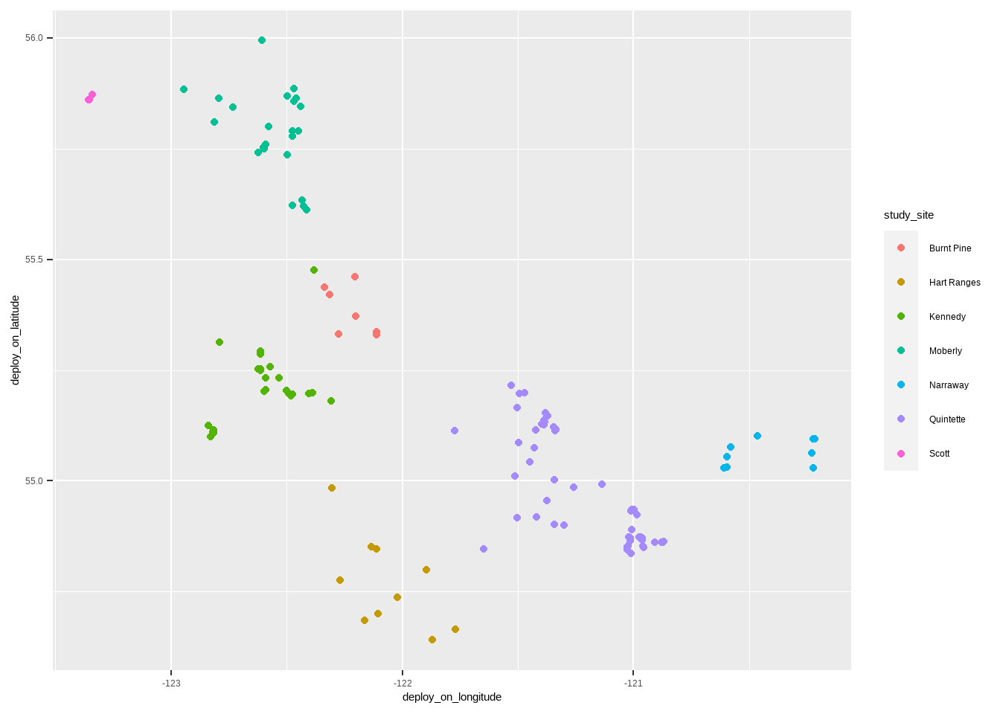

---
output:
  html_document: default
  pdf_document: default
---

# 探索性数据分析-驯鹿迁移 {#eda-caribou}


本章我们分析加拿大哥伦比亚林地驯鹿追踪数据，数据包含了从1988年到2016年期间260只驯鹿，近250000个位置标签。

## 数据录入


```r
individuals <- readr::read_csv("datas/caribou/individuals.csv")
locations <- readr::read_csv("datas/caribou/locations.csv")
```

## 驯鹿身份信息


```r
# 查看数据基本信息
individuals %>% 
  glimpse()
```

```
## Rows: 286
## Columns: 14
## $ animal_id            <chr> "HR_151.510", "GR_C04", "GR_C03", "HR_~
## $ sex                  <chr> "f", "f", "f", "f", "f", "f", "f", "f"~
## $ life_stage           <chr> NA, NA, NA, NA, NA, NA, NA, NA, NA, NA~
## $ pregnant             <lgl> NA, NA, NA, NA, NA, NA, NA, NA, NA, NA~
## $ with_calf            <lgl> NA, NA, NA, NA, NA, NA, NA, NA, NA, NA~
## $ death_cause          <chr> NA, NA, NA, NA, NA, NA, NA, NA, "Unkno~
## $ study_site           <chr> "Hart Ranges", "Graham", "Graham", "Ha~
## $ deploy_on_longitude  <dbl> NA, NA, NA, NA, NA, NA, NA, NA, NA, NA~
## $ deploy_on_latitude   <dbl> NA, NA, NA, NA, NA, NA, NA, NA, NA, NA~
## $ deploy_on_comments   <chr> NA, NA, NA, NA, NA, NA, NA, NA, NA, NA~
## $ deploy_off_longitude <dbl> NA, NA, NA, NA, NA, NA, NA, NA, -122.6~
## $ deploy_off_latitude  <dbl> NA, NA, NA, NA, NA, NA, NA, NA, 55.260~
## $ deploy_off_type      <chr> "unknown", "unknown", "unknown", "unkn~
## $ deploy_off_comments  <chr> NA, NA, NA, NA, NA, NA, NA, NA, NA, NA~
```

```r
# 查看驯鹿ID
individuals %>% 
  count(animal_id)
```

```
## # A tibble: 260 x 2
##    animal_id     n
##    <chr>     <int>
##  1 BP_car022     1
##  2 BP_car023     1
##  3 BP_car032     1
##  4 BP_car043     1
##  5 BP_car100     1
##  6 BP_car101     1
##  7 BP_car115     1
##  8 BP_car144     1
##  9 BP_car145     1
## 10 GR_C01        2
## # ... with 250 more rows
```

发现重复ID，理论上ID与驯鹿是一一对应的，需要对其进行处理。


```r
individuals %>% 
  janitor::get_dupes(animal_id)
```

```
## # A tibble: 50 x 15
##    animal_id dupe_count sex   life_stage pregnant with_calf
##    <chr>          <int> <chr> <chr>      <lgl>    <lgl>    
##  1 GR_C01             2 f     <NA>       NA       NA       
##  2 GR_C01             2 f     <NA>       NA       NA       
##  3 GR_C02             2 f     <NA>       NA       NA       
##  4 GR_C02             2 f     <NA>       NA       NA       
##  5 GR_C04             2 f     <NA>       NA       NA       
##  6 GR_C04             2 f     <NA>       NA       NA       
##  7 GR_C05             2 f     <NA>       NA       NA       
##  8 GR_C05             2 f     <NA>       NA       NA       
##  9 GR_C06             2 f     <NA>       NA       NA       
## 10 GR_C06             2 f     <NA>       NA       NA       
## # ... with 40 more rows, and 9 more variables: death_cause <chr>,
## #   study_site <chr>, deploy_on_longitude <dbl>,
## #   deploy_on_latitude <dbl>, deploy_on_comments <chr>,
## #   deploy_off_longitude <dbl>, deploy_off_latitude <dbl>,
## #   deploy_off_type <chr>, deploy_off_comments <chr>
```


```r
individuals %>%
  filter(deploy_on_latitude > 50) %>%
  ggplot(aes(x = deploy_on_longitude, y = deploy_on_latitude)) +
  geom_point(aes(color = study_site))
```



