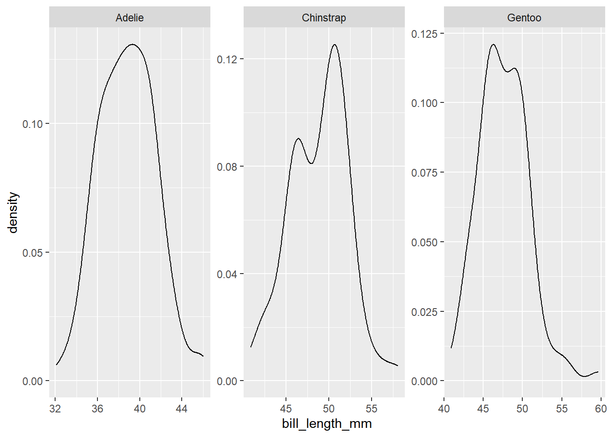
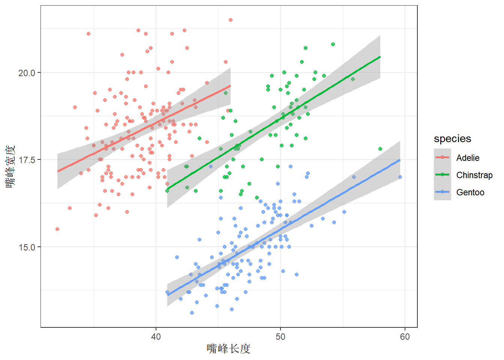
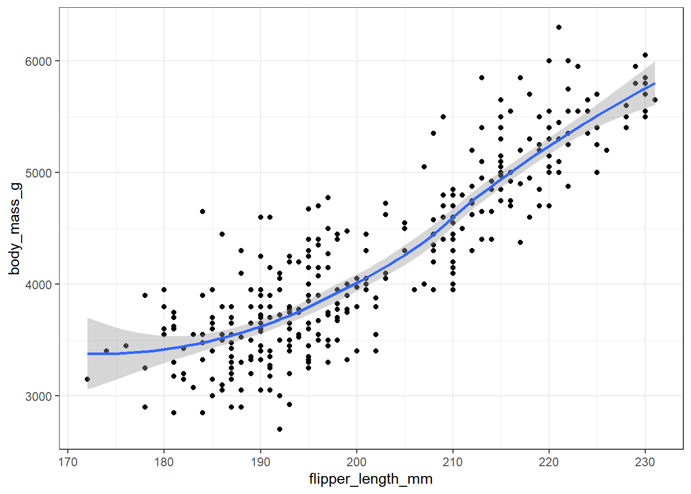

---
output:
  html_document: default
  pdf_document: default
---

# 探索性数据分析-企鹅的故事 {#eda-penguins}


今天讲一个关于企鹅的数据故事。这个故事来源于科考人员记录的大量企鹅体征[数据](https://raw.githubusercontent.com/rfordatascience/tidytuesday/master/data/2020/2020-07-28/penguins.csv)。

## 数据录入


```r
penguins <- readr::read_csv("datas/penguins.csv") %>% 
  janitor::clean_names()
```

```
## Warning in FUN(X[[i]], ...): strings not representable in native
## encoding will be translated to UTF-8
```

```
## Warning in FUN(X[[i]], ...): unable to translate '<U+00C4>' to native
## encoding
```

```
## Warning in FUN(X[[i]], ...): unable to translate '<U+00D6>' to native
## encoding
```

```
## Warning in FUN(X[[i]], ...): unable to translate '<U+00E4>' to native
## encoding
```

```
## Warning in FUN(X[[i]], ...): unable to translate '<U+00F6>' to native
## encoding
```

```
## Warning in FUN(X[[i]], ...): unable to translate '<U+00DF>' to native
## encoding
```

```
## Warning in FUN(X[[i]], ...): unable to translate '<U+00C6>' to native
## encoding
```

```
## Warning in FUN(X[[i]], ...): unable to translate '<U+00E6>' to native
## encoding
```

```
## Warning in FUN(X[[i]], ...): unable to translate '<U+00D8>' to native
## encoding
```

```
## Warning in FUN(X[[i]], ...): unable to translate '<U+00F8>' to native
## encoding
```

```
## Warning in FUN(X[[i]], ...): unable to translate '<U+00C5>' to native
## encoding
```

```
## Warning in FUN(X[[i]], ...): unable to translate '<U+00E5>' to native
## encoding
```

```r
penguins %>% 
  head()
```

```
## # A tibble: 6 x 8
##   species island    bill_length_mm bill_depth_mm flipper_length_mm
##   <chr>   <chr>              <dbl>         <dbl>             <dbl>
## 1 Adelie  Torgersen           39.1          18.7               181
## 2 Adelie  Torgersen           39.5          17.4               186
## 3 Adelie  Torgersen           40.3          18                 195
## 4 Adelie  Torgersen           NA            NA                  NA
## 5 Adelie  Torgersen           36.7          19.3               193
## 6 Adelie  Torgersen           39.3          20.6               190
## # ... with 3 more variables: body_mass_g <dbl>, sex <chr>,
## #   year <dbl>
```

### 变量含义


## 数据清洗


```r
# 检查缺失值
penguins %>% 
  summarise(
    across(everything(), ~ sum(is.na(.)))
  ) %>% 
  pivot_longer(
    cols = everything(),
    names_to = "cols",
    values_to = "NAs"
  )
```

```
## # A tibble: 8 x 2
##   cols                NAs
##   <chr>             <int>
## 1 species               0
## 2 island                0
## 3 bill_length_mm        2
## 4 bill_depth_mm         2
## 5 flipper_length_mm     2
## 6 body_mass_g           2
## 7 sex                  11
## 8 year                  0
```

发现共有11行至少有一处缺失值，我们对这些行进行删除操作。


```r
penguins <- penguins %>% 
  drop_na()
penguins
```

```
## # A tibble: 333 x 8
##    species island    bill_length_mm bill_depth_mm flipper_length_mm
##    <chr>   <chr>              <dbl>         <dbl>             <dbl>
##  1 Adelie  Torgersen           39.1          18.7               181
##  2 Adelie  Torgersen           39.5          17.4               186
##  3 Adelie  Torgersen           40.3          18                 195
##  4 Adelie  Torgersen           36.7          19.3               193
##  5 Adelie  Torgersen           39.3          20.6               190
##  6 Adelie  Torgersen           38.9          17.8               181
##  7 Adelie  Torgersen           39.2          19.6               195
##  8 Adelie  Torgersen           41.1          17.6               182
##  9 Adelie  Torgersen           38.6          21.2               191
## 10 Adelie  Torgersen           34.6          21.1               198
## # ... with 323 more rows, and 3 more variables: body_mass_g <dbl>,
## #   sex <chr>, year <dbl>
```

## 探索性分析

-每种类型企鹅有多少只？

-每种类型企鹅各种属性的均值和分布？

-嘴峰长度和深度的关联？

-体重与翅膀长度的关联？

-嘴峰长度与嘴峰深度的比例？

-不同种类的宝宝，体重具有显著性差异？

-这体征中哪个因素对性别影响最大？

针对以上问题我们分别来看：

###  每种类型的企鹅有多少只


```r
penguins %>% 
  count(species, sort = T)  # sort = T设定排序。
```

```
## # A tibble: 3 x 2
##   species       n
##   <chr>     <int>
## 1 Adelie      146
## 2 Gentoo      119
## 3 Chinstrap    68
```

### 每种类型企鹅各种属性的均值和分布


```r
# 求平均值
penguins %>% 
  group_by(species) %>% 
  summarise(across(where(is.numeric), mean, na.rm = TRUE))
```

```
## # A tibble: 3 x 6
##   species   bill_length_mm bill_depth_mm flipper_length_~ body_mass_g
##   <chr>              <dbl>         <dbl>            <dbl>       <dbl>
## 1 Adelie              38.8          18.3             190.       3706.
## 2 Chinstrap           48.8          18.4             196.       3733.
## 3 Gentoo              47.6          15.0             217.       5092.
## # ... with 1 more variable: year <dbl>
```


```r
# 绘制分布图
penguins %>% 
  ggplot(aes(x = bill_length_mm)) +
    geom_density() +
    facet_wrap("species", scales = "free")
```



### 嘴峰长度和深度的关联


```r
penguins %>% 
  ggplot(aes(x = bill_length_mm, y = bill_depth_mm, color = species)) +
    geom_point(alpha = 0.75) +
    geom_smooth(method = "lm") +
    theme_bw() +
    labs(x = "嘴峰长度", y = "嘴峰宽度")
```



- 三个种类的企鹅嘴峰长度与宽度均呈正相关关系。

- 总体看并无明显规律。

### 体重与翅膀长度的关联？


```r
penguins %>% 
  ggplot(aes(x = flipper_length_mm, y = body_mass_g)) +
    geom_point() +
    geom_smooth() +
    theme_bw()
```



### 性别与不同体征信息的关系-建立模型

1. 标准化


```r
scale_fun <- function(x){
  (x - mean(x)) / sd(x)
}

d <- penguins %>% 
  select(sex, species, bill_length_mm:body_mass_g) %>% 
  mutate(
    across(where(is.numeric), scale_fun)
  ) %>% 
  mutate(male = if_else(sex == "male", 1, 0))
d
```

```
## # A tibble: 333 x 7
##    sex    species bill_length_mm bill_depth_mm flipper_length_mm
##    <chr>  <chr>            <dbl>         <dbl>             <dbl>
##  1 male   Adelie          -0.895         0.780            -1.42 
##  2 female Adelie          -0.822         0.119            -1.07 
##  3 female Adelie          -0.675         0.424            -0.426
##  4 female Adelie          -1.33          1.08             -0.568
##  5 male   Adelie          -0.858         1.74             -0.782
##  6 female Adelie          -0.931         0.323            -1.42 
##  7 male   Adelie          -0.876         1.24             -0.426
##  8 female Adelie          -0.529         0.221            -1.35 
##  9 male   Adelie          -0.986         2.05             -0.711
## 10 male   Adelie          -1.72          2.00             -0.212
## # ... with 323 more rows, and 2 more variables: body_mass_g <dbl>,
## #   male <dbl>
```

2. 以sex为相应变量，其它变量为预测变量


```r
logit_mod1 <- glm(
  male ~ 1 + species + bill_length_mm + bill_depth_mm +
    flipper_length_mm + body_mass_g,
  data = d,
  family = binomial(link = "logit")
)
summary(logit_mod1)
```

```
## 
## Call:
## glm(formula = male ~ 1 + species + bill_length_mm + bill_depth_mm + 
##     flipper_length_mm + body_mass_g, family = binomial(link = "logit"), 
##     data = d)
## 
## Deviance Residuals: 
##    Min      1Q  Median      3Q     Max  
## -3.382  -0.215   0.002   0.155   2.809  
## 
## Coefficients:
##                   Estimate Std. Error z value Pr(>|z|)    
## (Intercept)          4.684      1.187    3.95  7.9e-05 ***
## speciesChinstrap    -6.980      1.574   -4.43  9.3e-06 ***
## speciesGentoo       -8.354      2.524   -3.31  0.00093 ***
## bill_length_mm       3.357      0.716    4.69  2.8e-06 ***
## bill_depth_mm        3.196      0.655    4.88  1.0e-06 ***
## flipper_length_mm    0.291      0.670    0.43  0.66405    
## body_mass_g          4.723      0.872    5.41  6.2e-08 ***
## ---
## Signif. codes:  0 '***' 0.001 '**' 0.01 '*' 0.05 '.' 0.1 ' ' 1
## 
## (Dispersion parameter for binomial family taken to be 1)
## 
##     Null deviance: 461.61  on 332  degrees of freedom
## Residual deviance: 127.11  on 326  degrees of freedom
## AIC: 141.1
## 
## Number of Fisher Scoring iterations: 7
```
