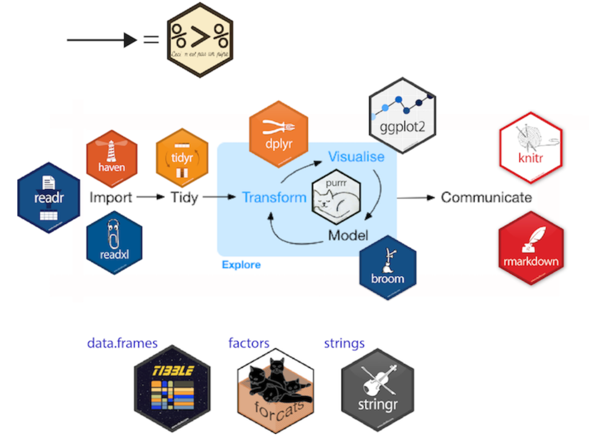

---
output:
  html_document: default
  pdf_document: default
---

# (PART) 数据操作 {-}

# tidyverse简介 {-}


`tidyverse`包对数据操作的核心思维是**向量化**，即使用自定义函数（或现成函数）解决分解的小问题，进而使用泛函式循环迭代解决完整问题。关键有三：

1. 将**向量化**的编程思维，纳入数据框或更高级的数据结构中：

   - 对想做的操作自定义操作函数（或使用现成函数）。
   
   - 将上一步的函数（自定义/现成）应用到数据框的多个列上，对列进行修改或汇总。
   
2. 将复杂的操作分解为若干基本数据操作的能力：

   - 复杂的数据操作都可以分解为若干简单的基本数据操作，数据连接、数据重塑（长宽变换/拆分合并列）、筛选行、排序行、选择列、修改列、分组汇总。
   
   - 完成问题的梳理和分解后，使用“管道”流以此对数据进行相应的基本操作即可。
   
3. 接受数据分解的操作思维：

   - `across()`函数可以同时操作多个列，实际只需要将对一个列的操作实现后，就可以使用该函数对所有需要操作的列进行循环迭代，在将结果进行合并即可。
   
   - 事实上，`tidyverse`中有很多函数可以帮助我们实现**分解+分别操作+合并结果**的过程，我们只需要关心**分别操作**的部分就好。

`tidyverse`核心包的数据操作过程如下图（图\@ref(fig:tidyverse-flow)）所示。


```r
knitr::include_graphics("images/tidyverse-flow.jpg", dpi = FALSE)
```

<div class="figure" style="text-align: center">

<p class="caption">(\#fig:tidyverse-flow)tidyverse核心包工作流</p>
</div>

:::: {.rmdnote data-latex="{注意}"}
- 数据经过管道默认传递给函数的第一个参数，此时通常可以省略。

- 如果不是在第一个参数的位置使用数据，则需要用符号`.`代替，此时该符号不能被省略。

- 对于`.`的用法，建议单独使用`.`符号时代替数据，而使用`.x`用于`purrr`中的匿名函数。


```r
mtcars %>% 
  group_split(cyl) %>%  # 数据mtcars作为第一个参数，省略。
  # 数据首先作为第一个参数传入map函数，省略。
  # 然后传入lm函数中，作为第二个参数，不能省略，且为purrr风格匿名函数，使用.x
  map(~ lm(mpg ~ wt, data = .x))  
```

```
## [[1]]
## 
## Call:
## lm(formula = mpg ~ wt, data = .x)
## 
## Coefficients:
## (Intercept)           wt  
##      39.571       -5.647  
## 
## 
## [[2]]
## 
## Call:
## lm(formula = mpg ~ wt, data = .x)
## 
## Coefficients:
## (Intercept)           wt  
##       28.41        -2.78  
## 
## 
## [[3]]
## 
## Call:
## lm(formula = mpg ~ wt, data = .x)
## 
## Coefficients:
## (Intercept)           wt  
##      23.868       -2.192
```
::::

# 数据读写 {#tidyverse-readr}

1. `readr`、`readxl`等包中所有的读取函数均用`_`连接，如`read_csv()`。

2. 几个数据读写包：

   - `readr`，读写带分隔符的文本文件，如csv、rds。
   - `readxl`，读写Excel文件。
   - `haven`，读写SPSS、Stata、SAS数据。
   - `jsonlite`，读写JSON数据[^JSON]。

[^JSON]:一种轻量级的数据交换格式，采用完全独立于编程语言的文本格式来存储和表示数据，易于人阅读和编写，同时也易于机器解析和生成，并有效地提升网络传输效率。

## 数据读入

### 例1：多个文件数据读取后合并


```r
files <- fs::dir_ls("datas/new/read_datas/", recurse = TRUE, glob = "*.xlsx")
files
```

```
## datas/new/read_datas/61score.xlsx datas/new/read_datas/62score.xlsx 
## datas/new/read_datas/63score.xlsx datas/new/read_datas/64score.xlsx 
## datas/new/read_datas/65score.xlsx
```

```r
# 增加一列说明数据来源
library(readxl)
# set_names()将字符型向量转换为命名字符型向量。
df <- map_dfr(set_names(files), read_xlsx, .id = "来源")
df
```

```
## # A tibble: 20 x 7
##    来源                           班级  姓名  性别   语文  数学  英语
##    <chr>                          <chr> <chr> <chr> <dbl> <dbl> <dbl>
##  1 datas/new/read_datas/61score.~ 六1班 何娜  女       87    92    79
##  2 datas/new/read_datas/61score.~ 六1班 黄才~ 女       95    77    75
##  3 datas/new/read_datas/61score.~ 六1班 陈芳~ 女       79    87    66
##  4 datas/new/read_datas/61score.~ 六1班 陈学~ 男       82    79    66
##  5 datas/new/read_datas/62score.~ 六2班 黄祖~ 女       94    88    75
##  6 datas/new/read_datas/62score.~ 六2班 徐雅~ 女       92    86    72
##  7 datas/new/read_datas/62score.~ 六2班 徐达~ 男       90    86    72
##  8 datas/new/read_datas/62score.~ 六2班 陈华~ 男       92    84    70
##  9 datas/new/read_datas/63score.~ 六3班 江佳~ 女       80    69    75
## 10 datas/new/read_datas/63score.~ 六3班 何诗~ 女       76    53    72
## 11 datas/new/read_datas/63score.~ 六3班 林可~ 女       72    52    72
## 12 datas/new/read_datas/63score.~ 六3班 雷帆  男       78    56    66
## 13 datas/new/read_datas/64score.~ 六4班 周婵  女       92    94    77
## 14 datas/new/read_datas/64score.~ 六4班 李小~ 男       90    87    69
## 15 datas/new/read_datas/64score.~ 六4班 陈丽~ 女       87    93    61
## 16 datas/new/read_datas/64score.~ 六4班 杨昌~ 男       84    85    64
## 17 datas/new/read_datas/65score.~ 六5班 符苡~ 女       85    89    76
## 18 datas/new/read_datas/65score.~ 六5班 陆曼  女       88    84    69
## 19 datas/new/read_datas/65score.~ 六5班 容唐  女       83    71    56
## 20 datas/new/read_datas/65score.~ 六5班 蒙丽~ 女       72    72    64
```

### 例2：一个excel中多个sheet表的读取合并


```r
path <- "datas/new/Students-Grade.xlsx"
df <- map_dfr(set_names(excel_sheets(path)), 
              ~ read_xlsx(path, .x), id = "sheet")
df
```

```
## # A tibble: 20 x 6
##    班级  姓名   性别   语文  数学  英语
##    <chr> <chr>  <chr> <dbl> <dbl> <dbl>
##  1 六1班 何娜   女       87    92    79
##  2 六1班 黄才菊 女       95    77    75
##  3 六1班 陈芳妹 女       79    87    66
##  4 六1班 陈学勤 男       82    79    66
##  5 六2班 黄祖娜 女       94    88    75
##  6 六2班 徐雅琦 女       92    86    72
##  7 六2班 徐达政 男       90    86    72
##  8 六2班 陈华健 男       92    84    70
##  9 六3班 江佳欣 女       80    69    75
## 10 六3班 何诗婷 女       76    53    72
## 11 六3班 林可莉 女       72    52    72
## 12 六3班 雷帆   男       78    56    66
## 13 六4班 周婵   女       92    94    77
## 14 六4班 李小龄 男       90    87    69
## 15 六4班 陈丽丽 女       87    93    61
## 16 六4班 杨昌晟 男       84    85    64
## 17 六5班 符苡榕 女       85    89    76
## 18 六5班 陆曼   女       88    84    69
## 19 六5班 容唐   女       83    71    56
## 20 六5班 蒙丽梅 女       72    72    64
```

::: {.rmdtip data-latex="{提示}"}
`readr 2.0`中，提供了可以批量读取行列名称csv文件的简便方法，如下例所示。


```r
files <- fs::dir_ls("datas/new/read_datas", recurse = TRUE, glob = "*.csv")
df <- read_csv(files)
df
```

```
## # A tibble: 20 x 6
##    班级  姓名   性别   语文  数学  英语
##    <chr> <chr>  <chr> <dbl> <dbl> <dbl>
##  1 六1班 何娜   女       87    92    79
##  2 六1班 黄才菊 女       95    77    75
##  3 六1班 陈芳妹 女       79    87    66
##  4 六1班 陈学勤 男       82    79    66
##  5 六2班 黄祖娜 女       94    88    75
##  6 六2班 徐雅琦 女       92    86    72
##  7 六2班 徐达政 男       90    86    72
##  8 六2班 陈华健 男       92    84    70
##  9 六3班 江佳欣 女       80    69    75
## 10 六3班 何诗婷 女       76    53    72
## 11 六3班 林可莉 女       72    52    72
## 12 六3班 雷  帆 男       78    56    66
## 13 六4班 周婵   女       92    94    77
## 14 六4班 李小龄 男       90    87    69
## 15 六4班 陈丽丽 女       87    93    61
## 16 六4班 杨昌晟 男       84    85    64
## 17 六5班 符苡榕 女       85    89    76
## 18 六5班 陆曼   女       88    84    69
## 19 六5班 容唐   女       83    71    56
## 20 六5班 蒙丽梅 女       72    72    64
```
:::

## 数据写出

目前暂时不需要了解此部分内容。


