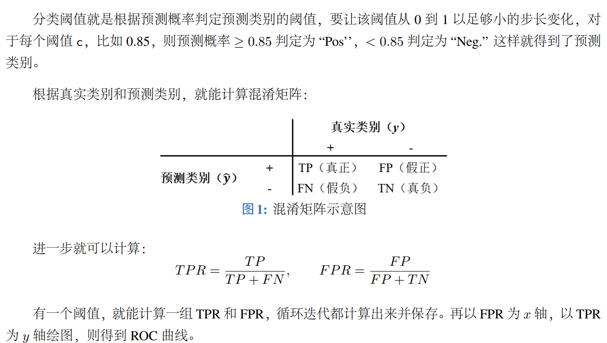
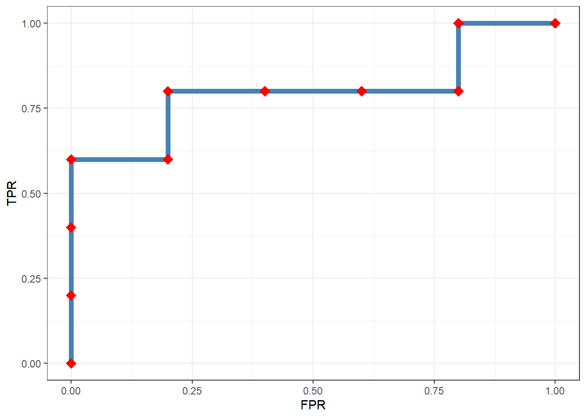
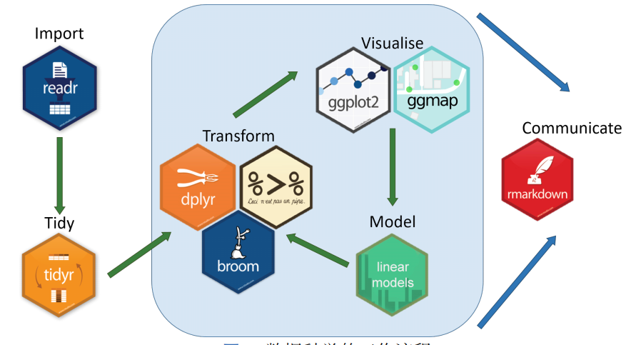

--- 
title: "R基础及提高-读书笔记"
subtitle: "优雅的 Bookdown 书籍模版"
author: 
  - Lee
date: "2022-04-22"
site: bookdown::bookdown_site
documentclass: elegantbook
bibliography: 
 - book.bib
 - packages.bib
lot: yes
lof: yes
colorlinks: yes
toccolor: Maroon
link-citations: yes
nocite: '@*'    # 将正文未引用的参考文献也列在书中
mathspec: yes
graphics: yes
subject: "基于 elegantbook 文类的 bookdown 模版"
keywords:
  - elegantbook
  - bookdown
  - pandoc
  - R
hyperrefoptions:
- linktoc=all
- pdfstartview=FitH
github-repo: XiangyunHuang/ElegantBookdown
classoption: 
 - lang=cn
 - 11pt
 - scheme=chinese
 - chinesefont=nofont
 - citestyle=gb7714-2015
 - bibstyle=gb7714-2015
description: "最初看到 elegantbook 做的书籍样式很漂亮，就想把它引入到 bookdown 中，遂定制了此模版。在此基础上，做了迁移和扩展的工作，融合了 LaTeX (精美)、Pandoc (简洁) 和 R (强大) 的特性。This is a bookdown template based on ElegantBook. The output format for this template is bookdown::gitbook and bookdown::pdf_book."
---

# 欢迎 {#welcome}

> A Markdown-formatted document should be publishable as-is, as plain text, without looking like it’s been marked up with tags or formatting instructions.  
> 
> --- John Gruber

这是一份 R Markodwn 文档。 Markdown 提供一种简洁的格式语法，用来生成 HTML、PDF 和 MS Word 文档。

当你点击 **Knit** 按钮时，就会生成一份包含正文和代码执行结果的文档。你可以像这样嵌入 R 代码块：


```r
summary(cars)
```

```
##      speed           dist       
##  Min.   : 4.0   Min.   :  2.00  
##  1st Qu.:12.0   1st Qu.: 26.00  
##  Median :15.0   Median : 36.00  
##  Mean   :15.4   Mean   : 42.98  
##  3rd Qu.:19.0   3rd Qu.: 56.00  
##  Max.   :25.0   Max.   :120.00
```

# 已有 Block {#theorem-block}

::: {.lemma #chf-pdf}
For any two random variables $X_1$, $X_2$, they both have the same probability distribution if and only if
$$\varphi _{X_1}(t)=\varphi _{X_2}(t)$$
:::

::: {.theorem #chf-sum}
If $X_1$, ..., $X_n$ are independent random variables, and $a_1$, ..., $a_n$ are some constants, then the characteristic function of the linear combination $S_n=\sum_{i=1}^na_iX_i$ is
$$\varphi _{S_{n}}(t)=\prod_{i=1}^n\varphi _{X_i}(a_{i}t)=\varphi _{X_{1}}(a_{1}t)\cdots \varphi _{X_{n}}(a_{n}t)$$
:::

::: {.proposition #unnamed-chunk-1}
The distribution of the sum of independent Poisson random variables $X_i \sim \mathrm{Pois}(\lambda_i),\: i=1,2,\cdots,n$ is $\mathrm{Pois}(\sum_{i=1}^n\lambda_i)$.
:::


## 数学公式 {#math-formular}

[^load-bm]: <https://github.com/ElegantLaTeX/ElegantBook/blob/6ab10beda81252f0b478e05fa926199301347e4a/elegantbook.cls#L884>

数学公式加粗可能是最常见的需求之一， **elegantbook** 宏包提供的文类 `elegantbook.cls` 已经调用了 **bm** 宏包 [^load-bm]。有了 **bm** 宏包，就可以使用 **bm** 宏包提供的 `\bm{}` 命令，而不需要调 `\boldsymbol{}` 加粗希腊字母，如将  $\alpha$ （正常）加粗为 $\bm{\alpha}$（粗体）。为了在 HTML 网页中显示加粗效果，则还不够，默认情况下， MathJax 是不认识 `\bm{}` 命令的，所以需要在 `header.html` 自定义 `\bm{}` 命令：

```html
<script type="text/x-mathjax-config">
    MathJax.Hub.Config({
      TeX: {
        Macros: {
          bm: ["{\\boldsymbol #1}",1],
        }
      }
    });
</script>
```

进一步地，使用常用的 3 个取消符号 $\bcancel{///}$ 需要在 `header.html` 添加 JS 库 `cancel.js`，

```html
<script type="text/x-mathjax-config">
    MathJax.Hub.Config({
      TeX: {
        Macros: {
          bm: ["{\\boldsymbol #1}",1],
        },
        extensions: ["cancel.js"]
      }
    });
</script>
```

并在 preamble.tex 文件中添加一行代码加载 **cancel** 宏包

```latex
\usepackage[makeroom]{cancel}
```

## 自定义 block {#custom-block}

基于 Pandoc 自定义 block 是一件很有意思的事情，目前不想让模版过于复杂，仅给出几个最常用的例子。如何自定义可以去看谢益辉的新书 <https://bookdown.org/yihui/rmarkdown-cookbook/custom-blocks.html>。

[要做的还有很多]{.todo}

::: {.rmdwarn data-latex="{警告}"}
这是警告
:::

::: {.rmdtip data-latex="{提示}"}
这是提示
:::

:::: {.rmdnote data-latex="{注意}"}
这是注意
::::

::: {.rmdinfo}
普通说明
:::


# 简单实例 {#index:example}

::: {.rmdtip data-latex="{提示}"}
1. 如何完成从“**看懂别人代码**”到“**自己写代码**”的鸿沟？答案是**分解问题**。

   - 将难以入手打大问题分解为可以逐步解决的**小问题**。
   - 用**计算机的思维**去思考解决每个小问题的步骤。
   - 借助类比的简单实例和代码片段，梳理详细**算法步骤**。
   - 将详细算法步骤用逐片段的编程语法**翻译成代码并调试通过**。
   - **写代码时，随时跟踪关注每一步执行的情况，关注执行的结果（变量、数据值）是否达到预期，这一点非常重要**。
   
2. 以上步骤的关键，就是从**问题**到**代码**的中间是有包括分解、编译、调试的过程的。任何编程问题都不可能从问题直接到代码，*问题直接到代码*是一个可怕的思维定式，在自己编写代码时，一定要强迫自己执行`1`中所示的步骤。

我们通过一个简单的例子来说明如何执行以上步骤。
:::

### 例0.1 计算并绘制ROC曲线

ROC曲线是二分类机器学习模型的性能评价指标，已知测试集或验证集每个样本的真实类别及其模型预测概率值，就可以计算并绘制ROC曲线。

ROC曲线是不同分类阈值上对比真正率（TPR）与假正率（FPR）的曲线，可以通过下图的步骤进行计算。


```r
library(knitr)
knitr::include_graphics("images/eg0-1.jpg", dpi = FALSE)
```

<!-- -->

通过以上定义，我们梳理执行第一步：对问题进行梳理。本例的问题可以分解为如小问题：

   - 让分类阈值以某步长在[0,1]上变化取值；
   - 对某一个阈值：
      - 计算预测类别
      - 计算混淆矩阵
      - 计算真正率和假正率
   - 循环迭代，计算所有阈值的真正率和假正率；
   - 绘制ROC曲线。

根据以上步骤，我们生成一个小数据集进行演示。


```r
library(tidyverse)
```

```
## -- Attaching packages ---------------------------- tidyverse 1.3.1 --
```

```
## v ggplot2 3.3.5     v purrr   0.3.4
## v tibble  3.1.6     v dplyr   1.0.8
## v tidyr   1.2.0     v stringr 1.4.0
## v readr   2.1.2     v forcats 0.5.1
```

```
## -- Conflicts ------------------------------- tidyverse_conflicts() --
## x dplyr::filter() masks stats::filter()
## x dplyr::lag()    masks stats::lag()
```

```r
df <- tibble(
  ID = 1:10,
  真实类别 = c("Pos","Pos","Pos","Neg","Pos","Neg","Neg","Neg","Pos","Neg"),
  预测概率 = c(0.95,0.86,0.69,0.65,0.59,0.52,0.39,0.28,0.15,0.06)
)
df
```

```
## # A tibble: 10 x 3
##       ID 真实类别 预测概率
##    <int> <chr>       <dbl>
##  1     1 Pos          0.95
##  2     2 Pos          0.86
##  3     3 Pos          0.69
##  4     4 Neg          0.65
##  5     5 Pos          0.59
##  6     6 Neg          0.52
##  7     7 Neg          0.39
##  8     8 Neg          0.28
##  9     9 Pos          0.15
## 10    10 Neg          0.06
```

1. 先解决某一个阈值的问题，以0.85为例


```r
# 在使用tidyverse时，注意要将“真实类别”转化为因子型数据
c <- 0.85
df1 <- df %>% 
  mutate(
    预测类别 = ifelse(预测概率 >= c, "Pos", "Neg"),
    预测类别 = factor(预测类别, levels = c("Pos", "Neg")),
    真实类别 = factor(真实类别, levels = c("Pos", "Neg"))
  )
df1
```

```
## # A tibble: 10 x 4
##       ID 真实类别 预测概率 预测类别
##    <int> <fct>       <dbl> <fct>   
##  1     1 Pos          0.95 Pos     
##  2     2 Pos          0.86 Pos     
##  3     3 Pos          0.69 Neg     
##  4     4 Neg          0.65 Neg     
##  5     5 Pos          0.59 Neg     
##  6     6 Neg          0.52 Neg     
##  7     7 Neg          0.39 Neg     
##  8     8 Neg          0.28 Neg     
##  9     9 Pos          0.15 Neg     
## 10    10 Neg          0.06 Neg
```

2. 针对c=0.85的情况计算混淆矩阵


```r
# 即统计本来统计为“Pos”预测为“Pos”的有多少，等等
cm <- table(df1$预测类别, df1$真实类别)
cm  
```

```
##      
##       Pos Neg
##   Pos   2   0
##   Neg   3   5
```

3. 计算真正率和假正率。这里我们采用R语言的特长，**向量化编程**来计算实现。


```r
cm["Pos", ]/colSums(cm)
```

```
## Pos Neg 
## 0.4 0.0
```

到此，我们完成了本例的核心部分，下一步就是要通过迭代，套用以上算法，计算每个阈值的真正率和假正率。同样采用R语言的特性，**泛函式编程**进行迭代。


```r
# 将上述计算封装为一个函数
cal_ROC <- function(df, c){
  df = df %>% 
  mutate(
    预测类别 = ifelse(预测概率 >= c, "Pos", "Neg"),
    预测类别 = factor(预测类别, levels = c("Pos", "Neg")),
    真实类别 = factor(真实类别, levels = c("Pos", "Neg")))
  cm = table(df$预测类别, df$真实类别)
  t = cm["Pos",] / colSums(cm)
  list(TPR = t[[1]], FPR = t[[2]])
}
# 测试自定义函数计算结果-结果没问题
cal_ROC(df, 0.85)
```

```
## $TPR
## [1] 0.4
## 
## $FPR
## [1] 0
```

3. 将自定义函数应用到每一个阈值，并一步到位的将结果合并，完成绘图所需的数据计算。


```r
c <- seq(1, 0, -0.02)
rocs <- map_dfr(c, cal_ROC, df = df)
head(rocs)
```

```
## # A tibble: 6 x 2
##     TPR   FPR
##   <dbl> <dbl>
## 1   0       0
## 2   0       0
## 3   0       0
## 4   0.2     0
## 5   0.2     0
## 6   0.2     0
```

4. 使用ggplot2包绘图。


```r
ggplot(rocs, aes(FPR, TPR)) +
  geom_line(size = 2, color = "steelblue") +
  geom_point(shape = "diamond", size = 4, color = "red") +
  theme_bw()
```



根据以上的步骤，我们可以知道在R中使用tidyverse进行数据科学的工作流程如下图。


```r
library(knitr)
knitr::include_graphics("images/flow.jpg", dpi = FALSE)
```

<!-- -->

